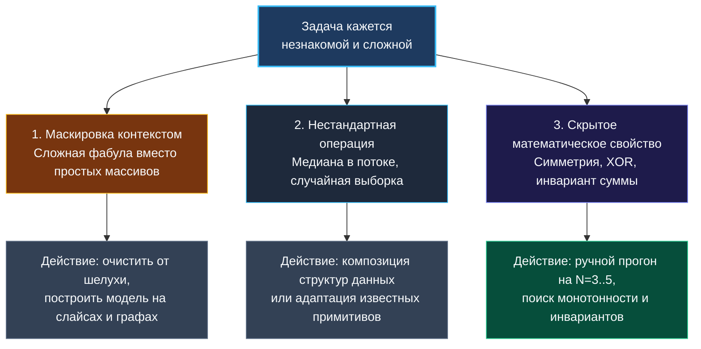

> *«Если вы не можете решить задачу, значит, существует более простая подзадача, которую вы решить в состоянии. Найдите её».*  
> — Дьёрдь Пойа

Вы добросовестно изучили алгоритмические паттерны, умеете применять два указателя, скользящее окно и динамическое программирование. Но вот звучит условие очередной задачи на собеседовании — и в голове образуется пугающая тишина. Ни один паттерн не узнается сходу. Условие замаскировано под причудливую бизнес-историю или физический процесс. Знакомые формулы не ложатся на входные данные, а время неумолимо утекает.

Это момент истины, на котором отсеивается подавляющее большинство кандидатов: они впадают в панику, начинают лихорадочно печатать случайный код или погружаются в мрачное молчание. Senior-инженер отличается не тем, что помнит наизусть все 3000 задач с LeetCode, а тем, что у него есть **четкий протокол действий на случай, когда решение не очевидно**. Он превращает ступор в упорядоченный процесс инженерного поиска.

---

### Три причины, почему задача кажется неочевидной

Неочевидность — это не свойство задачи, а оптическая иллюзия восприятия. Обычно задача «прячется» за одним из трех барьеров:



1. **Маскировка метафорой:** Задача «Удержание дождевой воды» (Trapping Rain Water) звучит как гидродинамический симулятор, а на деле сводится к поиску префиксных и суффиксных максимумов в слайсе целых чисел.
2. **Непривычный профиль операций:** Требуется не просто сортировка, а нахождение скользящей медианы в непрерывном потоке данных (композиция двух куч).
3. **Скрытый математический инсайт:** Например, поиск единственного непарного числа за $O(N)$ времени и $O(1)$ памяти решается операцией побитового исключающего ИЛИ (`XOR`), а не структурами данных.

---

### Пошаговый протокол выхода из тупика

Если за первые 90 секунд образ решения не возник, прекратите попытки «угадать ответ» и запустите систематический алгоритм.

#### Шаг 1. Вербализуйте рассуждения (думайте вслух)
Худшее, что можно сделать на интервью — замолчать. Скажите:  
*«Задача выглядит нетривиальной. Я пока не вижу прямого линейного решения, поэтому зафиксирую базовые требования и начну с построения наивного брутфорса, чтобы закрепить понимание и выявить избыточные вычисления».*  
Этим вы снимаете психологическое напряжение и показываете зрелый инженерный подход.

#### Шаг 2. Запустите ручную симуляцию на крошечном примере
Возьмите массив из 4–5 элементов (например, `[3, 1, 2, 4, 1]`) и решите задачу на бумаге или виртуальной доске карандашом, записывая промежуточные состояния. Человеческий мозг визуален: при ручном прогоне вы заметите: *«Ого, а ведь правее максимального столбца вода всегда ограничена именно им!»*. Это зерно оптимального инварианта.

#### Шаг 3. Смените перспективу (инверсия)
- **Движение с конца:** Если трудно построить путь от старта к цели, попробуйте пойти от цели к началу.
- **Инверсия условия:** Вместо поиска того, что «подходит», отсекайте то, что гарантированно «не подходит».
- **С двух сторон одновременно:** Если обход слева направо не дает нужного контекста, подумайте о сходящихся указателях с краев массива.

#### Шаг 4. Вспомните универсальные инженерные «отмычки»
Если паттерн не очевиден, проверьте три мета-алгоритма, решающие до половины олимпиадных и собеседовательных задач:
1. **Бинарный поиск по пространству ответов:** Если целевое значение лежит в известном диапазоне (например, от `1` до `max(nums)`), а функция валидности ответа **монотонна** (если подходит $X$, то гарантированно подходит любое $Y > X$), бинарный поиск решает задачу за $O(N \log(\text{range}))$.
2. **Префиксные суммы и хэш-таблица:** Если в задаче фигурируют подмассивы с фиксированной суммой, кратностью $K$ или равенством нулей и единиц, префиксные суммы превращают вложенный цикл в константный поиск в `map`.
3. **Оценка по ограничениям ($N$):** Посмотрите на лимиты. Если $N \le 20$ — это чистый бэктрекинг или битовые маски. Если $N \le 2000$ — двумерное DP за $O(N^2)$. Если $N \le 10^5$ — строго $O(N)$ или $O(N \log N)$.

---

### Разбор кейса: Trapping Rain Water (LeetCode 42)

Посмотрим, как от полной неочевидности прийти к безупречному коду с помощью последовательной смены перспективы.

**Условие:** Дан массив высот `height`. Посчитать, сколько единиц воды удержится после дождя.

```
       #
   #   ## #
 _ # _ ## ##
[0,1,0,2,1,0,1,3,2,1,2,1]
```

#### Итерация 1: Брутфорс «в лоб»
Сколько воды может стоять строго над столбцом с индексом `i`?  
Она ограничена самым высоким столбцом слева и самым высоким столбцом справа:  
$$\text{water}[i] = \max(0, \min(\text{maxLeft}, \text{maxRight}) - \text{height}[i])$$  
Чтобы посчитать это для каждого `i`, мы каждый раз бежим влево и вправо. Итог: $O(N^2)$ времени, $O(1)$ памяти.

#### Итерация 2: Устраняем повторные вычисления (Мемоизация префиксов)
Зачем каждый раз искать максимумы заново? Сделаем два прохода и сохраним их в слайсах `leftMax` и `rightMax`:
- Время сокращается до $O(N)$!
- Но мы платим за это памятью $O(N)$ на два вспомогательных среза.

#### Итерация 3: Гениальный шаг — Два указателя за $O(1)$ памяти
Зададимся вопросом: действительно ли нам нужно знать *точный* максимум с обеих сторон?  
Нет! Нам достаточно знать, какая сторона является **ограничивающей** (меньшей). Если `leftMax < rightMax`, то уровень воды над `left` гарантированно определяется `leftMax`, независимо от того, насколько гигантские горы стоят далеко справа!

```go
func trap(height []int) int {
    if len(height) == 0 {
        return 0
    }

    left, right := 0, len(height)-1
    leftMax, rightMax := height[left], height[right]
    totalWater := 0

    for left < right {
        if leftMax < rightMax {
            left++
            if height[left] > leftMax {
                leftMax = height[left]
            } else {
                totalWater += leftMax - height[left]
            }
        } else {
            right--
            if height[right] > rightMax {
                rightMax = height[right]
            } else {
                totalWater += rightMax - height[right]
            }
        }
    }

    return totalWater
}
```
Сложность: строго $O(N)$ по времени, $O(1)$ по памяти. Ни единой аллокации в куче!

---

### Go-специфика: нестандартные приемы, спасающие на интервью

Иногда знание идиом и рантайма Go превращает громоздкую логику в элегантную двухстрочную конструкцию.

#### Сравнение массивов фиксированного размера через `==`
В задаче на поиск анаграмм (например, LeetCode 438) новичок заводит `map[byte]int` и долго пишет вспомогательную функцию поэлементного сравнения карт. Опытный Go-инженер помнит: **массивы фиксированного размера в Go сравнимы оператором `==`**!

```go
func findAnagrams(s string, p string) []int {
    if len(s) < len(p) {
        return nil
    }

    var target, window [26]int
    for i := range p {
        target[p[i]-'a']++
        window[s[i]-'a']++
    }

    var result []int
    if window == target { // Сравнение всех 26 элементов за один проход процессора!
        result = append(result, 0)
    }

    for i := len(p); i < len(s); i++ {
        window[s[i]-'a']++
        window[s[i-len(p)]-'a']--
        if window == target {
            result = append(result, i-len(p)+1)
        }
    }

    return result
}
```

#### Использование пакета `math/bits`
Задачи на подсчет единичных битов или поиск старшего бита решаются одной ассемблерной процессорной инструкцией через стандартную библиотеку:
- `bits.OnesCount(x)` $\to$ инструкция `POPCNT`.
- `bits.LeadingZeros(x)` $\to$ инструкция `LZCNT` / `BSR`.

---

### Резюме стратегии

1. **Не паникуйте:** Неочевидность — нормальный этап решения сложных инженерных задач.
2. **Начните с брутфорса:** Зафиксируйте baseline, покажите рабочий код на бумаге и объясните, почему он медленный.
3. **Ищите инварианты на маленьких примерах:** Рисуйте руками, ищите зависимости и монотонность.
4. **Смените угол зрения:** Проверьте бинарный поиск по ответу, сходящиеся указатели или префиксные агрегаты.
5. **Используйте сильные стороны Go:** Массивы на стеке, встроенные битовые операции и непрерывные слайсы.

В следующей статье мы объединим все теоретические концепции в единую симфонию и проведем полный сквозной разбор реальной задачи уровня Hard от первого прочтения условия до финального production-кода. [[14. Разбор задачи от условия до кода]]