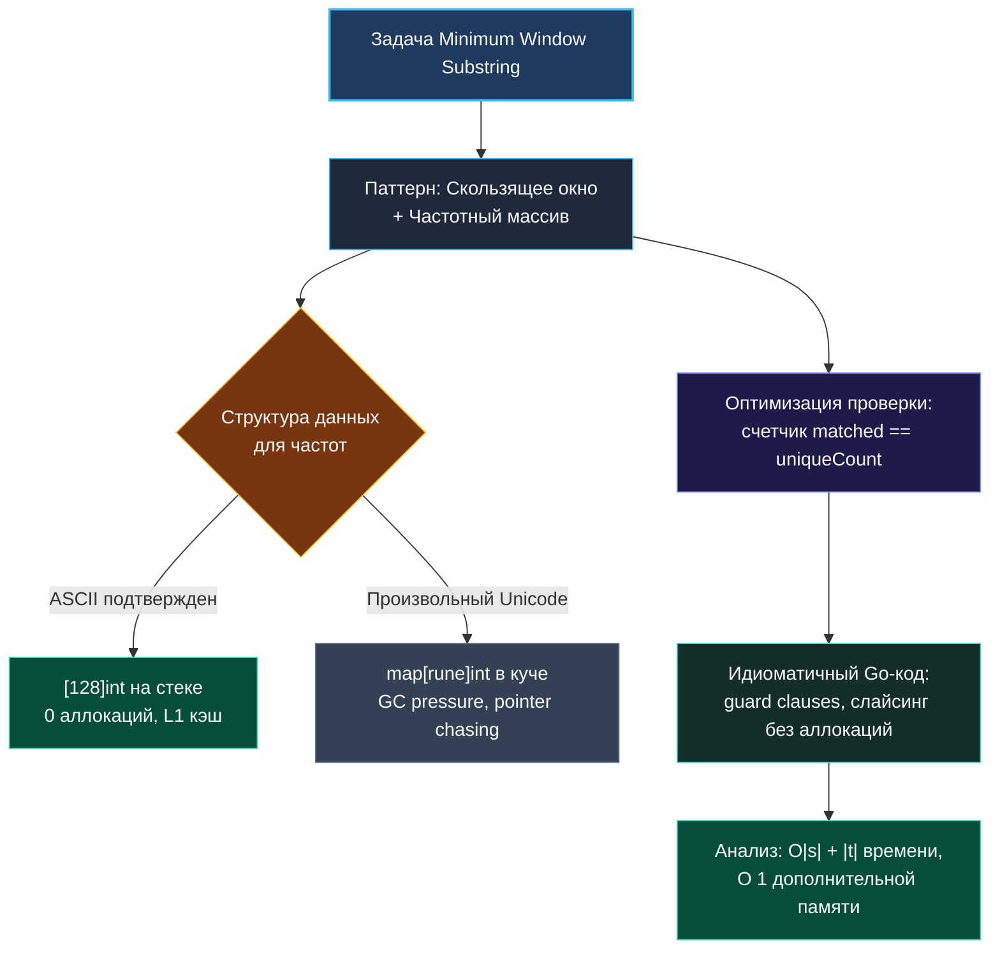

> *«Отладка кода вдвое сложнее, чем его написание. Поэтому, если вы пишете код настолько умно, насколько способны, вы по определению недостаточно сообразительны, чтобы его отладить».*  
> — Брайан Керниган

Теоретические концепции паттернов, инвариантов и композиции дают прочный фундамент. Но знание абстрактных правил само по себе не гарантирует успеха на реальном интервью, когда перед вами белый лист редактора, таймер неумолимо отсчитывает минуты, а интервьюер внимательно следит за каждым вашим словом и движением мысли.

Чтобы превратить разрозненные знания в рефлекторный навык, мы разберем задачу от начала и до конца. Мы возьмем классическую задачу уровня Hard — **Minimum Window Substring (LeetCode 76)** — и пройдем по всей цепочке шагов, демонстрируя эталонное поведение Senior Go-разработчика: от первого уточняющего вопроса до анализа кэш-линий и аллокаций памяти.

---

### Постановка задачи

> Даны две строки `s` и `t`. Необходимо найти минимальную по длине непрерывную подстроку строки `s`, которая содержит все символы строки `t` (включая повторяющиеся символы). Если такой подстроки не существует, вернуть пустую строку `""`. Гарантируется, что подходящее минимальное окно единственно.

**Пример:** `s = "ADOBECODEBANC"`, `t = "ABC"` $\to$ Результат: `"BANC"`.

---

### Шаг 1. Уточнение требований (Не пишите код молча!)

Никогда не начинайте писать код сразу после прочтения текста задачи. Первые 2–3 минуты интервью посвящены снятию неопределенностей:

1. **Алфавит и кодировка:**  
   *«Из каких символов состоят строки? Это только латиница ASCII или возможен произвольный UTF-8 (эмодзи, кириллица)?»*  
   *Ответ интервьюера:* Только стандартный набор ASCII (буквы верхнего/нижнего регистра, цифры).  
   *Вывод для нас:* Мы можем использовать массив фиксированного размера `[128]int` на стеке вместо медленной хэш-таблицы `map[rune]int`!
2. **Дубликаты в `t`:**  
   *«Если t = "AAB", обязано ли окно содержать как минимум две буквы A?»*  
   *Ответ интервьюера:* Да, кратность символов строго учитывается.
3. **Размеры входа:**  
   *«Какова максимальная длина строк s и t?»*  
   *Ответ интервьюера:* До $10^5$ символов.  
   *Вывод для нас:* Алгоритм с квадратичной сложностью $O(N^2)$ гарантированно упадет по тайм-ауту (TLE). Требуется строго линейное решение $O(N)$.
4. **Отношение длин:**  
   *«Может ли t быть длиннее s?»*  
   *Ответ интервьюера:* Да, в этом случае подходящего окна быть не может, возвращаем `""`.

---

### Шаг 2. Распознавание паттерна и проектирование инварианта

Включаем систему распознавания ([[4. Как распознавать паттерн в задаче]]):
- **Маркеры:** непрерывная подстрока, поиск экстремума (минимальная длина), проверка покрытия множества символов.
- **Свойство монотонности:** если подстрока `s[left:right]` уже содержит все символы `t`, то любое дальнейшее расширение окна вправо гарантированно сохранит валидность. Это канонический признак **скользящего окна (Sliding Window)**.
- **Узкое место проверки:** если на каждом сдвиге указателя проверять совпадение частот за $O(128)$, это добавит лишние накладные расходы. Чтобы проверка валидности окна работала за строгое $O(1)$, введем инкрементальный счетчик `matched` — число уникальных символов из `t`, которые уже представлены в окне в достаточном количестве.



---

### Шаг 3. Озвучивание плана интервьюеру

Прежде чем прикоснуться к клавиатуре, проговорите алгоритм за 40 секунд:
> *«Я предлагаю решить задачу методом скользящего окна с двумя указателями left и right. Правый указатель расширяет окно, накапливая символы в частотном массиве. Как только окно становится валидным (все уникальные символы строки t покрыты с нужной кратностью), мы начинаем сжимать его слева указателем left, обновляя глобальный минимум длины. Для представления частот я использую массив [128]int, что избавит нас от аллокаций в куче. Сложность по времени составит O(|s| + |t|), по памяти — O(1)».*

Интервьюер кивает — приступаем к кодированию.

---

### Шаг 4. Написание идиоматичного Go-кода

```go
func minWindow(s string, t string) string {
    // Ранняя проверка: если искомый шаблон длиннее исходной строки
    if len(s) < len(t) {
        return ""
    }

    // Частотный массив для целевой строки t
    var need [128]int
    needCount := 0 // Число уникальных символов, которые необходимо покрыть
    for i := 0; i < len(t); i++ {
        if need[t[i]] == 0 {
            needCount++
        }
        need[t[i]]++
    }

    // Частотный массив текущего окна
    var have [128]int
    matched := 0 // Сколько уникальных символов покрыто в текущем окне

    left := 0
    startIdx := 0
    minLen := math.MaxInt

    // Расширяем окно правым указателем
    for right := 0; right < len(s); right++ {
        rChar := s[right]
        have[rChar]++

        // Если символ нужен и его количество достигло целевого
        if need[rChar] > 0 && have[rChar] == need[rChar] {
            matched++
        }

        // Окно валидно — пытаемся максимально сжать его слева
        for matched == needCount {
            currentLen := right - left + 1
            if currentLen < minLen {
                minLen = currentLen
                startIdx = left
            }

            lChar := s[left]
            have[lChar]--
            // Если после удаления символа его стало меньше необходимого
            if need[lChar] > 0 && have[lChar] < need[lChar] {
                matched--
            }
            left++
        }
    }

    if minLen == math.MaxInt {
        return ""
    }

    return s[startIdx : startIdx+minLen]
}
```

---

### Шаг 5. Ручной сухой прогон (Dry Run) и валидация Edge Cases

Не объявляйте задачу решенной, пока сами не проверите код на краевых тестах:

1. **Базовый пример:** `s = "ADOBECODEBANC"`, `t = "ABC"`.
   - Символы `A, B, C` имеют `needCount = 3`.
   - При `right = 5` (`s[5] == 'C'`) находим первое валидное окно `"ADOBEC"` длины 6.
   - Сжимаем `left`: удаляем `A`, окно становится невалидным, `minLen = 6`.
   - Далее находим `"CODEBA"`, затем `"BANC"` (длина 4). Итоговый ответ: `"BANC"`. Логика безупречна.
2. **Длина `t` больше длины `s`:**  
   `s = "A"`, `t = "AA"`. Срабатывает guard clause `len(s) < len(t)` в начале функции $\to$ мгновенный возврат `""`.
3. **Строка `t` из одного символа:**  
   `s = "A"`, `t = "A"`. На первой же итерации `matched` станет равен 1, зафиксируется длина 1, вернется `"A"`.
4. **Символы не найдены вовсе:**  
   `s = "DEF"`, `t = "A"`. `matched` останется 0, `minLen` останется `math.MaxInt`, вернется `""`.
5. **Дубликаты в `t`:**  
   Условие `have[rChar] == need[rChar]` срабатывает строго один раз при достижении нужного порога, что исключает ложные инкременты `matched`.

---

### Шаг 6. Анализ сложности и механическая симпатия

#### Временная сложность (Time Complexity)
- Подсчет символов строки `t`: $O(|t|)$.
- Скользящее окно: указатель `right` пробегает строку $s$ ровно 1 раз ($|s|$ шагов). Указатель `left` также смещается строго вправо и суммарно совершает не более $|s|$ шагов.
- Каждая операция внутри цикла (индексация массива, арифметика, сравнение скаляров) занимает $O(1)$.
- Итоговая асимптотика: **$O(|s| + |t|)$** — строго линейное время.

#### Пространственная сложность (Space Complexity)
- Массивы `need` и `have` имеют фиксированный размер $128 \times 8 = 1024$ байта каждый.
- Они целиком размещаются в стековом фрейме горутины, не сбегают в кучу (escape analysis чист) и мгновенно прогревают L1-кэш процессора.
- Итоговая дополнительная память: **$O(1)$**.

> [!TIP] Замечание об иммутабельности строк в Go
> Строка `s[startIdx : startIdx+minLen]` создает новый заголовок строки, указывающий на срез существующего байтового массива без его копирования (до тех пор, пока на исходную строку есть ссылки). Однако, если строка `s` была многомегабайтным документом, удержание подстроки может препятствовать освобождению памяти исходного буфера. В продакшене Senior упомянет: «Если исходная строка огромна, для предотвращения утечки памяти имеет смысл явно скопировать байты через `strings.Clone` (в Go 1.20+)».

---

### Шаг 7. Обсуждение альтернатив и расширений

Завершите выступление зрелым инженерным комментарием:
- **А что, если Unicode?** Если вход содержит произвольные руны UTF-8, мы заменим `[128]int` на `map[rune]int`, предварительно выделив емкость `make(map[rune]int, len([]rune(t)))`. Асимптотика сохранится ($O(N)$), но появится константа на хэширование.
- **Сравнение массивов целиком:** Вместо переменной `matched` мы могли бы сравнивать массивы за $O(128)$, но инкрементальный счетчик снижает число инструкций процессора на порядки.

В следующей статье мы разберем фундамент любой оптимизации: как правильно строить наивное решение (brute-force) и выжимать из его анализа максимум пользы. [[15. Наивное решение и его анализ]]