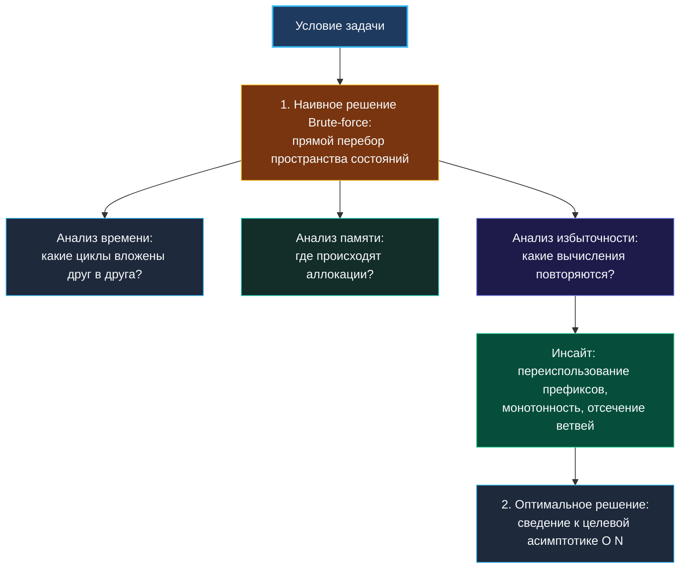

> *«Сначала сделайте программу правильной, затем понятной, и только потом — если возникнет реальная необходимость — делайте её быстрой».*  
> — Брайан Керниган

В алгоритмической культуре, воспитанной автоматическими тестами платформ вроде LeetCode, укоренился опасный психологический комплекс: наивное решение (brute-force) считается признаком некомпетентности. Если алгоритм получает красный вердикт «Time Limit Exceeded», кандидат воспринимает это как провал.

На реальном инженерном собеседовании всё устроено ровно наоборот. Интервьюер оценивает не бинарный результат, а **структуру вашего мышления**. Способность быстро и чисто сформулировать наивное решение, зафиксировать его как базовый ориентир (baseline), а затем методично раскрутить узкие места — это фундаментальный паттерн работы Senior-инженера. В этой статье мы разберем, почему brute-force — ваш главный союзник, как извлекать из него ключи к оптимальному алгоритму и какую роль в этом играет механическая симпатия к Go.

---

### Почему brute-force — это стратегический фундамент

Представьте две стратегии кандидата:
1. **Стратегия метаний:** Кандидат молчит 10 минут, пытаясь сразу вообразить идеальный алгоритм $O(N)$, пишет кусок кода, стирает, путается в указателях и к концу раунда не имеет ничего работающего.
2. **Стратегия контролируемого восхождения:** Кандидат за 3 минуты формулирует наивный перебор: *«Давайте я зафиксирую baseline за $O(N^2)$, чтобы мы оба были уверены в корректности логики и edge cases, а затем я покажу, где именно мы теряем такты и как свести сложность к линейной»*.



**Что видит интервьюер во втором случае:**
- Инженерная зрелость: вы не боитесь простых решений и умеете декомпозировать задачу.
- Наличие эталона: на наивном решении можно моментально проверить каверзные краевые случаи (пустые слайсы, дубликаты, отрицательные числа).
- Управляемость: у вас в руках гарантированно рабочий код, от которого можно безопасно отталкиваться.

---

### Принципы построения наивного решения на Go

Наивный код обязан быть кристально ясным, надежным и лаконичным:

1. **Максимальная прямолинейность:** Если задача про подмассивы — пишите два честных цикла `left` и `right`. Если про подмножества — используйте рекурсивный бэктрекинг или битовую маску. Никаких преждевременных «умных» структур данных.
2. **Идиоматичный синтаксис Go:** Даже в брутфорсе соблюдайте культуру: осмысленные имена переменных, guard clauses в начале функции, корректная работа со срезами.
3. **Никаких микрооптимизаций:** Не пытайтесь одновременно писать перебор и «чуть-чуть ускорять» его случайными трюками — это лишь запутает вас.

#### Пример 1: Максимальная сумма подмассива (Maximum Subarray)

Представим, что мы еще не знакомы с алгоритмом Кадане. Как выглядит честный brute-force?

```go
// maxSubArrayBruteForce возвращает максимальную сумму непрерывного подмассива.
// Сложность: O(N^2) по времени, O(1) по памяти.
func maxSubArrayBruteForce(nums []int) int {
    if len(nums) == 0 {
        return 0
    }

    maxSum := math.MinInt

    for left := 0; left < len(nums); left++ {
        currentSum := 0
        for right := left; right < len(nums); right++ {
            currentSum += nums[right]
            if currentSum > maxSum {
                maxSum = currentSum
            }
        }
    }

    return maxSum
}
```

---

### Анатомия анализа: как извлечь ключи к оптимизации

После написания наивного кода мы задаем себе 5 диагностических вопросов:

1. **Какова точная стоимость вложенных циклов?**  
   Внешний цикл делает $N$ шагов, внутренний в среднем $N/2$. Итого $\frac{N(N+1)}{2} \approx O(N^2)$ операций. При $N = 10^5$ это $5 \times 10^9$ операций. Процессор физически не успеет выполнить их за 1 секунду лимита (современное ядро способно переварить порядка $10^8 - 10^9$ тактов в секунду).
2. **Какие вычисления являются избыточными?**  
   Мы перебираем все возможные начальные точки `left`. Но если сумма на отрезке `nums[left...right]` упала ниже нуля, может ли она принести хоть какую-то пользу следующему элементу `nums[right+1]`? Нет! Отрицательная накопленная сумма лишь уменьшит потенциал будущих элементов. Значит, все такие `left` можно сбросить до нуля!
3. **Инсайт:**  
   Анализ избыточности брутфорса естественным образом рождает **алгоритм Кадане**: мы просто сбрасываем бегущую сумму `currentSum = max(nums[i], currentSum + nums[i])`, сводя сложность к $O(N)$ за один проход!

---

### Механическая симпатия: почему наивный $O(N^2)$ может обогнать «умный» $O(N \log N)$

В теории Big O квадратичный алгоритм $O(N^2)$ считается хуже логарифмического $O(N \log N)$ или линейного $O(N)$. Но на реальном «железе» в игру вступают аппаратные кэш-линии (64 байта) и цена аллокаций.

Сравним две реализации поиска элементов для небольших массивов ($N \le 64$):
- **Вариант А («Умный»):** Создать `map[int]bool`, заполнить значениями, искать совпадения. Асимптотика $O(N)$, но каждое обращение к `map` — это вычисление хэш-суммы, поиск бакета, потенциальный cache miss и работа GC по очистке кучи.
- **Вариант Б («Наивный»):** Вложенные циклы по слайсу `[]int`. Формально это $O(N^2)$, но слайс лежит в памяти **строго непрерывно**. 64 целых числа занимают ровно 512 байт — они целиком умещаются в 8 кэш-линий L1-кэша процессора! Аппаратный предвыборщик (Hardware Prefetcher) читает их с околонулевой задержкой (1–3 такта).

> [!NOTE] Инженерное правило константы
> Для малых диапазонов данных ($N < 50-100$) прямолинейный обход непрерывного слайса на практике часто оказывается быстрее сложных структур данных с лучшей теоретической асимптотикой. Senior-разработчик всегда помнит о весе скрытой константы.

---

### Пример 2: От $O(N^3)$ к $O(N^2)$ в задаче 3Sum (LeetCode 15)

Наивный перебор всех троек чисел:

```go
func threeSumBruteForce(nums []int) [][]int {
    n := len(nums)
    sort.Ints(nums) // Сортируем in-place для дедупликации
    var result [][]int

    for i := 0; i < n-2; i++ {
        if i > 0 && nums[i] == nums[i-1] {
            continue
        }
        for j := i + 1; j < n-1; j++ {
            if j > i+1 && nums[j] == nums[j-1] {
                continue
            }
            for k := j + 1; k < n; k++ {
                if k > j+1 && nums[k] == nums[k-1] {
                    continue
                }
                if nums[i]+nums[j]+nums[k] == 0 {
                    result = append(result, []int{nums[i], nums[j], nums[k]})
                }
            }
        }
    }

    return result
}
```

**Анализ брутфорса:**
- Сложность $O(N^3)$. При $N = 3000$ это $2.7 \times 10^{10}$ операций — глубокий TLE.
- Где узкое место? В третьем цикле по `k`. Мы фиксируем `i` и `j`, а затем линейно ищем `k` такое, что `nums[k] == -(nums[i] + nums[j])`.
- Но массив уже отсортирован! Значит, вместо слепого перебора мы можем заменить внутренний цикл на сходящиеся навстречу друг другу **два указателя** (`j` слева, `k` справа), мгновенно сократив общую сложность до $O(N^2)$.

---

### Когда brute-force — это уже финальное оптимальное решение

Иногда условия задачи таковы, что наивный перебор является исчерпывающим и математически единственно верным решением. Вы обязаны мгновенно определять такие ситуации по размеру $N$:

| Ограничение $N$ | Допустимая сложность | Характер задачи |
|---|---|---|
| $N \le 10-12$ | $O(N!)$ или $O(N^2 \cdot 2^N)$ | Перестановки (Permutations), коммивояжер (TSP) |
| $N \le 20-22$ | $O(2^N)$ | Генерация всех подмножеств (Subsets), рюкзак перебором |
| $N \le 100$ | $O(N^3)$ или $O(N^4)$ | Алгоритм Флойда-Уоршелла, матричные умножения |

Если в условии задачи LeetCode 78 (Subsets) сказано `nums.length <= 10`, не тратьте время на поиск «магического $O(N)$» — ответ обязан содержать $2^N = 1024$ подмножества, и прямой перебор с битовой маской здесь идеален.

---

### Резюме для кандидата

1. **Не стыдитесь наивного решения:** Быстро сформулируйте его, зафиксируйте гарантию правильности логики и покажите интервьюеру точку старта.
2. **Считайте операции в числах:** Переводите $N$ в количество инструкций (помня о лимите $\sim 10^8$ операций в секунду).
3. **Ищите избыточность:** Анализируйте, какие данные пересчитываются заново, и заменяйте их префиксами, монотонными структурами или указателями.
4. **Учитывайте кэш-локальность Go:** Непрерывный слайс без аллокаций часто выигрывает у сложных структур на малых объемах данных.

В следующей статье мы подробно рассмотрим, как шаг за шагом трансформировать наивное решение в высокопроизводительный production-код. [[16. Оптимизация решения шаг за шагом]]