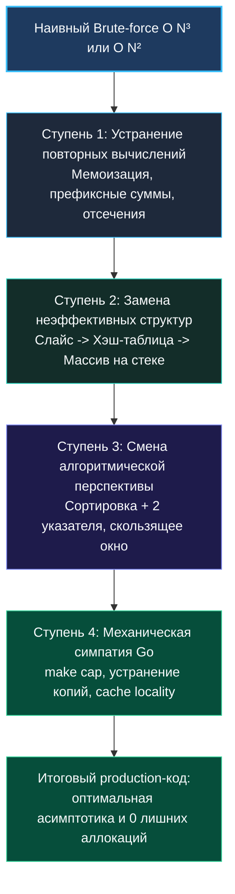

> *«Преждевременная оптимизация — корень всех зол. Но когда архитектура уже определена, аккуратная пошаговая оптимизация — признак истинного профессионализма».*  
> — Дональд Кнут

В предыдущей статье мы договорились, что наивное решение (brute-force) — это не досадный черновик, а надежная стартовая площадка. Теперь наступает время главного действия: превращения медленного перебора в высокоскоростной, надежный алгоритм. И делать это нужно не отчаянным прыжком в неизвестность, а последовательностью выверенных, логичных шагов.

Такая техника пошаговой оптимизации (incremental optimization) производит неотразимое впечатление на интервьюера: вы не просто выдаете готовый код из памяти, а наглядно демонстрируете инженерную методологию устранения узких мест. В этой статье мы разберем 4 ступени оптимизации, свяжем их с рантаймом Go и закрепим навык на классических задачах LeetCode.

---

### Модель восхождения по ступеням

Оптимизация подчиняется закону узкого места (bottleneck): в любой момент времени общая скорость алгоритма лимитируется самой «дорогой» операцией. Устраняя один bottleneck, мы передаем пальму первенства следующему, пока не упремся в фундаментальный теоретический предел задачи.



---

### Ступень 1. Устраняем повторные вычисления

Самый банальный источник тормозов — пересчет того, что уже было посчитано на предыдущем шаге.
- **Префиксные агрегаты:** Вместо того чтобы суммировать срез `nums[left...right]` за $O(K)$, мы предподсчитываем префиксные суммы `prefix[i] = prefix[i-1] + nums[i]` и получаем сумму любого диапазона за $O(1)$ как `prefix[right+1] - prefix[left]`.
- **Динамическое программирование:** Вместо экспоненциальной рекурсии с ветвлением $O(2^N)$ мы сохраняем промежуточные решения подзадач в плоском срезе `dp`.

---

### Ступень 2. Заменяем неэффективные структуры данных

Когда повторные вычисления ликвидированы, узкое место почти всегда перемещается в операции поиска, вставки или удаления в коллекциях:
- **Линейный поиск в слайсе ($O(N)$):** Заменяется на поиск в `map` ($O(1)$ в среднем) или бинарный поиск по отсортированному массиву ($O(\log N)$).
- **Хэш-таблица `map` $\to$ Массив прямого доступа:** Если ключами являются символы ASCII или небольшие числа, замена `map[byte]int` на `[128]int` убирает хэширование, pointer chasing и освобождает сборщик мусора.
- **Стандартный `container/list` $\to$ Кастомный список на структурах:** Устраняет упаковку примитивов в `any` (boxing) и сопутствующие аллокации в куче.

---

### Ступень 3. Меняем перспективу (алгоритмический сдвиг)

Иногда структуру данных оптимизировать некуда — нужно изменить сам порядок обхода пространства поиска:
- **Предварительная сортировка ($O(N \log N)$):** Создает инвариант порядка, открывающий дорогу для сходящихся двух указателей.
- **Скользящее окно:** Вместо перебора всех пар индексов $(i, j)$ сдвигает границы монотонно, гарантируя строго линейное время $O(N)$.
- **Бинарный поиск по ответу:** Превращает задачу нахождения оптимума в серию быстрых проверок гипотезы.

---

### Ступень 4. Go-специфичные микрооптимизации

Когда Big O доведен до совершенства, Senior-разработчик демонстрирует уважение к рантайму Go:

1. **Предварительное выделение емкости (`cap`):**  
   Запись `make([]T, 0, expectedSize)` предотвращает многократные переаллокации и копирования массива в куче при `append`.
2. **Локальные массивы на стеке:**  
   Переменная `var count [26]int` остается на стеке текущей горутины, если на нее нет внешних ссылок (escape analysis).
3. **Отказ от лишнего копирования в циклах:**  
   Конструкция `for _, item := range hugeSlice` копирует структуру `item` на каждой итерации. Для структур большого размера используйте доступ по индексу: `for i := range hugeSlice` и `&hugeSlice[i]`.
4. **Использование `strings.Builder`:**  
   Предотвращает квадратичное выделение промежуточных строк при сборке текста.

> [!WARNING] Ловушка / Gotcha: Читаемость кода превыше микрооптимизаций
> Не начинайте со Ступени 4! Микрооптимизации без смены плохой асимптотики бесполезны: замена `append` на предварительно выделенный слайс не спасет квадратичный алгоритм $O(N^2)$ от тайм-аута при $N = 10^5$. Сначала победите Big O, и только потом наводите лоск на уровне байтов.

---

### Сквозной пример 1: 3Sum (LeetCode 15)

Пройдем задачу по всем ступеням эволюции:

#### Шаг 0: Наивный перебор $O(N^3)$
Три вложенных цикла, перебирающих все возможные комбинации индексов $i < j < k$. При $N = 3000$ это $2.7 \times 10^{10}$ операций $\to$ Time Limit Exceeded.

#### Шаг 1: Анализ узкого места
Внутренний цикл по $k$ просто ищет значение `-(nums[i] + nums[j])`. Можно ли найти его быстрее? Если массив отсортирован, мы можем искать пару $(j, k)$ сходящимися указателями с двух концов массива за один проход $O(N)$!

#### Шаг 2: Итоговый оптимальный код $O(N^2)$

```go
func threeSum(nums []int) [][]int {
    n := len(nums)
    if n < 3 {
        return nil
    }

    // Сортировка in-place за O(N log N)
    sort.Ints(nums)

    // Предвыделяем разумную начальную емкость
    result := make([][]int, 0, 64)

    for i := 0; i < n-2; i++ {
        // Пропускаем дубликаты для первого элемента
        if i > 0 && nums[i] == nums[i-1] {
            continue
        }
        // Если наименьшее число > 0, сумма трех положительных чисел никогда не будет 0
        if nums[i] > 0 {
            break
        }

        left := i + 1
        right := n - 1
        target := -nums[i]

        for left < right {
            sum := nums[left] + nums[right]
            switch {
            case sum == target:
                result = append(result, []int{nums[i], nums[left], nums[right]})
                
                // Пропускаем дубликаты слева и справа
                for left < right && nums[left] == nums[left+1] {
                    left++
                }
                for left < right && nums[right] == nums[right-1] {
                    right--
                }
                left++
                right--
            case sum < target:
                left++
            default:
                right--
            }
        }
    }

    return result
}
```

---

### Сквозной пример 2: Самая длинная подстрока без повторяющихся символов (LeetCode 3)

#### Шаг 0: Наивный брутфорс $O(N^3)$
Перебираем все возможные подстроки `s[left:right]` и для каждой из них проверяем уникальность символов. Катастрофически медленно.

#### Шаг 1: Оптимизация до скользящего окна с хэш-таблицей $O(N)$
Вместо перезапуска проверки сжимаем окно слева при обнаружении дубликата. Работает за $O(N)$, но использует `map[byte]int`.

#### Шаг 2: Go-микрооптимизация до массива на стеке
Поскольку символы принадлежат таблице ASCII, заменяем `map` на плоский массив `[128]int`, где храним последний замеченный индекс каждого символа.

```go
func lengthOfLongestSubstring(s string) int {
    // lastPos[char] хранит последний замеченный индекс символа char
    var lastPos [128]int
    for i := range lastPos {
        lastPos[i] = -1 // -1 означает, что символ еще не встречался
    }

    left := 0
    maxLen := 0

    for right := 0; right < len(s); right++ {
        ch := s[right]
        
        // Если символ уже встречался внутри текущего окна
        if prevIdx := lastPos[ch]; prevIdx >= left {
            left = prevIdx + 1 // Мгновенный прыжок левой границы!
        }

        lastPos[ch] = right
        
        currentLen := right - left + 1
        if currentLen > maxLen {
            maxLen = currentLen
        }
    }

    return maxLen
}
```

**Инженерный триумф:**
- Сложность по времени: строго $O(N)$ за ровно 1 проход по строке.
- Сложность по памяти: $128 \times 8 = 1024$ байта на стеке ($O(1)$).
- Ноль обращений к аллокатору Go, ноль работы для сборщика мусора.

---

### Резюме диалога на собеседовании

1. *«Я зафиксировал наивное решение со сложностью $O(N^3)$. Главный bottleneck — внутренний цикл перебора».*
2. *«Я предлагаю устранить этот перебор, отсортировав массив и применив два указателя. Это понизит асимптотику до $O(N^2)$».*
3. *«Для оптимизации работы памяти я заменяю хэш-карту на локальный стек-массив [128]int, что полностью исключит аллокации в куче».*
4. *«Финальная сложность: $O(N)$ по времени и $O(1)$ по памяти. Код готов к тестам».*

В следующей статье мы разберем диагностику кода: как научиться безошибочно находить узкие места с первого взгляда без профайлера и бенчмарков. [[17. Как находить узкие места]]