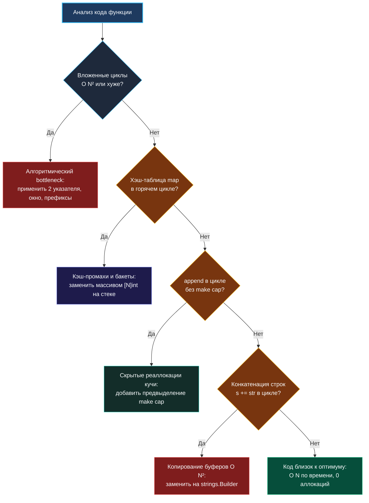

> *«Ошибочно полагать, будто программа распределяет свое время равномерно по всем строкам. Девяносто процентов времени процессор проводит в десяти процентах кода. Найдите эти десять процентов».*  
> — Брайан Керниган

В предыдущей статье мы научились последовательно подниматься по ступеням оптимизации. Но как безошибочно определить, на какую именно ступень нужно ступить прямо сейчас? Какая строка кода сжигает драгоценные миллисекунды, а какая — работает практически со скоростью кремния? И главное: как делать это прямо на собеседовании, глядя на пустой экран редактора, где нет ни `pprof`, ни бенчмарков `go test -bench`?

Умение моментально диагностировать узкое место (bottleneck) в уме — это высший пилотаж алгоритмической культуры. Новичок бросается наугад менять типы переменных или переставлять `if`-ы. Senior-инженер смотрит на код сквозь призму рантайма Go и законов физики процессора, безошибочно указывая пальцем на скрытый источник проблем.

---

### Три измерения узкого места

Узкое место — это не просто абстрактная степень в формуле Big O. В высоконагруженных системах и алгоритмах на Go узкие места раскладываются на три физических слоя:

1. **Асимптотический слой (Алгоритм):**  
   Вложенные циклы, разрастание пространства состояний ($O(N^2)$, $O(N^3)$, $O(2^N)$). При $N = 10^5$ никакой кэш процессора не спасет квадратичный алгоритм от краха.
2. **Аллокационный слой (Рантайм Go и GC):**  
   Даже если ваш алгоритм строго линейный ($O(N)$), но внутри цикла на миллион итераций вы создаете тысячи мелких объектов в куче или заставляете слайс неконтролируемо расти, вызовы `runtime.mallocgc` и сборщик мусора заставят программу захлебнуться.
3. **Кэш-промаховый слой (Архитектура процессора):**  
   Случайный доступ по указателям (pointer chasing) в хэш-таблицах или связных списках заставляет ядра CPU непрерывно простаивать в ожидании данных из оперативной памяти (RAM latency $\sim 50-100$ нс), в то время как последовательный обход непрерывного слайса утилизирует кэш-линии L1 со скоростью $\sim 1$ нс.



---

### Ментальный счетчик тактов: ориентиры для x86-64 и ARM64

Чтобы находить узкие места в уме, достаточно помнить примерный порядок стоимости базовых операций процессора:

| Операция | Стоимость (такты CPU) | Физический смысл |
|---|---|---|
| Чтение регистра CPU | 0–1 такт | Данные уже внутри вычислительного ядра |
| Чтение из кэша L1 | 3–4 такта | Локальные переменные на стеке, массив на стеке |
| Чтение из кэша L2 | 10–14 тактов | Непрерывный слайс среднего размера |
| Чтение из оперативной памяти (RAM) | 150–300 тактов | **Cache Miss!** Случайный прыжок по указателю |
| Доступ к элементу `map` | 50–200 тактов | Вычисление хэша + выборка бакета + разыменование |
| Аллокация в куче (`runtime.mallocgc`) | 500–2000 тактов | Поиск свободного span в mcache + метаданные GC |

Когда вы видите `m[key]++` внутри цикла на $10^5$ итераций, вы должны понимать: программа потратит на это десятки миллионов тактов просто на обслуживание бакетов `hmap`! Замена на `count[key]++` по прямому индексу слайса сократит это время на 90%.

---

### 7 «красных флагов» в коде на Go

Пройдитесь по этому чек-листу, когда ищете узкое место в наивном коде:

#### 1. Вложенные циклы по одному и тому же набору данных
Классический признак квадратичной сложности $O(N^2)$. Если $N > 2000$, это гарантированный провал. Задайте вопрос: *«Можно ли отсортировать массив, применить скользящее окно или запомнить посещенные элементы в хэш-таблице?»*

#### 2. Линейный поиск внутри цикла
Конструкция вида:
```go
for _, item := range listA {
    for _, target := range listB { // O(N * M) скрытый вложенный цикл!
        if item == target { ... }
    }
}
```
Лечится предварительной индексацией `listB` в `map[T]struct{}` или бинарным поиском.

#### 3. `map` с простыми ключами внутри горячего цикла
Если ключами являются символы латиницы, байты или целые числа из компактного диапазона (например, $0..1000$), использование `map` — неоправданный оверхед. Замените на срез или массив фиксированного размера.

#### 4. Неконтролируемый `append` без емкости
```go
var res []int // cap = 0
for i := 0; i < n; i++ {
    res = append(res, i) // До 17 реаллокаций и копирований памяти при n = 100 000!
}
```
Лечится одной строкой: `res := make([]int, 0, n)`.

#### 5. Конкатенация строк оператором `+` в цикле
Строки в Go неизменяемы. Выражение `s += chunk` выделяет новый буфер в куче и копирует в него все ранее накопленные байты. Для $N$ итераций это превращается в скрытое $O(N^2)$ по памяти и времени. Всегда используйте `strings.Builder`.

#### 6. Копирование тяжелых структур в `range`
```go
for _, item := range hugeStructSlice { // На каждой итерации копируется весь struct!
    process(item.ID)
}
```
Используйте индекс: `for i := range hugeStructSlice` и обращайтесь по ссылке или индексу.

#### 7. Неограниченная рекурсия
В Go размер стека горутины динамический (начинается с 2 КБ и удваивается по мере необходимости). Однако при глубине рекурсии в $10^4-10^5$ рантайм вынужден многократно вызывать процедуру `runtime.newstack`, копируя весь стековый фрейм в новый сегмент памяти. Итеративный цикл с явным слайсом-стеком всегда быстрее.

---

### Разбор кейса: Group Anagrams (LeetCode 49)

Задача: сгруппировать слова по признаку анаграммы.

#### Наивный подход: Сортировка каждого слова
Для каждого из $N$ слов длины $K$ мы сортируем буквы:
```go
// Сортировка строки: O(K log K)
sBytes := []byte(str)
sort.Slice(sBytes, func(i, j int) bool { return sBytes[i] < sBytes[j] })
key := string(sBytes)
groups[key] = append(groups[key], str)
```
- Общая сложность: $O(N \cdot K \log K)$.
- Узкое место: сортировка строк и множественные конвертации `string` $\leftrightarrow$ `[]byte`.

#### Оптимизация Senior-уровня: Массив частот как ключ map
Можно ли сгруппировать анаграммы без сортировки? Да! Частотный профиль слова из строчных латинских букв исчерпывающе описывается массивом `[26]byte`.
А в Go **массивы фиксированного размера являются сравнимыми (`comparable`) и могут выступать в роли ключа `map`**!

```go
func groupAnagrams(strs []string) [][]string {
    // В качестве ключа map используем массив [26]byte!
    groups := make(map[[26]byte][]string)

    for _, s := range strs {
        var count [26]byte
        for i := 0; i < len(s); i++ {
            count[s[i]-'a']++
        }
        groups[count] = append(groups[count], s)
    }

    result := make([][]string, 0, len(groups))
    for _, group := range groups {
        result = append(result, group)
    }
    return result
}
```

**Результат:**
- Сложность снизилась с $O(N \cdot K \log K)$ до строго линейной $O(N \cdot K)$!
- Полностью исключены сортировки.
- Профиль частот вычисляется на стеке за $K$ тактов.

---

### Резюме диагностики

1. **Смотрите на максимальный уровень вложенности:** Именно там скрывается главный пожиратель времени.
2. **Проверяйте операции по чек-листу «красных флагов»:** Ищите `map` в горячих циклах, скрытые реаллокации слайсов и конкатенацию строк.
3. **Оценивайте влияние памяти:** Помните о разнице между L1-кэшем (1 нс) и аллокациями в куче (сотни наносекунд + GC).
4. **Озвучивайте выводы:**  
   *«Здесь главный bottleneck — это сортировка каждого слова за O(K log K). Мы можем устранить его, воспользовавшись тем, что в Go массив [26]byte является comparable, и применить подсчет частот за O(K)»*.

В следующей статье мы подробно поговорим о том, как переводить абстрактные формулы Big O в реальные миллисекунды и мегабайты памяти на практике. [[18. Время и память на практике]]