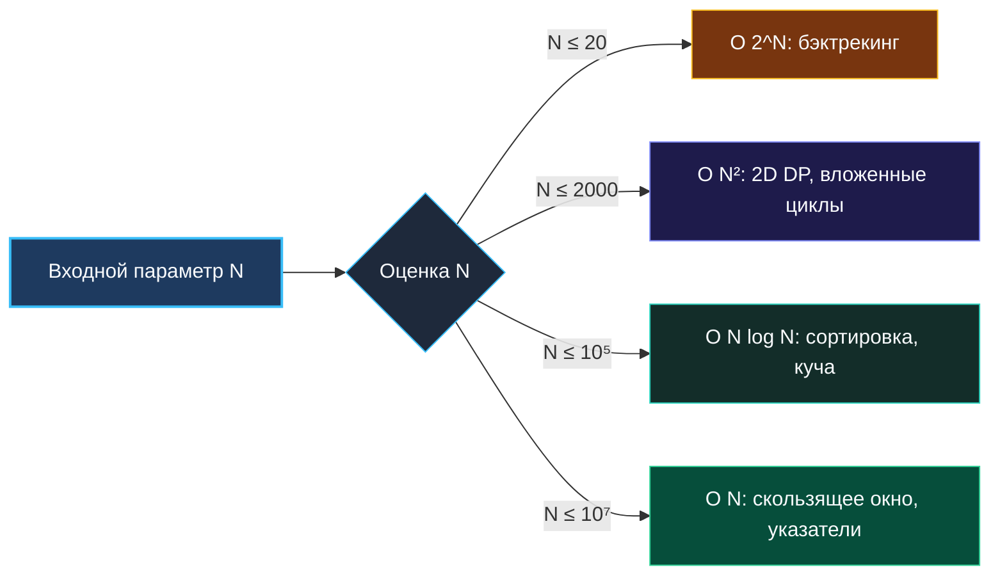

> *«В теории между теорией и практикой нет никакой разницы. На практике же эта разница колоссальна».*  
> — Бенджамин Брюстер

В академических учебниках по Computer Science сложность алгоритмов описывается строгой математической О-нотацией. Но на практике — будь то лимиты платформы LeetCode (1–2 секунды CPU и 256–512 МБ RAM) или реальные SLA бэкенд-микросервисов — чистая математика сталкивается с физикой кремния, накладными расходами рантайма Go и поведением сборщика мусора.

Senior-инженер мгновенно переводит абстрактную формулу $O(N \log N)$ в конкретные миллисекунды, а $O(N)$ — в мегабайты оперативной памяти. Он знает, почему $N = 10^5$ для квадратичного алгоритма означает гарантированный вердикт Time Limit Exceeded (TLE), и умеет за 15 секунд аргументировать интервьюеру, почему выбранное решение гарантированно уложится в бюджет ресурсов.

---

### Таблица выживания: ограничения $N$ диктуют архитектуру

Ограничения на входные данные — это главная подсказка в условии задачи. Опытный разработчик определяет семейство допустимых алгоритмов еще до того, как начнет придумывать решение:

| Ограничение $N$ | Максимально допустимая сложность | Допустимые алгоритмические семейства |
|---|---|---|
| $N \le 10–11$ | $O(N!)$, $O(N^2 \cdot 2^N)$ | Полный перебор перестановок, задача коммивояжера |
| $N \le 20–22$ | $O(2^N)$ | Бэктрекинг, перебор всех подмножеств, битовые маски |
| $N \le 100–400$ | $O(N^3)$ | Алгоритм Флойда-Уоршелла, трехмерное DP, наивные тройки |
| $N \le 2000–3000$ | $O(N^2)$ | Двумерное DP, два вложенных цикла, слияния пар |
| $N \le 10^5$ | $O(N \log N)$ | Сортировка, кучи, бинарный поиск, Divide & Conquer |
| $N \le 10^7$ | $O(N)$ | Линейный обход, два указателя, скользящее окно, префиксы |
| $N > 10^8$ | $O(\log N)$ или $O(1)$ | Бинарный поиск по ответу, математические замкнутые формулы |

---

### Физическая эвристика времени: правило «$10^8$ операций в секунду»

Чтобы быстро оценить время исполнения в уме, запомните фундаментальную эмпирическую константу:

> **Одно современное процессорное ядро успевает выполнить порядка $10^8 - 10^9$ базовых инструкций за 1 секунду.**

Как применить это правило к вашему коду:

1. **Простой цикл со сложением и доступом к слайсу:**  
   $10^7$ итераций $\approx 0.01 - 0.05$ секунды (зеленый свет, уверенный запас).
2. **Цикл с обращениями к `map` или аллокациями:**  
   Каждая операция с `map` «тяжелее» простого сложения в 5–10 раз. Поэтому $10^7$ операций с `map` займут уже около $0.3 - 0.8$ секунды — это опасная близость к тайм-ауту.
3. **Квадратичный алгоритм при $N = 10^5$:**  
   $N^2 = 10^{10}$ операций. Делим на $10^8 \to \mathbf{100\text{ секунд}}$ работы! Никакая система тестирования не будет ждать 100 секунд.

#### Пример: Расчет для 3Sum ($N = 3000$)
- Наше решение $O(N^2)$: число итераций $\frac{N(N-1)}{2} \approx 4.5 \times 10^6$.
- Внутри — арифметические сравнения и сдвиги указателей.
- Время выполнения: $4.5 \times 10^6 / 10^8 \approx \mathbf{0.04\text{ секунды}}$. Запас по времени более чем 25-кратный!

---

### Практическая бухгалтерия памяти в Go

В 64-битной архитектуре каждый тип данных имеет строгую цену в байтах:

| Тип данных в Go | Размер в памяти | На что обратить внимание |
|---|---|---|
| `byte`, `bool` | 1 байт | Базовые скаляры |
| `int32`, `rune` | 4 байта | Числа фиксированного диапазона, UTF-8 руны |
| `int`, `int64`, указатель `*T` | 8 байт | Стандартный целочисленный тип на 64-битных ОС |
| `struct{}` (пустая структура) | **0 байт** | Идеальный маркер для множеств: `map[T]struct{}` |
| `string` (заголовок) | 16 байт | Указатель на массив (8 байт) + длина (8 байт) |
| `[]T` (срез) | 24 байта | Указатель (8 байт) + `len` (8 байт) + `cap` (8 байт) |
| `map[K]V` | 8 байт (указатель `hmap`) | Плюс оверхед бакетов $\sim 8$ пар на бакет + метаданные |

> [!TIP] Множество на `struct{}` против `map[T]bool`
> Если вам нужно множество из $10^6$ элементов:
> - `map[int]bool`: каждое значение занимает 1 байт (плюс выравнивание структуры до байтов), суммарно тратится несколько мегабайт лишней памяти.
> - `map[int]struct{}`: тип `struct{}` занимает ровно 0 байт! Рантайм Go не выделяет под значения вообще ничего. Это идиоматичный и экономный паттерн.

---

### Расчет памяти для DP: плоский срез против матрицы

Предположим, алгоритм требует двумерной таблицы $DP[N][M]$, где $N = M = 2000$, тип ячейки `int` (8 байт).
Общий объем полезных данных:
$$2000 \times 2000 \times 8 \text{ байт} = 32\,000\,000 \text{ байт} \approx \mathbf{32\text{ МБ}}$$
При общем лимите памяти в 256 МБ это абсолютно безопасно.

Однако дьявол кроется в способе выделения памяти:
1. **Матрица срезов `[][]int`:**  
   Вызов `make([]int, m)` в цикле $N$ раз создает 2000 независимых кусков памяти в куче. Это не только фрагментирует память, но и заставляет сборщик мусора тратить время на сканирование 2000 объектов.
2. **Плоский срез `[]int`:**  
   `dp := make([]int, n*m)` — ровно **одна непрерывная аллокация** на 32 МБ. Обращение к элементу $(i, j)$ транслируется в `dp[i*m + j]`. Это дружественно к кэш-линиям CPU и снижает работу GC до нуля.

---

### Как презентовать оценку времени и памяти на интервью

Интервьюер не требует точности до микросекунды. Ему важна твердая инженерная аргументация:

> *«В худшем случае при N = 10⁵ наш алгоритм выполняет порядка N log N операций. Это примерно 1.7 миллиона итераций, внутри которых находятся только элементарные сравнения в непрерывном слайсе. На одном ядре такой объем инструкций выполнится за 0.02–0.05 секунды, что с огромным запасом укладывается в 2-секундный лимит.*  
> *По памяти: мы используем только плоский массив [128]int размером 1 КБ, который целиком размещен на стеке текущей горутины. Дополнительная память в куче строго O(1)».*

После такого ответа у интервьюера не остается никаких сомнений в уровне вашей технической квалификации.

В следующей статье мы разберем фактор, способный сломать даже самый быстрый алгоритм: краевые и угловые случаи (edge cases и corner cases) и специфические ловушки языка Go. [[19. Edge cases и corner cases]]