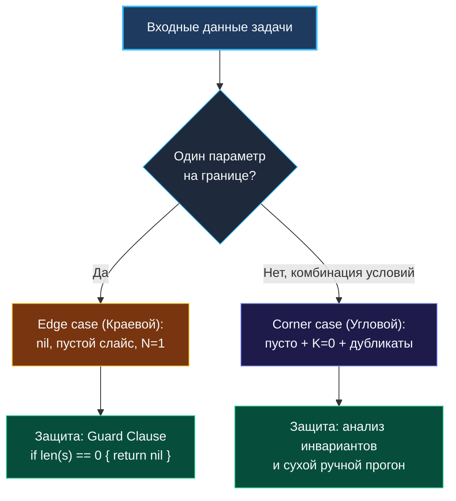

> *«Ошибки обожают прятаться на стыках и границах. Если вы научитесь методично проверять крайности, большинство катастроф погибнет ещё до рождения».*  
> — Брайан Керниган

Вы написали лаконичный алгоритм. Он компилируется без предупреждений. Он успешно проходит первый пример из условия. Вы уже готовы доложить интервьюеру об успешном решении, но тут звучит спокойный вопрос:  
*«А что произойдет, если массив окажется пустым? А если в графе всего одна вершина без ребер? А если все элементы среза одинаковы и равны нулю?»*

И в этот момент красивый код падает с паникой `panic: runtime error: index out of range`, зависает в бесконечном цикле или выдает неверный ответ. Умение предвидеть, систематически выявлять и элегантно обрабатывать краевые случаи — это один из самых надежных маркеров перехода от Middle к зрелому Senior-разработчику.

---

### Edge case против Corner case: в чем фундаментальная разница?

Хотя в разговорной речи эти термины часто смешивают, между ними существует важное инженерное различие:

- **Edge case (Краевой случай):**  
  Ситуация, когда **один** входной параметр находится на экстремальной границе диапазона допустимых значений.  
  *Примеры:* пустой слайс `len(nums) == 0`, срез из одного элемента, строка из одного символа, значение `math.MaxInt64`, корень дерева равен `nil`.  
  *Стратегия защиты:* лаконичные защитные условия (guard clauses) в начале функции.
- **Corner case (Угловой случай):**  
  Ситуация, когда сходятся **одновременно несколько** экстремальных или специфических условий. На пересечении этих условий алгоритмические инварианты трещат по швам.  
  *Примеры:* и исходная строка пуста, и целевой шаблон пуст; массив состоит только из отрицательных чисел, а целевая сумма $K = 0$; граф содержит ровно один узел с петлей на самого себя; связный список зациклен, но его длина меньше шага $k$.  
  *Стратегия защиты:* строгое доказательство инвариантов циклов и тщательный мысленный трассировочный прогон.



---

### Системный чек-лист поиска краевых случаев

После написания кода возьмите минутную паузу и методично прогоните его по универсальному списку «экстремумов»:

1. **Пустота (Empty/Nil):** Пустой срез `[]int{}`, `nil`-указатель, пустая строка `""`, дерево без единого узла.
2. **Одиночный элемент (Singular):** Массив длины 1, корень дерева без потомков, граф из одной вершины.
3. **Все элементы одинаковы (Homogeneous):** Массив `[5, 5, 5, 5]`. Ломает ли это сортировку или два указателя?
4. **Отрицательные числа:** Сохраняется ли монотонность префиксных сумм или скользящего окна при наличии отрицательных чисел? (Подсказка: классическое скользящее окно ломается, если элементы могут быть отрицательными!).
5. **Целочисленное переполнение (Overflow):** Превышает ли сумма двух элементов `math.MaxInt32` или `math.MaxInt64`?
6. **Вырожденная топология:** Дерево, вырожденное в длинный односвязный список (все потомки только правые) $\to$ риск переполнения стека при наивном DFS.

---

### Специфические ловушки Go: где ошибаются даже опытные

Рантайм Go имеет собственные уникальные особенности, порождающие тонкие баги.

#### 1. `nil`-слайс против пустого слайса
В Go и `var s []int` (`nil`), и `s := []int{}` имеют `len(s) == 0`. Проверка `len(s) == 0` корректно обрабатывает оба случая. Однако при сравнении `s == nil` или при сериализации в JSON они ведут себя по-разному (`null` vs `[]`). Уточняйте у интервьюера: *«Что мы возвращаем при отсутствии ответа — nil или пустой срез?»*.

#### 2. Индексация строк: байты против рун (UTF-8)
Обращение `s[i]` возвращает **байт**, а не символ!  
Если строка содержит символы не из таблицы ASCII (например, кириллицу или эмодзи), каждый символ кодируется 2–4 байтами:
```go
s := "Привет"
fmt.Println(len(s))         // 12 (длина в байтах!)
fmt.Println(len([]rune(s))) // 6 (длина в символах-рунах)
```
Если алгоритм оперирует индексами посимвольно в Unicode-строке, работайте со срезом рун `[]rune(s)`.

#### 3. Общая память и сайд-эффекты при `append`
Если создать под-срез и сделать в него `append`, пока емкость (`cap`) позволяет, вы **перезапишете данные исходного массива**!

```go
original := []int{1, 2, 3, 4, 5}
sub := original[:3] // len=3, cap=5 -> [1, 2, 3]
sub = append(sub, 99) // Перезаписывает original[3]!
// original стал: [1, 2, 3, 99, 5]
```
Senior всегда отслеживает, является ли слайс независимым буфером или разделяет память с исходными данными.

#### 4. Безопасное вычисление середины (Binary Search)
Наивная формула `mid := (left + right) / 2` при больших `left` и `right` (близких к $2^{31}-1$ или $2^{63}-1$) приводит к переполнению знакового целого.  
Канонический идиоматичный Go-вариант:
```go
mid := left + (right-left)/2
```

#### 5. Паника при записи в `nil`-map
Чтение из неинициализированной карты `var m map[string]int; val := m["key"]` возвращает `0` и **не паникует**.  
Но попытка записи `m["key"] = 1` немедленно обрушивает программу:  
`panic: assignment to entry in nil map`.  
Всегда инициализируйте карту: `m := make(map[string]int)`.

#### 6. Недетерминированный порядок обхода `map`
Спецификация Go намеренно рандомизирует порядок итерации в `for k, v := range m`. Если ваш алгоритм рассчитывает на то, что ключи будут прочитаны в порядке их вставки, решение выдаст недетерминированный результат. Порядок вставки поддерживается отдельным срезом ключей.

---

### Таблица edge cases по типам данных

| Структура данных | Типовые Edge & Corner Cases |
|---|---|
| **Слайс `[]int`** | `len == 0`, `len == 1`, все дубликаты, отсортирован в обратном порядке, отрицательные числа |
| **Строка `string`** | `""`, один символ, пробелы, многобайтовый UTF-8, четная/нечетная длина для палиндромов |
| **Связный список** | `head == nil`, 1 узел, 2 узла, цикл (петля), удаление головного узла, удаление хвоста |
| **Дерево** | `root == nil`, цепочка в одну линию (глубина $N$), все значения одинаковы, сбалансировано |
| **Граф** | 0 ребер, не связный (несколько компонент), наличие петель и циклов в ориентированном графе |
| **Числа** | `0`, `-1`, деление на ноль, `math.MinInt64` (абсолютное значение `abs(MinInt)` переполняется!) |

> [!WARNING] Ловушка с `abs(math.MinInt)`
> В двузначной дополнительной арифметике (two's complement) отрицательных чисел на единицу больше, чем положительных.
> Для 64-битного целого `math.MinInt64 = -9223372036854775808`. Попытка взять `-math.MinInt64` переполняется и снова возвращает отрицательное число!

---

### Как презентовать обработку edge cases на собеседовании

Не ждите, пока интервьюер начнет искать дыры в вашем коде. Перехватите инициативу:

> *«Код написан. Теперь я выполню систематическую проверку на краевые случаи:*  
> *1. Пустой вход: условие if len(nums) == 0 в начале функции корректно возвращает nil.*  
> *2. Массив из одного элемента: цикл for left < right даже не запустится, вернется базовый ответ.*  
> *3. Дубликаты: в блоке сдвига указателей я добавил пропуск одинаковых значений.*  
> *4. Целочисленное переполнение: для вычисления середины я использую mid = left + (right-left)/2.*  
> *Все краевые точки закрыты».*

Такой уровень самоконтроля — это то, что безоговорочно отличает сильного Senior-инженера.

В следующей заключительной главе теоретического блока мы разберем высшее искусство: как отлаживать сложные алгоритмические дефекты в уме прямо во время интервью, не имея под рукой IDE и отладчика. [[20. Debugging алгоритмов]]