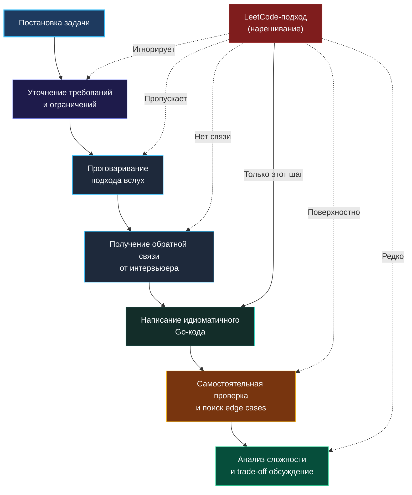

> *«Отладка кода вдвое сложнее, чем его написание. Так что если вы пишете код настолько умно, насколько можете, вы по определению недостаточно сообразительны, чтобы его отладить».*  
> — Брайан Керниган

Парадокс, знакомый десяткам талантливых инженеров: вы добросовестно решили 400 задач на LeetCode, назубок помните обход графов, балансировку красно-чёрных деревьев и двумерную динамику, но на реальном техническом собеседовании получаете вежливый отказ уже после первого алгоритмического раунда. При этом задачу вы, казалось бы, решили: код прошёл тестовые сценарии, интервьюер кивал и делал пометки в блокноте. В чём же дело?

Ответ прост и порой обескураживает: **техническое интервью — это не автоматизированная проверка скрипта в песочнице**. Онлайн-платформы вроде LeetCode оценивают единственный бездушный артефакт: скомпилировался ли код и уложился ли он в заданные лимиты по времени и оперативной памяти. Живой интервьюер оценивает нечто неизмеримо более ценное: **вас как будущего коллегу по инженерной команде**, с которым предстоит дежурить на продакшене, проектировать микросервисы и проводить вдумчивые код-ревью. И написанный код — лишь один из множества сигналов в этой оценке.

> [!tip] Что на самом деле ждет интервьюер на позиции Senior Go Engineer
> В технологических компаниях уровня FAANG и крупных финтехах за 45-минутный алгоритмический раунд оценивают:
> - **Умение прояснять контекст:** Способность задать точные вопросы до того, как пальцы коснутся клавиатуры.
> - **Прозрачность мышления:** Умение непрерывно и структурированно рассуждать вслух, делая свои мысли понятными собеседнику.
> - **Осознанный выбор структур данных:** Способность аргументировать, почему именно здесь уместен `map`, а где лучше применить плоский срез или битовую маску.
> - **Качество кода:** Написание чистого, читаемого и идиоматичного Go-кода, который не стыдно сразу отправить в продакшен.
> - **Автономный поиск краевых случаев (Edge Cases):** Умение протестировать собственное решение без подсказок и наводящих вопросов.
> - **Глубокий анализ компромиссов (Trade-offs):** Понимание альтернативных решений и их влияния на процессорный кэш, память и сборщик мусора.

## Анатомия алгоритмического интервью

Давайте сопоставим реальный процесс прохождения секции и привычку «нарешивания», выработанную платформой:



Разберём каждый шаг подробно и увидим, где именно механическое решение задач формирует вредные привычки.

### 1. Уточнение требований: формулировка задачи — лишь повод для диалога

На сайте LeetCode формулировка выверена до миллиметра: указаны ограничения (constraints), типы данных и детальные примеры. На реальном интервью опытный специалист намеренно дает **размытое, неполное условие**. Он проверяет, броситесь ли вы сразу писать код, доверившись догадкам, или проявите инженерную дисциплину:

- **Диапазон и природа входных данных:** Могут ли числа быть отрицательными или нулём? Влезают ли значения в стандартный `int` или возможно переполнение?
- **Строки и кодировки:** Мы работаем строго с латиницей (ASCII) или с произвольным текстом в UTF-8? Для Go это принципиальная разница: байт (`byte`) или руна (`rune`)?
- **Краевые условия:** Что возвращать, если данных нет или решения не существует — `nil`, пустой слайс или сигнальное значение (`-1`)?
- **Масштаб и память:** Помещается ли набор данных целиком в оперативную память одного сервера или мы имеем дело с бесконечным потоком логов (Streaming Data)?
- **Конкурентность:** Будет ли функция вызываться одновременно из множества параллельных горутин?

> [!warning] Ловушка / Gotcha: Молчание о конкурентности
> Реальная поучительная история: кандидат блестяще закодил на Go задачу нахождения скользящей медианы в потоке чисел (LeetCode 295) через две кучи (`container/heap`). Код работал за безупречные $O(\log K)$, тесты прошли. Кандидат получил отказ.
> 
> Почему? На этапе уточнений он ни словом не обмолвился о том, как метод `AddNum()` взаимодействует с параллельными вызовами. В продакшене Go почти весь бэкенд высококонкурентен, а стандартный пакет `container/heap` не является потокобезопасным. Интервьюер сделал запись: *«Кандидат пишет код в вакууме, не задумываясь о среде исполнения и безопасности параллельного доступа»*. Всего один вопрос — «Нужно ли защищать структуру через `sync.Mutex` или вызовы строго последовательны?» — кардинально изменил бы результат.

### 2. Коммуникация: думаем вслух, а не кодим в тишине

Для разработчиков-интровертов необходимость говорить во время размышлений часто кажется противоестественной. Однако гробовая тишина во время интервью — худший сценарий. Интервьюер не телепат: он не знает, обдумываете ли вы тонкую оптимизацию, растерялись или просто пытаетесь вспомнить заученный листинг из интернета.

Зрелый кандидат озвучивает ход мыслей тезисно и системно:
- *«Сначала сформулируем наивный подход. Перебор всех пар даст квадратичное время $O(N^2)$. При ограничениях $N \le 10^5$ это приведет к $10^{10}$ операций, что вызовет Time Limit Exceeded на любом сервере».*
- *«Поскольку массив уже отсортирован, здесь возникает монотонность. Мы можем использовать два указателя, двигаясь с краев к центру. Это снизит время до линейного $O(N)$ при константной памяти $O(1)$».*
- *«Для хранения частот нам потребуется хэш-таблица. В Go это `map[byte]int`. Но если алфавит ограничен только строчными латинскими буквами, мы можем взять фиксированный массив `[26]int` на стеке, сэкономив на аллокациях в куче».*

Если вы идёте по тупиковому пути, но рассуждаете вслух, доброжелательный интервьюер почти всегда мягко подтолкнет вас в нужную сторону («А что произойдет, если в массиве встретится отрицательное число?»). Если же вы молчите, подсказки не будет: спасать молчащего кандидата некому. Подробнее эту технику мы разберем в лекции [[6. Как объяснять решение вслух]].

### 3. Культура кода: читаемость и идиоматичный Go

На онлайн-платформах код существует ровно три секунды — до получения зеленой плашки «Accepted». Кандидаты привыкают к однобуквенным переменным (`l`, `r`, `t`, `m`), странным хакам и конструкциям в одну строчку.

На собеседовании ваш код будут **внимательно читать люди**. Код должен выглядеть так, будто завтра он пойдет в рабочий репозиторий:

Сравним два подхода на задаче поиска всех анаграмм в строке (LeetCode 438):

**Плохой стиль («Платформенный» набросок):**
```go
func findAnagrams(s string, p string) []int {
    res := []int{}
    if len(s) < len(p) {
        return res
    }
    m1 := make([]int, 26)
    for i := 0; i < len(p); i++ {
        m1[p[i]-'a']++
    }
    m2 := make([]int, 26)
    for i := 0; i < len(p); i++ {
        m2[s[i]-'a']++
    }
    if eq(m1, m2) {
        res = append(res, 0)
    }
    for i := len(p); i < len(s); i++ {
        m2[s[i]-'a']++
        m2[s[i-len(p)]-'a']--
        if eq(m1, m2) {
            res = append(res, i-len(p)+1)
        }
    }
    return res
}
```

Что бросается в глаза интервьюеру?
- Слайсы `m1` и `m2` аллоцируются в куче через `make([]int, 26)`, хотя размер заранее известен и константен.
- Требуется вспомогательная функция `eq()`, потому что слайсы в Go нельзя сравнивать через оператор `==`.
- Неуклюжая индексная арифметика `i-len(p)+1`, загромождающая чтение.

**Идиоматичный вариант зрелого инженера:**
```go
func findAnagrams(s string, p string) []int {
    if len(s) < len(p) {
        return nil
    }

    var (
        target [26]int
        window [26]int
        result []int
    )

    // Первоначальное заполнение частот для первого окна
    for i := range p {
        target[p[i]-'a']++
        window[s[i]-'a']++
    }

    // В Go массивы фиксированного размера [26]int являются values 
    // и прекрасно сравниваются встроенным оператором == за O(1)!
    if window == target {
        result = append(result, 0)
    }

    // Скользим окном фиксированного размера по оставшейся строке
    for i := len(p); i < len(s); i++ {
        window[s[i]-'a']++
        window[s[i-len(p)]-'a']--

        if window == target {
            result = append(result, i-len(p)+1)
        }
    }

    return result
}
```

Посмотрите на разницу:
1. `target` и `window` объявлены как **массивы фиксированной длины `[26]int`**. Они лежат прямо на стеке горутины, не вызывают аллокаций в куче и не создают ни грамма работы для сборщика мусора.
2. В отличие от слайсов, массивы одинакового типа в Go **напрямую сравниваются оператором `==`**! Никаких рукописных циклов сравнения.
3. Код лаконичен, прозрачен и безопасен.

### 4. Автономное тестирование граничных случаев

На учебном сайте при ошибке вам услужливо выведут: *«Test failed: input [1, 2], expected true, got false»*. На собеседовании кнопки «Проверить тестами» нет. Нажатие на компиляцию или запуск тестов без предварительной вычитки глазами расценивается как слабость.

Senior-инженер сам проводит трассировку:
- **Нулевые и пустые структуры:** `nil`-указатели, срезы нулевой длины, пустые строки.
- **Отрицательные числа и ноль:** Поведение условий деления и модульной арифметики.
- **Целочисленное переполнение (Integer Overflow):** В Go тип `int` платформозависим (на 64-битных системах это 64 бита, на 32-битных — 32 бита). При сложении больших чисел в цикле всегда стоит упомянуть `int64` или защиту от переполнения.
- **Особенности работы со строками в Go:** Помните, что `len(str)` возвращает **количество байт**, а не количество символов! Если строка содержит кириллицу или эмодзи, индексация `s[i]` вернет обломок многобайтовой руны. Если задача требует работы с произвольным текстом, мы обязаны декодировать руны через `utf8.DecodeRuneInString` или явный срез `[]rune(s)`.

### 5. Анализ сложности: заглядываем за пределы Big-O

Произнести вслух «Сложность по времени $O(N)$, по памяти $O(N)$» может любой студент. От опытного инженера ждут понимания того, как алгоритмическая сложность транслируется в реальные миллисекунды и байты:

> [!info] Под капотом: Настоящая цена `runtime.hmap`
> Когда вы создаете хэш-таблицу `m := make(map[int]int)`, в оперативной памяти разворачивается сложная внутренняя структура рантайма `runtime.hmap`. Данные хранятся в 8-элементных бакетах. 
> 
> Каждое чтение или запись ключа включает:
> 1. Вычисление хэша ключа алгоритмом AES/MEMHASH.
> 2. Битовое маскирование для нахождения нужного бакета.
> 3. Сканирование массива `tophash` внутри бакета.
> 4. Разыменование указателей при коллизиях и переход по переполненным бакетам (overflow buckets).
> 
> На современном процессоре такое обращение занимает порядка 20–50 наносекунд и практически гарантированно вызывает Cache Miss, сбивая конвейер команд. В то же время доступ по индексу к непрерывному массиву `[26]int` занимает доли наносекунды (L1-кэш). Знание этой разницы позволяет аргументированно сказать интервьюеру: *«Теоретически хэш-таблица и статический массив дают $O(1)$, но константа массива на реальном железе на порядки ниже»*.

## Вредные привычки, порождаемые LeetCode

Обобщим привычки, от которых необходимо избавиться перед выходом на собеседования:

1. **Мгновенный старт кодинга.** Прочитали первую строку и сразу начали набивать цикл. *Лекарство:* положите руки на колени, задайте три уточняющих вопроса и проговорите общую идею.
2. **Невнимание к именам переменных.** Переменные `i`, `j`, `k`, `v`, `tmp` превращают алгоритм в шифрограмму. Используйте говорящие имена: `left`, `right`, `currentSum`, `charFrequency`.
3. **Надежда на подсказку компилятора.** Полагаться на то, что компилятор укажет на опечатки и пропущенные краевые случаи. Привыкайте трассировать код в уме, ведя по строкам мысленным курсором.
4. **Игнорирование экосистемы языка.** Попытка переписать стандартные алгоритмы вручную там, где стандартная библиотека предлагает готовое решение (`sort.Slice`, `slices.BinarySearch` в современном Go, `copy`, `bytes.Buffer`).

## Практический чеклист подготовки

Чтобы ваша подготовка трансформировалась в офферы, превратите каждую решаемую задачу в мини-собеседование:

- **Решайте вслух.** Даже когда сидите в пустой комнате. Объясняйте стенке или резиновой уточке каждый шаг.
- **Откажитесь от автодополнения IDE.** Тренируйтесь писать решения в простом текстовом редакторе или на листе бумаги. Вы удивитесь, как часто на интервью забывается базовая сигнатура `sort.Slice` или параметры `append`.
- **Контролируйте тайминг:** 20 минут на Medium, 35 минут на Hard.
- **Проводите самоанализ:** После того как задача решена, задайте себе контрольный вопрос: «Как бы я объяснил это решение коллеге на архитектурном комитете?».

## Итог

Умение решать задачи — это фундамент, но прочный дом собеседования строится из коммуникации, инженерной дисциплины, идиоматичного кода и понимания компромиссов на уровне рантайма Go.

В следующей лекции мы разберём, как перестать запоминать сотни разрозненных задач и освоить компактный набор универсальных ментальных моделей: [[3. Паттерны вместо запоминания решений]].