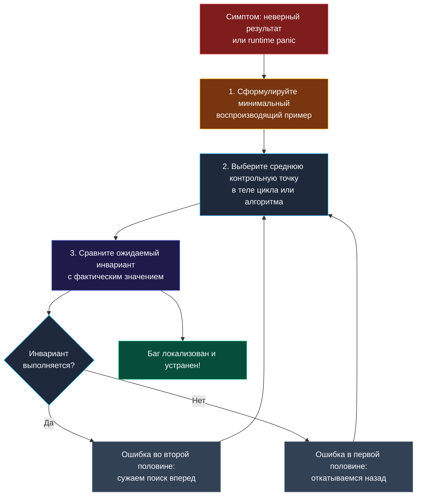

> *«Самый эффективный инструмент отладки — это по-прежнему ясное, неторопливое мышление, подкрепленное строгой проверкой логических утверждений».*  
> — Брайан Керниган

Вы написали алгоритмический код. Он компилируется. Вы с уверенностью запускаете его на тестовом примере, но результат не совпадает с ожидаемым. Или еще драматичнее: программа паникует с ошибкой времени выполнения.

На реальном собеседовании у вас нет под рукой графического отладчика с точками останова (breakpoints), нет возможности бесконечно расставлять `fmt.Println` и нет времени на хаотичный перебор вариантов. Ваш единственный инструмент диагностики — **собственное структурированное мышление**.

Умение хладнокровно, методично и прозрачно для интервьюера локализовать и устранить дефект в коде прямо в уме — это один из самых ценных навыков Senior-инженера. В этой статье мы разберем универсальный алгоритм отладки без IDE, научимся превращать ментальные сбои в точки профессионального роста и изучим типовые ловушки рантайма Go.

---

### Ментальная модель: бинарный поиск по пространству кода

Когда алгоритм выдает ошибку, неопытный кандидат начинает хаотично перечитывать весь код строчка за строчкой в надежде «случайно заметить опечатку». Это крайне неэффективно.

Профессиональный подход к отладке опирается на **метод бинарного поиска по состояниям**:
1. Разделите выполнение функции на несколько контрольных этапов (фаз).
2. Сформулируйте ожидаемое состояние данных в середине алгоритма.
3. Мысленно сопоставьте ожидаемое состояние с реальным:
   - Если состояние корректно — ошибка находится **во второй половине** кода.
   - Если состояние уже повреждено — ошибка произошла **до контрольной точки**.



---

### Шаг 1. Сожмите проблему: минимальный воспроизводящий пример (MRE)

Если алгоритм падает на тесте из 50 элементов, не пытайтесь отлаживать его на всех 50! Главное правило инженера — **минимизировать входные данные**:
- Сократите массив до 2–3 элементов (например, `[2, 1]`).
- Для строк возьмите слово из двух одинаковых или двух разных букв (`"ab"`, `"aa"`).
- Для графов оставьте 2 вершины и 1 ребро.

Если ошибка воспроизводится на 2 элементах, вы найдете ее за 30 секунд ручной трассировки, сохранив ясность ума и контроль над ситуацией.

---

### Шаг 2. Инварианты как ментальные точки останова (Breakpoints)

Инвариант — это непреложное логическое утверждение о состоянии переменных, которое обязано оставаться истинным перед началом и после завершения каждой итерации цикла.

Примеры строгих инвариантов:
- **Бинарный поиск:** *«Искомый элемент, если он существует, строго лежит в диапазоне [left, right]»*.
- **Скользящее окно:** *«Подстрока s[left:right] содержит ровно matched уникальных символов с требуемой кратностью»*.
- **Два указателя в 3Sum:** *«Все пары левее left и правее right уже проверены и не могут дать нулевую сумму с nums[i]»*.

В момент отладки озвучьте инвариант:  
*«Проверим инвариант: после сдвига правого указателя переменная have[ch] обязана увеличиться на 1. Проверяю... да, увеличилась. А вот счетчик matched не увеличился, потому что я забыл проверить условие have[ch] == need[ch]. Баг найден!»*.

---

### Шаг 3. Ручная таблица трассировки (Variable Tracing)

Нарисуйте в комментариях редактора или на доске компактную таблицу значений для 2–3 итераций:

| Итерация | `left` | `right` | `nums[right]` | `currentSum` | `maxSum` |
|---|---|---|---|---|---|
| Старт | 0 | 0 | 2 | 2 | 2 |
| Итерация 1 | 0 | 1 | -3 | -1 | 2 |
| Итерация 2 | 2 (сброс!) | 2 | 4 | 4 | 4 |

Заполняя эту таблицу шаг за шагом, вы мгновенно увидите точное место, где реальность разошлась с математической моделью.

---

### Классификатор дефектов: «фоторобот» типичных багов

#### 1. Ошибка на единицу (Off-by-one)
Самый распространенный класс алгоритмических дефектов.
- **Симптомы:** длина ответа отличается ровно на $\pm 1$; `panic: index out of range` на последнем элементе.
- **Зона проверки:**
  - Границы циклов: `for i < n` против `for i <= n`.
  - Длина диапазона: `right - left + 1` против `right - left`.
  - Срезы Go: в срезе `s[a:b]` правая граница `b` **не включается**!
  - Бинарный поиск: сдвиги `left = mid + 1` и `right = mid - 1` против `right = mid`.

#### 2. Забытое обновление связанных переменных
- **Симптомы:** алгоритм работает на простых тестах, но зацикливается или возвращает мусор на сложных.
- **Зона проверки:** при сдвиге указателя `left++` вы забыли вычесть `nums[left]` из бегущей суммы или уменьшить частотный счетчик в хэш-таблице.

#### 3. Неправильный сброс состояния в бэктрекинге
- **Симптомы:** последующие ветви рекурсии получают данные от предыдущих веток.
- **Зона проверки:** забыли выполнить откат: `path = path[:len(path)-1]` или `visited[node] = false` после возврата из рекурсивного вызова.

---

### Тонкие «маски» Go: когда виноват язык, а не алгоритм

Иногда алгоритмическая логика кандидата безупречна, но код падает из-за непонимания внутренних механизмов Go:

#### Ловушка 1: Паника на `nil`-карте
```go
var memo map[int]int
// ...
memo[key] = val // panic: assignment to entry in nil map!
```
*Лечение:* Всегда инициализируйте карту: `memo = make(map[int]int)`.

#### Ловушка 2: Модификация копии вместо оригинала в `range`
```go
for _, node := range nodes {
    node.Visited = true // Бесполезно! Изменяется локальная копия структуры!
}
```
*Лечение:* Используйте индекс: `nodes[i].Visited = true`.

#### Ловушка 3: Случайная перезапись среза через `append`
```go
a := []int{1, 2, 3}
b := a[:1] // [1], cap = 3
b = append(b, 99) // Перезаписало a[1]! Теперь a = [1, 99, 3]
```
*Лечение:* При необходимости изолированного среза используйте трех-индексный срез с ограничением емкости: `b := a[:1:1]`. Тогда `append` гарантированно выделит независимый массив.

---

### Как вести себя при обнаружении бага на интервью

1. **Не паникуйте и не извиняйтесь:** Ошибки при написании кода — абсолютно естественная часть инженерной работы. Интервьюер оценивает вашу реакцию.
2. **Озвучьте симптом:** *«Так, на тесте с дубликатами функция вернула 3 вместо 2. Похоже, мы дважды учли один и тот же элемент»*.
3. **Возьмите управление:** *«Давайте я не буду гадать, а быстро протрассирую логику на минимальном примере из трех элементов»*.
4. **Найдите и объясните причину:** *«Ага! При сдвиге указателя я забыл пропустить повторяющиеся значения. Исправляю условием for»*.
5. **Проверьте повторно:** Убедитесь, что исправление не сломало другие тесты.

Демонстрация такого спокойного, аналитического подхода производит куда более сильное впечатление, чем случайное «угадывание» решения без единой помарки.

---

### Заключение теоретического блока

Мы завершили фундаментальный теоретический цикл подготовки к алгоритмическим секциям. Мы освоили ментальные модели Кернигана:
- Перевод условий задач в эффективные структуры данных.
- Строгий выбор между жадностью и динамическим программированием.
- Гармоничную композицию алгоритмических паттернов.
- Преодоление неочевидности через наивное решение и пошаговую оптимизацию.
- Механическую симпатию к кэш-линиям, сборщику мусора и рантайму Go.

В следующем модуле мы перейдем к психологическим и тактическим аспектам интервью: таймингу, лайвкодингу на белой доске и антипаттернам поведения. [[21. Тайминг решения задач]]