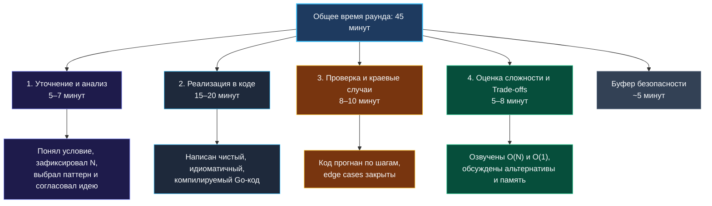
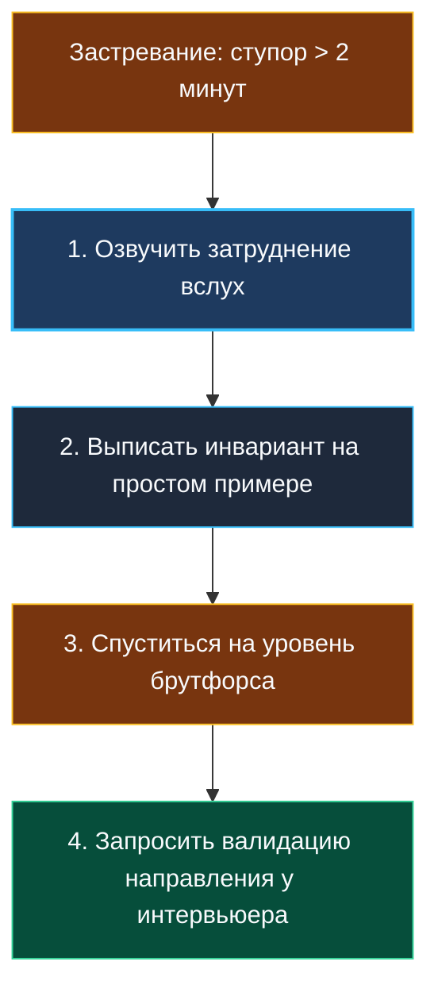

> *«Время — самый дефицитный ресурс инженера, и если им не управлять, ничем другим управлять невозможно».*  
> — Питер Друкер

Вы отлично знаете алгоритмические паттерны, умеете мгновенно вычленять их из туманного условия задачи ([[4. Как распознавать паттерн в задаче]]), писать безупречный идиоматичный код ([[5. Алгоритм решения задачи на интервью]]) и даже пошагово отлаживать его в уме ([[20. Debugging алгоритмов]]). Но всё это инженерное великолепие может обратиться в прах, если вы не уложитесь в отведённые 45 минут.

Тайминг на техническом собеседовании — это строгий невидимый экзаменатор. Он безжалостнее любого придирчивого интервьюера. Вы можете придумать гениальное математическое доказательство и написать шедевр архитектуры, но если вы потратили 40 минут на разминку и оставили 5 минут на основную задачу — результат раунда предрешён.

Управление временем на интервью — это не суетливое «думай быстрее и стучи по клавишам яростнее». Это зрелый стратегический навык: понимание, когда нужно углубиться в инварианты, а когда безжалостно форсировать переход к коду; в какой момент признать тупик гипотезы и сменить курс; как использовать интервьюера как ценного союзника и как чётко транслировать статус своего мыслительного процесса.

---

### Почему тайминг критичен для Senior-инженера

От начинающего разработчика (Junior/Middle) не ждут идеального тайм-менеджмента: если он застрял, интервьюер охотно подскажет направление, ведь оценивается в первую очередь базовое знание структур данных и способность воспринимать фидбек.

От Senior-разработчика ждут **автономии и предсказуемости**. Сеньор обязан самостоятельно пройти весь производственный цикл:
1. Квалифицировать входные требования и ограничения;
2. Сформулировать архитектурную гипотезу;
3. Реализовать чистый, компилируемый код;
4. Самостоятельно протестировать его на пограничных сценариях;
5. Оценить вычислительную сложность и обсудить инженерные компромиссы (trade-offs).

И всё это — строго в рамках тикающего таймера. Срыв тайминга опытным кандидатом воспринимается нанимающей стороной не как «чуть-чуть не хватило времени», а как тревожный сигнал: инженер не умеет декомпозировать задачи, теряет фокус на главном или увлекается академическим перфекционизмом. В реальном продакшене такой специалист рискует пообещать критическую фичу за двухнедельный спринт, а затем два месяца полировать внутренние интерфейсы. Алгоритмическое интервью — это сжатая во времени модель поведения разработчика в стрессовой производственной ситуации.

---

### Стандартный тайминг раунда и его вариации

Классический алгоритмический раунд длится **45 минут** (в редких компаниях — 60 минут). Как правило, он строится по одному из трёх сценариев:

- **Одна задача уровня Medium/Hard:** Самый частый формат для позиций уровня Senior. 45 минут идеально хватает для честного прохождения полного цикла: от проектирования и обсуждения до верификации и анализа компромиссов.
- **Две задачи (Easy + Medium):** Интервьюер хочет проверить две разные вещи: базовую скорость и механику на простой задаче, а также глубину мышления на средней. Здесь тайминг превращается в искусство: на Easy-задачу нельзя тратить более 10–12 минут, иначе на Medium физически не останется времени.
- **Задача с усложнением (Follow-up):** Вам дают базовую постановку, а после успешного решения добавляют новое ограничение (например: «А теперь данные не помещаются в память» или «Поток данных бесконечен»). Фактически это решение полутора-двух связанных задач.

Эти временные интервалы — не догматический шаблон, а ваш внутренний метроном. Если задача оказалась очевидной, фазы сжимаются, давая простор для глубокого технического диалога. Если задача крепкая — баланс сдвигается, но **категорически запрещено жертвовать фазой проверки и оценки сложности**. Пропуск этих финальных этапов снижает итоговую оценку даже при безупречно написанном алгоритме.

---

### Детальный разбор фаз и тактика победы над временем

#### Фаза 1: Уточнение и формулирование гипотезы (5–7 минут)

**Главная цель:** Детально понять задачу, очертить границы входных данных ($N$), выбрать алгоритмический паттерн и согласовать выбранный маршрут с интервьюером.

**Чек-лист действий:**
- Задайте 3–4 прицельных вопроса по ограничениям: допустимы ли отрицательные числа, могут ли быть дубликаты, как обрабатывать пустой слайс или `nil`, фиксирован ли алфавит (ASCII vs UTF-8).
- Оцените порядок величины $N$ и сопоставьте с допустимой асимптотикой (вспомните матрицу ограничений из [[18. Время и память на практике]]).
- Сформулируйте гипотезу: «Поскольку массив отсортирован и требуется найти пару, я предлагаю использовать технику двух указателей, что даст $O(N)$ по времени и $O(1)$ по дополнительной памяти». Дождитесь явного кивка или одобрения интервьюера!

> [!WARNING] Ловушка «Аналитического паралича»
> Не пытайтесь на первой фазе мысленно написать весь код вплоть до каждого индекса `i` и `j`. На фазе 1 вам нужен **инвариант и общее направление**. Если через 7 минут вы всё ещё не видите оптимального решения — не молчите! Форсируйте переход: *«Оптимальный подход пока не очевиден, поэтому я предлагаю зафиксировать наивное решение за $O(N^2)$, чтобы гарантировать рабочий результат, а затем мы вместе найдем узкие места и оптимизируем его»*. Это действие взрослого инженера.

**Go-специфика на фазе 1:**
Уже здесь полезно проговорить выбор типов:  
*«Так как входные символы строго из латиницы `a-z`, вместо тяжёлой `map[rune]int` с динамическими аллокациями в куче я использую плоский массив `[26]int` на стеке»*. Это моментально демонстрирует ваше знание рантайма и экономит время на этапе кодирования.

---

#### Фаза 2: Написание кода (15–20 минут)

**Главная цель:** Воплотить согласованную идею в компилируемый, чистый и лаконичный Go-код без пауз и мучительных раздумий над синтаксисом.

**Тактические приемы ускорения:**
1. **Быстрый старт с сигнатуры и граничных условий:** Начните с объявления функции и обработки вырожденных случаев (`if len(nums) == 0 { return 0 }`). Это занимает ровно 30 секунд, помогает справиться со стартовым мандражом и даёт ощущение первого осязаемого результата.
2. **Комментирование блоками, а не строками:** Не озвучивайте каждую запятую. Проговаривайте смысловые секции: *«Сейчас я инициализирую скользящее окно... В цикле расширяю правую границу... При нарушении инварианта сжимаю окно слева... Обновляю максимальную длину»*.
3. **Отложите микрооптимизации на второй проход:** Сначала — стопроцентная алгоритмическая корректность. Не тратьте драгоценные минуты на ручное раскручивание циклов или битхаки. Исключение в Go — очевидное предвыделение капасити (`make([]int, 0, n)`), которое пишется за секунду и защищает от лишних аллокаций.
4. **Шаблоны стандартных структур:** Если алгоритм требует кучи (`container/heap`), не изобретайте велосипед. Напишите минимальную реализацию пяти методов `heap.Interface` за 15 строк (вы должны уметь писать этот скелет с закрытыми глазами).

> [!TIP] Индикатор темпа кодирования
> Если прошло 10 минут кодирования, а у вас написано меньше половины логики, вы почти наверняка выбрали чересчур громоздкую конструкцию. Остановитесь и задайте себе вопрос: *«Не пытаюсь ли я построить сложнейшее красно-чёрное дерево там, где достаточно отсортировать слайс и применить бинарный поиск?»*

---

#### Фаза 3: Ручная трассировка и закрытие Edge Cases (8–10 минут)

**Главная цель:** Доказать корректность решения без запуска компилятора, продемонстрировать дисциплину проверки и устранить ошибки на границах диапазонов.

**Тактика выполнения:**
- Возьмите стандартный тестовый пример из условия. Выпишите в комментариях или рядом на доске ключевые переменные (`left=0`, `right=0`, `currentSum=0`, `maxLen=0`) и методично «прокрутите» 2–3 итерации цикла.
- Возьмите экстремальный пример: пустой слайс `[]int{}`, массив из одного элемента `[42]`, массив из одинаковых чисел `[5, 5, 5]`, отрицательные значения.
- Проверьте условия выхода из циклов: строгое ли неравенство (`<` или `<=`), корректно ли сдвигаются указатели (нет ли риска вечного цикла `for left < right`).

> [!NOTE] Ремарка для интервьюера
> Проговорите вслух: *«В production-коде я бы обязательно оформил этот набор проверок в виде табличного теста (`table-driven tests`) согласно стандартам Go ([[15. Тестирование в Go (QA & Testing)]]), но в рамках нашего тайминга я верифицирую ключевые пограничные случаи вручную»*. Это подчеркивает вашу инженерную зрелость.

---

#### Фаза 4: Анализ асимптотики и компромиссов (5–8 минут)

**Главная цель:** Чётко сформулировать временную ($T$) и пространственную ($M$) сложность, объяснить поведение рантайма Go и предложить альтернативные проектные решения.

**Структура ответа:**
- **Время ($O$):** *«Алгоритм работает за $O(N)$, так как каждый элемент попадает в скользящее окно ровно один раз и удаляется из него не более одного раза»*.
- **Память ($O$):** *«Дополнительная память составляет $O(K)$, где $K$ — размер алфавита уникальных символов в хеш-таблице. В худшем случае это $O(N)$»*.
- **Нюансы рантайма и железа:** Упомяните дружественность к кэшу CPU: *«Хотя решение с хеш-таблицей формально имеет сложность $O(N)$, предварительная сортировка за $O(N \log N)$ с последующим линейным сканированием массива на практике может показать сравнимое время за счет последовательного чтения памяти (cache line prefetching) и отсутствия оверхеда бакетов map»*.
- **Обсуждение альтернатив:** *«Если бы память была строго ограничена и мы не могли позволить себе $O(N)$ под map, мы могли бы применить in-place модификацию массива ценой дополнительного прохода»*.

---

### Что делать, если вы застряли (Disaster Recovery)

Застревание на собеседовании случается с каждым — вопрос лишь в том, как вы из него выходите. 

**Признаки того, что вы застряли:**
- Вы более двух минут смотрите на одну строчку и не знаете, что написать.
- Вы стираете и заново переписываете один и тот же блок условий в третий раз.
- Вы чувствуете, как нарастает паника от тишины в эфире.

**Четырёхшаговый протокол выхода из тупика:**
1. **Прервите молчание:** Немедленно озвучьте проблему: *«Я сейчас проверяю логику обновления указателя и вижу, что при дубликатах инвариант нарушается. Давайте я выпишу состояние на маленьком массиве из 3 элементов»*.
2. **Упростите задачу:** Если общий случай рассыпается, решите подзадачу для положительных чисел или для уникальных элементов.
3. **Сделайте шаг назад к наивному решению:** *«Чтобы не буксовать на оптимизации внутреннего поиска, я временно сделаю здесь линейный проход. Это временно ухудшит асимптотику до $O(N^2)$, но позволит нам достроить каркас алгоритма и вернуться к оптимизации узкого места»*.
4. **Используйте интервьюера как партнёра:** Спросите: *«Я выбираю между двумя структурами: префиксным деревом и бинарным поиском по ответу. Есть ли у нас предпочтение по потреблению памяти?»* Это демонстрирует коммуникабельность и командную работу.

---

### Стратегия раунда с двумя задачами

Когда интервьюер объявляет: «Сегодня у нас в плане две задачи», внутренняя тактика кардинально меняется.

| Этап | Задача 1 (Easy / warm-up) | Задача 2 (Medium / Core) |
|---|---|---|
| **Уточнение условий** | 1–2 минуты | 4–5 минут |
| **Кодирование** | 5–7 минут | 15–18 минут |
| **Проверка и Edge Cases** | 2 минуты | 6–8 минут |
| **Сложность и Trade-offs** | 1 минута | 4–5 минут |
| **Итоговый бюджет** | **~10–12 минут** | **~30–33 минут** |

**Критическое правило:** На первой Easy-задаче запрещено вдаваться в глубокие философские дискуссии об устройстве вселенной. Решили, написали чистый код, проверили базовый краевой случай, озвучили сложность и сказали: *«С первой задачей мы закончили, решение оптимально за $O(N)$. Предлагаю не терять время и перейти ко второй задаче»*. Интервьюер мгновенно оценит вашу нацеленность на результат.

---

### Типичные ошибки тайм-менеджмента

1. **Фальстарт кодирования:** Броситься писать код на 30-й секунде, не уточнив формат ввода. Через 15 минут выясняется, что массив может содержать отрицательные числа, и весь алгоритм скользящего окна летит в корзину.
2. **Капкан перфекционизма:** Попытка сразу написать максимально обобщённое решение на дженериках с поддержкой всех возможных типов данных вместо простого среза целых чисел.
3. **Игнорирование часов:** Увлечённое обсуждение архитектуры микросервисов в преамбуле к алгоритмической задаче, из-за чего на сам код остаётся 12 минут.
4. **Мёртвая тишина:** Молчаливые раздумья в течение 5 минут. Интервьюер не умеет читать мысли: для него вы выглядите либо зависшим, либо растерянным.

---

### Резюме

Тайминг — это управляемая инженерная метрика. Успех на алгоритмическом интервью на 50% состоит из знания структур данных и на 50% — из дисциплины владения временем. Тренируйте этот навык точно так же, как бинарный поиск: запускайте секундомер при решении домашних задач, приучайте себя укладываться в 20 минут чистого кода и всегда оставляйте время на качественную верификацию.

В следующей лекции мы разберём главный инструмент калибровки тайминга и преодоления психологических барьеров — проведение тренировочных mock-собеседований: [[22. Mock интервью]].