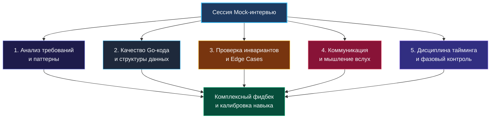
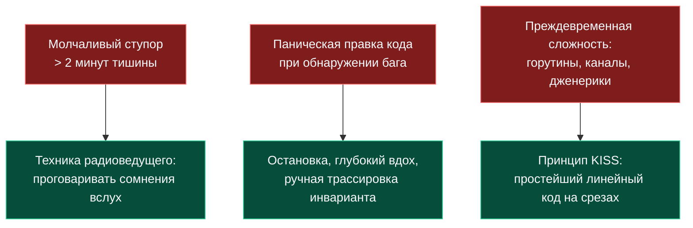

> *«Единственный надёжный способ научиться писать хорошие программы — писать программы, ошибаться и внимательно изучать свои ошибки в присутствии доброжелательного критика».*  
> — Брайан Керниган

Вы можете досконально изучить классические алгоритмы, натренировать распознавание паттернов в туманных формулировках ([[4. Как распознавать паттерн в задаче]]), овладеть искусством управления временем ([[21. Тайминг решения задач]]) и научиться мысленно отлаживать код до последнего бита ([[20. Debugging алгоритмов]]). Но между комфортным решением задач в одиночестве за чашкой кофе и заветным оффером в компанию мечты лежит глубокий психологический ров. Имя ему — **стресс реального экзаменационного раунда**.

Единственный надежный инженерный мост через эту пропасть — регулярные тренировочные собеседования (Mock-интервью).

В этой главе мы разберём, как организовать процесс пробных собеседований так, чтобы они стали мощным катализатором профессионального роста, а не пустой тратой времени. Мы выясним, как смоделировать психологическое давление настоящего раунда, по каким объективным метрикам оценивать кандидата и почему даже 500 решённых в тишине задач на LeetCode не гарантируют сеньорского оффера.

---

### Почему Mock-интервью — это не опция, а суровая необходимость

Разница между решением задач в веб-интерфейсе LeetCode и живым техническим собеседованием колоссальна. 

Когда вы сидите один на один с тренажёром, над вами нет живого наблюдателя. Вы можете отправить десять неработающих решений, получить десяток `Wrong Answer` или `Time Limit Exceeded`, затем заглянуть в раздел обсуждений, скопировать элегантный трюк и с облегчением увидеть зелёную плашку `Accepted`. Ваш профиль зафиксирует победу.

Однако на живом собеседовании оценивается **не результат, а траектория мысли**:
- Как вы реагируете на неоднозначность в ТЗ?
- Способны ли вы думать и формулировать гипотезы вслух?
- Насколько спокойно вы встречаете обнаруженный баг?
- Насколько чист, выразителен и безопасен ваш Go-код?

Автоматизированная платформа никогда не скажет вам: *«Ты выбрал верный паттерн, но неоправданно выделил хеш-таблицу в куче вместо статического массива на стеке, а краевой случай с пустым слайсом привёл бы к панике в продакшене»*. А опытный коллега на mock-сессии скажет это сразу.

Кроме того, тренировочные сессии десенсибилизируют стресс. Когда на ваш экран смотрят чужие глаза, а таймер неумолимо отсчитывает секунды, мозг переходит в режим «бей или беги», блокируя доступ к оперативной памяти. После 5–7 качественных симуляций этот физиологический тремор исчезает, уступая место рабочему хладнокровию.

---

### Пять измерений оценки на Mock-интервью

Mock-интервью — это комплексная диагностика инженерного профиля по пяти ключевым векторам:

1. **Инженерный анализ и декомпозиция:** Умение выслушать неполное условие, задать прицельные уточняющие вопросы по ограничениям и структурированно выбрать алгоритмический паттерн.
2. **Культура написания кода на Go:** Скорость реализации, идиоматичность конструкций, отсутствие скрытых паник, эффективная работа со слайсами, контроль емкости (`cap`) и осмысленный нейминг.
3. **Дисциплина верификации (Edge Cases):** Умение методично прогнать алгоритм на пограничных данных вручную до того, как код будет объявлен готовым.
4. **Коммуникация и работа с обратной связью:** Умение объяснять свои мысли без длинных пауз, слышать подсказки интервьюера и конструктивно обсуждать архитектурные компромиссы.
5. **Тайм-менеджмент:** Способность уложиться в 45-минутный норматив без паники и скомканных финальных этапов.

---

### Форматы организации и роли

#### 1. Парный Mock (Золотой стандарт)
Идеальный формат — работа в паре с коллегой-бэкендером или участником профильного сообщества.
- **Кандидат:** Решает задачу в реальном времени, непрерывно транслируя ход мыслей.
- **Интервьюер:** Заранее готовит задачу (уровня Medium/Hard), досконально зная её оптимум и типичные грабли; ведёт протокол, следит за временем и в конце выдаёт развёрнутую рецензию.
- **Смена ролей:** После 45 минут сессии и 15 минут разбора участники меняются ролями. Это удваивает пользу: побывав «по ту сторону баррикад», вы начинаете видеть ошибки кандидатов и моментально замечаете их у себя.

#### 2. Соло-режим с видеозаписью («Зеркало»)
Если найти квалифицированного партнёра прямо сейчас не удаётся, используйте метод видеофиксации:
1. Запустите запись экрана и веб-камеры с микрофоном (OBS или Zoom).
2. Откройте незнакомую задачу и поставьте таймер на 45 минут.
3. Решайте задачу вслух, обращаясь к воображаемому интервьюеру.
4. Спустя час после завершения пересмотрите запись с блокнотом в руках. Вы будете поражены тем, сколько слов-паразитов, долгих пауз и хаотичных движений курсора совершаете, даже не замечая этого.

---

### Структура сессии: 75 минут полного погружения

| Этап | Длительность | Содержание |
|---|---|---|
| **Синхронизация** | 5 минут | Выбор среды (Google Docs, CoderPad, VS Code без плагинов), согласование правил (когда интервьюер имеет право прервать подсказкой). |
| **Решение задачи** | 45 минут | Полный боевой цикл: анализ (5–7 мин) $\to$ код (15–20 мин) $\to$ верификация (8–10 мин) $\to$ оценка сложности (5 мин). |
| **Качественный фидбек** | 15–20 минут | Детальный разбор полетов по чек-листу: сильные стороны, грубые ошибки, упущенные оптимизации. |
| **Фиксация выводов** | 5 минут | Запись 2–3 главных фокусов для работы на следующую неделю. |

---

### Чек-лист интервьюера: Go-специфика и стандарты качества

Используйте этот чек-лист при оценке своего партнера или самого себя на видеозаписи.

#### Анализ и системный подход
- [ ] Задал ли кандидат уточняющие вопросы до написания кода (пустые слайсы, дубликаты, знаки чисел, границы $N$)?
- [ ] Озвучил ли допустимую асимптотику исходя из ограничений?
- [ ] Согласовал ли выбранный паттерн с интервьюером перед стартом кодирования?

#### Качество Go-кода (Mechanical Sympathy)
- [ ] Использовал ли `make([]T, 0, cap)` с предвыделением памяти там, где размер известен заранее?
- [ ] Не создал ли тяжелую `map` там, где достаточно массива фиксированного размера (например, `[26]int` для латиницы)?
- [ ] Корректно ли обрабатываются `nil`-значения и пустые срезы без риска словить `panic: runtime error: index out of range`?
- [ ] Идиоматично ли написаны циклы (предпочтение `range` или чистым индексам без лишних аллокаций)?
- [ ] Осмысленны ли имена переменных (`windowStart`, `currentSum` вместо `i1`, `s`, `temp`)?
- [ ] Нет ли неявных аллокаций в горячих циклах (например, многократной конвертации `string([]byte)` или конкатенации строк через `+`)?

#### Верификация и стресс-тест
- [ ] Прогнал ли кандидат код по шагам на конкретном примере, выписывая значения ключевых переменных?
- [ ] Проверил ли пограничные случаи: пустой ввод, массив из 1 элемента, все элементы одинаковые?
- [ ] Если кандидат нашёл баг, исправил ли он его спокойно и системно или начал хаотично менять знаки неравенств?

#### Коммуникация
- [ ] Не замолкал ли кандидат более чем на 45–60 секунд?
- [ ] Объяснял ли он высокоуровневые намерения, а не просто зачитывал синтаксис языка?
- [ ] Принял ли подсказку интервьюера или ушёл в глухую оборону?

---

### Классические болезни кандидатов и методы их лечения

1. **«Инженер-молчун»:** Кандидат уходит в глубокие раздумья на 5 минут. Для интервьюера это «черный ящик».  
   *Лечение:* Принудительная тренировка речи. Проговаривайте даже тривиальные действия: *«Сейчас я создаю указатель на начало слайса, чтобы отслеживать левую границу окна...»*.
2. **Паническая правка знаков неравенства:** Увидев ошибку на единицу (`off-by-one`), кандидат начинает наугад менять `<` на `<=`, `+1` на `-1`. Это выдает непонимание инварианта.  
   *Лечение:* Не трогайте код руками! Возьмите массив из двух элементов `[1, 2]` и медленно пройдите граничное условие на бумаге.
3. **Оверинжиниринг:** Попытка применить каналы и горутины в задаче на поиск подстроки.  
   *Лечение:* Помните: в 99% алгоритмических задач Go оценивается знание базовых структур памяти и процессорных циклов. Конкурентность нужна только тогда, когда условие явно требует многопоточной синхронизации ([[08. Конкурентность в Go (Goroutines, Channels)]]).

---

### Резюме

Mock-интервью — это тренажёрный зал для вашей нервной системы и алгоритмического аппарата. Проведите минимум 5–8 полноценных сессий перед выходом на реальный рынок труда. Каждая ошибка, совершенная и разобранная на тренировочном собеседовании, спасает вас от отказа на реальном собеседовании и приближает к заветному офферу.

В следующей статье мы разберем специфику работы в условиях жестких технических ограничений: как уверенно кодить на белой доске и в аскетичных веб-редакторах без привычной IDE и автодополнения: [[23. Белая доска и live coding]].