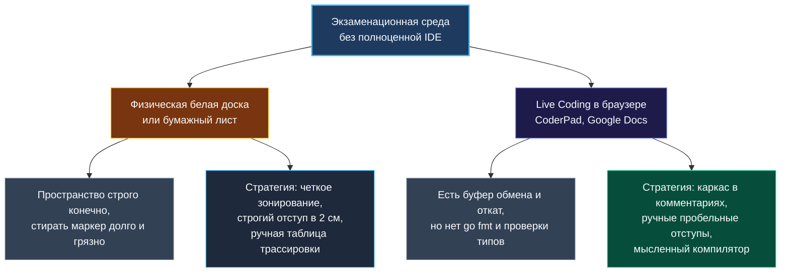

> *«Сложнее всего писать код не тогда, когда машина отказывается понимать вас, а тогда, когда перед вами чистый лист бумаги или доска, и единственный судья — кристальная ясность вашей мысли».*  
> — Брайан Керниган

В комфортной повседневной разработке нас окружает заботливая экосистема: мощная IDE с мгновенным подсвечиванием синтаксиса, линтеры (`golangci-lint`), автодополнение кода через gopls и безотказный `go fmt`, сглаживающий любые неровности форматирования при каждом сохранении файла.

Но на серьёзных технических собеседованиях этот технологический кокон часто бесцеремонно сдирают. Кандидата просят выйти к физической **маркерной доске (whiteboard)**, открыть аскетичный **Google Docs** с пропорциональным шрифтом Arial или войти в спартанскую веб-песочницу вроде CoderPad, где компилятор отключён, а плагин Go работает как примитивный Блокнот.

В этих условиях инженер остаётся один на один со своей ментальной моделью рантайма. Здесь нет клавиши Undo в привычном смысле, нет всплывающих подсказок типов и сигнатур функций. Настоящий Senior Go-разработчик обязан уверенно писать компилируемый, идиоматичный и чистый код даже мелком на асфальте. В этой главе мы разберём искусство уверенного кода в спартанских условиях.

---

### Два мира: Физическая доска vs Аскетичный веб-редактор

Хотя оба формата объединяет отсутствие интеллектуального автодополнения, они налагают принципиально разные физические ограничения.



---

### Стратегия победы на белой доске (Whiteboard)

Физическая маркерная доска не прощает хаоса. Главная беда неподготовленного разработчика — «синдром сползающего текста»: когда сигнатура функции пишется огромными буквами по центру, затем место стремительно кончается, и остаток алгоритма ютится на клочке в правом нижнем углу микроскопическим неразборчивым почерком.

#### 1. Архитектурное зонирование плоскости доски
Перед тем как коснуться маркером поверхности, мысленно разделите доску вертикальными линиями на три функциональные зоны:

```
+-------------------+-----------------------------------+--------------------+
|  ЗОНА 1: ВХОД     |  ЗОНА 2: ТЕЛО АЛГОРИТМА          |  ЗОНА 3: ВЕРИФИКАЦИЯ|
|                   |                                   |                    |
| - Сигнатура func  |  func twoSum(nums []int, ...      |  Трассировка:      |
| - Ограничения (N) |      seen := make(map[int]int)    |  i | num | diff    |
| - Идея инварианта |      for i, x := range nums {     |  --+-----+-----    |
| - Контракт ввода  |          ...                      |  0 |  2  |  7      |
|                   |      }                            |  1 |  7  |  2 (OK) |
+-------------------+-----------------------------------+--------------------+
```

- **Левая колонка (20% ширины):** Сигнатура функции, краевые условия, формулировка инварианта и выбранная асимптотика ($O(N)$ time, $O(1)$ space).
- **Центральное поле (60% ширины):** Чистый текст алгоритма. Пишите строго сверху вниз, оставляя между смысловыми блоками 1–2 пустые строчки на случай, если придётся вставить пропущенную инициализацию.
- **Правая колонка (20% ширины):** Тестовый прогон на маленьком массиве: таблица переменных по шагам и краевые случаи.

#### 2. Дисциплина почерка и синтаксиса Go
- **Табуляция рукой:** Забудьте про экономию места. Отступ вложенности блока (`for`, `if`) на доске должен составлять честные 3–4 сантиметра. Интервьюер должен видеть структуру вложенности с расстояния трёх метров.
- **Опасность `:=` против `=`:** При быстром письме маркером двоеточие часто смазывается или превращается в жирную точку. Если сомневаетесь, пишите разборчиво или используйте явное `var result []int`. Помните: перепутать повторное объявление с присваиванием — грубая ошибка в Go.
- **Запрет на псевдокод:** Если вы пишете на Go, пишите на Go! Забудьте синтаксис Python или Java. Никаких циклов `while condition` (в Go существует **только** `for`), никаких `len` без скобок, никаких тернарных операторов `? :` (их нет в спецификации языка).
- **Аккуратная коррекция:** Если вы обнаружили баг в строке, не трите её судорожно пальцем, оставляя чёрные разводы. Спокойно зачеркните строку одной аккуратной горизонтальной чертой и напишите корректную строчку сверху или снизу. Скажите вслух: *«Я заменяю строгое неравенство на нестрогое, чтобы корректно обработать правый край диапазона»*.

---

### Стратегия выживания в live coding редакторах (Google Docs, CoderPad)

Веб-редакторы лишают вас маркера, но возвращают клавиатуру. Однако работа в них таит свои скрытые ловушки.

#### 1. Дисциплина отсутствия `go fmt`
В продакшене утилита `go fmt` автоматически выравнивает код при сохранении файла. В Google Docs или браузере автоформатирования нет.
- Сразу выработайте привычку отбивать отступы вручную (4 пробела или Tab).
- Следите за закрывающими фигурными скобками `}`. Ставьте закрывающую скобку сразу же после открытия блока, чтобы не потерять границы в длинном коде.
- Держите однотипные конструкции визуально ровными — это создает впечатление безупречного контроля над синтаксисом.

#### 2. Каркас через комментарии
В текстовом редакторе чрезвычайно выгодно сначала набросать скелет алгоритма однострочными комментариями:

```go
func minSubArrayLen(target int, nums []int) int {
    // 1. Быстрая проверка краевых условий
    
    // 2. Инициализация указателей окна и накопителя суммы
    
    // 3. Основной цикл расширения правого указателя
    
    // 4. Сжатие окна левым указателем при выполнении инварианта
    
    // 5. Возврат минимальной длины (или 0, если сумма не найдена)
}
```

Этот каркас выполняет тройную функцию:
1. Вы успокаиваетесь и структурируете свои мысли;
2. Интервьюер сразу видит, что вы понимаете архитектуру решения;
3. Вы не забудете вернуть результат или обработать пограничный случай.

---

### Специфика Go без IDE: Что нужно знать назубок

Когда IDE не подсвечивает ошибки красной волнистой линией, компилятор должен работать внутри вашей головы.

| Ловушка без IDE | Неверный код (паника / ошибка) | Корректный идиоматичный Go |
|---|---|---|
| **Запись в `nil`-карту** | `var m map[int]int`<br>`m[1] = 42 // panic!` | `m := make(map[int]int)`<br>*(Всегда `make` перед записью)* |
| **Емкость слайса** | `res := []int{}`<br>`// 1000 реаллокаций` | `res := make([]int, 0, n)`<br>*(Предвыделение капасити)* |
| **Длина строки vs Байты** | `len("привет") == 12`<br>`// обращение побайтово ломает руну` | `runes := []rune(s)`<br>*(Или явная фиксация ASCII)* |
| **Несуществующий `while`** | `while left < right { ... }` | `for left < right { ... }` |
| **Преобразование типов** | `val = strconv.Atoi(s)`<br>*(Игнорирование возврата error)* | `val, err := strconv.Atoi(s)`<br>`if err != nil { return 0 }` |

> [!WARNING] Ловушка теневых переменных (Shadowing)
> Без линтера очень легко случайно затенить внешнюю переменную во вложенном блоке через короткое объявление:
> ```go
> var maxLen int
> for _, x := range nums {
>     if x > 0 {
>         maxLen := calculate(x) // ОШИБКА: объявлена новая локальная переменная!
>     }
> }
> return maxLen // вернет 0!
> ```
> На доске и в текстовом редакторе пишите присваивание строго через `=`, если переменная уже была объявлена выше: `maxLen = calculate(x)`.

---

### Как тренировать навык «Спартанского кодинга»

1. **Режим «Тетрадь в клеточку»:** Возьмите за правило 2–3 задачи в неделю решать шариковой ручкой на обычном бумажном листе А4 с таймером на 20 минут. Лишь после того, как вы поставили точку и вручную проверили код, перепечатайте его символ в символ в терминал и запустите `go run`. Если компилятор выдал ошибку синтаксиса — задача считается проваленной. Это воспитывает предельную концентрацию.
2. **Тренажер Google Docs:** Отключите в настройках автозамену кавычек («умные кавычки» ломают строковые литералы Go), выберите моноширинный шрифт (Courier New или Roboto Mono) и пишите решения без обращения к документации.
3. **Мысленная трансляция escape-анализа:** Пиша код мелом, вслух проговаривайте работу памяти: *«Я объявляю срез `buf := [32]byte{}` фиксированного размера. Он останется на стеке вызова, не потребует аллокаций в куче и снимет нагрузку со сборщика мусора»*. Этот комментарий производит колоссальное впечатление на интервьюера.

---

### Резюме

Белая доска и аскетичные веб-редакторы — это не наказание, а фильтр профессиональной состоятельности. Они мгновенно отделяют инженера, глубоко понимающего устройство языка и рантайма, от разработчика, целиком зависимого от подсказок среды. Владейте пространством доски, держите в голове сигнатуры базовых пакетов и помните: чистая инженерная мысль видна на любой поверхности.

В следующей лекции мы детально разберем ментальный компилятор Go и сигнатуры стандартной библиотеки, которые необходимо помнить наизусть: [[24. Как писать код без IDE]].