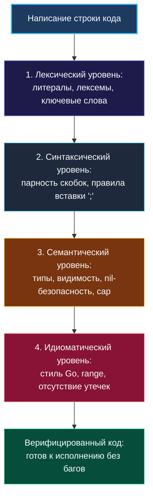

> *«Настоящий мастер владеет своим ремеслом настолько глубоко, что инструмент становится простым продолжением его руки, а не костылём для мысли».*  
> — Брайан Керниган

В современной комфортной разработке мы привыкли делегировать рутину умной среде: IDE услужливо подсвечивает опечатки красным пунктиром, `gopls` дописывает имена методов после ввода точки, а связка линтеров на лету бьёт по рукам за неиспользованные переменные.

Но когда на собеседовании перед вами оказывается чистый лист бумаги, белая маркерная доска или спартанский Google Docs без автодополнения ([[23. Белая доска и live coding]]), происходит момент истины. Здесь невозможно опереться на подсказки редактора. Единственный компилятор, который у вас остался, — это ваш собственный мозг.

Умение писать чистый, компилируемый код без IDE — это не цирковой трюк и не мазохизм. Это лакмусовая бумажка зрелости инженера: она показывает, мыслите ли вы языком на уровне семантики и рантайма или просто научились нажимать `Tab` в привычном редакторе.

---

### Четырёхуровневая ментальная модель компилятора Go

Когда вы пишете код в спартанской среде, внутри вашей головы должна синхронно работать конвейерная цепочка проверок, имитирующая этапы работы официального компилятора `compile` и линтеров:



1. **Лексический слой:** Точное написание ключевых слов (в Go их всего 25!), правильные числовые литералы, одинарные кавычки для рун `'a'` и двойные для строк `"a"`.
2. **Синтаксический слой:** Правило автоматической вставки точек с запятой (Semicolon Injection). Открывающая фигурная скобка `{` обязана находиться на той же строке, что и `func`, `for`, `if`, иначе лексер вставит `;` сразу после условия, сломав сборку.
3. **Семантический слой:** Строгая типизация (нельзя неявно сложить `int` и `int64`), проверка инициализации ссылочных структур данных перед записью, отсутствие затенённых переменных.
4. **Идиоматический слой:** Чистый стиль оформления (gofmt-совместимость), плоский поток управления (early return), минималистичный нейминг без венгерской нотации.

---

### Главные синтаксические и семантические капканы без подсказок среды

#### 1. Коварство неявных точек с запятой (Semicolon Rule)
В спецификации языка Go чётко указано: если строка оканчивается идентификатором, числом, строковым литералом или закрывающей скобкой `}`, `)` или `]`, лексер автоматически вставляет точку с запятой `;`.

Поэтому следующий код вызовет фатальную ошибку компиляции:
```go
// НЕ СКОМПИЛИРУЕТСЯ В GO:
if target > currentSum 
{ // Ошибка: лексер вставил ';' после currentSum!
    currentSum += num
}
```
**Железное правило:** Открывающая фигурная скобка `{` всегда пишется на той же строке!

#### 2. Затенение переменных (Shadowing Pitfall)
В IDE теневая переменная обычно подсвечивается серым или желтым цветом. На доске или в Google Docs эта ошибка абсолютно невидима:

```go
var maxLen int

for _, x := range nums {
    if x > threshold {
        // ОШИБКА: оператор := создает новую локальную переменную maxLen!
        maxLen := computeLength(x) 
        _ = maxLen
    }
}

return maxLen // ВНИМАНИЕ: Всегда вернет 0!
```
**Правило спасения:** Если переменная объявлена во внешней области видимости, внутри блоков условий и циклов используйте **только оператор присваивания `=`**, а не короткое объявление `:=`.

#### 3. Инициализация ссылочных типов: `make` vs `new`
На доске кандидаты нередко пишут `var m map[string]int` и следом пытаются выполнить запись `m["foo"] = 1`. В рантайме Go чтение из неинициализированной карты (`nil-map`) безопасно и вернёт нулевое значение, но **любая запись в `nil`-карту немедленно вызывает панику**:  
`panic: assignment to entry in nil map`.

Для срезов (slices) ситуация обратная: `var s []int` имеет значение `nil`, но вызов `append(s, 1)` абсолютно легален, так как функция `append` сама аллоцирует базовый массив при первом вызове.

---

### Сигнатуры стандартной библиотеки, которые нужно знать наизусть

На собеседовании у вас не будет возможности заглянуть в `pkg.go.dev`. Вся базовая палитра стандартных пакетов должна храниться в мышечной памяти.

| Пакет | Вызов / Тип | Сигнатура и применение | Замечания по рантайму |
|---|---|---|---|
| `slices` *(Go 1.21+)* | `slices.Sort` | `slices.Sort(s []E)` | Быстрее `sort.Slice`, работает через дженерики без рефлексии |
| `slices` *(Go 1.21+)* | `slices.BinarySearch` | `slices.BinarySearch(s, target) (int, bool)` | Возвращает индекс вставки и флаг нахождения |
| `sort` | `sort.Ints` | `sort.Ints(a []int)` | Классическая сортировка среза целых чисел |
| `sort` | `sort.Slice` | `sort.Slice(s, func(i, j int) bool)` | Сортировка с компаратором через замыкание |
| `container/heap` | `heap.Interface` | `Len, Less, Swap, Push, Pop` | Требует реализации 5 методов структуры |
| `strconv` | `strconv.Atoi` | `strconv.Atoi(s string) (int, error)` | Парсинг строки в целое число (ASCII to int) |
| `strconv` | `strconv.Itoa` | `strconv.Itoa(i int) string` | Преобразование int в строку (Integer to ASCII) |
| `strings` | `strings.Builder` | `var sb strings.Builder; sb.WriteString(s)` | Минимизация аллокаций при конкатенации строк |
| `math` | `math.MaxInt` | Константа `math.MaxInt` | Максимальное значение платформозависимого `int` |

> [!TIP] Эволюция Go: `sort.Slice` vs `slices.Sort`
> В современном коде (Go 1.21+) для базовых типов всегда отдавайте предпочтение пакету `slices`: `slices.Sort(nums)`. Это показывает ваше владение актуальными версиями языка. `sort.Slice` под капотом использует `reflect.ValueOf`, что замедляет работу и требует аллокаций интерфейса, тогда как `slices.Sort` основан на дженериках (`cmp.Ordered`) и инлайнится компилятором.

---

### Чек-лист «Компилятор в голове» (Мысленный Compile Pass)

Когда вы закончили писать алгоритм, сделайте глубокий вдох и проведите пошаговый аудит кода перед тем, как повернуть голову к интервьюеру:

1. **Проверка точек входа и выхода:** Возвращает ли функция значение во всех ветках выполнения? Совпадает ли тип возвращаемого значения с сигнатурой?
2. **Проверка инициализации:** Все ли `map` созданы через `make`? Задана ли емкость (`cap`) для срезов-аккумуляторов?
3. **Проверка границ циклов:** В цикле `for i := 0; i < len(arr); i++` точно стоит строгое `<`? Не произойдёт ли выхода за границы `arr[i+1]` на последней итерации?
4. **Проверка преобразования строк:** Если задача требует разворота строки, помните ли вы, что прямое взятие байта `s[i]` сломает многобайтовые символы UTF-8? Проговорите: *«Так как по условию входная строка состоит только из ASCII, обращение по байтовым индексам корректно»*.
5. **Проверка на ошибки библиотечных функций:** Если вызывается `strconv.Atoi`, обработан ли возвращаемый `err`?

---

### Практикум: Как выработать мышечную память

- **Ежедневный рукописный скрипт:** Возьмите задачу среднего уровня сложности и решите её на чистом листе белой бумаги. Засеките 20 минут. После завершения откройте терминал, наберите код в `cat > solution.go << 'EOF'` без единого исправления и запустите `go run solution.go`. Каждая ошибка синтаксиса или опечатка — повод переписать задачу заново.
- **Работа в «голом» Vim/Nano:** Попробуйте решать задачи в терминальном редакторе с полностью отключёнными плагинами и LSP-серверами. Это приучает следить за парностью скобок и отступами на уровне автоматизма.

---

### Резюме

Умение писать код без подсказок IDE возвращает программисту тотальный контроль над создаваемой системой. Когда вы держите структуру языка и поведение структур данных в оперативной памяти своего мозга, качество вашего инженерного мышления возрастает на порядок. Этот навык не просто помогает блестяще пройти алгоритмический раунд — он делает вас первоклассным разработчиком, видящим сквозь синтаксический сахар саму природу исполнения программы.

В следующей лекции мы детально разберем, как выглядит безупречно чистый и идиоматичный код на Go в стрессовых условиях собеседования: [[25. Чистый код на Go на интервью]].