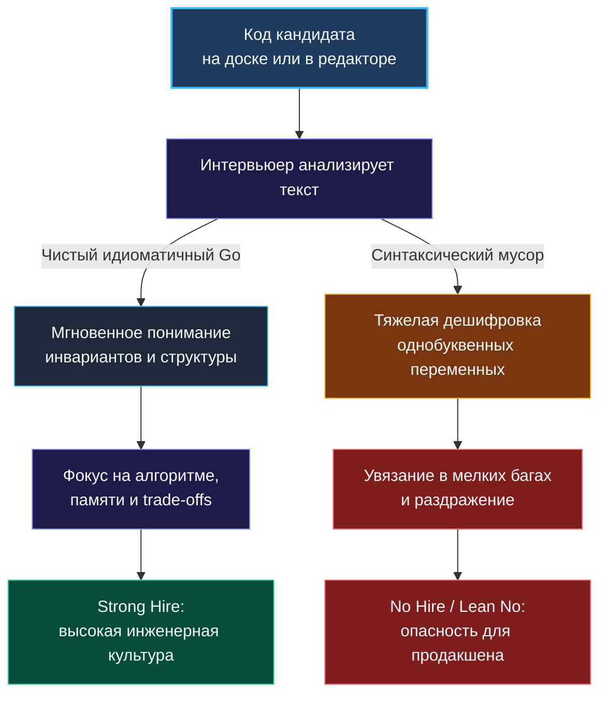
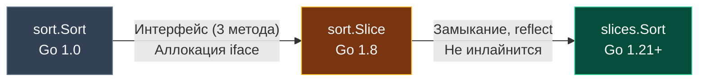

> *«Управление сложностью — вот суть программирования. Чистый код не прячет сложность под ковёр абстракций, а растворяет её в предельной ясности мысли».*  
> — Брайан Керниган

Вы научились молниеносно классифицировать алгоритмические паттерны ([[4. Как распознавать паттерн в задаче]]), филигранно распределять минуты раунда ([[21. Тайминг решения задач]]) и держать компилятор в собственной голове ([[24. Как писать код без IDE]]). Но существует ещё один фундаментальный фактор, который в 80% случаев предопределяет вердикт нанимающей команды: **чистота и инженерная культура вашего кода**.

На техническом собеседовании под «чистым кодом» понимается не академический переизбыток паттернов проектирования (Go органически отторгает «фабрики фабрик»), а нечто куда более ценное и практичное:
- Может ли интервьюер прочитать и понять ваше решение с первого взгляда?
- Безопасен ли этот код для запуска в высоконагруженном production?
- Демонстрирует ли он знание рантайма Go, бережное отношение к памяти и сборщику мусора?
- Или проверяющему приходится продираться сквозь дебри однобуквенных переменных, трёхэтажных циклов и скрытых квадратичных аллокаций?

Для позиций уровня Senior и Staff требования непреложны: вы обязаны писать не просто формально рабочий алгоритм, а код, который ваши будущие коллеги сочтут эталоном лаконичности и надежности.

---

### Почему собеседование беспощадно наказывает за неряшливый код

Любой технический интервьюер — живой человек с ограниченным запасом когнитивного ресурса. Если ваш код визуально грязен, экзаменатор вынужден тратить силы на дешифровку: *«Что хранится в переменной `k` на 14-й строке? Почему здесь слайс режется пополам без проверки длины? Зачем тут `panic` посреди цикла?»*.



Чистый код мгновенно переводит диалог в конструктивное русло: вы обсуждаете не опечатки в индексах, а сложность $O(N)$, кэш-линии процессора и тонкости взаимодействия с GC.

---

### Четыре столпа идиоматичного Go на собеседовании

#### 1. Обработка ошибок: строгий запрет на `panic`
В мире академических олимпиад по программированию принято «ронять» программу при любых неожиданных данных. В профессиональном Go **использование `panic` для контроля потока выполнения — тягчайший антипаттерн**.

Если вспомогательная функция (например, парсер подстроки или конвертер) может завершиться неудачей, она обязана возвращать идиоматичную пару `(result, error)`.

```go
// АНТИПАТТЕРН (Олимпиадный стиль, No Hire):
func parseToken(s string) int {
    val, err := strconv.Atoi(s)
    if err != nil {
        panic("invalid input") // КАТЕГОРИЧЕСКИ ЗАПРЕЩЕНО на интервью!
    }
    return val
}

// ИДИОМАТИЧНЫЙ GO (Senior-стиль):
func parseToken(s string) (int, error) {
    val, err := strconv.Atoi(s)
    if err != nil {
        return 0, fmt.Errorf("parse token %q: %w", s, err)
    }
    return val, nil
}
```

> [!IMPORTANT]
> Если алгоритмическая задача гарантирует корректность входных данных по условию, достаточно вернуть дефолтное значение или сигнал отсутствия результата (`nil`, `-1`, `false` через идиому `comma-ok`), но ни в коем случае не аварийно останавливать рантайм.

---

#### 2. Эволюция сортировки: `sort.Sort` vs `sort.Slice` vs `slices.Sort` (Go 1.21+)

Знание того, как развивалась стандартная библиотека Go, мгновенно выделяет кандидата с глубоким пониманием рантайма:



- **`sort.Sort(data Interface)` (Go 1.0):** Требует создания пользовательского типа и реализации трёх методов (`Len`, `Less`, `Swap`). Для обычных массивов это колоссальный синтаксический оверхед.
- **`sort.Slice(s, less)` (Go 1.8):** Удобно сортировать срезы через анонимное замыкание `func(i, j int) bool`. Однако под капотом функция принимает пустой интерфейс `any` и использует `reflect.ValueOf`, что лишает компилятор возможности заинлайнить компаратор и вызывает оверхед при проверках типов.
- **`slices.Sort(s)` (Go 1.21+):** Абсолютный золотой стандарт современного Go. Реализована на базе параметрического полиморфизма (дженериков) с ограничением `cmp.Ordered`. Работает напрямую с памятью без рефлексии и аллокаций в куче, обгоняя `sort.Slice` в 2–3 раза!

```go
// Современный, быстрый и лаконичный код:
import "slices"

slices.Sort(nums) // O(N log N), zero-allocation, type-safe!

// С кастомным компаратором:
import "cmp"
slices.SortFunc(intervals, func(a, b []int) int {
    return cmp.Compare(a[0], b[0])
})
```

---

#### 3. Эффективная сборка строк: `strings.Builder` против конкатенации через `+`

Попытка собрать результирующую строку в цикле через банальный плюс `+` — классическая ловушка для новичков:

```go
// КАТАСТРОФА ДЛЯ ПАМЯТИ: O(N^2) аллокаций и времени!
var res string
for _, s := range words {
    res += s // Каждая итерация копирует всю предыдущую строку в новую область памяти!
}
```

Поскольку строки в Go неизменяемы (`immutable`), каждая операция `res += s` аллоцирует в куче новый буфер и переносит туда все байты. На строке длиной 100 000 символов это гарантированный `Time Limit Exceeded`.

**Идиоматичное решение — `strings.Builder`:**

```go
var sb strings.Builder
// Если суммарная длина известна или оцениваема — задаем емкость заранее!
sb.Grow(estimatedSize)

for _, s := range words {
    sb.WriteString(s) // O(1) амортизированно, без лишних аллокаций
}
return sb.String()
```
`strings.Builder` внутри использует байтовый срез, а его метод `String()` применяет `unsafe`-преобразование без повторного копирования памяти, что обеспечивает максимальную производительность.

---

#### 4. Предварительное выделение емкости: `make([]T, 0, cap)`

Срезы в Go расширяются динамически: когда емкость (`cap`) исчерпана, рантайм выделяет новый массив увеличенного размера (в 2 раза для малых срезов и с коэффициентом ~1.25 для больших) и копирует туда старые элементы.

Если вы знаете, что на выходе алгоритма будет ровно $N$ элементов, создавать срез через `res := []int{}` — признак пренебрежения к ресурсам системы.

```go
// Плохо: десятки скрытых реаллокаций и фрагментация кучи
result := []int{}
for i := 0; i < n; i++ {
    result = append(result, nums[i]*2)
}

// Превосходно: ровно одна аллокация в памяти!
result := make([]int, 0, n)
for i := 0; i < n; i++ {
    result = append(result, nums[i]*2)
}
```

---

### Архитектурная плоскость: искоренение вложенности (Guard Clauses)

В Go считается дурным тоном выстраивать код «лесенкой» из вложенных блоков `if/else`. Код должен читаться сверху вниз по прямой линии (Happy Path), а все ошибки и граничные условия отсекаться в самом начале:

```go
// ГРЯЗНЫЙ КОД (Вложенность 3 уровня):
func findTarget(nums []int, target int) int {
    if len(nums) > 0 {
        for i, val := range nums {
            if val == target {
                return i
            }
        }
    }
    return -1
}

// ЧИСТЫЙ КОД (Плоский поток выполнения):
func findTarget(nums []int, target int) int {
    if len(nums) == 0 {
        return -1
    }

    for i, val := range nums {
        if val == target {
            return i
        }
    }

    return -1
}
```

Если у вас возникает цепочка проверок одного значения, откажитесь от бесконечных `else if` в пользу лаконичного `switch`:

```go
switch {
case sum == target:
    return []int{left, right}
case sum < target:
    left++
default:
    right--
}
```

---

### Сквозной пример чистого рефакторинга

Задача: Сгруппировать анаграммы из списка слов (`Group Anagrams`).

#### Версия кандидата-торопыги (Грязно, шумно):
```go
func groupAnagrams(strs []string) [][]string {
    m := make(map[string][]string)
    for i := 0; i < len(strs); i++ {
        s := strs[i]
        b := []byte(s)
        sort.Slice(b, func(x, y int) bool { return b[x] < b[y] })
        k := string(b)
        m[k] = append(m[k], s)
    }
    ans := [][]string{}
    for _, v := range m {
        ans = append(ans, v)
    }
    return ans
}
```

#### Версия Senior Go Engineer (Чисто, оптимально, выразительно):
```go
func groupAnagrams(strs []string) [][]string {
    if len(strs) == 0 {
        return nil
    }

    // Ключ - частотная сигнатура символов [26]byte, значение - список слов
    groups := make(map[[26]byte][]string, len(strs))

    for _, word := range strs {
        key := countKey(word)
        groups[key] = append(groups[key], word)
    }

    result := make([][]string, 0, len(groups))
    for _, group := range groups {
        result = append(result, group)
    }

    return result
}

// countKey формирует хэшируемый ключ за O(K) без дорогой сортировки O(K log K)
func countKey(s string) [26]byte {
    var counts [26]byte
    for i := 0; i < len(s); i++ {
        counts[s[i]-'a']++
    }
    return counts
}
```

**Почему второй вариант гарантирует оффер:**
1. Замена сортировки строки на подсчёт частот ускоряет ключ с $O(K \log K)$ до $O(K)$.
2. Массив `[26]byte` является сравниваемым типом (`comparable`) и может быть напрямую ключом в `map` без конвертации в `string`!
3. Предвыделена емкость для карты и результирующего среза.
4. Выделена чистая вспомогательная функция `countKey`.

---

### Резюме

Чистый код на Go — это сплав визуальной простоты, уважения к читателю и глубокого знания механики рантайма. Избегайте паник, отдавайте предпочтение современным пакетам (`slices`), не допускайте квадратичных аллокаций строк и всегда управляйте емкостью слайсов. Этот стиль не отнимает лишние минуты — напротив, он защищает вас от глупых ошибок и внушает проверяющему непоколебимую уверенность в вашем высоком инженерном уровне.

В следующей лекции мы разберем фатальные ошибки кандидатов: как гарантированно провалить даже самое легкое алгоритмическое интервью и как этого избежать: [[26. Антипаттерны. Как проваливают алгоритмические интервью]].