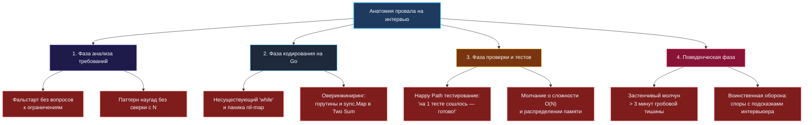
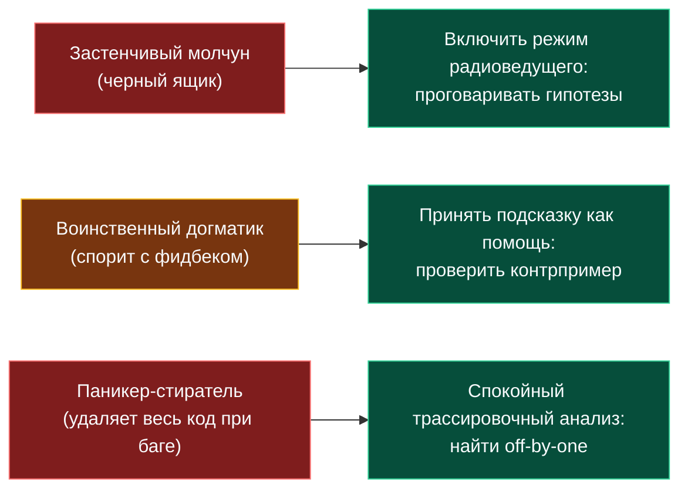

> *«Ошибки — естественная часть ремесла программиста, но наступать на одни и те же классические грабли из поколения в поколение — непростительная роскошь».*  
> — Брайан Керниган

Вы заучили наизусть все типовые алгоритмические паттерны, решили сотни задач на тренажерах, научились укладываться в тайминг ([[21. Тайминг решения задач]]) и можете с закрытыми глазами написать бинарный поиск на салфетке. И тем не менее заветный оффер на позицию Senior Go-разработчика ускользает. Раунд «вроде бы прошёл нормально», код компилировался, тесты сходились, но в почту падает вежливый шаблонный отказ.

Причина в 9 случаях из 10 кроется не в незнании красно-чёрных деревьев, а в **алгоритмических антипаттернах** — устойчивых технических и поведенческих паттернах, которые опытный интервьюер считывает за считанные минуты и маркирует жирными красными флагами.

В этой главе мы разберём кунсткамеру классических провалов на алгоритмических собеседованиях: от нелепых синтаксических ляпов до разрушительных коммуникационных привычек.

---

### Топография провалов: где кандидаты теряют офферы



---

### Топ-1: Фальстарт и синдром «Мне всё понятно»

**Сценарий:** Интервьюер успевает произнести: «Дан массив целых чисел, найдите максимальную сумму подмассива...». Кандидат радостно вскрикивает: «А, Кадан!», и тут же начинает бешено стучать по клавишам, строча код.

**В чём катастрофа:** Интервьюер собирался добавить: «...при условии, что подмассив должен содержать не более $K$ элементов, а входной поток поступает непрерывно через сетевой сокет». 

Кандидат потратил 15 минут, написал алгоритм Кадана, гордо откинулся на спинку стула и услышал холодное: *«Вы не дослушали условие и не уточнили ограничения. Переделывайте»*.

> [!WARNING] Золотое правило старта
> Никогда не пишите ни строчки кода в первые 5 минут! Выпишите сигнатуру, задайте минимум три вопроса по границам данных ($N$, отрицательные числа, дубликаты, пустой ввод) и явно согласуйте подход: *«Я планирую использовать скользящее окно с монотонной декой, так как это даст $O(N)$. Начинаем реализацию?»*.

---

### Топ-2: Мемные синтаксические казусы в Go

#### 1. Попытка написать `while` в Go
Кандидат нервничает и выдаёт конструкцию из Java/C++:
```go
// ОШИБКА: Компилятор Go в недоумении
while left < right {
    // ...
}
```
В языке Go есть ровно **одно** ключевое слово для циклов — `for`. Попытка написать `while` выдает человека, который в последний раз видел Go в рекламном буклете, а задачи тренировал на Python.

#### 2. Фатальный выстрел в ногу: паника на `nil`-карте
```go
var freq map[rune]int
freq['a']++ // panic: assignment to entry in nil map!
```
Это легендарная классика собеседований. Кандидат забыл, что нулевое значение для map — это `nil`. Читать из него безопасно, но первая же запись приводит к фатальному падению процесса. Интервьюер делает в блокноте пометку: *«Кандидат не понимает устройство рантайма Go»*.

#### 3. Архитектурный оверинжиниринг: `sync.Map` и горутины в Two Sum
В попытке продемонстрировать «глубокие сеньорские знания конкурентности» кандидат заводит пул горутин с каналами и `sync.WaitGroup` для поиска двух чисел в массиве из 20 элементов.

**Реакция интервьюера:** Немой шок. Накладные расходы на запуск горутин и планировщик Go превосходят время выполнения обычного цикла в 1000 раз. Это демонстрация полного отсутствия *Mechanical Sympathy* (механического сочувствия к оборудованию) и понимания цены синхронизации.

---

### Топ-3: Психологические типажи провальных кандидатов



#### 1. «Застенчивый молчун»
Кандидат прочитал условие, уставился в одну точку на мониторе и замолчал на 7 минут. Интервьюер пытается завязать диалог:  
— *О чем вы сейчас думаете?*  
— *Я думаю.* (И снова 5 минут могильной тишины).

Интервьюер не умеет читать мысли. Если вы молчите, оценивать нечего. Даже если через 15 минут молчания вы выдадите идеальный код, оценка за коммуникацию будет нулевой.

#### 2. «Воинственный догматик»
Интервьюер видит потенциальный баг и мягко подсказывает:  
— *А что произойдет с вашим алгоритмом, если на вход придет массив из строго отрицательных чисел?*  
Кандидат встает в стойку:  
— *У меня всё абсолютно правильно! В условии не было сказано, что числа отрицательные! Это некорректный кейс!*

Это гарантированный отказ с пометкой **«Toxic / Culture mismatch»**. Интервьюер проверяет не только ваш код, но и то, каково будет коллегам сидеть с вами на одном code review. Умение с благодарностью принять подсказку и спокойно проверить контрпример — признак психологической зрелости.

#### 3. «Паникёр-стиратель»
Обнаружив, что код на тесте выдал `false` вместо `true`, кандидат в панике нажимает `Ctrl+A` $\to$ `Backspace`, стирает 50 строк написанного кода и начинает с нуля писать совершенно другой алгоритм.  
В 95% случаев проблема заключалась в тривиальной опечатке на единицу (`i < n` вместо `i <= n`). Стирать рабочую базу — верный способ растратить всё время раунда.

---

### Топ-4: «Happy Path» и пренебрежение пограничными условиями

Кандидат написал 20 строк кода, бросил взгляд на первый пример из условия:
```
Ввод: nums = [2, 7, 11, 15], target = 9
Вывод: [0, 1]
```
Мысленно подставил двойку и семёрку, радостно заявил: *«Всё готово, код работает идеально!»* — и сложил руки.

Интервьюер берет маркер и пишет на доске:
```
nums = [] (пустой слайс)
nums = [9] (один элемент)
nums = [3, 3], target = 6 (дубликаты)
```
И код кандидата моментально падает с `panic: runtime error: index out of range` или зацикливается навсегда.

> [!TIP] Дисциплина верификации
> Никогда не говорите «Я закончил», пока сами, по собственной инициативе, не протестировали код на пустом вводе, массиве из одного элемента и дубликатах. Это показывает, что вы производите надежный софт, а не олимпиадные полуфабрикаты.

---

### Сводная таблица: Антипаттерн $\to$ Решение

| Антипаттерн | Внутренняя причина | Профессиональная реакция (Senior Go) |
|---|---|---|
| **Фальстарт кодирования** | Страх не успеть по таймингу | Потратить 5 минут на вопросы и согласование схемы с интервьюером. |
| **Паника на `nil`-map** | Невнимательность к zero values | Всегда инициализировать карту через `make(map[K]V)`. |
| **Оверинжиниринг с горутинами** | Желание пустить пыль в глаза | Использовать простейшие последовательные структуры данных. |
| **Гробовое молчание** | Боязнь показаться некомпетентным | Проговаривать логику: «Я проверяю два подхода: сортировку и хэш-таблицу...». |
| **Спор с интервьюером** | Уязвленное эго | «Отличный пограничный случай, давайте прогоним его по моим условиям». |
| **Happy-path проверка** | Поверхностный подход к качеству | Всегда лично проверять 3 крайних случая перед сдачей решения. |

---

### Резюме

Провал на алгоритмическом собеседовании редко бывает следствием математической сложности задачи. В подавляющем большинстве случаев это результат потери самоконтроля, нарушения коммуникации или пренебрежения базовой инженерной гигиеной Go. Рассматривайте интервьюера не как враждебного экзаменатора, а как старшего коллегу по парному программированию: советуйтесь, транслируйте ход мыслей, уважительно относитесь к ресурсам системы и пишите простой, прозрачный код.

В следующей лекции мы освоим спасительную технику: как легально и продуктивно думать вслух и тянуть время на интервью, если верное решение не приходит в голову сразу: [[27. Как думать вслух и тянуть время на интервью]].