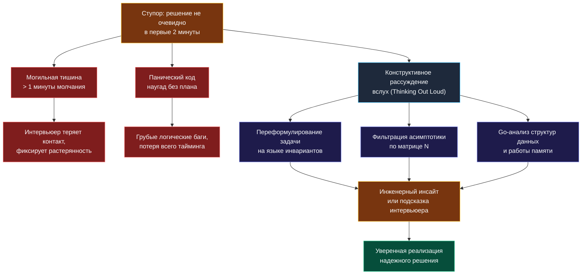

> *«Ясность мысли порождает ясность речи, а неторопливое структурированное рассуждение вслух помогает мысли отыскать единственно верное русло».*  
> — Брайан Керниган

Вы детально изучили методы презентации готовых решений ([[6. Как объяснять решение вслух]]), запомнили классические ошибки кандидатов ([[7. Типичные ошибки кандидатов]]) и выжгли калёным железом опасные антипаттерны ([[26. Антипаттерны. Как проваливают алгоритмические интервью]]). Но существует критический сценарий, с которым рано или поздно сталкивается даже самый эрудированный инженер: **что делать, если решение категорически не приходит в голову?**

Вы прочитали условие задачи, вежливо переспросили про граничные случаи, а в голове — абсолютная пустота. Алгоритмический паттерн не узнаётся, инвариант рассыпается, а таймер в углу экрана методично сжигает драгоценные минуты.

В этот психологический капкан попадают многие: одни впадают в парализующий ступор и молчат по 5 минут, другие начинают лихорадочно писать наугад случайные циклы в надежде на озарение. Настоящий Senior Go-разработчик выбирает третий, профессиональный путь: он включает **структурированное рассуждение вслух (Thinking Out Loud)**, превращая паузу в демонстрацию глубокого инженерного анализа.

---

### Почему легально «тянуть время» — это признак зрелости

На техническом собеседовании мёртвая тишина продолжительностью более 45 секунд — ваш злейший враг. Для экзаменатора за экраном вы превращаетесь в «чёрный ящик»: непонятно, зависли ли вы от шока, потеряли нить рассуждения или мысленно уже сдались.

«Тянуть время» в инженерном смысле означает **купить своему подсознанию 2–3 минуты на поиск паттерна, наполняя эфир безупречной технической аналитикой**. Вы методично сужаете пространство поиска, озвучиваете ограничения, отбрасываете заведомо неэффективные ветки и рассуждаете о поведении железа. Для интервьюера это выглядит как зрелый исследовательский процесс.

---

### Резервуар тем: О чём говорить, когда не знаешь решения

Когда мозг ищет алгоритмический ключ, задействуйте речевой аппарат для озвучивания пяти фундаментальных тем:

#### 1. Инженерная переформулировка задачи
Не пересказывайте условие дословно. Переведите его на язык абстрактных структур данных:
> *«Итак, условие требует найти кратчайший непрерывный отрезок, сумма которого превосходит target. Так как все элементы строго положительны, перед нами монотонно возрастающая функция накопленной суммы. Это ключевое свойство: монотонность сразу открывает дорогу к двум техникам — скользящему окну или бинарному поиску по префиксным суммам. Давайте сопоставим их по ограничениям...»*

Вы ещё не написали ни строчки кода, но уже зафиксировали ключевое математическое свойство монотонности.

#### 2. Фильтрация асимптотики по размеру входных данных ($N$)
Озвучьте анализ граничных условий:
> *«По условию $N \le 10^5$. Это исключает любые квадратичные алгоритмы $O(N^2)$ — они упрутся в Time Limit с сотней миллионов операций. Наш целевой коридор — $O(N)$ или $O(N \log N)$. Сортировка всего массива за $O(N \log N)$ здесь не подходит, так как разрушит естественный порядок индексов подмассива. Следовательно, нам необходимо линейное решение за один проход либо алгоритм с дополнительной памятью $O(N)$»*.

Интервьюер удовлетворенно делает пометку: кандидат мыслит системно и понимает вычислительные бюджеты.

#### 3. Анализ структур данных и Mechanical Sympathy в Go
Пока алгоритм не оформился окончательно, обсудите выбор структур памяти:
> *«Если нам потребуется сохранять частоты символов для латинского алфавита: мы можем взять стандартную `map[byte]int`, но в рантайме Go это создаст структуру `hmap` с хеш-таблицей, аллокациями в куче и оверхедом на вычисление хеша. Намного эффективнее выделить плоский массив `var counts [26]int`. Он гарантированно останется на стеке вызова, обеспечит стопроцентное попадание в L1-кэш процессора и снимет всякую нагрузку с GC»*.

Такой монолог превращает паузу в триумф вашей квалификации.

#### 4. Метод «Доказательства от противного» (Отбрасывание тупиков)
Покажите, почему наивный путь плох:
> *«Наивный брутфорс потребовал бы сгенерировать все $O(N^2)$ подмассивов и для каждого вычислить сумму за $O(N)$, получив кубическую сложность $O(N^3)$. Мы можем мгновенно срезать одну степень, предрасчитав массив префиксных сумм за $O(N)$, что даст $O(N^2)$. Но при $N = 10^5$ это всё ещё неприемлемо. Значит, двигаемся в сторону скользящего окна с инвариантом сохранения минимальной суммы»*.

---

### Как легально попросить паузу в эфире

Если вам требуется 20–30 секунд абсолютной тишины, чтобы сосредоточиться на формуле, никогда не замолкайте внезапно. Запросите техническую паузу профессионально:

| Запрещённые фразы (Капитуляция) | Профессиональный запрос паузы (Senior) |
|---|---|
| *«Я вообще не знаю, как это решать...»* | *«Дайте мне буквально 20 секунд, я хочу сопоставить инварианты двух подходов на краевом случае»*. |
| *«Я забыл этот алгоритм...»* | *«Я оцениваю компромисс между расходом памяти в $O(N)$ и временем $O(N \log N)$ без дополнительных аллокаций»*. |
| *«Странная какая-то задача...»* | *«Условие допускает интересные краевые сценарии. Позвольте я зафиксирую тестовый пример из двух элементов»*. |

---

### Момент перехода: Когда прекращать рассуждения и начинать кодить

Рассуждения вслух — это спасательный плот, а не круизный лайнер. Если вы рассуждаете уже 7 минут, а код так и не начат, интервьюер начнет сомневаться в вашей способности переходить от теории к практике.

**Специфический маркер остановки:** Если вы поймали себя на том, что повторяете одну и ту же мысль другими словами во второй раз, немедленно переходите к действиям:

> *«Итак, общая картина ясна: мы реализуем скользящее окно с двумя указателями. Это гарантирует время $O(N)$ и память $O(1)$. Я приступаю к написанию сигнатуры функции и базовых проверок»*.

Начав выписывать сигнатуру и краевые условия, вы переключаете мозг в моторный режим, и оставшиеся детали алгоритма часто встают на свои места сами собой.

---

### Резюме

Умение думать вслух — это высший пилотаж технической коммуникации. Оно страхует вас от панического ступора, демонстрирует ход инженерной мысли и создает комфортную партнерскую атмосферу на собеседовании. Практикуйте этот навык: решайте задачи перед диктофоном, учитесь комментировать каждый шаг и помните, что нанимают не тех, кто заучил наизусть 500 решений, а тех, с кем приятно и надежно решать неизвестные производственные проблемы.

В следующей лекции мы подведем итоги всего теоретического блока и сформулируем целостное психологическое и профессиональное состояние — **Interview Mindset**: [[28. Итоги. Interview mindset]].