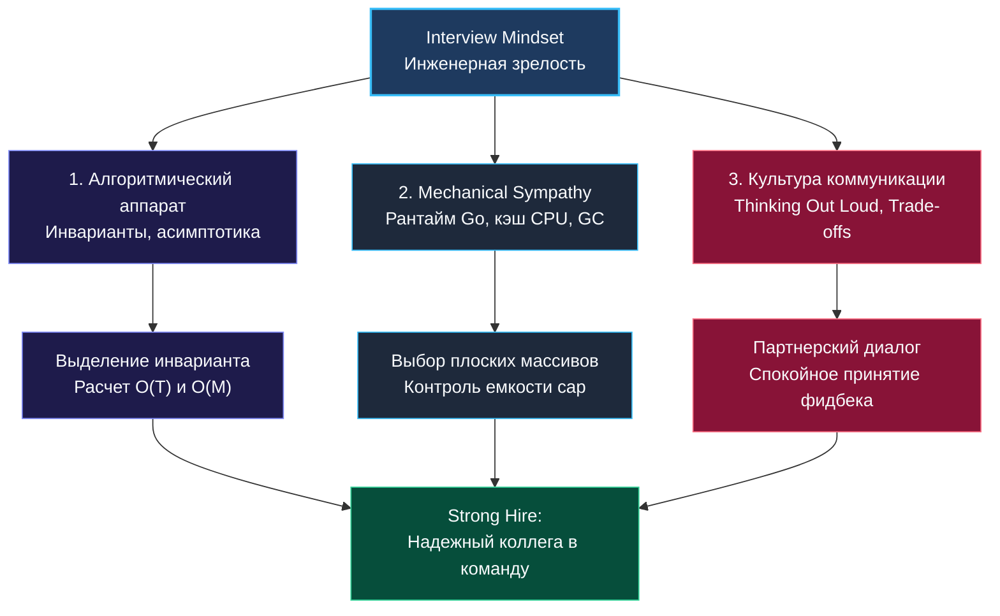

> *«Настоящая уверенность рождается не из слепой надежды на удачу, а из глубокого понимания базовых принципов и спокойной инженерной дисциплины».*  
> — Брайан Керниган

Позади двадцать семь фундаментальных лекций теоретического блока. 

Вы детально разобрались, почему паттерны неизмеримо важнее заучивания чужих решений ([[3. Паттерны вместо запоминания решений]]), научились безошибочно вычленять их из туманных формулировок ([[4. Как распознавать паттерн в задаче]]), искусно комбинировать несколько подходов в одной задаче ([[12. Как комбинировать алгоритмические паттерны]]) и планомерно оптимизировать код шаг за шагом ([[16. Оптимизация решения шаг за шагом]]). Вы овладели психологией инженерной коммуникации ([[6. Как объяснять решение вслух]]), дисциплиной тайминга ([[21. Тайминг решения задач]]), ручной отладкой кода ([[20. Debugging алгоритмов]]) и искусством мыслить вслух ([[27. Как думать вслух и тянуть время на интервью]]).

Теперь пришло время свести разрозненные навыки в единую монолитную систему. На реальном техническом собеседовании невозможно действовать по механической инструкции, сверяясь с бумажным чек-листом. Вы действуете из целостного психоэмоционального и профессионального состояния, имя которому — **Interview Mindset**.

---

### Три кита Interview Mindset

**Interview Mindset** — это психологическая и инженерная позиция, при которой собеседование перестаёт восприниматься как стрессовый экзамен с угрозой провала и превращается в **партнёрскую рабочую сессию двух инженеров**. 

Ваша цель — не угадать «правильный ответ», спрятанный в голове экзаменатора, а совместно исследовать задачу, предложить взвешенные варианты и реализовать надежный софт.

#### 1. Алгоритмический аппарат (Аналитическое зрение)
Вы не судорожно вспоминаете «где я видел эту задачу на LeetCode». Вы спокойно декомпозируете её на составляющие:
- Каковы ограничения на входные данные ($N$)?
- Обладает ли функция накопления свойством монотонности?
- Нужен ли нам произвольный доступ ($O(1)$) или достаточно последовательного чтения?
- Какой алгоритмический инвариант гарантирует корректность на каждом шаге цикла?

#### 2. Механическое сочувствие к оборудованию (Mechanical Sympathy)
В каждом решении вы видите не абстрактные математические формулы, а физические байты, путешествующие по шине памяти в регистры процессора:
- Вы предпочитаете статический срез `[26]int` вместо `map[rune]int`, потому что помните о стоимости промаха мимо L1-кэша и нагрузке на GC ([[01. Архитектура компьютера]]).
- Вы выделяете память один раз через `make([]T, 0, cap)`, оберегая аллокатор от фрагментации кучи.
- Вы знаете, когда рекурсия опасна исчерпанием стека горутины, и осознанно заменяете её итеративным циклом на плоском слайсе.

#### 3. Культура технического диалога
Вы воспринимаете интервьюера как союзника. Вы не спорите, защищая неработающий код, а с интересом встречаете контрпримеры. Вы проговариваете сомнения вслух, предупреждаете о сделанных допущениях и открыто обсуждаете цену архитектурных компромиссов.

---

### Хроника идеального 45-минутного раунда

Вот как выглядит ход мысли и действий инженера, обладающего зрелым Interview Mindset:

1. **Минуты 0–5 (Калибровка требований):** Вы внимательно выслушиваете формулировку. Задаете 3–4 вопроса: допустимы ли отрицательные значения, могут ли данные содержать дубликаты, каков максимальный размер $N$, что возвращать при вырожденном входе (`nil` или пустой слайс).
2. **Минуты 5–8 (Проектирование и согласование):** Вы сопоставляете ограничения с допустимой сложностью: *«Так как $N \le 10^5$, алгоритм должен укладываться в $O(N)$. Свойство монотонности позволяет применить скользящее окно с поддержанием инварианта минимальной суммы. Для хранения частот используем массив `[128]int`. Согласны с таким направлением?»*. Дождавшись одобрения, переходите к коду.
3. **Минуты 8–25 (Чистая реализация):** Вы пишете идиоматичный код сверху вниз. Начинаете с ранней проверки (`guard clause`). Используете говорящие имена (`windowSum`, `left`, `right`). Поясняете назначение смысловых блоков.
4. **Минуты 25–35 (Ручная верификация):** Не дожидаясь напоминания, вы берете пример из условия и прогоняете алгоритм по шагам в виде компактной таблицы переменных. Затем стресс-тестируете код на крайних случаях: пустой массив `[]`, массив из 1 элемента, массив из одинаковых чисел. Спокойно корректируете найденный off-by-one сдвиг.
5. **Минуты 35–45 (Анализ и расширение):** Вы четко формулируете асимптотику: *«Время выполнения — строго $O(N)$, так как каждый элемент попадает в окно и покидает его ровно по одному разу. Память — $O(1)$ благодаря фиксированному массиву на стеке. В качестве альтернативы мы могли бы рассмотреть префиксные суммы с бинарным поиском за $O(N \log N)$, если бы массив содержал отрицательные числа»*.

---

### Ритуалы уверенности перед стартом («День X»)

Стресс перед ответственным раундом — естественная биологическая реакция организма на неизвестность. Профессионал отличается тем, что умеет переводить адреналин в предельную концентрацию.

- **Информационный детокс за полчаса до звонка:** Прекратите судорожно перелистывать задачи на LeetCode. Попытка «в последний момент выучить ещё один алгоритм» лишь усилит фоновую тревожность. Закройте все вкладки.
- **Мышечная калибровка пальцев:** Откройте терминал и наберите короткую программу на Go без подсказок. Это переведет мелкую моторику в рабочий тонус.
- **Ментальный якорь:** Напомните себе: собеседование — это не суд присяжных. Это обоюдный процесс знакомства двух инженеров. Вы пришли не просить одолжения, а показать свои сильные стороны и посмотреть на задачи компании.

---

### Дорога к практическому мастерству

Теоретический фундамент заложен безупречно. Вы освоили правила игры, ментальные модели и Go-идиоматику. Но любая теория мертва без сотен часов осознанной практики.

Впереди вас ждёт сердце нашей энциклопедии — **Раздел 02. Задачи**. 

В нём собраны 29 фундаментальных алгоритмических кластеров: от классической работы с массивами, указателями и битовыми операциями до сложнейшего двумерного динамического программирования, графовых потоков и построения префиксных деревьев. Каждая задача разобрана с позиций Кернигановского стандарта: с доказательством инварианта, разбором ошибок на собеседованиях, пошаговыми диаграммами памяти и безупречным кодом на современном Go.

Переходите к первой практической теме: [[1. Теория. Массивы и строки]]. В добрый путь!