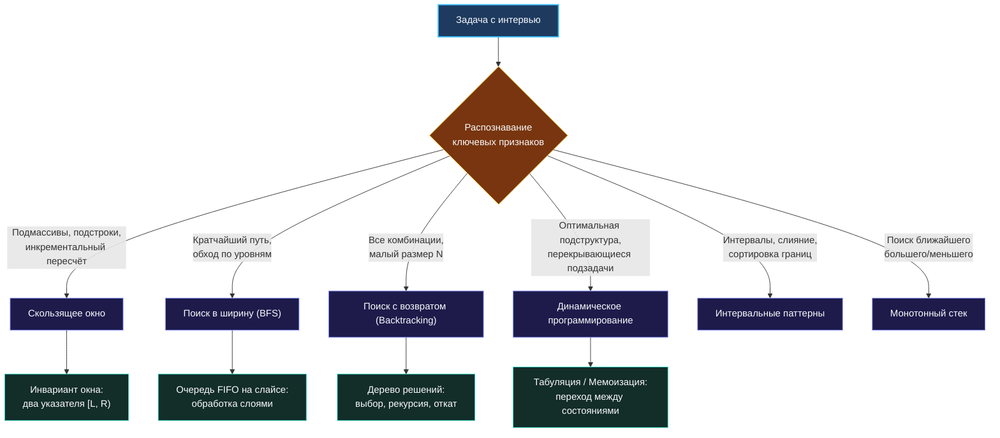

> *«Не пытайтесь запомнить каждую деталь. Ищите структуры, повторяющиеся принципы и паттерны — они остаются неизменными, когда детали забываются».*  
> — Брайан Керниган

В предыдущих беседах мы выяснили, почему механическое заучивание решений на учебных платформах разбивается о реалии живого собеседования: стресс блокирует доступ к разрозненным фрагментам памяти, а малейшее изменение условий превращает «знакомую» задачу в непреодолимую стену.

Теперь мы заложим краеугольный камень эффективной подготовки: **алгоритмические паттерны**. Паттерны — это фундаментальные мыслительные модели, позволяющие объединить тысячи кажущихся уникальными задач в компактное семейство из 15–20 базовых инженерных приёмов.

## Что такое алгоритмический паттерн

**Алгоритмический паттерн** — это не фрагмент кода, который можно бездумно скопировать в буфер обмена. Это обобщённая концептуальная схема организации вычислений, обладающая строгой анатомией:

1. **Триггеры применимости:** Характерные признаки в условии и ограничениях, сигнализирующие о пригодности подхода.
2. **Структурный каркас:** Инвариантный скелет алгоритма (например, расширение и сужение границ окна, просеивание в куче или стек возвратов в рекурсии).
3. **Математический инвариант:** Условие, остающееся истинным на каждом шаге цикла и гарантирующее математическую корректность результата.
4. **Реализация в железе (Mechanical Sympathy):** Выбор структур данных конкретного языка программирования, минимизирующий аллокации и дружественный к кэш-памяти CPU.

Если провести параллель с объектно-ориентированными паттернами проектирования (GoF) или паттернами параллелизма в Go (worker pool, fan-out/fan-in), то алгоритмические паттерны решают аналогичную задачу, но на микроуровне отдельной вычислительной функции.

> [!info] Философия Go в алгоритмах
> Идиоматичный Go следует завету простоты: *«Паттерны должны быть очевидны из структуры кода, а не спрятаны за громоздкими абстракциями»*. В Go вы не строите полиморфные фабрики для итерации по окну. Вы пишете прозрачный цикл с двумя индексами, снабжая его лаконичным комментарием: `// sliding window: [left, right]`. Простота и читаемость важнее академической красивости.

## Почему паттерны превосходят зубрёжку

1. **Уверенная работа с незнакомыми задачами.** На собеседовании вам почти никогда не предложат задачу из топа LeetCode в первозданном виде. Интервьюер изменит ограничения, добавит отрицательные числа или переформулирует задачу в терминах бизнес-логики. Если вы помните задачу «Longest Substring Without Repeating Characters» лишь построчно, вы растеряетесь. Если же вы владеете паттерном «Скользящее окно», вам безразлично, что именно находится внутри окна — символы, пакеты сетевого трафика или финансовые транзакции.
2. **Радикальное снижение когнитивной нагрузки.** В условиях стресса оперативная память человека резко сужается. Пытаться удержать в голове 300 алгоритмов — верный путь к панике. Удержать 15 паттернов и правила их выбора — абсолютно решаемая задача даже под пристальным взглядом нанимающего менеджера.
3. **Естественный язык общения с интервьюером.** Когда вы уверенно произносите: *«Я вижу здесь задачу о поиске непрерывного подмассива с монотонной суммой, поэтому предлагаю применить скользящее окно с двумя указателями»*, — интервьюер мгновенно считывает системное инженерное мышление.

## Пространство алгоритмических паттернов



## Паттерны в Go: Механическая симпатия на практике

Паттерн не существует в сферическом вакууме псевдокода. В реальном мире Go-разработчик обязан понимать, как выбранная структура данных взаимодействует с аллокатором памяти и процессорным кэшем.

### Пример 1: Скользящее окно — `map` против статического массива

Задача: найти длину самой длинной подстроки без повторяющихся символов. Если алфавит произвольный (Unicode), без динамической хэш-таблицы не обойтись. Но если условие прямо гарантирует диапазон ASCII (например, строчные латинские буквы), то использование `map[byte]int` превращается в стрельбу из пушки по воробьям.

```go
// Идиоматичное скользящее окно с нулевыми аллокациями для ASCII
func lengthOfLongestSubstring(s string) int {
    // 128 элементов типа int на 64-битной системе занимают ровно 1024 байта.
    // Escape analysis компилятора гарантирует, что массив останется на стеке горутины!
    var lastSeen [128]int
    for i := range lastSeen {
        lastSeen[i] = -1
    }

    left, maxLength := 0, 0

    for right := 0; right < len(s); right++ {
        char := s[right]
        if prevIndex := lastSeen[char]; prevIndex >= left {
            left = prevIndex + 1
        }
        lastSeen[char] = right

        if currentLen := right - left + 1; currentLen > maxLength {
            maxLength = currentLen
        }
    }

    return maxLength
}
```

Почему этот код вызовет одобрение Senior-интервьюера:
- **Zero Allocations:** Никаких походов в кучу (`runtime.newobject`). Память выделяется мгновенным сдвигом указателя стека.
- **Отсутствие Pointer Chasing:** Прямая индексация массива по коду символа `lastSeen[char]` — это одна процессорная инструкция с базовым смещением, исполняемая в L1-кэше за доли наносекунды.
- **Полная изоляция от GC:** Сборщик мусора Go даже не взглянет на этот массив, так как в нём нет указателей.

### Пример 2: Очередь для BFS — слайс против каналов и списков

Начинающие Go-разработчики, начитавшись о конкурентности, порой пытаются организовать обход в ширину (BFS) через буферизованные каналы или пакет `container/list`. Это грубейшая ошибка.

BFS — это детерминированный последовательный алгоритм. Каналы добавляют накладные расходы на блокировки мьютексов внутри `hchan`, а `container/list` выделяет отдельный объект узла в куче на каждый элемент:

```go
// Идиоматичный BFS: FIFO-очередь на базе плоского слайса
func levelOrder(root *TreeNode) [][]int {
    if root == nil {
        return nil
    }

    var result [][]int
    // Инициализируем слайс указателей
    queue := []*TreeNode{root}

    for len(queue) > 0 {
        levelSize := len(queue)
        level := make([]int, 0, levelSize)

        for i := 0; i < levelSize; i++ {
            // Извлекаем голову очереди
            node := queue[0]
            queue = queue[1:] // Сдвиг слайса за O(1)

            level = append(level, node.Val)

            if node.Left != nil {
                queue = append(queue, node.Left)
            }
            if node.Right != nil {
                queue = append(queue, node.Right)
            }
        }

        result = append(result, level)
    }

    return result
}
```

> [!warning] Ловушка / Gotcha: Удержание ссылок при `queue = queue[1:]`
> Операция `queue = queue[1:]` сдвигает указатель заголовка слайса вправо, но **не освобождает память** подлежащего массива. Если очередь в цикле вырастает до миллиона элементов, все удаленные указатели продолжат висеть в памяти, пока жив слайс `queue`!
> 
> На собеседовании проявите класс: упомяните, что в долгоживущих системных сервисах для предотвращения утечек указателей старую голову зануляют (`queue[0] = nil; queue = queue[1:]`) либо используют кольцевой буфер (ring buffer).

### Пример 3: Backtracking и минимизация аллокаций

В задачах на поиск с возвратом (генерация перестановок, подмножеств, обход лабиринтов) наивный код создает копию слайса на каждом шаге рекурсивного спуска. Это приводит к экспоненциальному взрыву аллокаций.

Идиоматичный паттерн в Go использует **один общий буфер пути** с техникой отката:
```go
// Добавляем текущий кандидат в буфер
currentPath = append(currentPath, candidate)

// Рекурсивный спуск в пространство состояний
backtrack(nextState, currentPath)

// Мгновенный откат состояния без аллокаций
currentPath = currentPath[:len(currentPath)-1]
```
Лишь в момент достижения листа дерева решений (базового случая) мы делаем явную глубокую копию: `solution := make([]int, len(currentPath)); copy(solution, currentPath)`.

## Как тренировать распознавание паттернов

Чтобы паттерны перешли из теоретического знания в мышечную память, придерживайтесь строгого алгоритма:

1. **Разберите анатомию:** Перед решением задач кластера прочитайте статью `1. Теория. <Тема>`. Осознайте инвариант и типовые структуры данных.
2. **Решите базовые задачи в чистом виде:** Возьмите 2–3 задачи, где паттерн представлен в эталонной форме.
3. **Формулируйте рефлексию:** После каждой задачи задайте себе три проверочных вопроса:
   - *Что именно в условии задачи подсказало применить этот паттерн?*
   - *Какой инвариант сохранялся на каждой итерации цикла?*
   - *Где в этом коде были узкие места по памяти и как Go-рантайм отреагирует на них?*

> [!tip] Что делать, если паттерн не очевиден
> Если на интервью задача кажется нестандартной, не молчите. Озвучьте процесс отбора: *«Я вижу два потенциальных кандидата: скользящее окно и динамическое программирование. Давайте проверим свойство монотонности. Если при расширении границы сумма всегда растет — окно сработает за $O(N)$. Если же числа могут быть отрицательными, монотонность ломается, и нам потребуются префиксные суммы с хэш-таблицей»*. Такой анализ покажет интервьюеру зрелого архитектора.

## Итог

Заучивание готовых решений — путь в тупик. Паттерны — это универсальные чертежи, позволяющие декомпозировать незнакомую задачу на проверенные кирпичики. 

В следующей лекции мы детально разберем методологию распознавания: по каким ключевым фразам, типам данных и ограничениям асимптотики безошибочно вычислять нужный паттерн: [[4. Как распознавать паттерн в задаче]].