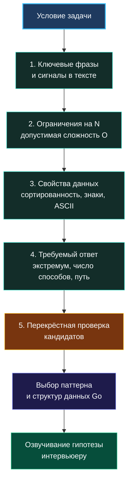

> *«Хороший программист смотрит на проблему с обеих сторон, прежде чем перейти улицу».*  
> — Брайан Керниган

Знать каталог алгоритмических паттернов — это лишь половина дела. На реальном техническом интервью перед вами появится задача, в условии которой никто заботливо не напишет: «Решите эту задачу скользящим окном» или «Используйте поиск в ширину». Напротив, условие часто маскируется под прикладную бизнес-задачу или намеренно путает кандидатов формулировками.

**Распознавание паттерна — это первый и критический шаг решения.** Ошиблись здесь — и последующие 25 минут пройдут в мучительных попытках заставить неподходящий алгоритм работать. В этой лекции мы разберём систематическую детективную методику: как по ключевым словам, ограничениям задачи и природе данных безошибочно вычислять правильный каркас.

## Почему поверхностная интуиция подводит

Человеческий мозг склонен цепляться за простые триггеры:
- Увидели слово «подмассив» — мгновенный рефлекс: «Два указателя!».
- Увидели «минимальное количество» — «Динамическое программирование!».

В 70% стандартных учебных задач это срабатывает. Но в оставшихся 30% слепая интуиция заводит в тупик:
- В задаче о поиске подмассива числа могут быть отрицательными, что мгновенно разрушает монотонность, необходимую для скользящего окна.
- В задаче о поиске минимума жадный выбор может дать оптимальный результат за $O(N)$, пока кандидат мучительно строит двумерную таблицу DP за $O(N^2)$.

Интервьюеры высокого уровня прекрасно осведомлены об этих шаблонах и намеренно проверяют: способен ли кандидат провести **многофакторный перекрёстный анализ**, прежде чем писать первую строку кода.

## Систематический конвейер распознавания

Подходите к анализу задачи как опытный инженер-исследователь. Не делайте скоропалительных выводов по одному признаку: соберите улики по пяти направлениям.

### Шаг 1: Семантические маркеры в условии

Определённые слова и словосочетания служат первичными индикаторами класса задач:

| Ключевые фразы в условии | Вероятные паттерны |
|---|---|
| «Непрерывный подмассив», «подстрока фиксированной длины» | Скользящее окно, Префиксные суммы |
| «Все возможные комбинации», «все перестановки», «расставить N ферзей» | Поиск с возвратом (Backtracking) |
| «Кратчайший путь в невзвешенном графе», «минимальное число шагов» | Поиск в ширину (BFS) |
| «Максимальная прибыль», «минимальная стоимость», «количество способов» | Динамическое программирование, Жадные алгоритмы |
| «Отсортированный массив», «найти значение за $O(\log N)$» | Бинарный поиск |
| «Ближайший больший справа», «гистограмма», «видимые элементы» | Монотонный стек |
| «Слияние интервалов», «расписание встреч», «пересекающиеся отрезки» | Интервальные паттерны (сортировка границ) |
| «K-й по величине», «Top-K частотных элементов» | Куча (`container/heap`), Быстрый выбор (Quickselect) |
| «Связность компонент», «динамическое объединение сетей» | Система непересекающихся множеств (Union-Find) |

### Шаг 2: Ограничения на входные данные — главный компас

Если слова в условии могут ввести в заблуждение, то **ограничения на размер входа ($N$) никогда не врут**. Они с абсолютной математической точностью диктуют допустимую верхнюю границу вычислительной сложности:

- **$N \le 12$–$20$:** Допустима экспоненциальная ($O(2^N)$) или факториальная ($O(N!)$) сложность. Это классический домен **Backtracking** (полный перебор с отсечением ветвей).
- **$N \le 100$–$500$:** Подойдет кубическая сложность $O(N^3)$ — трехмерное DP, алгоритм Флойда-Уоршелла для поиска кратчайших путей между всеми парами вершин.
- **$N \le 2\,000$–$5\,000$:** Верхний предел для квадратичных решений $O(N^2)$ — классическое 2D динамическое программирование, перебор всех пар границ.
- **$N \le 10^5$–$10^6$:** Решение обязано укладываться в линейно-логарифмическое $O(N \log N)$ или чисто линейное $O(N)$ время. Здесь царствуют: предварительная сортировка, скользящее окно, префиксные суммы с хэш-таблицей, жадные алгоритмы и кучи.
- **$N \ge 10^9$ или $N$ не ограничено (поток данных):** Допустимо только логарифмическое время $O(\log N)$ (бинарный поиск по ответу) либо потоковые алгоритмы с памятью $O(1)$ или $O(K)$.

> [!warning] Ловушка / Gotcha: Игнорирование диапазона чисел
> Не смотрите только на длину массива `len(nums)`. Обращайте пристальное внимание на величину самих элементов:
> 
> В задаче «Koko Eating Bananas» массив банановых куч может содержать $10^4$ элементов, но размер отдельной кучи достигает $10^9$. Попытка построить таблицу DP по значениям куч мгновенно исчерпает память. 
> 
> Правильный паттерн — **Бинарный поиск по пространству ответов**: мы ищем минимальную скорость в диапазоне $[1, 10^9]$ за $O(N \log(\max))$, проверяя допустимость скорости линейным проходом.

### Шаг 3: Свойства входных данных

Структура данных на входе подсказывает, какие операции будут дешёвыми:
- **Массив отсортирован?** Это подарок судьбы: монотонность позволяет применять бинарный поиск или сходящиеся два указателя.
- **Массив содержит отрицательные числа?** Скользящее окно исключается, если сумма не монотонна. В игру вступают префиксные суммы с хэш-таблицей ($prefix[j] - prefix[i] = K$).
- **Алфавит ограничен?** Если гарантируется ASCII (`[a-z]` или `[0-9]`), хэш-таблицу `map` можно заменить на статический массив `[26]int` на стеке.

> [!info] Go-специфика: Длина строк и кодировки
> На собеседовании по Go всегда уточняйте: *«Гарантируется ли, что строка состоит только из однобайтовых символов ASCII?»*.
> 
> Помните, что в Go выражение `len(s)` возвращает число байт, а не символов! Для кириллицы строка `"Привет"` имеет длину 12 байт. Индексация `s[i]` обращается к отдельному байту UTF-8 последовательности. Если строка произвольная, потребуется конвертация в `[]rune` или итерация через `range`. Упоминание этого нюанса подчеркивает ваш реальный опыт работы с языком.

### Шаг 4: Анализ целевого результата

Что именно требует вернуть функция:
- **Экстремум (максимум/минимум целевой функции):** DP, Жадный алгоритм, Бинарный поиск по ответу.
- **Количество комбинаций/способов:** Динамическое программирование (суммирование путей), Комбинаторика.
- **Факт существования (булев флаг `true/false`):** Поиск пути в графе (DFS), проверка инварианта.
- **Полный список всех вариантов:** Поиск с возвратом (Backtracking).

### Шаг 5: Перекрёстная проверка и выбор победителя

Собрав все сигналы, кандидат формулирует гипотезу и сверяет её с ограничениями:
1. Какова асимптотика худшего случая выбранного подхода?
2. Укладывается ли она в лимит $10^8$ операций в секунду?
3. Не противоречат ли свойства данных инварианту паттерна?

## Живой пример: LeetCode 560. Subarray Sum Equals K

Разберём, как работает конвейер на классической задаче:

1. **Семантика:** В условии звучат слова «непрерывный подмассив» и «сумма равна $K$». Первичная ассоциация — скользящее окно.
2. **Ограничения:** Длина массива $N \le 20\,000$. Квадратичное решение $O(N^2)$ с перебором всех пар даст $4 \cdot 10^8$ операций — на грани таймаута. Нужно решение за $O(N)$ или $O(N \log N)$.
3. **Свойства данных:** В массиве **присутствуют отрицательные числа**. Добавление элемента может как увеличить, так и уменьшить сумму. Монотонности нет! Скользящее окно ломается.
4. **Вывод:** Применяем паттерн **Префиксные суммы с хэш-таблицей**. Формула $prefix[j] - prefix[i] = K$ переписывается как $prefix[i] = prefix[j] - K$. Храним в `map[int]int` историю частот префиксных сумм. Время $O(N)$, память $O(N)$.

## Go-специфика: От абстрактного паттерна к эффективным структурам

После выбора паттерна зрелый инженер сразу продумывает его материализацию в Go:

- **Скользящее окно с подсчётом символов:** Если диапазон ASCII — берем `[128]int` вместо `map[byte]int`. Избавляемся от аллокаций в куче и эвакуаций бакетов.
- **Очередь для BFS:** Используем плоский срез `[]*TreeNode` с предвыделенной вместимостью, избегая `container/list`.
- **Приоритетная очередь:** Реализуем `heap.Interface` поверх компактного среза, помня о непрерывности памяти для кэша процессора.

> [!tip] Как элегантно озвучить гипотезу на интервью
> Сформулируйте выбор паттерна как зрелое техническое предложение:
> *«Я проанализировал условие: нам нужен непрерывный подмассив, но из-за наличия отрицательных чисел скользящее окно неприменимо. Поэтому я предлагаю использовать префиксные суммы в комбинации с хэш-таблицей. Это позволит находить нужные диапазоны за один проход за время $O(N)$ при памяти $O(N)$ на хранение истории сумм. В Go я использую `make(map[int]int, len(nums))` для исключения лишних реаллокаций. Что вы думаете о таком направлении?»*.

## Итог

Распознавание паттерна — это не лотерея и не мистическое прозрение. Это строгий инженерный алгоритм взвешивания улик: семантики, асимптотических ограничений, свойств типов данных и желаемого результата.

В следующей лекции мы объединим распознавание паттерна в пошаговый алгоритм действий на 45-минутном техническом интервью: [[5. Алгоритм решения задачи на интервью]].