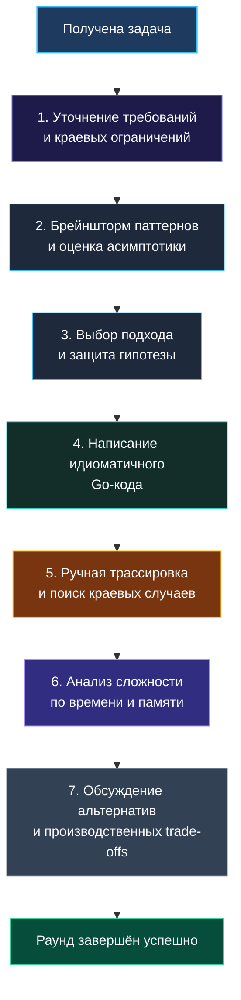

> *«Сначала сделайте так, чтобы программа работала правильно. Затем сделайте её быстрой — если это действительно необходимо».*  
> — Брайан Керниган

Вы получили алгоритмическую задачу. В крови подскакивает адреналин, курсор мигает в пустом окне редактора, а рука инстинктивно тянется немедленно набрать заголовок функции и первый цикл. 

Остановитесь. Это решающий момент собеседования.

Без чёткого, отрепетированного протокола действий даже сильный инженер рискует превратить 45-минутный раунд в хаотичную череду переделок: сначала поспешный код, потом обнаружение неучтённых отрицательных чисел, паническое стирание строк, нехватка времени и смазанный финал без анализа асимптотики.

В этой лекции мы зафиксируем **строгий пошаговый алгоритм прохождения алгоритмической секции**, который сохраняет ясность мышления под стрессом и демонстрирует интервьюеру зрелого бэкенд-инженера.

## Пошаговый каркас алгоритма



### Тайм-менеджмент 45-минутного раунда
- **00:00–05:00 (5 мин):** Уточнение условий, граничных случаев, ограничений и интерфейса.
- **05:00–10:00 (5 мин):** Брейншторм, проговаривание наивного решения, выбор паттерна и согласование гипотезы.
- **10:00–25:00 (15 мин):** Написание чистого, идиоматичного Go-кода без спешки.
- **25:00–35:00 (10 мин):** Ручная трассировка по коду, проверка краевых кейсов, исправление мелких огрехов.
- **35:00–42:00 (7 мин):** Анализ сложности ($O$-time, $O$-space), обсуждение влияния на память и GC, альтернативы.
- **42:00–45:00 (3 мин):** Вопросы кандидату или интервьюеру.

---

### Шаг 1: Уточнение требований — никогда не пропускайте

Первое, что оценивает интервьюер: **как вы формулируете техническое задание в условиях неопределенности**.

Контрольный список вопросов:
1. **Природа и ограничения данных:** Каков максимальный размер $N$? Могут ли быть отрицательные числа, ноль?
2. **Формат строк:** Строго ASCII или возможен произвольный UTF-8?
3. **Дубликаты:** Допустимы ли повторяющиеся элементы и влияет ли это на результат?
4. **Контракт возвращаемого значения:** Что возвращать при отсутствии решения?

> [!info] Go-специфика: nil против пустого среза
> В Go конструкции `var res []int` (nil-слайс) и `res := []int{}` (пустой слайс ненулевого заголовка) ведут себя по-разному при JSON-сериализации: nil сериализуется в `null`, а пустой слайс — в `[]`. 
> 
> Уточните у интервьюера: *«Если ответа нет, я возвращаю nil-слайс или пустой срез?»*. Это мгновенно выделит вас на фоне кандидатов, пишущих код абстрактно.

---

### Шаг 2: Быстрый брейншторм и наивное решение

Прежде чем бросаться к сложным алгоритмам, кратко озвучьте брутфорс-подход:
*«В лоб задачу можно решить перебором всех подмассивов за $O(N^2)$. Это тривиально в реализации, но при $N = 10^5$ приведет к $10^{10}$ операций и не уложится в тайм-лимит. Поэтому нам нужен линейный подход $O(N)$»*.

Зачем это нужно:
- Вы гарантируете себе «базовую оценку»: интервьюер видит, что вы способны решить задачу хоть как-то.
- Вы показываете, что понимаете, *почему* требуется оптимизация, отталкиваясь от математических ограничений.

---

### Шаг 3: Защита гипотезы перед написанием кода

Никогда не начинайте писать код без явного согласия интервьюера. Сформулируйте гипотезу:
*«Я предлагаю использовать паттерн двух указателей. Поскольку массив отсортирован, мы можем поставить указатели на начало и конец. Если текущая сумма меньше целевой — сдвигаем левый указатель вправо; если больше — правый указатель влево. Это гарантирует нахождение пары за один проход $O(N)$ при памяти $O(1)$. Подходит ли такой подход или вы хотите рассмотреть другое направление?»*.

Дождитесь кивка или фразы: *«Отлично, давайте закодим»*. Это страхует вас от 20 минут написания кода в неверном направлении.

---

### Шаг 4: Написание кода — идиоматичный Go с первой строки

Пишите код так, чтобы его можно было сразу отправить на ревью старшему инженеру:

1. **Осмысленные имена:** `left`, `right`, `targetSum`, `windowCount` вместо `l`, `r`, `s`, `c`.
2. **Ранние возвраты (Guard Clauses):**
   ```go
   if len(numbers) < 2 {
       return nil
   }
   ```
3. **Идиоматичные циклы:** Используйте `range` там, где индекс не нужен, либо явный `for left < right`.
4. **Контроль аллокаций:** Если размер результирующего среза известен заранее, инициализируйте его с емкостью: `result := make([]int, 0, expectedCapacity)`.

**Пример эталонного кода (Two Sum II — Input Array Is Sorted):**

```go
// twoSumSorted находит 1-базированные индексы двух чисел с заданной суммой target.
// Входной массив numbers отсортирован по возрастанию.
func twoSumSorted(numbers []int, target int) []int {
    if len(numbers) < 2 {
        return nil
    }

    left, right := 0, len(numbers)-1

    for left < right {
        currentSum := numbers[left] + numbers[right]

        switch {
        case currentSum == target:
            // Задача требует 1-базированные индексы
            return []int{left + 1, right + 1}
        case currentSum < target:
            left++
        default: // currentSum > target
            right--
        }
    }

    return nil
}
```

Обратите внимание на чистоту: логика ветвления элегантно оформлена через конструкцию `switch`, отсутствуют лишние переменные, краевой случай закрыт в первой же строке.

> [!warning] Ловушка / Gotcha: Игнорирование ошибок в сопутствующих функциях
> Если вы используете функции стандартной библиотеки, возвращающие `error` (например, `strconv.Atoi`), никогда не гасите ошибку пустым идентификатором `val, _ := strconv.Atoi(s)`. Если формат гарантирован условием задачи — добавьте поясняющий комментарий:
> ```go
> val, err := strconv.Atoi(s)
> if err != nil {
>     return nil // или panic с пояснением в контексте задачи
> }
> ```

---

### Шаг 5: Ручная трассировка — пальцем по коду

Закончив набор последней строки, не спешите говорить: «Я всё». Сделайте вдох и возьмите инициативу проверки в свои руки:

1. **Возьмите конкретный пример:** Пройдите по строкам кода, вслух проговаривая текущие значения переменных на каждой итерации.
2. **Проверьте крайние случаи (Edge Cases):**
   - Пустой срез `[]`.
   - Массив из одного или двух элементов.
   - Все элементы одинаковы.
   - Максимальные и минимальные значения (нет ли риска переполнения `int`?).
3. **Если заметили баг:** Спокойно скажите: *«Ага, я вижу, что на последнем шаге левый указатель выходит за пределы слайса. Добавим проверку границы»*. Исправление бага кандидатом до запуска тестов ценится интервьюерами крайне высоко.

> [!tip] Культура тестирования в стиле Go
> На этапе проверки упомяните: *«В боевом коде я бы оформил эти сценарии в виде table-driven теста с набором кейсов `[]struct{ name string; in []int; expected []int }`. Сейчас я вручную проверил граничный кейс с пустым слайсом и кейс с отрицательными числами»*. Это демонстрация зрелой инженерной ДНК.

---

### Шаг 6: Анализ сложности и Mechanical Sympathy

Не ждите, пока интервьюер спросит про Big-O. Сделайте разбор сами:

- **Временная сложность:** Обоснуйте её по циклам. Упомяните скрытые затраты: если внутри цикла происходит обращение к хэш-таблице, отметьте влияние хэширования на наносекунды.
- **Пространственная сложность:** Проанализируйте дополнительную память. Выделяется ли память в куче или стек горутины остается чистым?
- **Аппаратная локальность (Cache Locality):** Если вы работаете с непрерывным слайсом, упомяните: *«Слайс лежит в непрерывной памяти, поэтому процессор эффективно использует L1-кэш и аппаратный префетчинг»*.

---

### Шаг 7: Обсуждение альтернатив и производственных компромиссов

Завершите раунд демонстрацией широты кругозора:
*«Мы реализовали решение за $O(N)$ времени и $O(1)$ памяти на двух указателях. Если бы входной массив не был отсортирован, у нас было бы два пути:
1. Использовать хэш-таблицу: $O(N)$ времени, но $O(N)$ дополнительной памяти в куче.
2. Предварительно отсортировать массив: $O(N \log N)$ времени, но память сохранилась бы $O(1)$.
В высоконагруженном микросервисе с ограниченной оперативной памятью второй вариант мог бы оказаться предпочтительнее для снижения нагрузки на Garbage Collector»*.

## Итог

Следование чёткому 7-шаговому алгоритму превращает стрессовую неизвестность в контролируемый производственный процесс. Вы не просто решаете академическую задачу — вы демонстрируете культуру разработки, которой хотят подражать.

В следующей лекции мы детально разберём ключевой коммуникативный навык: как непрерывно и органично думать вслух на протяжении всего интервью: [[6. Как объяснять решение вслух]].