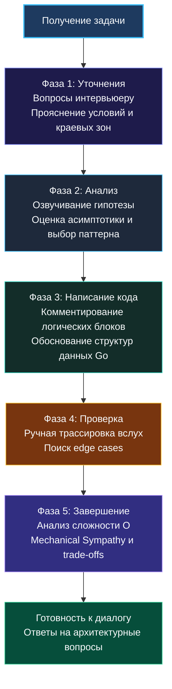

> *«Неясное объяснение — это почти всегда признак неясного понимания».*  
> — Брайан Керниган

Один из самых обидных исходов алгоритмического интервью — когда код написан без ошибок, алгоритм оптимален, но кандидат всё равно получает отказ с вердиктом: *«Слабые коммуникативные навыки, трудно проследить ход мысли, не готов к командному взаимодействию»*.

На позициях уровня Senior и Lead умение понятно и связно артикулировать технические мысли ценится не меньше, чем знание структур данных. В реальной жизни вам предстоит защищать архитектуру сервисов на технических комитетах, проводить конструктивные код-ревью и обучать менее опытных коллег. Алгоритмический раунд — это первая проверка того, каково будет работать с вами плечом к плечу каждый день.

**Объяснение решения вслух — это не бесконечный поток сознания, а осознанная инженерная техника.** В этой лекции мы разберём, как выстроить структурированный монолог, как заполнять естественные паузы и как получать подсказки интервьюера без потери очков.

## Фазы диалога на интервью

Процесс решения делится на несколько чётких фаз, и в каждой из них кандидат использует собственный регистр речи:

---

### Фаза 1: Уточнения — закладываем фундамент диалога

Не молчите после прочтения задачи. Задайте серию вопросов, формулируя их так, чтобы они подчеркивали ваше понимание связки алгоритма с рантаймом Go:

**Полезные речевые конструкции:**
- *«Входные данные — массив целых чисел. Могут ли они быть отрицательными? Это повлияет на возможность использования скользящего окна, так как при отрицательных значениях нарушается монотонность суммы»*.
- *«Строки содержат исключительно латиницу (ASCII) или нам нужно корректно обрабатывать многобайтовые UTF-8 символы? В Go это разница между работой с байтами через `s[i]` и декодированием рун через `[]rune`»*.
- *«Каков предельный размер $N$? Это определит, можем ли мы применить решение за $O(N^2)$ или нам строго необходим линейный алгоритм»*.

---

### Фаза 2: Анализ — рассуждаем вслух перед кодингом

Сформулируйте гипотезу на 1–2 минуты, давая интервьюеру полную картину вашего замысла:

1. **Краткий брутфорс:** *«Наивное решение — перебрать все варианты за $O(N^2)$, но для продакшена это неприемлемо по времени»*.
2. **Предлагаемый паттерн:** *«Я предлагаю применить хэш-таблицу для сохранения истории префиксных сумм. Это сведёт проверку условия к поиску в словаре за $O(1)$ на каждом шаге»*.
3. **Выбор структур данных в Go:** *«Для таблицы мы используем `map[int]int`, заранее выделив емкость через `make(map[int]int, len(nums))`, чтобы исключить эвакуацию бакетов при заполнении»*.
4. **Контрольный вопрос:** *«Кажется ли вам такое направление логичным?»*.

> [!tip] Сила своевременного вопроса
> Задавая в конце анализа вопрос: *«Подходит ли такой подход?»*, вы превращаете интервью из допроса в партнёрское обсуждение. Если вы выбрали неоптимальный путь, интервьюер сразу скажет: *«Идея хорошая, но можно ли обойтись без выделения $O(N)$ памяти?»*. Вы сэкономите 15 минут кодинга.

---

### Фаза 3: Написание кода — комментируйте блоки, а не синтаксис

Самая распространенная ошибка новичков — механическое озвучивание синтаксиса:
> ❌ *«Так, теперь я пишу for, объявляю переменную i равную нулю, пока i меньше длины массива, делаю i плюс плюс...»*

Это информационный мусор, который утомляет интервьюера. Озвучивать нужно **инженерное намерение** и **инварианты блоков**:

> ✅ *«Теперь мы проходим правым указателем по слайсу, расширяя окно. Внутри мы поддерживаем инвариант: сумма элементов в окне не должна превышать целевое значение target. Если инвариант нарушен — мы запускаем внутренний цикл сжатия окна слева, пока сумма снова не придет в норму»*.

**Что ценно проговаривать в процессе кодинга на Go:**
- **Защитные условия (Guard Clauses):** *«В начале функции отсекаем граничный случай: если длина среза меньше двух, сразу возвращаем nil, избавляясь от лишней вложенности if»*.
- **Отказ от лишних аллокаций:** *«Поскольку нам известна верхняя планка размера ответа, я выделяю срез с нулевой длиной, но заданной вместимостью `make([]int, 0, len(nums))`»*.
- **Выбор типов:** *«Алфавит строго 26 символов, поэтому вместо тяжелой хэш-таблицы я беру массив `[26]int` на стеке»*.

---

### Фаза 4: Проверка — тестирование глазами кандидата

Никогда не объявляйте о завершении работы фразой: «Я закончил, проверяйте». Перехватите инициативу и проведите тестирование сами:

1. **Возьмите конкретный входной пример:** *«Давайте проследим выполнение на массиве `[2, 3, 1, 2, 4, 3]` при target = 7. На первом шаге правый указатель на 0, сумма 2. Окно расширяется...»*.
2. **Проверьте крайние случаи (Edge Cases):** *«Теперь проверим граничные сценарии: пустой срез вернет nil благодаря первой строке. Если массив состоит из одного элемента, цикл отработает корректно»*.
3. **Исправление ошибок:** Если при трассировке вы заметили огрех (например, off-by-one ошибку на индексе `right`), не паникуйте. Спокойно произнесите: *«Вижу, что при вычислении длины я забыл прибавить единицу: `right - left + 1`. Отлично, что мы это выявили до запуска»*.

---

### Фаза 5: Завершение и Mechanical Sympathy

Завершите задачу строгим анализом:
- *«Временная сложность решения — $O(N)$, так как каждый элемент массива посещается правым и левым указателями не более одного раза»*.
- *«Пространственная сложность — $O(1)$, так как мы оперируем только несколькими переменными на стеке горутины, не создавая нагрузки на Garbage Collector»*.

> [!info] Как звучит Senior-разработчик
> Добавьте замечание о работе на реальном железе:
> *«С точки зрения локальности кэша (Cache Locality), последовательный проход по непрерывному слайсу идеален для процессора: аппаратный префетчер загружает данные целыми кэш-линиями по 64 байта, минимизируя простои CPU»*.

---

## Как правильно заполнять паузы («технический шум»)

Невозможно говорить каждую секунду: порой вам требуется 10–15 секунд глубокой концентрации, чтобы свести концы с концами в сложной формуле. Полная тишина более 20 секунд начинает напрягать интервьюера.

**Приёмы безопасного заполнения пауз:**
1. **Резюмирование текущей точки:** *«Итак, базовые случаи мы закрыли, расширение окна реализовано. Сейчас я проверяю условие корректного обновления минимальной длины»*.
2. **Проверка инварианта:** *«Секунду, я мысленно проверю, не выходит ли `left` за пределы `right` при резком сжатии окна»*.
3. **Честная короткая пауза:** *«Мне нужно 15 секунд сосредоточиться на условии выхода из рекурсии»*. Это абсолютно нормально и приветствуется: вы предупредили собеседника.

## Как просить о подсказке, сохраняя баллы

Если вы зашли в тупик, худшее — молча сидеть или жалобно сказать: «Я не знаю, что делать дальше».

**Грамотный запрос на подсказку через альтернативу:**
> *«Я вижу два пути решения: первый — через рекурсивный DFS с мемоизацией, второй — через итеративное заполнение таблицы DP. В первом случае код пишется быстрее, но есть риск глубокого стека вызовов. Во втором — память гарантированно под контролем. Какое направление вам интереснее увидеть в реализации?»*.

Вы не просите решить задачу за вас — вы показываете два инженерных компромисса и предлагаете интервьюеру выбрать фокус.

## Итог

Умение объяснять решение вслух — это не врожденный дар, а тренируемый навык. Включайте диктофон при каждом решении задач дома, слушайте себя со стороны, избавляйтесь от слов-паразитов и оттачивайте формулировки.

В следующей лекции мы детально разберём главные ошибки и грабли, на которых регулярно спотыкаются кандидаты: [[7. Типичные ошибки кандидатов]].