> *«Ошибки не возникают на пустом месте; они рождаются из спешки, самоуверенности и пренебрежения простыми правилами».*  
> — Брайан Керниган

В предыдущих лекциях мы разобрали, как выстраивать правильный диалог и контролировать ход алгоритмического интервью. Однако даже блестящие ораторские навыки не спасут, если кандидат совершает фундаментальные инженерные ошибки, которые опытные интервьюеры мгновенно считывают как красные флаги.

За годы практики в найме Senior и Lead разработчиков выкристаллизовался устойчивый список типичных ловушек — от наивного непонимания внутреннего устройства Go до фатальных промахов в алгоритмической дисциплине. В этой лекции мы детально препарируем эти ошибки, чтобы вы никогда не наступали на эти грабли.

## Карта типичных ошибок кандидата

```mermaid
flowchart TD
    classDef process  fill:#1e293b,stroke:#38bdf8,stroke-width:1px,color:#f8fafc
    classDef success  fill:#064e3b,stroke:#34d399,stroke-width:1px,color:#f8fafc
    classDef error    fill:#7f1d1d,stroke:#f87171,stroke-width:1px,color:#f8fafc
    classDef warning  fill:#78350f,stroke:#fbbf24,stroke-width:1px,color:#f8fafc
    classDef entry    fill:#1e3a5f,stroke:#38bdf8,stroke-width:2px,color:#f8fafc
    classDef aux      fill:#334155,stroke:#64748b,stroke-width:1px,color:#f8fafc
    classDef system   fill:#312e81,stroke:#a78bfa,stroke-width:1px,color:#f8fafc
    classDef data     fill:#132d29,stroke:#2dd4bf,stroke-width:1px,color:#f8fafc
    classDef network  fill:#881337,stroke:#fb7185,stroke-width:1px,color:#f8fafc
    classDef accent   fill:#1e1b4b,stroke:#818cf8,stroke-width:1px,color:#f8fafc

    Start["Старт интервью"]:::entry --> Phase1["Этап анализа"]:::accent
    Start --> Phase2["Этап кодинга"]:::accent
    Start --> Phase3["Этап проверки"]:::accent
    Start --> Phase4["Коммуникация"]:::accent
    
    Phase1 --> Err1["1. Пропуск уточнений"]:::error
    Phase1 --> Err2["2. Поспешный выбор паттерна"]:::error
    Phase1 --> Err3["3. Игнорирование ограничений N"]:::error
    
    Phase2 --> Err4["4. Неидиоматичный Go"]:::error
    Phase2 --> Err5["5. Утечки памяти срезов"]:::error
    Phase2 --> Err6["6. Преждевременная оптимизация"]:::error
    
    Phase3 --> Err7["7. Пропуск edge cases"]:::error
    Phase3 --> Err8["8. Ошибки в оценке Big-O"]:::error
    Phase3 --> Err9["9. Отсутствие альтернатив"]:::error
    
    Phase4 --> Err10["10. Молчание кандидата"]:::error
    Phase4 --> Err11["11. Игнорирование подсказок"]:::error
    Phase4 --> Err12["12. Провал тайм-менеджмента"]:::error
```



---

## Блок 1: Ошибки этапа анализа (фундамент рушится до кодинга)

### 1. Игнорирование уточнений: «Я всё понял, пишу код»
Кандидат слышит знакомые слова («максимальная сумма подмассива») и сразу заявляет: «Это скользящее окно!». Он упускает, что в массиве могут быть отрицательные числа, которые ломают монотонность. Через 15 минут код заходит в тупик, время безвозвратно потеряно.

**Почему это критично:** Senior-инженер на реальной работе получает размытые требования от бизнеса. Если он не задает уточняющих вопросов, команда рискует разработать не тот функционал. Всегда уточняйте знаки чисел, пустые срезы, дубликаты и UTF-8 кодировку.

### 2. Привязка к одному слову вместо перекрёстного анализа
Увидев слово «интервалы», кандидат немедленно начинает сортировать их по левой границе, хотя для задачи о непересекающихся отрезках оптимальна жадная сортировка по правому краю.

**Как исправить:** Применяйте правило трёх улик из лекции [[4. Как распознавать паттерн в задаче]]: сопоставляйте семантику, размер $N$ и свойства данных.

### 3. Слепота к ограничениям ($N$)
Кандидат пишет квадратичное решение $O(N^2)$ для массива размером $10^5$, искренне полагая, что «компилятор Go очень быстрый и вытянет». Физику не обманешь: $10^{10}$ операций на процессоре с частотой 3 ГГц займут от нескольких секунд до десятков секунд, что гарантирует Time Limit Exceeded.

---

## Блок 2: Ошибки реализации и Go-специфика

### 4. Неидиоматичный Go: «Код переведен с Java или Python»
Интервьюеры, сами ежедневно пишущие на Go, с первых строк видят чужеродный стиль:
- Имена переменных `i`, `j`, `k`, `tmp`, `arr`, `res` вместо `left`, `right`, `windowSum`, `frequency`.
- Использование классических циклов `for i := 0; i < len(s); i++` там, где идиоматичен `range`.
- Игнорирование ошибок: `val, _ := strconv.Atoi(s)` без комментариев.
- Использование `panic()` для логики выхода из алгоритма.

> [!warning] Ловушка / Gotcha: Семантика nil-слайса против пустого слайса
> Запомните разницу:
> ```go
> var a []int      // nil-слайс (len=0, cap=0, указатель на массив == nil)
> b := []int{}     // пустой слайс (len=0, cap=0, указатель указывает на zerobase)
> ```
> В логических условиях `len(a) == 0` и `len(b) == 0` ведут себя одинаково. Но при возврате из API и сериализации в JSON: `a` превращается в `null`, а `b` — в `[]`. Зрелый инженер всегда явно выбирает тот или иной вариант и может объяснить причину.

### 5. Опасные трюки со срезами (Slice Header Pitfalls)
Срез в Go — это 24-байтная структура:
```go
type SliceHeader struct {
    Data uintptr
    Len  int
    Cap  int
}
```
Копирование среза копирует заголовок, но оставляет **общий подлежащий массив**:

**Ошибка 5.1: Утечка памяти при срезе большого массива**
```go
func getHeader(hugeBuffer []byte) []byte {
    return hugeBuffer[:16] // Ошибка! hugeBuffer никогда не соберется GC!
}
```
*Решение:* явное копирование через `make([]byte, 16)` и `copy()`.

**Ошибка 5.2: Путаница между len и cap**
```go
res := make([]int, 0, 10)
res[0] = 42 // ПАНИКА: index out of range [0] with length 0
```
При длине 0 доступ по индексу запрещен, несмотря на наличие емкости 10. Добавление должно идти строго через `append()`.

### 6. Преждевременная микрооптимизация
Кандидат решает задачу среднего уровня и начинает вызывать `unsafe.Pointer`, битовую магию и пулы объектов `sync.Pool`. Код превращается в нечитаемую кашу.

**Золотое правило Кернигана:** *Сначала добейтесь корректной работы и идеальной читаемости с правильной алгоритмической сложностью. Микрооптимизации допустимы только по прямой просьбе интервьюера*.

---

## Блок 3: Ошибки проверки и анализа

### 7. Игнорирование краевых случаев (Happy Path Bias)
Кандидат протестировал код на одном примере из условия и объявляет о готовности. Опытный интервьюер сразу же подставляет краевой случай:
- Пустой массив `[]` или пустая строка `""`.
- Массив из одинаковых чисел `[1, 1, 1, 1]`.
- Указатель `root == nil` для бинарного дерева.
- Переполнение `int` при сложении больших чисел (`math.MaxInt`).

> [!tip] Внимание к разрядности типов в Go
> Тип `int` в Go на 64-битной архитектуре занимает 8 байт, но на 32-битной — 4 байта. Если числа в задаче могут достигать $10^9$, их сумма легко выйдет за пределы `int32`. Упомяните на интервью: *«Для суммирования я использую `int64`, чтобы предотвратить целочисленное переполнение независимо от целевой архитектуры сборки»*.

### 8. Поверхностная оценка сложности
Кандидат объявляет: «Сложность $O(N)$». Но внутри цикла спрятан вызов `append` без предвыделенной емкости, приводящий к скрытым реаллокациям и копированиям массива, либо поиск в `map`, который при коллизиях дает худшее время $O(N)$. 

Зрелый ответ всегда раскрывает скрытые затраты:
- *«По времени — $O(N)$ амортизированно. По памяти — $O(N)$ в худшем случае, так как мы аллоцируем бакеты хэш-таблицы в куче»*.

### 9. Отсутствие обсуждения альтернатив
Решить задачу одним способом и замолчать — значит упустить возможность продемонстрировать инженерный кругозор. Сравните решение с другими подходами: через время, память и нагрузку на GC.

---

## Блок 4: Коммуникация и тайм-менеджмент

### 10. Гробовое молчание
Кандидат молча пишет код 20 минут. Интервьюер скучает, не понимает хода мысли и ставит низкий балл за коммуникацию. 

### 11. Глухота к подсказкам
Интервьюер мягко замечает: *«А что произойдет, если массив содержит отрицательные элементы?»*. Кандидат отмахивается: *«Да-да, всё учтено»*, и продолжает развивать ошибочную ветку. Это катастрофа: кандидат демонстрирует неспособность слушать коллег. Любой вопрос интервьюера воспринимайте как дружеский знак остановиться и перепроверить инвариант.

### 12. Потеря чувства времени
Тратить 30 минут на простую первую задачу из двух запланированных — гарантированный способ провалить раунд. Поглядывайте на таймер и контролируйте контрольные точки.

---

## Комплексный разбор: Задача на проверку палиндрома

Рассмотрим показательный пример. Задача: «Проверить, является ли строка палиндромом, игнорируя небуквенные символы и регистр».

**Плохой код (типичные ошибки начинающего):**
```go
func isPalindrome(s string) bool {
    // ОШИБКА 1: strings.ToLower создает полную копию строки в куче!
    s = strings.ToLower(s) 
    
    // ОШИБКА 2: неидиоматичные имена i, j
    i, j := 0, len(s)-1 
    for i < j {
        // ОШИБКА 3: s[i] — это байт, а не символ UTF-8!
        if !isLetter(s[i]) { 
            i++
            continue
        }
        if !isLetter(s[j]) {
            j--
            continue
        }
        if s[i] != s[j] {
            return false
        }
        i++
        j--
    }
    return true
}
```

**Эталонный код Senior Go-разработчика:**
```go
// isPalindrome проверяет палиндромность строки с учётом произвольного Unicode.
// Временная сложность: O(N), Пространственная сложность: O(N) из-за конвертации в руны.
func isPalindrome(s string) bool {
    // Если условие гарантирует ASCII — мы можем работать байтами с двумя указателями за O(1) памяти.
    // Для честного Unicode декодируем строку в срез рун:
    runes := []rune(s)
    left, right := 0, len(runes)-1

    for left < right {
        l := unicode.ToLower(runes[left])
        if !unicode.IsLetter(l) && !unicode.IsDigit(l) {
            left++
            continue
        }

        r := unicode.ToLower(runes[right])
        if !unicode.IsLetter(r) && !unicode.IsDigit(r) {
            right--
            continue
        }

        if l != r {
            return false
        }

        left++
        right--
    }

    return true
}
```

**Что говорит кандидат при защите этого решения:**
*«Я явно конвертирую строку в срез `[]rune`, чтобы корректно поддержать многобайтовые символы UTF-8, что требует $O(N)$ памяти. Если бы условие гарантировало чистый ASCII, я бы применил побайтовую обработку с двумя указателями и нулевыми аллокациями памяти ($O(1)$)»*. 

Это исчерпывающий, профессиональный ответ.

## Итог

Ошибки на интервью редко бывают случайными. Они обнажают пробелы в культуре написания кода и понимании рантайма Go. Избавьтесь от суеты, следите за выделением памяти, не забывайте о сборщике мусора и всегда держите диалог открытым.

В следующей лекции мы перейдем к фундаментальной теории алгоритмических паттернов: что они представляют собой на глубинном уровне и как их классифицировать: [[8. Что такое алгоритмический паттерн]].