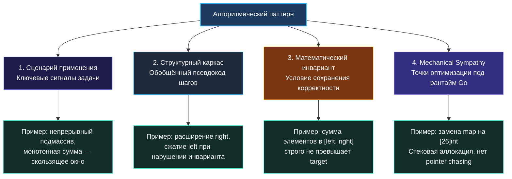

> *«Суть хорошей структуры данных в том, чтобы сделать алгоритм простым, понятным и эффективным».*  
> — Брайан Керниган

В предыдущих лекциях мы часто оперировали понятием «алгоритмический паттерн». Мы говорили, что паттерны важнее механической зубрёжки ([[3. Паттерны вместо запоминания решений]]), учились распознавать их сигналы в условии ([[4. Как распознавать паттерн в задаче]]) и встраивали их в общий процесс собеседования ([[5. Алгоритм решения задачи на интервью]]).

Но пришло время дать строгое определение: **что именно представляет собой алгоритмический паттерн на концептуальном уровне?** Чем он отличается от конкретного алгоритма? Как соотносится с классическими паттернами проектирования (GoF)? И почему понимание внутренней механики паттерна превращает вас из пользователя чужих сниппетов в настоящего инженера-архитектора?

## Определение: Не жесткий рецепт, а мета-алгоритм

**Алгоритмический паттерн** — это повторно используемый способ организации вычислений, задающий инвариантную структуру решения для целого класса задач, объединённых общими математическими свойствами, но не фиксирующий конкретные операции над элементами данных.

Ключевое различие кроется в степени абстракции:
- **Алгоритм** — это конкретная, жестко детерминированная последовательность шагов: например, классический бинарный поиск в отсортированном целочисленном массиве `nums`.
- **Алгоритмический паттерн** — это **мета-алгоритм** (каркас мышления). Например, «Бинарный поиск по пространству монотонного предиката».

Этот мета-каркас гласит:
> *«Если существует пространство поиска $[low, high]$ и монотонная функция-предикат $P(x)$, которая меняет свое значение с false на true ровно один раз, мы можем найти граничное значение за $O(\log(high - low))$ шагов, вычисляя $P(mid)$»*.

Этот один-единственный абстрактный паттерн элегантно решает десятки внешне непохожих задач: от распределения грузов по кораблям (Capacity To Ship Packages) до поиска оптимальной скорости в «Koko Eating Bananas» и разбиения массива на подмассивы с минимальной максимальной суммой (Split Array Largest Sum).

> [!info] Параллель с паттернами проектирования
> В объектно-ориентированном программировании паттерн «Стратегия» (Strategy) не диктует конкретный бизнес-код: он задает структуру взаимодействия контекста и интерфейса. Алгоритмический паттерн делает то же самое для вычислительных процессов: он задает каркас обхода состояний, оставляя детали конкретных операций на откуп задаче.

## Анатомия алгоритмического паттерна

Каждый полноценный алгоритмический паттерн раскладывается на четыре фундаментальных измерения:



### 1. Сценарий применения (Applicability Trigger)
Специфический профиль условий и ограничений, указывающий на применимость паттерна. Для «Скользящего окна» это требование непрерывности диапазона и монотонности функции агрегации при расширении границы.

### 2. Структурный каркас (Structural Skeleton)
Обобщенный алгоритмический скелет, инвариантный к языку реализации. Для обхода в ширину (BFS) каркас неизменен: инициализация очереди головой, цикл `while len(queue) > 0`, обработка элементов слоями по текущей длине очереди, пополнение новыми соседями.

### 3. Математический инвариант (Invariant)
Утверждение о состоянии вычислений, остающееся абсолютно истинным до начала итерации цикла и восстанавливающееся после ее завершения. Именно инвариант служит математическим доказательством того, что алгоритм гарантированно найдет оптимум и не пропустит решение.

### 4. Точки аппаратной оптимизации (Mechanical Sympathy)
Критически важное измерение для Senior Go-инженера: знание того, как математический скелет проецируется на процессорные кэши, аллокации в куче и паузы Garbage Collector.

## Три уровня абстракции: Не путайте слои

Многие разработчики смешивают понятия разных уровней проектирования. Проведем четкую границу:

| Слой абстракции | Область ответственности | Вопрос, на который отвечает | Примеры в разработке |
|---|---|---|---|
| **Алгоритмические паттерны** | Локальная вычислительная функция, цикл | *«Как эффективно вычислить результат?»* | Скользящее окно, Два указателя, Монотонный стек, BFS/DFS, DP |
| **Паттерны проектирования (GoF)** | Взаимодействие модулей, структур и пакетов | *«Как гибко организовать код программы?»* | Опции конфигурации (Functional Options), Стратегия, Декоратор, Адаптер |
| **Архитектурные паттерны** | Распределенная система, топология сервисов | *«Как разделить систему на надежные компоненты?»* | CQRS, Event Sourcing, Outbox Pattern, Saga, Circuit Breaker |

В языке Go этот водораздел особенно ярок: лаконичный синтаксис не поощряет раздувания объектных иерархий, поэтому алгоритмические паттерны в Go оформляются как чистые, прозрачные функции без лишней церемониальности.

## Систематическая классификация алгоритмических паттернов

Для удобной навигации в пространстве задач алгоритмические паттерны классифицируют по вычислительным парадигмам:

1. **Сужение пространства поиска при помощи монотонности:**
   - *Два указателя (Two Pointers):* встречное или сонаправленное движение по отсортированным срезам.
   - *Скользящее окно (Sliding Window):* динамическое расширение и сужение непрерывных границ $[L, R]$.
   - *Бинарный поиск по ответу (Binary Search on Answer):* деление диапазона допустимых значений пополам.
2. **Исследование пространства состояний:**
   - *Поиск в ширину (BFS):* послойное сканирование графов и деревьев, поиск кратчайшего пути в невзвешенных графах.
   - *Поиск в глубину (DFS):* обход компонент связности, топологическая сортировка, проверка на циклы.
   - *Поиск с возвратом (Backtracking):* перебор конфигураций с ранним отсечением бесперспективных ветвей.
3. **Оптимальная подструктура и перекрытие подзадач:**
   - *Динамическое программирование (DP 1D/2D):* сведение задачи к предыдущим состояниям через рекуррентные соотношения с мемоизацией или табуляцией.
   - *Жадные алгоритмы (Greedy):* локально оптимальный выбор на каждом шаге без последующего пересмотра.
4. **Структурная фильтрация и поддержание монотонности:**
   - *Монотонный стек / очередь:* поиск ближайшего большего или меньшего элемента за амортизированное $O(1)$.
   - *Приоритетные кучи (Heap / Priority Queue):* поддержание Top-K экстремумов в динамическом потоке.
5. **Префиксная агрегация:**
   - *Префиксные суммы:* мгновенный ответ на запросы суммы диапазона за $O(1)$ и выявление скрытых инвариантов ($prefix[j] - prefix[i] = K$).
   - *Разностные массивы (Difference Array):* массовое обновление интервалов за $O(1)$ на операцию.

## Механическая симпатия: Как рантайм Go оживляет паттерн

Рассмотрим наглядный пример того, как один и тот же алгоритмический паттерн («Скользящее окно для нахождения самой длинной подстроки без повторов») кардинально меняет свои эксплуатационные свойства в зависимости от выбора структур данных Go.

### Вариант А: Академическая реализация через `map[byte]int`

```go
func lengthOfLongestSubstringMap(s string) int {
    lastPos := make(map[byte]int)
    left, maxLen := 0, 0

    for right := 0; right < len(s); right++ {
        char := s[right]
        if prevIndex, exists := lastPos[char]; exists && prevIndex >= left {
            left = prevIndex + 1
        }
        lastPos[char] = right

        if currentLen := right - left + 1; currentLen > maxLen {
            maxLen = currentLen
        }
    }

    return maxLen
}
```

Асимптотика идеальна: $O(N)$ по времени. Но что происходит внутри рантайма Go?
1. Вызов `make(map[byte]int)` аллоцирует структуру `runtime.hmap` в куче.
2. Каждое чтение и запись `lastPos[char]` вычисляет хэш от байта, обращается к бакету и ищет ключ среди переполненных ячеек.
3. При росте таблицы рантайм запускает эвакуацию (resize) бакетов, вызывая всплески задержек (Latency Spikes).
4. Каждое обращение к куче с высокой вероятностью приводит к промаху кэша процессора (Cache Miss).

### Вариант Б: Высоконагруженная реализация через статический массив `[128]int`

Если условие гарантирует набор символов ASCII:

```go
func lengthOfLongestSubstringArray(s string) int {
    // 128 целых чисел (1 КБ) на стеке горутины
    var lastPos [128]int
    for i := range lastPos {
        lastPos[i] = -1
    }

    left, maxLen := 0, 0

    for right := 0; right < len(s); right++ {
        char := s[right]
        if prevIndex := lastPos[char]; prevIndex >= left {
            left = prevIndex + 1
        }
        lastPos[char] = right

        if currentLen := right - left + 1; currentLen > maxLen {
            maxLen = currentLen
        }
    }

    return maxLen
}
```

Анализ компилятора:
- **Escape Analysis:** Массив `lastPos` не возвращается наружу и не передается по указателю. Компилятор выделяет его прямо в стековом фрейме текущей горутины. Аллокаций в куче — ровно **ноль** (`0 B/op, 0 allocs/op`).
- **Инструкции процессора:** Обращение `lastPos[char]` транслируется в одну ассемблерную инструкцию `MOVQ offset(RSP, RAX*8), RBX` — прямое чтение из сверхбыстрого L1-кэша CPU за 3–4 такта (~1 нс).
- **Нагрузка на Garbage Collector:** Нулевая. GC даже не сканирует стековый массив без указателей.

> [!warning] Ловушка / Gotcha: Границы применимости оптимизации
> Оптимизация массивом безупречна для ASCII. Но если в условие задачи входит произвольный Unicode (миллионы возможных кодовых точек), массив размера `[1114112]int` займет 8.5 МБ памяти, что недопустимо для стека горутины (начальный размер стека всего 2 КБ!). В этом случае использование динамической хэш-таблицы `map[rune]int` становится математически неизбежным. Умение обосновать границу применимости — признак зрелого Senior-инженера.

## Глубокий разбор паттерна: Два указателя (Two Pointers)

Закрепим анатомию на примере классического паттерна двух указателей.

1. **Сценарий применения:** Отсортированный массив или цепочка элементов. Требуется найти пару элементов, удовлетворяющих целевой сумме $A + B = K$, либо развернуть массив in-place.
2. **Структурный каркас:** Два индекса `left = 0` и `right = len - 1`. На каждом шаге вычисляется текущее значение суммы. Указатели сходятся навстречу друг другу.
3. **Математический инвариант:** 
   *«Для текущих позиций `left` и `right` все элементы левее `left` уже гарантированно не могут образовать пару ни с одним оставшимся элементом справа; аналогично, все элементы правее `right` не могут образовать пару с оставшимися элементами слева»*.
4. **Go-специфика:** Доступ к элементам среза по индексам `nums[left]` и `nums[right]` оптимизируется компилятором Go (BCE — Bounds Check Elimination), если условие цикла строго ограничивает индексы `left < right && right < len(nums)`.

## Итог

Алгоритмический паттерн — это ментальный мост между абстрактной математической задачей и эффективной машинной реализацией. Овладев анатомией паттернов, вы перестаете зависеть от капризов памяти и формулировок задач.

В следующей лекции мы заглянем в самое сердце алгоритмических механизмов — разберём, как паттерны декомпозируются на элементарные операции, как строятся математические доказательства инвариантов и как из простых кирпичиков конструировать сложные композитные решения: [[9. Как устроены алгоритмические паттерны]].