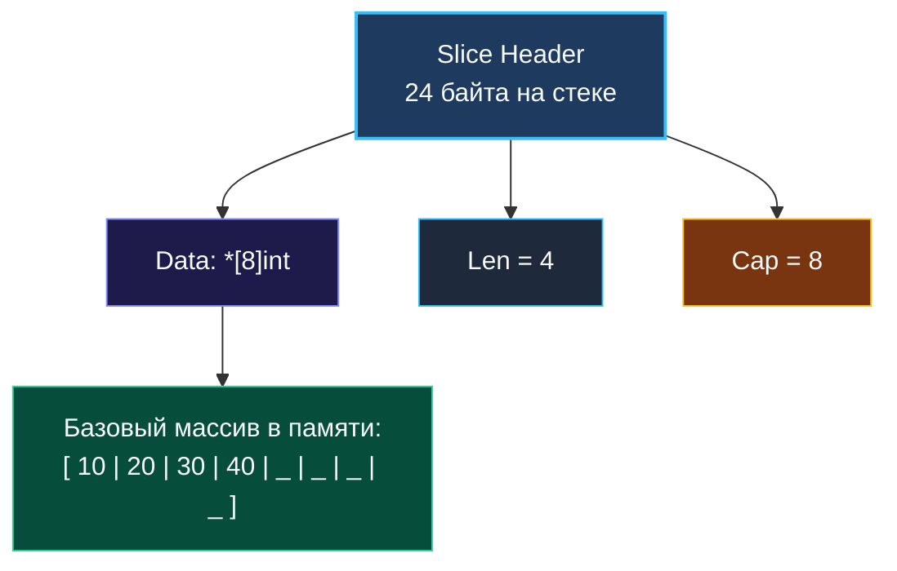
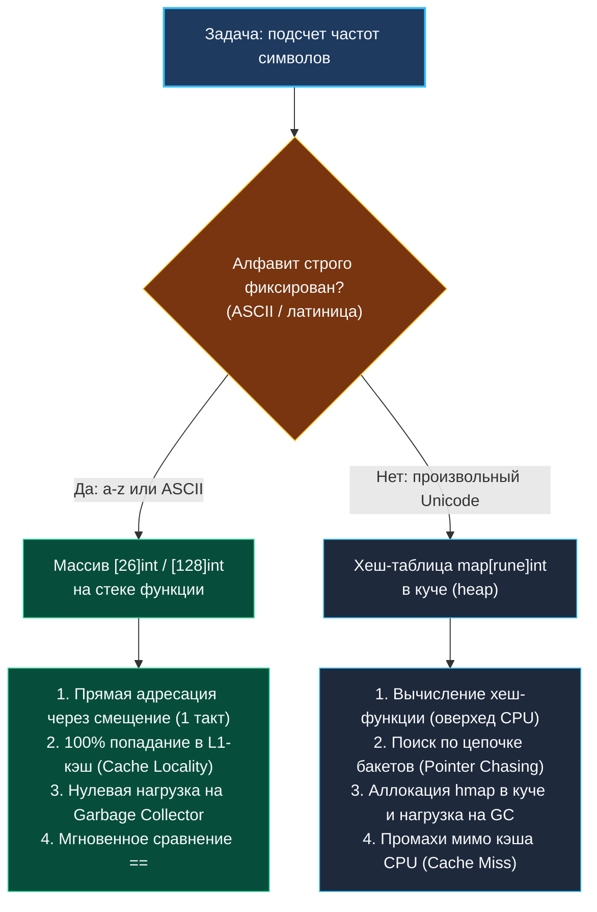

> *«Структуры данных — это скелет программы. Если кости сложены правильно, алгоритмы движутся с естественной лёгкостью и грацией».*  
> — Брайан Керниган

Массивы и строки — это фундамент, с которого начинается практически любое алгоритмическое собеседование. Однако в языке Go эти базовые сущности устроены совсем не так, как в C++, Java или Python:
- Массив в Go — это строго типизированное значение фиксированной длины, которое копируется целиком при передаче.
- Строка — это неизменяемая (`immutable`) последовательность байтов UTF-8.
- Слайс (срез) — легковесный дескриптор, динамическое «окно» в непрерывный массив памяти.

Непонимание того, как эти структуры взаимодействуют с аллокатором рантайма Go, кэш-линиями процессора и сборщиком мусора, способно превратить формально правильный алгоритм $O(N)$ в источник тяжелейших просадок производительности, фрагментации памяти и коварных паник в продакшене.

В этой главе мы систематизируем фундаментальные знания о массивах, строках и срезах в Go перед переходом к практическому разбору задач: Two Sum, 3Sum, Maximum Subarray, Product of Array Except Self и других.

---

### Массивы в Go: Железобетонный контракт памяти

В отличие от языка Си, где имя массива тривиально деградирует в указатель на его первый элемент, в Go массив — это полноценный **тип-значение (value type)**:

```go
var a [5]int
b := a    // ВНИМАНИЕ: полное побайтовое копирование 5 × 8 = 40 байт!
b[0] = 42 // a[0] по-прежнему равен 0
```

Размер массива является неотъемлемой частью его типа: `[5]int` и `[6]int` — это два абсолютно разных типа, несовместимых при присваивании. Это делает массивы неудобными для написания обобщённых функций (до появления дженериков), поэтому в прикладном коде мы оперируем срезами (`[]T`).

Однако у фиксированных массивов в Go есть две критические ниши, где Senior-разработчик обязан предпочесть именно массив:

1. **Фиксированные алфавиты и частотные словари:**  
   Если условие задачи гарантирует символы латиницы (`a-z`) или таблицу ASCII, структура `var freq [26]int` или `[128]int` идеальна. Она гарантированно размещается на стеке вызова, не порождает аллокаций в куче, даёт сверхбыстрый доступ по прямой адресации без вычисления хэшей, а два таких массива можно мгновенно сравнить между собой оператором `==` за $O(1)$ процессорных инструкций!
2. **Локальные матрицы и константные таблицы:**  
   Фиксированные размеры позволяют компилятору идеально соптимизировать машинный код, избегая лишних проверок границ (`bounds checks elimination`).

> [!INFO] Под капотом: Escape Analysis и стек
> Механизм `escape analysis` компилятора Go решает, где выделить память под переменную — на стеке или в куче (`heap`). Массив фиксированного размера, который не передается по указателю наружу и не оборачивается в интерфейс, выделяется на стеке горутины.  
> 
> Выделение памяти на стеке сводится к банальному сдвигу регистра указателя стека (`RSP`) на один такт процессора. Никаких системных вызовов, никакой фрагментации кучи и нулевая нагрузка на сборщик мусора (GC). Именно поэтому `var freq [26]int` внутри цикла работает на порядки быстрее `make(map[byte]int)`.

---

### Срезы (Slices): Умное динамическое окно

Срез в Go — это компактный 24-байтный заголовок на 64-битной архитектуре (3 машинных слова):
1. `Data unsafe.Pointer` — указатель на базовый массив;
2. `Len int` — текущее количество элементов;
3. `Cap int` — максимальная вместимость до необходимости реаллокации.

```go
type slice struct {
    array unsafe.Pointer
    len   int
    cap   int
}
```



Из этой трехкомпонентной структуры следуют фундаментальные законы работы:

#### 1. Ловушка скрытого удержания памяти (Memory Leaks via Sub-slices)
Когда вы делаете срез от гигантского массива, новый заголовок среза продолжает ссылаться на исходный базовый массив:

```go
func getHeader(hugeData []byte) []byte {
    return hugeData[:8] // ОПАСНОСТЬ: держит в памяти гигабайтный hugeData!
}
```
Пока жива маленькая ссылка на первые 8 байт, GC не имеет права освободить весь исходный массив.  
**Лечение:** Если подмассив должен жить долго, принудительно скопируйте его:
```go
res := make([]byte, 8)
copy(res, hugeData[:8])
return res
```

#### 2. Контроль емкости и цена реаллокаций
Когда встроенная функция `append` превышает текущий `cap`, рантайм выделяет новый массив большего размера (удвоение для срезов < 256 элементов и коэффициент ~1.25 далее) и копирует туда данные.  
При обработке массива на $10^5$ элементов без предварительного указания емкости произойдет более 15 скрытых реаллокаций с постоянным копированием данных в куче.  
**Правило:** Всегда пишите `make([]int, 0, expectedCapacity)`.

> [!WARNING] Ловушка `make([]int, n)` vs `make([]int, 0, n)`
> `make([]int, 5)` создает слайс длиной 5, заполненный нулями `[0, 0, 0, 0, 0]`. Последующий `append(s, 10)` добавит число 10 на **шестую** позицию, увеличив слайс до 6 элементов!  
> Если вы планируете заполнять срез через `append`, создавайте его как `make([]int, 0, 5)`.

#### 3. Идиоматичный стек и очередь на срезах
В алгоритмических задачах Go категорически не рекомендуется использовать связные списки (`container/list`). Срезы быстрее в сотни раз за счет непрерывности размещения в кэше CPU:
- **Стек (LIFO):**
  ```go
  stack = append(stack, val)           // Push
  val = stack[len(stack)-1]           // Peek
  stack = stack[:len(stack)-1]        // Pop
  ```
- **Очередь (FIFO):**
  ```go
  queue = append(queue, val)          // Enqueue
  val = queue[0]                      // Dequeue
  queue = queue[1:]                   // Сдвиг окна (O(1))
  ```

---

### Строки: Неизменяемые байтовые последовательности

Строка в Go — это структура из двух полей: указателя на неизменяемый байтовый массив и длины в байтах:

```go
type StringHeader struct {
    Data uintptr
    Len  int
}
```

Ключевые свойства строк, критичные для интервью:
1. **`len(s)` считает байты, а не символы!**  
   Для ASCII `len("hello") == 5`. Но для строки на кириллице `len("Привет") == 12`, поскольку в UTF-8 каждый русский символ кодируется 2 байтами. Если задача требует манипуляции с Unicode-символами, строку необходимо приводить к срезу рун `[]rune(s)`.
2. **Конкатенация в цикле убивает производительность:**  
   Поскольку строка неизменяема, операция `s += char` на каждой итерации выделяет новый буфер памяти и копирует туда всю накопленную строку. Сложность цикла из $N$ итераций превращается в катастрофические $O(N^2)$ по времени и аллокациям.
3. **`strings.Builder` — инструмент профессионала:**  
   Внутри `strings.Builder` накапливает данные в динамическом байтовом буфере, а метод `String()` возвращает результат без дополнительного копирования памяти.

---

### Mechanical Sympathy: Почему массив побеждает карту в 10 раз

Почему Senior Go-инженер при анализе строки выберет `[128]int`, а не `map[byte]int`, даже если Big-O для обеих структур заявляет доступ за $O(1)$?



1. **Кэш-линии CPU (64 байта):** Массив `[26]int` занимает ровно 208 байтов — это всего три кэш-линии процессора. При первом обращении аппаратный предвыборщик (`hardware prefetcher`) загружает весь массив в ультрабыстрый L1-кэш ядра.
2. **Pointer Chasing (Погоня за указателями):** Структура `hmap` хранит бакеты разрозненно в оперативной памяти. Каждый поиск ключа требует разыменования указателей, что при неблагоприятном сценарии приводит к штрафу в ~200 тактов процессора на чтение из RAM при каждом Cache Miss.
3. **Нагрузка на сборщик мусора (GC):** Миллионы короткоживущих карт создают колоссальное давление на рантайм Go, вынуждая GC чаще включать фазу Mark-Sweep и отбирать процессорные ядра у рабочих горутин.

---

### Резюме

Массивы, слайсы и строки в Go — это первоклассные инструменты системного программирования. Глубокое понимание их внутреннего устройства позволяет писать не просто формально корректный, а механически совершенный код:
- Используйте плоские массивы `[N]int` для фиксированных алфавитов.
- Предвыделяйте емкость срезов через `make([]T, 0, cap)`.
- Собирайте строки только через `strings.Builder`.
- Помните про разделение памяти при взятии подслайсов.

В следующей лекции мы детально разберем типовые алгоритмические операции и приемы, которые станут нашим главным оружием в решении задач: [[2. Типовые операции и приёмы]].