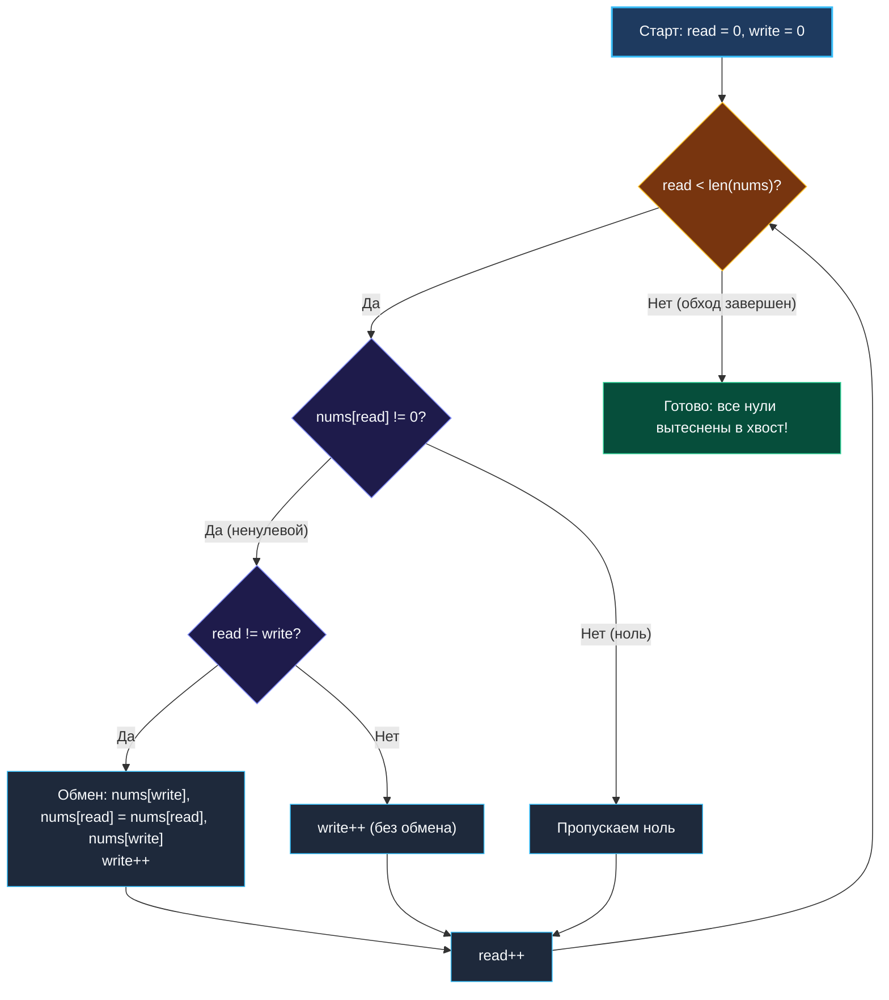

> *«Наведение порядка в массиве напоминает уборку на рабочем столе: незачем перетаскивать все вещи в соседнюю комнату, достаточно сдвинуть нужные предметы вперёд, а пустоту оставить позади».*  
> — Брайан Керниган

**LeetCode 283. Move Zeroes (Easy / Core)**

Вам дан целочисленный массив `nums`. Требуется переместить все нули в конец массива, сохранив **исходный относительный порядок** всех ненулевых элементов.  
Модификация массива должна быть выполнена строго **in-place**, без создания дополнительного массива или среза.

---

### Калибровка условий и пограничные случаи

```text
Вход:  nums = [0, 1, 0, 3, 12]
Вывод: [1, 3, 12, 0, 0]
```

> [!INTERVIEW] Вопросы интервьюеру перед реализацией
> 1. *«Что делать, если массив пуст или состоит из одного элемента?»* — Алгоритм должен завершаться без ошибок и изменений.
> 2. *«Могут ли быть отрицательные числа?»* — Да, отрицательные числа не являются нулями и их относительный порядок должен быть сохранен.
> 3. *«Какова целевая сложность по памяти?»* — Строго $O(1)$ extra space.

---

### Алгоритмический инвариант: Быстрый и медленный указатели (Fast & Slow)

Паттерн двух однонаправленных указателей:
- Указатель `read` (быстрый) инспектирует каждый элемент среза слева направо.
- Указатель `write` (медленный) указывает на позицию, куда должен встать следующий ненулевой элемент.

Если `nums[read] != 0`, мы производим обмен элементов `nums[write]` и `nums[read]`, после чего увеличиваем `write++`.  
Если в начале массива нулей нет (`read == write`), проверка `if read != write` защищает нас от пустых бессмысленных записей числа в саму себя.



---

### Идиоматичная реализация на Go

```go
package main

func moveZeroes(nums []int) {
    write := 0

    for read := 0; read < len(nums); read++ {
        if nums[read] != 0 {
            // Оптимизация: меняем только если указатели разошлись
            // (т.е. мы встретили хотя бы один ноль ранее)
            if read != write {
                nums[write], nums[read] = nums[read], nums[write]
            }
            write++
        }
    }
}
```

---

### Трассировка инварианта

Возьмем массив `[0, 1, 0, 3, 12]`:
1. `read = 0` (`val = 0`): Пропускаем. `write = 0`.
2. `read = 1` (`val = 1`): `read != write` $\to$ Меняем местами `nums[0]` и `nums[1]`.  
   Массив: `[1, 0, 0, 3, 12]`, `write` становится `1`.
3. `read = 2` (`val = 0`): Пропускаем. `write = 1`.
4. `read = 3` (`val = 3`): `read != write` $\to$ Меняем местами `nums[1]` и `nums[3]`.  
   Массив: `[1, 3, 0, 0, 12]`, `write` становится `2`.
5. `read = 4` (`val = 12`): `read != write` $\to$ Меняем местами `nums[2]` и `nums[4]`.  
   Массив: `[1, 3, 12, 0, 0]`, `write` становится `3`.

Все ненули сохранили порядок `[1, 3, 12]`, а нули оказались вытеснены вправо.

---

### Альтернатива: Два прохода (Запись + Зануление)

```go
func moveZeroesTwoPass(nums []int) {
    write := 0
    // Проход 1: сдвигаем все ненули влево
    for _, x := range nums {
        if x != 0 {
            nums[write] = x
            write++
        }
    }
    // Проход 2: зануляем оставшийся хвост
    for i := write; i < len(nums); i++ {
        nums[i] = 0
    }
}
```
Этот вариант производит меньше операций записи, если нулей очень мало, но требует двух циклов. Вариант со `swap` лаконичнее и укладывается в один проход.

---

### Mechanical Sympathy: Почему это решение летает

1. **Последовательное чтение и запись:** И `read`, и `write` движутся строго слева направо. Нет скачков памяти, кэш-линии утилизируются на 100%.
2. **Нулевые аллокации (Zero Allocations):** Функция модифицирует срез на месте, не порождая ни одного байта в куче. Давление на GC равно нулю.
3. **Параллелизм на уровне инструкций (ILP):** Процессор может конвейеризовать операции обмена без торможения шины памяти.

---

### Резюме

Move Zeroes — образцовый пример паттерна Fast & Slow pointers для фильтрации данных in-place.

В следующей лекции мы перейдем к обработке строк и поиску наибольшего общего префикса — задаче Longest Common Prefix: [[11. Longest Common Prefix]].