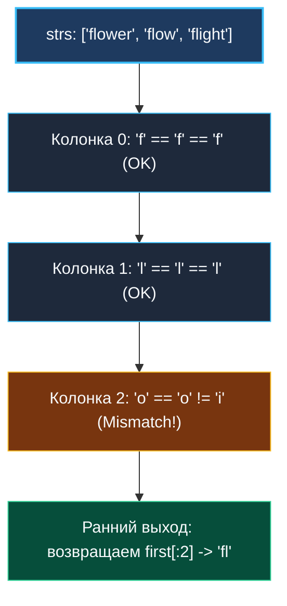
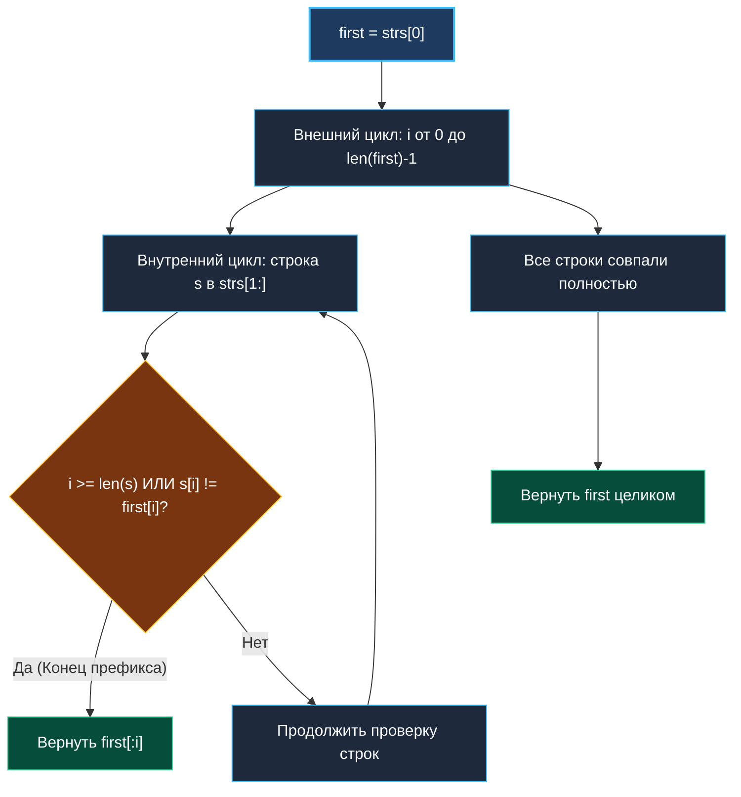

> *«Всякая хорошая программа должна быть понятна с первого взгляда, а любая сложная задача обязана сводиться к очевидной последовательности простых шагов».*  
> — Брайан Керниган

## LeetCode 14. Longest Common Prefix

**Сложность:** Easy  
**Тема:** Массивы и строки, вертикальное сканирование, иммутабельность строк в Go  
**Ссылки:** [[01. Массивы и строки/1. Теория. Массивы и строки|Теория: Массивы и строки]], [[01. Массивы и строки/2. Типовые операции и приёмы|Типовые операции и приёмы]], [[01. Массивы и строки/12. Valid Anagram|Valid Anagram]]

---

### 1. Введение и физическая интуиция

Представьте себе библиотеку или старинный архив, где на полке выставлены карточки с фамилиями авторов или инвентарными шифрами: `"flower"`, `"flow"`, `"flight"`. Архивариус скользит пальцем слева направо по всем карточкам одновременно:
- Первая колонка: у всех `'f'`? Да.
- Вторая колонка: у всех `'l'`? Да.
- Третья колонка: у первой `'o'`, у второй `'o'`, у третьей `'i'`. Стоп! Произошел рассинхрон. Общий префикс — `"fl"`.

Это и есть **вертикальное сканирование (vertical scanning)**.

Задача кажется элементарной, но именно на таких тестах проверяется зрелость инженера: понимание внутреннего устройства строк в Go (`reflect.StringHeader`), разницы между побайтовым доступом и декодированием UTF-8 рун, влияния слайсинга подстрок на Garbage Collector и умение выбрать алгоритм с оптимальным ранним выходом (early exit).



---

### 2. Формулировка задачи и вопросы интервьюеру

Дана коллекция строк `strs`. Требуется найти самую длинную непустую строку, являющуюся общим префиксом для абсолютно всех строк массива. Если общего префикса нет — вернуть пустую строку `""`.

#### Вопросы интервьюеру (Senior-стиль):
1. **Может ли массив быть пустым?**  
   *«Да, `len(strs) == 0`. В этом случае сразу возвращаем пустую строку `""`.»*
2. **Может ли одна из строк быть пустой?**  
   *«Да, если среди элементов есть `""`, максимальный общий префикс очевидно равен `""`.»*
3. **Каков алфавит?**  
   *«В стандартной задаче LeetCode гарантируются строчные латинские буквы (ASCII, a–z). Если возможен произвольный UTF-8 (эмодзи, кириллица), нам потребуется итерироваться по границам рун, а не по сырым байтам.»*
4. **Регистрозависимость?**  
   *«Да, `'A' != 'a'`.»*
5. **Каков размер входных данных?**  
   *«Обычно $N \le 200$, длина каждой строки $L \le 200$.»*

---

### 3. Разбор подходов

#### Подход 1: Попарное горизонтальное сканирование (Наивный)
Берем первую строку как базовый префикс `prefix = strs[0]`. Затем по очереди берем каждую следующую строку `s` и укорачиваем `prefix` с конца, пока `strings.HasPrefix(s, prefix)` не станет `true`.

```go
func longestCommonPrefixHorizontal(strs []string) string {
    if len(strs) == 0 {
        return ""
    }
    prefix := strs[0]
    for _, s := range strs[1:] {
        for len(prefix) > 0 && !strings.HasPrefix(s, prefix) {
            prefix = prefix[:len(prefix)-1]
        }
        if prefix == "" {
            return ""
        }
    }
    return prefix
}
```

**Минусы:**  
Если в массиве первая строка очень длинная (скажем, 100 000 символов), а последняя строка начинается с совершенно другой буквы, горизонтальный метод сделает массу холостой работы, укорачивая префикс символ за символом для промежуточных строк. В худшем случае сложность стремится к $O(N \times L^2)$.

---

#### Подход 2: Вертикальное сканирование (Оптимальное)
Смотрим на массив строк как на двумерную символьную матрицу. Берем первый элемент `strs[0]` как эталон и идем по индексам колонок `i`:
- Проверяем символ `strs[0][i]` против символов `s[i]` во всех остальных строках.
- Как только наткнулись на конец любой строки (`i == len(s)`) или несовпадение символов (`s[i] != strs[0][i]`) — мы немедленно прекращаем работу и возвращаем `strs[0][:i]`.



---

### 4. Эталонная реализация на Go

```go
package main

// LongestCommonPrefix находит наибольший общий префикс массива строк
// методом вертикального сканирования колонок.
// Временная сложность: O(S), где S — сумма символов, просмотренных до первого несовпадения.
// Пространственная сложность: O(1) вспомогательной памяти.
func LongestCommonPrefix(strs []string) string {
	if len(strs) == 0 {
		return ""
	}

	first := strs[0]

	// Идем по колонкам первой строки-эталона
	for i := 0; i < len(first); i++ {
		char := first[i]

		// Сравниваем символ char с i-м символом каждой следующей строки
		for _, s := range strs[1:] {
			// Если строка s закончилась или символ на позиции i не совпал
			if i >= len(s) || s[i] != char {
				return first[:i]
			}
		}
	}

	// Если цикл завершился штатно, значит первая строка целиком входит во все остальные
	return first
}
```

---

### 5. Пошаговая трассировка (Walkthrough)

Возьмем входной массив `strs = ["flower", "flow", "flight"]`.

| Шаг | Колонка `i` | Эталон `first[i]` | Сравнение со строками | Результат проверки |
|:---:|:---:|:---:|:---|:---|
| 1 | `0` | `'f'` | `strs[1][0] == 'f'`, `strs[2][0] == 'f'` | Все совпали |
| 2 | `1` | `'l'` | `strs[1][1] == 'l'`, `strs[2][1] == 'l'` | Все совпали |
| 3 | `2` | `'o'` | `strs[1][2] == 'o'`, но `strs[2][2] == 'i'` | **Несовпадение!** |

Срабатывает ветка `s[i] != char`. Функция немедленно возвращает `first[:2]`, то есть `"fl"`. Никакие последующие символы строк даже не загружаются в регистры процессора.

---

### 6. Mechanical Sympathy: Strings, GC и кэши процессора

1. **Срез строки `first[:i]` в Go:**  
   Строка в Go представлена 16-байтной структурой (в 64-битной архитектуре):
   ```go
   type StringHeader struct {
       Data uintptr
       Len  int
   }
   ```
   Срез строки `first[:i]` не аллоцирует новый массив байтов в куче! Он лишь создает новый заголовок, поле `Data` которого указывает на тот же неизменяемый буфер в памяти, а `Len` равно `i`.
   
   > [!CAUTION]
   > **Ловушка удержания памяти (Memory Retention Gotcha):**  
   > Если первая строка `first` имела размер 50 МБ, а общий префикс составил 3 байта, этот 3-байтный срез будет удерживать в памяти все 50 МБ исходной строки, пока жив указатель!  
   > В production-сервисе с высокими требованиями к памяти безопаснее сделать явное клонирование:
   > ```go
   > strings.Clone(first[:i]) // Go 1.20+
   > ```

2. **Кэш-локальность и Branch Predictor:**  
   Вертикальное сканирование прыгает по разным строкам на одном и том же смещении `i`. Однако при малом числе строк $N$ указатели на заголовки и первые кэш-линии строк отлично помещаются в L1/L2 кэш данных (L1d).

---

### 7. Работа с Unicode: когда сырых байт недостаточно

Если в ТЗ указано, что строки содержат произвольный UTF-8 (например, кириллицу или китайские иероглифы):

```go
func longestCommonPrefixUnicode(strs []string) string {
    if len(strs) == 0 {
        return ""
    }
    
    firstRunes := []rune(strs[0])
    for i, r := range firstRunes {
        for _, s := range strs[1:] {
            sRunes := []rune(s)
            if i >= len(sRunes) || sRunes[i] != r {
                return string(firstRunes[:i])
            }
        }
    }
    return strs[0]
}
```
*Замечание для интервьюера:* Конвертация `[]rune(s)` требует $O(L)$ времени и аллокации памяти в куче под массив `int32`. Для ASCII-диапазона побайтовое сканирование в разы быстрее и не требует аллокаций.

---

### 8. Вопросы для собеседования

> [!INTERVIEW]
> **Вопрос:** Чем вертикальное сканирование выгоднее горизонтального на практике?  
> **Ответ:** Вертикальное сканирование обладает наилучшим ранним выходом (early exit). Если в массиве из 10 000 строк последняя строка отличается первым же символом (например, `"zebra"` при остальных `"alpha..."`), вертикальный алгоритм сделает ровно $N$ побайтовых сравнений и завершится. Горизонтальный алгоритм потратит время на попарное сопоставление всех 9 999 предыдущих строк.

> [!TIP]
> **Вопрос:** Можно ли применить бинарный поиск или алгоритм «Разделяй и властвуй» (Divide and Conquer)?  
> **Ответ:** Да.  
> 1. *Divide and Conquer:* рекурсивно делим массив строк пополам, находим LCP левой и правой половин, затем LCP двух результатов. Время $O(S)$, глубина стека $O(\log N)$.  
> 2. *Binary Search по длине:* находим минимальную длину строки $minLen$. Делаем бинарный поиск `mid` в диапазоне $[0, minLen]$, проверяя префикс длины `mid` на совпадение со всеми строками. Время $O(S \log(minLen))$.  
> Однако вертикальное сканирование проще в реализации, имеет константную память $O(1)$ и в среднем отрабатывает гораздо быстрее за счет раннего выхода.

---

### 9. Инварианты и чек-лист самопроверки

- [x] **Пустой массив:** проверка `len(strs) == 0` предотвращает панику выхода за границы среза.
- [x] **Массив из одного элемента:** цикл по `strs[1:]` не выполнится, вернется вся строка `first`.
- [x] **Пустая строка в середине:** проверка `i >= len(s)` сработает на шаге `i = 0` и безопасно вернет `""`.
- [x] **Zero Allocations:** для ASCII алгоритм не выполняет ни единой аллокации в куче (`0 B/op`).