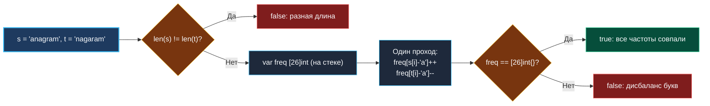

> *«Выбор правильного представления данных — это половина победы в любой программистской задаче».*  
> — Фредерик Брукс

## LeetCode 242. Valid Anagram

**Сложность:** Easy  
**Тема:** Массивы и строки, частотный анализ (Frequency Counter), структуры данных фиксированного размера  
**Ссылки:** [[01. Массивы и строки/1. Теория. Массивы и строки|Теория: Массивы и строки]], [[01. Массивы и строки/2. Типовые операции и приёмы|Типовые операции и приёмы]], [[02. Два указателя/1. Теория. Два указателя|Теория: Два указателя]]

---

### 1. Введение и физическая интуиция

Анаграмма — это игра букв, в которой одно слово превращается в другое простым перемешиванием символов: *"listen"* и *"silent"*, *"nagaram"* и *"anagram"*. Никакие буквы не теряются и не появляются из ниоткуда.

Представьте себе складского кладовщика с ящиком на 26 отсеков — по числу букв английского алфавита. Когда кладовщик читает строку `s`, он раскладывает по ячейкам деревянные фишки: буква `'a'` — плюс фишка в отсек №0, буква `'b'` — плюс фишка в отсек №1. Читая строку `t`, он забирает фишки из тех же ячеек. Если в конце все 26 ячеек оказались абсолютно пустыми (баланс ровно ноль) — перед нами безупречная анаграмма!

Задача формулируется элементарно, но на собеседовании Senior Go-разработчик демонстрирует глубокий инженерный кругозор:
- Почему выделять `map[rune]int` для ASCII — это архитектурная ошибка и неоправданная нагрузка на Garbage Collector?
- Как массив фиксированного размера `[26]int` на стеке обеспечивает нулевые аллокации (`0 B/op`) и умещается в единичную кэш-линию CPU?
- Как устроен оператор сравнения массивов `freq == [26]int{}` в рантайме Go?



---

### 2. Формулировка задачи и вопросы интервьюеру

Даны две строки `s` и `t`. Необходимо вернуть `true`, если `t` является анаграммой `s`, и `false` в противном случае.

#### Вопросы интервьюеру (Senior-стиль):
1. **Каков алфавит входных строк?**  
   *«Только строчные латинские буквы a–z? Если да, то диапазон ограничен 26 значениями, что позволяет использовать статический массив на стеке. Если допускается произвольный Unicode, мы обязаны использовать `map[rune]int` или динамическую таблицу.»*
2. **Имеет ли значение регистр символов?**  
   *«Да, `'A' != 'a'`. В стандартной постановке LeetCode все символы строчные.»*
3. **Могут ли строки содержать пробелы или знаки препинания?**  
   *«Нет, только буквы. Если бы были пробелы, потребовалась бы предварительная фильтрация.»*
4. **Что возвращать, если обе строки пустые?**  
   *«Две пустые строки состоят из одинакового (нулевого) набора символов — возвращаем `true`.»*

---

### 3. Разбор подходов

#### Подход 1: Сортировка байтов (Наивный)
Две строки являются анаграммами тогда и только тогда, когда их отсортированные представления посимвольно равны.

```go
import "slices"

func isAnagramSort(s string, t string) bool {
    if len(s) != len(t) {
        return false
    }
    sBytes := []byte(s)
    tBytes := []byte(t)
    
    // В современном Go (1.21+) используем быстрый slices.Sort
    slices.Sort(sBytes)
    slices.Sort(tBytes)
    
    return string(sBytes) == string(tBytes)
}
```

**Оценка:**
- **Время:** $O(N \log N)$ из-за сортировки (pdqsort в стандартной библиотеке Go).
- **Память:** $O(N)$ дополнительной памяти — срезы `[]byte(s)` и `[]byte(t)` копируют строку в кучу.
- **Вердикт:** Работает, но на позицию Senior недопустимо предлагать $O(N \log N)$ с аллокациями там, где задача решается за $O(N)$ со строгим $O(1)$ по памяти.

---

#### Подход 2: Частотный массив фиксированного размера (Оптимальный)

Поскольку в ASCII алфавите a–z ровно 26 букв, мы выделяем массив `[26]int`.  
Индекс буквы вычисляется тривиальной арифметикой: `char - 'a'`.

**Инвариант алгоритма:**  
Если длины строк равны (`len(s) == len(t)`), то за один совместный проход мы прибавляем 1 за букву из `s` и вычитаем 1 за букву из `t`. В конце проверяем, равен ли массив нулевому массиву.

---

### 4. Эталонная реализация на Go

```go
package main

// IsAnagram проверяет, является ли строка t анаграммой строки s.
// Временная сложность: O(N), где N — длина строки.
// Пространственная сложность: O(1) памяти (208 байт на стеке, 0 аллокаций в куче).
func IsAnagram(s string, t string) bool {
	// Если длины не совпадают, анаграмма невозможна в принципе — O(1) ранний выход
	if len(s) != len(t) {
		return false
	}

	// Массив из 26 int гарантированно размещается на стеке
	var freq [26]int

	// Совместный проход: строим баланс символов
	for i := 0; i < len(s); i++ {
		freq[s[i]-'a']++
		freq[t[i]-'a']--
	}

	// В Go массивы фиксированной длины являются value-типами!
	// Сравнение freq == [26]int{} компилируется напрямую в memequal:
	// побайтовое сравнение 208 байт памяти за считанные такты CPU.
	return freq == [26]int{}
}
```

---

### 5. Пошаговая трассировка (Walkthrough)

Рассмотрим `s = "anagram"`, `t = "nagaram"`:
- Длины: `len(s) == 7`, `len(t) == 7` — проверка пройдена.
- Итерации:
  1. `i = 0`: `s[0] = 'a'` (`freq[0]++`), `t[0] = 'n'` (`freq[13]--`)
  2. `i = 1`: `s[1] = 'n'` (`freq[13]++`), `t[1] = 'a'` (`freq[0]--`)
  3. `i = 2`: `s[2] = 'a'` (`freq[0]++`), `t[2] = 'g'` (`freq[6]--`)
  4. `i = 3`: `s[3] = 'g'` (`freq[6]++`), `t[3] = 'a'` (`freq[0]--`)
  5. `i = 4`: `s[4] = 'a'` (`freq[0]++`), `t[4] = 'r'` (`freq[17]--`)
  6. `i = 5`: `s[5] = 'r'` (`freq[17]++`), `t[5] = 'a'` (`freq[0]--`)
  7. `i = 6`: `s[6] = 'm'` (`freq[12]++`), `t[6] = 'm'` (`freq[12]--`)
- Итог: все ячейки `freq` равны 0. Сравнение `freq == [26]int{}` возвращает `true`.

---

### 6. Mechanical Sympathy: почему массив бьет map в десятки раз

| Характеристика | `var freq [26]int` | `freq := make(map[rune]int)` |
|:---|:---|:---|
| **Размещение в памяти** | Стек (Stack) — Escape Analysis оставляет его в кадре функции | Куча (Heap) — runtime-структура `hmap` и бакеты |
| **Аллокации** | **0 B/op, 0 allocs/op** | 48–1024 B/op в зависимости от числа элементов |
| **Доступ к элементу** | 1 инструкция ассемблера `LEA`/`MOV` ($1$ такт) | Вызов `runtime.mapassign`, вычисление хэша, поиск бакета (~$30\text{--}50$ тактов) |
| **L1d Cache Locality** | Массив занимает 208 байт — целиком умещается в 4 кэш-линии (по 64 байта) | Разрозненные указатели на бакеты, неизбежные Cache Misses |
| **Нагрузка на GC** | Нулевая (стек очищается сдвигом указателя RSP) | GC обязан сканировать бакеты мапы во время Mark Phase |

```
Стековый массив [26]int в памяти (208 байт):
+--------+--------+--------+--------+--------+--------+-----+--------+
|   a    |   b    |   c    |   d    |   e    |   f    | ... |   z    |
| (8 B)  | (8 B)  | (8 B)  | (8 B)  | (8 B)  | (8 B)  |     | (8 B)  |
+--------+--------+--------+--------+--------+--------+-----+--------+
  ^
  |-- Умещается в 4 кэш-линии по 64 байта (горячий L1d кэш!)
```

---

### 7. Расширение для произвольного Unicode (Follow-up)

Что делать, если интервьюер спрашивает: *«А что, если строки содержат произвольные символы Unicode (китайские иероглифы, эмодзи, кириллицу)?»*

В этом случае размер алфавита потенциально равен $2^{21}$ кодовых точек, и статический массив не подойдет. Используем хэш-таблицу рун:

```go
func isAnagramUnicode(s string, t string) bool {
    // Внимание: для Unicode len() возвращает число байт, а не символов!
    // Однако если суммарное байтовое представление разное, анаграмма невозможна:
    if len(s) != len(t) {
        return false
    }

    counts := make(map[rune]int)

    for _, r := range s {
        counts[r]++
    }

    for _, r := range t {
        counts[r]--
        if counts[r] < 0 {
            // Ранний выход: символов r в строке t оказалось больше, чем в s
            return false
        }
    }

    // Если все counts[r] >= 0 и длины равны, то все значения гарантированно равны 0
    return true
}
```

> [!TIP]
> Обратите внимание на оптимизацию раннего выхода: если при декременте счетчик уходит в отрицательную область (`counts[r] < 0`), мы немедленно прерываемся и возвращаем `false`, не обходя мапу повторно!

---

### 8. Вопросы для собеседования

> [!INTERVIEW]
> **Вопрос:** Как в Go работает выражение `freq == [26]int{}`? Разве массивы можно сравнивать через `==`?  
> **Ответ:** Да! В языке Go массивы (в отличие от срезов `[]int`) являются полноправными типами-значениями (value types). Оператор `==` для массивов определен спецификацией языка: он выполняет поэлементное сравнение. Компилятор Go оптимизирует сравнение массивов тривиальных типов в единый вызов ассемблерной функции `runtime.memequal` (или векторные инструкции AVX/SSE), которая побайтово сравнивает блок памяти за считанные такты.

> [!NOTE]
> **Вопрос:** Почему мы не использовали тип `[26]int8` или `[26]int16` для еще большей экономии памяти?  
> **Ответ:** Тип `[26]int8` занял бы всего 26 байт. Однако:
> 1. Если длина строки превысит 127 символов, счетчик переполнится (`overflow`).
> 2. На 64-битных процессорах x86-64 и ARM64 работа с 64-битными машинными словами (`int`) является нативной и часто выполняется быстрее или так же быстро, как с байтами, благодаря отсутствию необходимости маскирования старших разрядов регистров.

---

### 9. Инварианты и чек-лист самопроверки

- [x] **Проверка длин строк в самом начале:** отсекает несовпадающие строки за $O(1)$ времени до входа в цикл.
- [x] **Один совместный проход:** строки `s` и `t` обходятся параллельно за один цикл от `0` до `len(s)-1`.
- [x] **Zero Allocations:** массив `[26]int` располагается строго на стеке.
- [x] **Проверка алфавита:** вычитание байта `'a'` безопасно работает для всех строчных латинских символов.

На этом мы ставим точку в первом кластере **«Массивы и строки»**. Мы заложили прочный фундамент: освоили префиксные суммы, частотные массивы, технику скользящего сканирования и научились дружить с рантаймом Go.

Следующий шаг — специализированный кластер **«Два указателя»**, где встречные и параллельные указатели позволят нам сворачивать квадратичные переборы в элегантные линейные алгоритмы: [[02. Два указателя/1. Теория. Два указателя|1. Теория. Два указателя]].