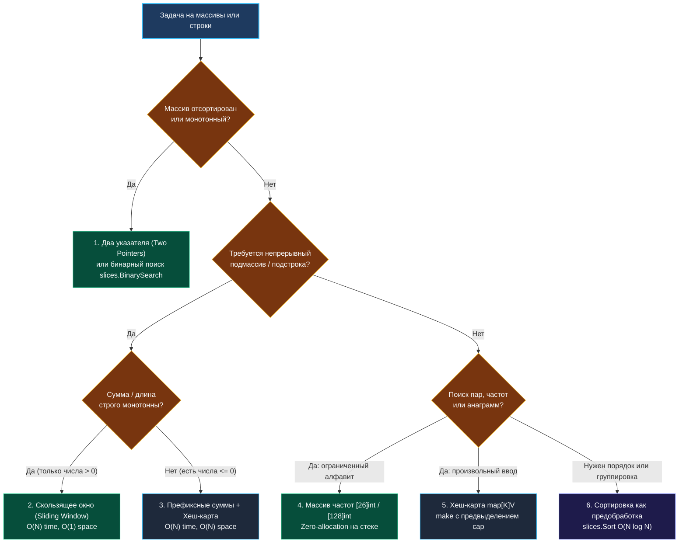

> *«Мастерство инженера проявляется не в изощрённости редких трюков, а в безупречном и точном владении базовым арсеналом инструментов».*  
> — Брайан Керниган

Теоретический фундамент из лекции [[1. Теория. Массивы и строки]] раскрыл нам механику работы заголовка среза (`SliceHeader`), аллокаций в куче и неизменяемости строк. Но на реальном техническом собеседовании знание низкоуровневых структур — это лишь половина победы. Вторая половина — это умение мгновенно распознать математическую природу задачи и применить подходящий алгоритмический паттерн.

В этой главе мы систематизируем **семь фундаментальных операционных приёмов**, которые покрывают свыше 90% задач на массивы и строки. Для каждого приёма мы разберём идиоматичную реализацию на Go, пошаговую физическую модель взаимодействия с памятью процессора и типичные подводные камни.

---

### Карта выбора алгоритмического приёма



---

### Приём 1: Два указателя (Two Pointers)

Один из самых мощных приёмов с асимптотикой $O(N)$ по времени и строгим $O(1)$ по дополнительной памяти.

#### 1. Встречные указатели (Opposite Direction)
Применяется на отсортированных массивах и палиндромах. Левый указатель (`left = 0`) и правый (`right = len-1`) движутся навстречу друг другу. На каждом шаге мы отсекаем заведомо неподходящее подмножество:

```go
func twoSumSorted(numbers []int, target int) []int {
    left, right := 0, len(numbers)-1
    for left < right {
        sum := numbers[left] + numbers[right]
        switch {
        case sum == target:
            return []int{left + 1, right + 1}
        case sum < target:
            left++ // Увеличиваем сумму сдвигом левого края
        default:
            right-- // Уменьшаем сумму сдвигом правого края
        }
    }
    return nil
}
```

#### 2. Быстрый и медленный указатели (Fast & Slow / In-place Mutation)
Используется для фильтрации данных без аллокации дополнительного массива. Медленный указатель (`write`) фиксирует границу валидных данных, а быстрый (`read`) сканирует входной срез:

```go
func moveZeroes(nums []int) {
    write := 0
    for read := 0; read < len(nums); read++ {
        if nums[read] != 0 {
            nums[write], nums[read] = nums[read], nums[write]
            write++
        }
    }
}
```

**Mechanical Sympathy:** Доступ к элементам строго последовательный. Процессорный блок `prefetcher` идеально предсказывает адреса, загружая кэш-линии L1/L2 наперёд, что обеспечивает максимальную скорость шины памяти.

---

### Приём 2: Скользящее окно (Sliding Window)

Паттерн для поиска оптимального непрерывного подмассива или подстроки. Окно задается полуинтервалом `[left, right)`: правый указатель монотонно расширяет окно, а левый сжимает его, как только инвариант нарушается.

```go
func minSubArrayLen(target int, nums []int) int {
    left, sum, minLen := 0, 0, math.MaxInt
    
    for right := 0; right < len(nums); right++ {
        sum += nums[right] // Расширяем окно вправо
        
        for sum >= target { // Сжимаем окно слева при выполнении условия
            curLen := right - left + 1
            if curLen < minLen {
                minLen = curLen
            }
            sum -= nums[left]
            left++
        }
    }
    
    if minLen == math.MaxInt {
        return 0
    }
    return minLen
}
```

> [!WARNING] Критическое ограничение скользящего окна
> Скользящее окно применимо **только при монотонности метрики**! Если массив содержит отрицательные числа, добавление элемента может как увеличить, так и уменьшить сумму окна. В этом случае скользящее окно бессильно — необходимо переходить к префиксным суммам.

---

### Приём 3: Префиксные суммы (Prefix Sums)

Позволяет за $O(1)$ получать сумму на любом произвольном подотрезке `[L, R]`.  
Формула: $\text{Sum}(L, R) = \text{Prefix}[R+1] - \text{Prefix}[L]$.

```go
nums := []int{10, 20, 30, 40}
pref := make([]int, len(nums)+1)
for i, v := range nums {
    pref[i+1] = pref[i] + v
}
// Сумма элементов nums[1..2] (20 + 30 = 50)
rangeSum := pref[3] - pref[1] // 60 - 10 = 50
```

#### Тандем с хеш-картой: Количество подмассивов с суммой K (LeetCode 560)
Если в массиве есть отрицательные числа, мы ищем отрезок, где $\text{Prefix}[R] - \text{Prefix}[L] = K$, что эквивалентно $\text{Prefix}[L] = \text{Prefix}[R] - K$:

```go
func subarraySum(nums []int, k int) int {
    count, currentSum := 0, 0
    // Базовый случай: префиксная сумма 0 встретилась 1 раз до начала массива
    seen := make(map[int]int, len(nums))
    seen[0] = 1

    for _, x := range nums {
        currentSum += x
        count += seen[currentSum-k]
        seen[currentSum]++
    }

    return count
}
```

---

### Приём 4: Частотный словарь — Массив против Map

В задачах на анаграммы, изоморфизм строк и подсчёт частот выбор типа структуры данных определяет производительность:

```go
// ИДЕАЛЬНО (ASCII / Латиница): zero allocation, стек, мгновенное сравнение ==
func isAnagram(s, t string) bool {
    if len(s) != len(t) {
        return false
    }
    var counts [26]int
    for i := 0; i < len(s); i++ {
        counts[s[i]-'a']++
        counts[t[i]-'a']--
    }
    return counts == [26]int{}
}
```

Если же алфавит произвольный (Unicode), используем `map[rune]int`, обязательно предвыделяя емкость:
```go
counts := make(map[rune]int, len(s))
```

---

### Приём 5: In-Place развороты и циклический сдвиг

Многие задачи требуют трансформации среза без выделения дополнительной памяти. Базовым кирпичиком выступает разворот диапазона:

```go
func reverse(s []int) {
    for i, j := 0, len(s)-1; i < j; i, j = i+1, j-1 {
        s[i], s[j] = s[j], s[i]
    }
}
```

**Алгоритм трех разворотов для циклического сдвига массива на $K$ позиций вправо (Rotate Array):**
1. Развернуть весь массив целиком;
2. Развернуть первые $K$ элементов;
3. Развернуть оставшиеся $N - K$ элементов.

Сложность: строго $O(N)$ по времени и $O(1)$ по памяти!

---

### Приём 6: Современная сортировка (`slices.Sort` Go 1.21+)

Сортировка часто превращает запутанную задачу в элементарную. Начиная с Go 1.21, вместо устаревшего `sort.Slice` следует использовать оптимизированный дженерик-пакет `slices`:

```go
import "slices"

nums := []int{5, 2, 6, 3, 1, 4}
slices.Sort(nums) // In-place pdqsort за O(N log N), zero-allocation!

// Бинарный поиск в отсортированном срезе:
idx, found := slices.BinarySearch(nums, 3)
```

---

### Резюме

Семь базовых приёмов — два указателя, скользящее окно, префиксные суммы, частотный массив, in-place развороты, предварительная сортировка и сборка через `strings.Builder` — образуют универсальный арсенал бэкенд-инженера. 

В следующей статье мы применим эти навыки к разбору классической задачи, с которой начинается путь любого разработчика на LeetCode: [[3. Two Sum]].