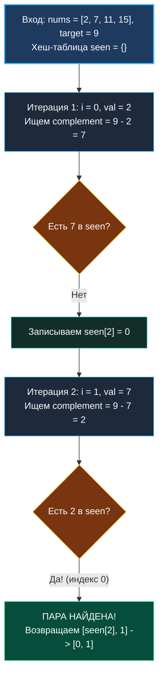

> *«Прежде чем бросаться складывать числа в слепом двойном цикле, спросите себя: нельзя ли один раз запомнить увиденное, чтобы мгновенно узнавать нужное?»*  
> — Брайан Керниган

С этой классической задачи начинается путь каждого инженера на платформах вроде LeetCode. На первый взгляд Two Sum тривиальна. Однако на реальном техническом собеседовании уровня Senior она выступает превосходным лакмусовым тестом:
- Насколько быстро кандидат переходит от наивного перебора к оптимальному обмену памяти на время?
- Задает ли он вопросы об ограничениях и типах до написания кода?
- Понимает ли он физику работы хэш-таблицы в рантайме Go (бакеты, pointer chasing, GC)?
- Пишет ли он идиоматичный код с предвыделением емкости и защитой от дублирования ключа?

---

### Формулировка задачи и калибровка требований

**LeetCode 1. Two Sum (Easy / Core)**

Дан массив целых чисел `nums` и целевое число `target`. Необходимо вернуть индексы двух чисел, сумма которых в точности равна `target`.

**Ограничения и гарантии:**
- Гарантируется, что существует ровно одно валидное решение.
- Запрещено использовать один и тот же элемент по одному и тому же индексу дважды.
- Порядок возвращаемых индексов в ответе не имеет значения.

**Пример:**
```text
Вход:  nums = [2, 7, 11, 15], target = 9
Вывод: [0, 1]
Объяснение: nums[0] + nums[1] == 2 + 7 == 9
```

> [!INTERVIEW] Что спросить у интервьюера перед кодом
> 1. *«Могут ли входные числа и target быть отрицательными или нулями?»* — Да, алгоритм обязан работать со всем диапазоном `int`.
> 2. *«Могут ли в массиве присутствовать дубликаты?»* — Да (например, `[3, 3]`, `target = 6`).
> 3. *«Каков максимальный размер массива $N$?»* — $N \le 10^5$. Это исключает квадратичные решения $O(N^2)$.
> 4. *«Что возвращать, если пара не найдена вопреки условию?»* — Идиоматичный `nil`.

---

### Визуальный Walk-Through: Как работает однопроходная хеш-карта

Бытовая аналогия: представьте, что вы организуете танцевальный вечер. Вместо того чтобы при входе каждого нового гостя заставлять его обходить весь зал и опрашивать всех присутствующих ($O(N^2)$), вы ставите на входе администратора с амбарной книгой.  
Каждый гость говорит, кто ему нужен в пару (`target - x`). Если нужного человека в книге нет, гость оставляет своё имя и номер столика в книге и проходит в зал ($O(1)$).



---

### Наивное решение: Квадратичный брутфорс

Прямой перебор всех возможных неупорядоченных пар индексов $(i, j)$ с проверкой суммы.

```go
func twoSumBrute(nums []int, target int) []int {
    n := len(nums)
    for i := 0; i < n-1; i++ {
        for j := i + 1; j < n; j++ {
            if nums[i]+nums[j] == target {
                return []int{i, j}
            }
        }
    }
    return nil
}
```

- **Время:** $O(N^2)$ — $\frac{N(N-1)}{2}$ сравнений. При $N = 10^5$ это $5 \cdot 10^9$ операций, что гарантирует `Time Limit Exceeded` (TLE).
- **Память:** $O(1)$ — дополнительная память не расходуется.

---

### Оптимальное решение: Однопроходная хеш-карта за O(N)

Мы обходим массив один раз слева направо. Для каждого числа вычисляем необходимое дополнение `complement = target - v`. Если дополнение уже лежит в карте `seen`, мы немедленно возвращаем пару индексов. Если нет — заносим текущее число и его индекс в карту.

```go
func twoSum(nums []int, target int) []int {
    // Предварительно выделяем емкость карты, чтобы избежать эвакуаций бакетов
    seen := make(map[int]int, len(nums))

    for i, v := range nums {
        complement := target - v
        if j, ok := seen[complement]; ok {
            return []int{j, i}
        }
        seen[v] = i
    }

    return nil
}
```

> [!WARNING] Критическая ловушка последовательности операций
> Запись `seen[v] = i` обязана происходить **строго после** проверки `if j, ok := seen[complement]`.  
> Если сначала записать `seen[v] = i`, то при `nums = [3, 2, 4]`, `target = 6` на первой же итерации для числа 3 дополнение будет $6 - 3 = 3$. Карта найдет само число 3 по его собственному индексу 0 и ошибочно вернет `[0, 0]`, нарушив условие «один и тот же элемент нельзя использовать дважды».

---

### Mechanical Sympathy: Что происходит в рантайме Go

Почему Senior-инженер на собеседовании обратит внимание на `make(map[int]int, len(nums))`?

1. **Строение `runtime.hmap`:** Хеш-таблица в Go состоит из массива бакетов (`bmap`), каждый из которых вмещает до 8 пар ключ-значение.
2. **Стоимость эвакуации (Evacuation Overhead):** Если карта создается без емкости (`seen := make(map[int]int)`), при факторе загрузки $\approx 6.5$ рантайм вынужден выделять в куче массив бакетов удвоенного размера и переносить (эвакуировать) все существующие ключи. Для 100 000 элементов это вызовет более 10 дорогостоящих аллокаций.
3. **Кэш-линии и Pointer Chasing:** Поиск в `map` требует вычисления хэша, взятия смещения бакета и возможного перехода по указателю `overflow`. Это сопровождается промахами мимо кэша L1/L2. Однако выигрыш по асимптотике с $O(N^2)$ до $O(N)$ перевешивает этот микрооверхед в тысячи раз.

---

### Анализ пограничных случаев (Edge Cases)

- **Массив из двух элементов:** `nums = [3, 3], target = 6` $\to$ на первой итерации `seen[3] = 0`, на второй находится пара `[0, 1]`.
- **Отрицательные числа:** `nums = [-3, 4, 3, 90], target = 0` $\to$ для -3 ищется complement $0 - (-3) = 3$. Работает безупречно.
- **Один элемент или пустой слайс:** Цикл завершится без паники, функция вернет идиоматичный `nil`.

---

### Итоги и асимптотика

| Параметр | Наивное решение | Однопроходный Map |
|---|:---:|:---:|
| **Время ($T$)** | $O(N^2)$ | **$O(N)$** |
| **Память ($M$)** | **$O(1)$** | $O(N)$ |
| **Аллокации в куче** | 0 | 1 (при вызове `make` с cap) |

Two Sum блестяще демонстрирует силу классического размена памяти на время (Time-Memory Trade-off).

В следующей задаче мы поднимем планку сложности: когда элементов для суммы требуется уже не два, а три, простой хеш-карты становится недостаточно, и на сцену выходит предварительная сортировка в сочетании с двумя встречными указателями: [[4. Three Sum]].