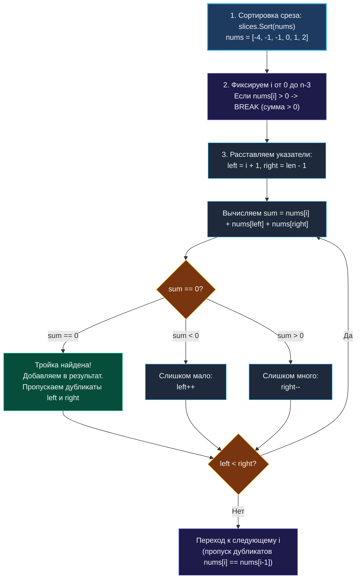

> *«Усложнение задачи лишь на один шаг часто требует полной смены парадигмы: там, где не справляется грубая память хеш-таблицы, побеждает строгий порядок сортировки и геометрия встречных указателей».*  
> — Брайан Керниган

**LeetCode 15. 3Sum (Medium / Core)**

Дан целочисленный массив `nums`. Необходимо найти все уникальные тройки элементов `[nums[i], nums[j], nums[k]]`, такие что:
$$nums[i] + nums[j] + nums[k] = 0$$
Индексы $i, j, k$ должны быть попарно различны ($i \ne j, i \ne k, j \ne k$), а итоговый набор троек **не должен содержать дубликатов**.

Эта задача — естественная эволюция Two Sum ([[3. Two Sum]]). Однако добавление всего одного слагаемого кардинально меняет правила игры:
- Попытка использовать `map` упирается в необходимость громоздкой дедупликации троек и огромный расход памяти.
- Оптимальным становится алгоритм с предварительной сортировкой и техникой двух встречных указателей ([[2. Типовые операции и приёмы]]).

---

### Формулировка и уточнения требований

**Пример:**
```text
Вход:  nums = [-1, 0, 1, 2, -1, -4]
Вывод: [[-1, -1, 2], [-1, 0, 1]]
Объяснение: 
nums[0] + nums[1] + nums[2] = (-1) + 0 + 1 = 0
nums[4] + nums[0] + nums[3] = (-1) + (-1) + 2 = 0
Дублирующиеся комбинации исключены.
```

> [!INTERVIEW] Вопросы интервьюеру на этапе калибровки
> 1. *«Может ли массив содержать менее 3 элементов?»* — Да, в таком случае троек быть не может, возвращаем пустой срез.
> 2. *«Допустима ли модификация (сортировка) исходного среза на месте (in-place)?»* — Да. Если бы массив было запрещено мутировать, мы бы сделали его копию через `copy(make([]int, len(nums)), nums)`.
> 3. *«В каком формате возвращать результат при отсутствии решений?»* — В Go идиоматично возвращать пустой срез `[][]int{}`, который при сериализации в JSON превращается в `[]`, а не в `null`.

---

### Визуальный Walk-Through: Сортировка + Два встречных указателя

Бытовая модель: представьте весы с чашами. Мы сортируем массив от меньшего к большему. Фиксируем первый гирьку `i`. Теперь нам нужно уравновесить её двумя другими гирьками `j` (самая легкая из оставшихся, слева) и `k` (самая тяжелая, справа).  
Если сумма слишком мала — сдвигаем `j` вправо (берем потяжелее). Если слишком велика — сдвигаем `k` влево (берем полегче).



---

### Наивное решение: Кубический брутфорс $O(N^3)$

```go
func threeSumBrute(nums []int) [][]int {
    n := len(nums)
    var res [][]int
    // Без сортировки сложно отсеять дубликаты троек
    slices.Sort(nums) 

    for i := 0; i < n-2; i++ {
        if i > 0 && nums[i] == nums[i-1] { continue }
        for j := i + 1; j < n-1; j++ {
            if j > i+1 && nums[j] == nums[j-1] { continue }
            for k := j + 1; k < n; k++ {
                if k > j+1 && nums[k] == nums[k-1] { continue }
                if nums[i]+nums[j]+nums[k] == 0 {
                    res = append(res, []int{nums[i], nums[j], nums[k]})
                }
            }
        }
    }
    return res
}
```
При $N = 3000$ это около $4.5 \cdot 10^9$ итераций, гарантированный `Time Limit Exceeded`.

---

### Оптимальное решение: $O(N^2)$ без дополнительной памяти

```go
package main

import (
    "slices"
)

func threeSum(nums []int) [][]int {
    n := len(nums)
    if n < 3 {
        return [][]int{}
    }

    // Сортировка на месте за O(N log N)
    slices.Sort(nums)

    res := make([][]int, 0)

    for i := 0; i < n-2; i++ {
        // Досрочный выход: если наименьшее число тройки > 0, сумма 0 невозможна
        if nums[i] > 0 {
            break
        }

        // Пропуск дубликатов первого элемента тройки
        if i > 0 && nums[i] == nums[i-1] {
            continue
        }

        target := -nums[i]
        left, right := i+1, n-1

        for left < right {
            sum := nums[left] + nums[right]
            switch {
            case sum == target:
                res = append(res, []int{nums[i], nums[left], nums[right]})

                // Пропускаем дубликаты второго элемента
                for left < right && nums[left] == nums[left+1] {
                    left++
                }
                // Пропускаем дубликаты третьего элемента
                for left < right && nums[right] == nums[right-1] {
                    right--
                }

                left++
                right--
            case sum < target:
                left++
            default:
                right--
            }
        }
    }

    return res
}
```

> [!WARNING] Критическая ловушка пропуска дубликатов
> Обратите внимание на условие пропуска дубликатов первого элемента:  
> `if i > 0 && nums[i] == nums[i-1] { continue }` — это ПРАВИЛЬНО.  
> Если бы мы написали `if nums[i] == nums[i+1]`, мы бы преждевременно пропустили валидную тройку `[-1, -1, 2]`, где одинаковые числа находятся на позициях $i$ и $left$!

---

### Mechanical Sympathy: Архитектура кэша и память

1. **In-place сортировка:** `slices.Sort` (начиная с Go 1.21) использует алгоритм pdqsort (Pattern-Defeating Quicksort). Он работает непосредственно в базовом массиве среза, не требуя аллокаций памяти в куче.
2. **Линейное сканирование (Hardware Prefetching):** Внутренний цикл с указателями `left` и `right` перемещается строго последовательно по непрерывной памяти. Процессорные кэш-линии (64 байта) утилизируются на 100%, не вызывая штрафных циклов ожидания памяти.
3. **Хеш-карта vs Сортировка:** Решение через `map` потребовало бы хранить тройки в виде ключа `map[[3]int]struct{}` для дедупликации, что породило бы тысячи мелких объектов в куче и вызвало тяжелейший оверхед сборщика мусора (GC).

---

### Сравнение Two Sum и 3Sum

| Параметр | Two Sum (LeetCode 1) | 3Sum (LeetCode 15) |
|---|:---:|:---:|
| **Оптимальный приём** | Хеш-карта (`map`) | Сортировка + 2 встречных указателя |
| **Временная сложность** | $O(N)$ | $O(N^2)$ |
| **Дополнительная память** | $O(N)$ | **$O(1)$** (не считая среза ответа) |
| **Дедупликация** | Не требуется (1 решение) | Критический аспект алгоритма |
| **Досрочный выход** | При первом совпадении | При `nums[i] > 0` |

---

### Резюме

3Sum учит инженера дисциплине управления дубликатами и демонстрирует превосходство механической непрерывности памяти над абстрактными хэш-таблицами.

В следующей лекции мы разберем алгоритм, который решает задачу поиска непрерывного отрезка с максимальной суммой за один проход — легендарный алгоритм Кадане: [[5. Maximum Subarray (Kadane)]].