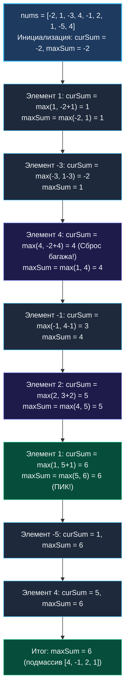

> *«Самые эффективные алгоритмы — те, которые делают минимум лишних движений. Если вы способны одним сравнением отбросить бесполезный груз прошлого и начать путь заново, вы победили».*  
> — Брайан Керниган

Среди всех алгоритмических задач на массивы эта занимает фундаментальное место в Computer Science. **LeetCode 53. Maximum Subarray** не требует ни аллокаций в куче, ни построения хэш-таблиц, ни предварительной сортировки. Весь алгоритм укладывается в один цикл и две скалярные переменные в регистрах процессора.

Однако в этой внешней простоте заключена огромная глубина: это классическое динамическое программирование, сжатое до строжайшего $O(1)$ по дополнительной памяти. На собеседовании уровня Senior эта задача мгновенно демонстрирует, видит ли кандидат математический инвариант задачи и понимает ли он *Mechanical Sympathy* — идеальное взаимодействие с кэш-линиями и конвейером CPU.

---

### Формулировка задачи и калибровка условий

Дан целочисленный массив `nums`. Необходимо найти **непрерывный подмассив** (содержащий хотя бы одно число), который имеет максимально возможную сумму элементов, и вернуть эту сумму.

**Пример:**
```text
Вход:  nums = [-2, 1, -3, 4, -1, 2, 1, -5, 4]
Вывод: 6
Объяснение: Непрерывный подмассив [4, -1, 2, 1] имеет максимальную сумму 4 + (-1) + 2 + 1 = 6.
```

> [!INTERVIEW] Вопросы интервьюеру перед реализацией
> 1. *«Может ли массив состоять исключительно из отрицательных чисел?»* — Да (например, `nums = [-3, -1, -5]`). В этом случае ответом должно быть наибольшее из отрицательных чисел (`-1`), а не ноль!
> 2. *«Каков максимальный размер массива $N$?»* — $N \le 10^5$. Это исключает любые квадратичные алгоритмы $O(N^2)$.
> 3. *«Может ли сумма переполнить 64-битный int?»* — Обычно элементы укладываются в диапазон $[-10^4, 10^4]$, поэтому стандартный тип `int` в Go на 64-битных системах гарантированно защищен от целочисленного переполнения.

---

### Инвариант и бытовая аналогия: Почему работает сброс

Представьте себе коммерческое предприятие. Вы идете по временной шкале день за днем.  
- Переменная `curSum` — это накопленный баланс текущего бизнес-проекта.
- Переменная `maxSum` — максимальная зафиксированная прибыль за всю историю.

Если ваш текущий баланс `curSum` опустился ниже нуля (проект приносит чистый убыток), то для любого будущего дня $i$ присоединение этого убыточного багажа сделает прибыль **меньше**, чем если бы вы закрыли старый проект и открыли новый с чистого листа прямо в день $i$!  
Поэтому, как только `curSum < 0`, мы без сожаления сбрасываем накопленную сумму и начинаем новый подмассив с текущего элемента: `curSum = max(nums[i], curSum + nums[i])`.

---

### Пошаговый визуальный Walk-Through алгоритма Кадане

Проследим эволюцию `curSum` и `maxSum` на классическом примере `[-2, 1, -3, 4, -1, 2, 1, -5, 4]`:



---

### Наивное решение: Квадратичный перебор $O(N^2)$

Мы фиксируем левую границу `left` и расширяем правую границу `right`, накапливая сумму на лету:

```go
func maxSubArrayBrute(nums []int) int {
    if len(nums) == 0 {
        return 0
    }
    maxSum := math.MinInt
    for left := 0; left < len(nums); left++ {
        curSum := 0
        for right := left; right < len(nums); right++ {
            curSum += nums[right]
            if curSum > maxSum {
                maxSum = curSum
            }
        }
    }
    return maxSum
}
```
При $N = 10^5$ внутренний цикл совершит $\approx 5 \cdot 10^9$ итераций, что неминуемо приведет к Time Limit Exceeded.

---

### Оптимальное решение: Алгоритм Кадане за $O(N)$ и $O(1)$ памяти

Формально алгоритм Кадане — это одномерное динамическое программирование.  
Пусть $dp[i]$ — максимально возможная сумма непрерывного подмассива, **заканчивающегося ровно в позиции $i$**.  
Тогда рекуррентное соотношение:
$$dp[i] = \max(nums[i], dp[i-1] + nums[i])$$
Поскольку для вычисления $dp[i]$ нам требуется только предыдущее значение $dp[i-1]$, массив размером $N$ сжимается в единственную переменную `curSum`.

```go
package main

// В Go 1.21+ функция max является встроенной (builtin).
// Для совместимости со старыми версиями объявляем локальный хелпер:
func maxInt(a, b int) int {
    if a > b {
        return a
    }
    return b
}

func maxSubArray(nums []int) int {
    if len(nums) == 0 {
        return 0
    }

    // Инициализируем первым элементом, чтобы корректно обработать
    // случай, когда все числа в массиве отрицательные!
    curSum := nums[0]
    maxSum := nums[0]

    // Проходим по оставшейся части среза
    for _, v := range nums[1:] {
        curSum = maxInt(v, curSum+v)
        maxSum = maxInt(maxSum, curSum)
    }

    return maxSum
}
```

> [!WARNING] Фатальная ошибка инициализации нулем
> Если инициализировать переменные нулями (`curSum := 0, maxSum := 0`), то на массиве `nums = [-5, -2, -9]` ваш код вернет `0`!  
> Но нуля в массиве нет, и подмассив не может быть пустым — правильный ответ `-2`.  
> Всегда инициализируйте аккумуляторы первым элементом массива: `curSum := nums[0], maxSum := nums[0]`.

---

### Mechanical Sympathy: Симфония процессора и памяти

Почему алгоритм Кадане работает со скоростью физического предела памяти?

1. **Последовательное чтение памяти (Sequential Stream):** Срез `nums` расположен в памяти непрерывным блоком байтов. Аппаратный предвыборщик процессора (`Hardware Prefetcher`) легко считывает шаблон доступа и заблаговременно подгружает кэш-линии (64 байта) в ультрабыстрый кэш L1d. Число промахов мимо кэша сведено к абсолютному нулю.
2. **Отсутствие ветвлений (Branchless Execution):** В скомпилированном коде инструкция `max` преобразуется компилятором Go в условную пересылку `CMOV` (Conditional Move) на x86-64. Это исключает ошибки предсказателя переходов (`Branch Misprediction Penalty`), и конвейер процессора не сбрасывается при смене знака суммы.
3. **Zero Allocations (Нулевое давление на GC):** Переменные `curSum`, `maxSum` и `v` размещаются непосредственно в регистрах процессора (`RAX`, `RBX`). Аллокатор рантайма и сборщик мусора полностью спят во время выполнения функции.

---

### Альтернатива: Разделяй и властвуй (Divide and Conquer)

Задачу можно решить за $O(N \log N)$ через рекурсивное деление массива пополам:
- Максимальный подмассив лежит целиком в левой половине;
- Либо целиком в правой половине;
- Либо пересекает границу раздела (сумма максимального суффикса слева и максимального префикса справа).

> [!TIP] Зачем Senior должен знать решение Divide and Conquer?
> В однопоточной программе на одном сервере алгоритм Кадане $O(N)$ вне конкуренции. Но если массив данных имеет объем 100 терабайт и распределен по кластеру из 1000 серверов (MapReduce / Apache Spark), подход **Divide and Conquer** позволяет независимо и параллельно обработать каждый чанк на своей ноде, а затем за $O(\log K)$ объединить результаты через фазу Reduce!

---

### Резюме

Алгоритм Кадане демонстрирует высшую степень инженерной элегантности: сжатие пространства состояний динамического программирования до элементарного линейного прохода.

В следующей задаче мы разберем технику префиксных и суффиксных накопителей, которая позволяет вычислить произведение элементов массива без операции деления: [[6. Product of Array Except Self]].