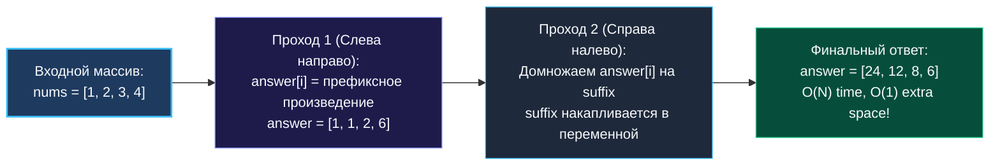

> *«Опытный инженер находит обходной путь не потому, что прямой путь труден, а потому, что запрет на очевидную операцию открывает подлинную геометрию данных».*  
> — Брайан Керниган

**LeetCode 238. Product of Array Except Self (Medium / Core)**

Дан целочисленный массив `nums` длиной $N > 1$. Требуется сформировать и вернуть массив `answer`, в котором каждый элемент `answer[i]` равен произведению всех элементов `nums`, **кроме** `nums[i]`.

**Особые ограничения:**
- Алгоритм обязан работать за строго линейное время **$O(N)$**.
- **Категорически запрещено использовать операцию деления (`/`)**.
- Алгоритм должен укладываться в **$O(1)$ дополнительной памяти** (память, выделенная под выходной массив `answer`, условием не учитывается).

---

### Почему очевидные подходы проваливаются

#### 1. «Наивное деление» (Запрещено условием + крах на нулях)
Первая мысль новичка: вычислить общее произведение всех чисел `total` за один проход, а затем вторым циклом записать `answer[i] = total / nums[i]`.
- Этот подход прямо запрещён условием задачи.
- Но даже если бы запрета не было, появление хотя бы одного нуля `nums[k] = 0` приводит к панике деления на ноль (`panic: runtime error: integer divide by zero`). Если же нулей два или больше (`[0, 4, 0]`), все элементы ответа должны быть нулями, что потребовало бы громоздких условий и костылей.

#### 2. Квадратичный брутфорс $O(N^2)$
Для каждого элемента `i` запускать внутренний цикл, перемножающий все элементы, кроме текущего. При $N = 10^5$ это $10^{10}$ операций умножения — гарантированный `Time Limit Exceeded`.

---

### Архитектурная идея: Префиксные и суффиксные накопители

Математически произведение всех элементов, кроме $i$-го, раскладывается на две независимые части:
$$\text{answer}[i] = \underbrace{(nums[0] \cdot nums[1] \dots nums[i-1])}_{\text{Произведение слева (Prefix)}} \times \underbrace{(nums[i+1] \cdot nums[i+2] \dots nums[N-1])}_{\text{Произведение справа (Suffix)}}$$

Чтобы уложиться в $O(1)$ дополнительной памяти, мы не создаем два вспомогательных массива `prefix[]` и `suffix[]`. Мы используем сам результирующий срез `answer` как аккумулятор!



---

### Идиоматичная реализация на Go

```go
package main

func productExceptSelf(nums []int) []int {
    n := len(nums)
    if n < 2 {
        return nil
    }

    // Выделяем память под срез ответа ровно один раз
    answer := make([]int, n)

    // ПРОХОД 1: Слева направо
    // answer[i] будет содержать произведение всех элементов строго левее i
    prefix := 1
    for i := 0; i < n; i++ {
        answer[i] = prefix
        prefix *= nums[i]
    }

    // ПРОХОД 2: Справа налево
    // Домножаем накопленный префикс на суффиксное произведение
    suffix := 1
    for i := n - 1; i >= 0; i-- {
        answer[i] *= suffix
        suffix *= nums[i]
    }

    return answer
}
```

---

### Трассировка инвариантов по шагам

Возьмем массив `nums = [1, 2, 3, 4]`:

#### Проход 1 (слева направо, prefix):
- `i = 0`: `answer[0] = 1` (пустой префикс), `prefix` становится $1 \times 1 = 1$
- `i = 1`: `answer[1] = 1`, `prefix` становится $1 \times 2 = 2$
- `i = 2`: `answer[2] = 2`, `prefix` становится $2 \times 3 = 6$
- `i = 3`: `answer[3] = 6`, `prefix` становится $6 \times 4 = 24$  
*Промежуточный `answer` равен `[1, 1, 2, 6]`.*

#### Проход 2 (справа налево, suffix):
- `i = 3`: `answer[3] = 6 * 1 = 6`, `suffix` становится $1 \times 4 = 4$
- `i = 2`: `answer[2] = 2 * 4 = 8`, `suffix` становится $4 \times 3 = 12$
- `i = 1`: `answer[1] = 1 * 12 = 12`, `suffix` становится $12 \times 2 = 24$
- `i = 0`: `answer[0] = 1 * 24 = 24`, `suffix` становится $24 \times 1 = 24$  
*Итоговый `answer` равен `[24, 12, 8, 6]`.*

---

### Анализ пограничных сценариев (Edge Cases)

- **Ровно один ноль в массиве:** `nums = [-1, 1, 0, -3, 3]`:
  - Для всех ненулевых элементов произведение слева или справа в какой-то момент умножится на 0, дав `answer[i] = 0`.
  - Для позиции, где стоит сам ноль, префикс слева соберет $(-1) \times 1 = -1$, а суффикс справа соберет $(-3) \times 3 = -9$.  
    Итог: $(-1) \times (-9) = 9$. Деления не было, результат идеально верен!
- **Два и более нулей:** `nums = [0, 4, 0]`:
  - При наличии хотя бы двух нулей любой подмассив «кроме $i$» гарантированно содержит минимум один ноль. Весь массив ответа заполнится нулями.

---

### Mechanical Sympathy: Память и кэш-линии

1. **Единственная аллокация:** Вызов `make([]int, n)` создает один непрерывный блок памяти в куче. Внутри обоих циклов нет вызовов `append`, нет ветвлений и нет скрытых аллокаций.
2. **Линейная утилизация L1d-кэша:** Первый проход идет строго вперед (`0` $\to$ `n-1`), второй — строго назад (`n-1` $\to$ `0`). Оба паттерна доступа являются строго последовательными (`strided access`), что позволяет аппаратному prefetcher процессора гарантировать 100% Cache Hit Rate.
3. **Чистые регистры:** Переменные `prefix` и `suffix` никогда не выходят в память — компилятор Go размещает их непосредственно в регистрах процессора.

---

### Резюме

Product of Array Except Self — великолепный пример того, как декомпозиция глобального вычисления на префиксную и суффиксную части позволяет обойти фундаментальные математические ограничения (деление на ноль) и добиться строгой линейной производительности при нулевых затратах дополнительной памяти.

В следующей лекции мы перейдем к задаче геометрической оптимизации с двумя указателями — поиску максимального объема воды в контейнере: [[7. Container With Most Water]].