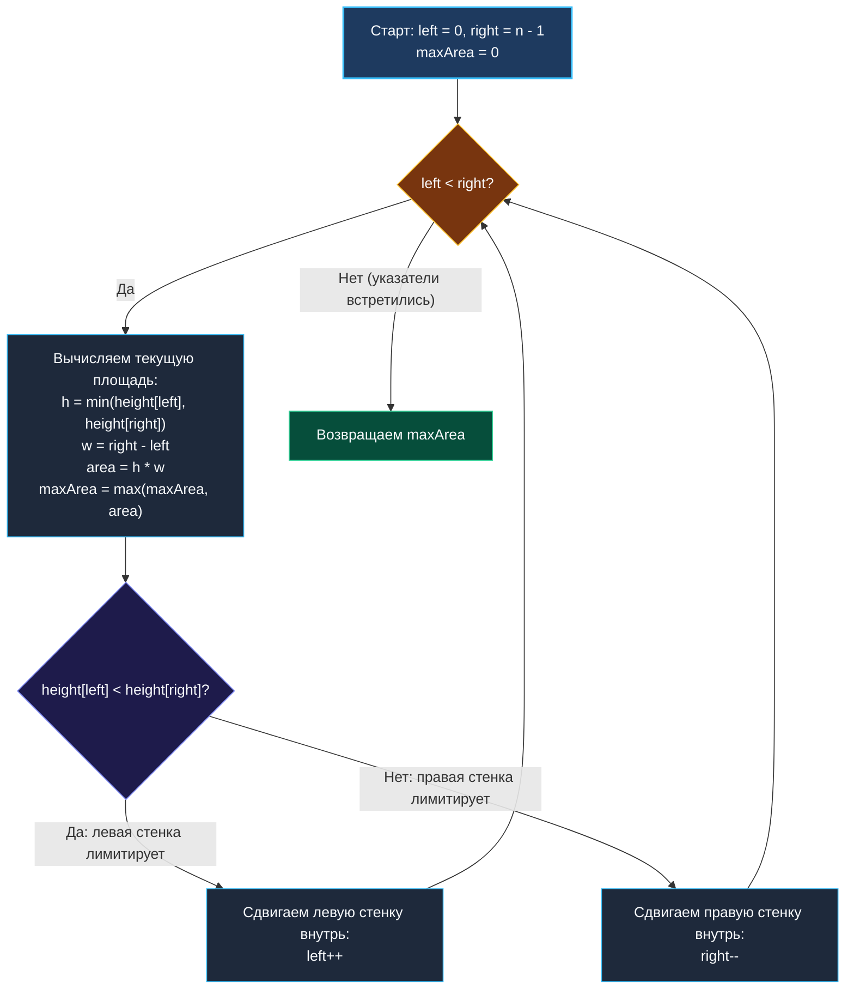

> *«В инженерной оптимизации побеждает не тот, кто слепо перебирает все возможности, а тот, кто умеет одним строгим рассуждением отсечь миллионы заведомо бесперспективных вариантов».*  
> — Брайан Керниган

**LeetCode 11. Container With Most Water (Medium / Core)**

Вам дан целочисленный массив неотрицательных чисел `height` длины $N \ge 2$. Каждое число представляет высоту вертикальной стенки, расположенной в точке с координатой $x = i$.  
Требуется выбрать две линии, которые вместе с осью абсцисс образуют сосуд, вмещающий **максимально возможное количество воды**.

Формула площади воды между стенками $i$ и $j$ ($i < j$):
$$\text{Area}(i, j) = \min(height[i], height[j]) \times (j - i)$$

Задача проверяет способность инженера доказать математический инвариант: почему жадный сдвиг более короткой стенки никогда не приводит к потере глобального максимума, и как свести кажущийся квадратичный перебор $O(N^2)$ к элегантному линейному алгоритму за $O(N)$ и $O(1)$ памяти.

---

### Калибровка условий и границы данных

```text
Вход:  height = [1, 8, 6, 2, 5, 4, 8, 3, 7]
Вывод: 49
Объяснение: Максимальный объем достигается между стенкой высотой 8 (индекс 1) 
и стенкой высотой 7 (индекс 8). Расстояние: 8 - 1 = 7. Высота воды: min(8, 7) = 7. 
Площадь: 7 * 7 = 49.
```

> [!INTERVIEW] Вопросы интервьюеру перед реализацией
> 1. *«Каков максимальный размер массива $N$?»* — $N \le 10^5$. Квадратичный брутфорс исключён сразу.
> 2. *«Могут ли быть высоты равные 0?»* — Да, они дают нулевой объём, но участвуют в расчёте расстояния.
> 3. *«Может ли возникнуть переполнение 64-битного целого?»* — Максимальная площадь $10^4 \times 10^5 = 10^9$. Это укладывается даже в 32-битный `int` ($< 2 \cdot 10^9$).

---

### Математический инвариант: Почему жадный сдвиг безопасен?

Бытовая аналогия: представьте, что вы строите прямоугольный бассейн. Его объем ограничен **самой низкой из двух стенок** (вода перельется через край).  
Мы начинаем с максимально возможной ширины: ставим указатели по краям массива — `left = 0` и `right = len - 1`.

Теперь мы обязаны сужать бассейн, сдвигая один из указателей внутрь. Какую стенку сдвинуть — высокую или низкую?
- Допустим, `height[left] < height[right]`. 
- Если мы оставим стенку `left` на месте и сдвинем правую (высокую) стенку внутрь на любую позицию $k$, ширина нового бассейна гарантированно уменьшится: $(k - left) < (right - left)$.
- А что с высотой? Высота нового бассейна будет $\min(height[left], height[k]) \le height[left]$. Она не может стать больше $height[left]$!
- Следовательно, площадь **любого** бассейна с фиксированной стенкой `left` и любой внутренней правой стенкой заведомо **меньше**, чем текущая площадь!

Стенка `left` выжала свой абсолютный теоретический максимум при максимальной ширине. Мы можем **навсегда выбросить её из рассмотрения** и сделать `left++`.  
Аналогично, если короче стенка справа — делаем `right--`.

---

### Визуальный алгоритмический процесс (Two Pointers)



---

### Идиоматичная реализация на Go

```go
package main

// Вспомогательный хелпер min (в Go 1.21+ встроен в builtin)
func minInt(a, b int) int {
    if a < b {
        return a
    }
    return b
}

func maxArea(height []int) int {
    left := 0
    right := len(height) - 1
    maxVolume := 0

    for left < right {
        h := minInt(height[left], height[right])
        w := right - left
        currentArea := h * w

        if currentArea > maxVolume {
            maxVolume = currentArea
        }

        // Жадный сдвиг: жертвуем более слабой стенкой,
        // сохраняя шанс найти более высокую стенку внутри
        if height[left] < height[right] {
            left++
        } else {
            right--
        }
    }

    return maxVolume
}
```

---

### Mechanical Sympathy: Почему два встречных указателя идеальны для CPU

1. **Двустороннее последовательное чтение:** Указатели `left` и `right` перемещаются строго монотонно. Кэш-линии процессора считываются последовательно с обоих концов среза, гарантируя высокий Cache Hit Rate.
2. **Нулевой оверхед памяти:** Алгоритм не создает объектов в куче (`zero allocations`). Переменные `left`, `right`, `h`, `w`, `currentArea` полностью аллоцируются в регистрах CPU.
3. **Минимальная длина цикла:** Весь алгоритм требует ровно $N-1$ итераций, выполняясь на процессоре с частотой 3 ГГц менее чем за 0.1 миллисекунды для $10^5$ элементов.

---

### Резюме

Container With Most Water учит строгому доказательству инварианта через метод исключения заведомо неоптимальных состояний (Exchange Argument).

В следующей лекции мы разберем задачу о максимальной прибыли на бирже, где достаточно отслеживать минимальную историческую цену — классическую задачу Best Time to Buy and Sell Stock: [[8. Best Time to Buy and Sell Stock]].