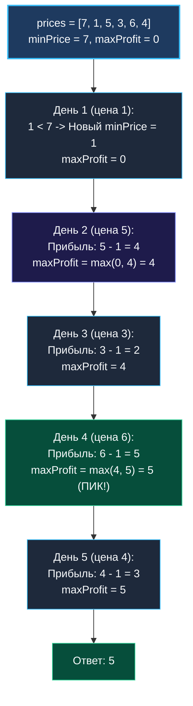

> *«Покупай дёшево, продавай дорого. Вся прелесть эффективного алгоритма в том, чтобы не пытаться перебрать все возможные комбинации дней, а просто помнить самую низкую цену из всех, что вы встречали на пути».*  
> — Брайан Керниган

**LeetCode 121. Best Time to Buy and Sell Stock (Easy / Core)**

Вам дан целочисленный массив `prices`, где `prices[i]` — цена акции в день $i$.  
Разрешено совершить ровно **одну сделку**: выбрать один день для покупки акции и другой, более поздний день для её продажи.  
Необходимо максимизировать итоговую чистую прибыль. Если получить прибыль невозможно (цены строго падают), следует вернуть `0`.

---

### Формулировка и калибровка условий

```text
Вход:  prices = [7, 1, 5, 3, 6, 4]
Вывод: 5
Объяснение: Покупка во 2-й день (цена = 1) и продажа в 5-й день (цена = 6).
Прибыль: 6 - 1 = 5.
(Заметим: покупка во 2-й день и продажа в 1-й день невозможна, так как продать можно только после покупки).
```

> [!INTERVIEW] Вопросы интервьюеру на старте
> 1. *«Что возвращать, если массив пуст или состоит из одного дня?»* — В Go возвращаем `0`, так как для совершения сделки необходимо минимум два разных дня.
> 2. *«Каков максимальный размер массива $N$?»* — $N \le 10^5$. Квадратичный перебор пар $O(N^2)$ гарантированно приведёт к Time Limit Exceeded.
> 3. *«Могут ли цены быть отрицательными?»* — Цены акций неотрицательны, но даже при произвольных ценах алгоритм работает абсолютно корректно.

---

### Визуальный Walk-Through: Один линейный проход

Инвариант: двигаясь слева направо, для каждого дня $i$ мы задаём простой вопрос:  
*«Если я продам акцию сегодня по цене $prices[i]$, когда мне следовало её купить?»*  
Ответ очевиден: в тот день из прошлого ($0 \dots i-1$), когда цена была **минимальной**.



---

### Наивное решение: Квадратичный брутфорс $O(N^2)$

```go
func maxProfitBrute(prices []int) int {
    maxProfit := 0
    for i := 0; i < len(prices)-1; i++ {
        for j := i + 1; j < len(prices); j++ {
            profit := prices[j] - prices[i]
            if profit > maxProfit {
                maxProfit = profit
            }
        }
    }
    return maxProfit
}
```
При $N = 10^5$ это $5 \cdot 10^9$ итераций — гарантированный `Time Limit Exceeded`.

---

### Оптимальное решение: Линейный проход за $O(N)$ и $O(1)$ памяти

```go
package main

func maxProfit(prices []int) int {
    if len(prices) < 2 {
        return 0
    }

    minPrice := prices[0]
    maxProfit := 0

    for _, price := range prices[1:] {
        // Вычисляем потенциальную прибыль при продаже сегодня
        profit := price - minPrice
        if profit > maxProfit {
            maxProfit = profit
        }

        // Обновляем исторический минимум цены покупки
        if price < minPrice {
            minPrice = price
        }
    }

    return maxProfit
}
```

---

### Глубокая связь с алгоритмом Кадане

Если построить массив разниц цен между соседними днями:
$$diff[i] = prices[i+1] - prices[i]$$
то покупка в день $i$ и продажа в день $j$ равна сумме непрерывного отрезка:
$$prices[j] - prices[i] = \sum_{k=i}^{j-1} diff[k]$$
Таким образом, задача о покупке акций математически **изоморфна** задаче Maximum Subarray ([[5. Maximum Subarray (Kadane)]]) на массиве разностей!  
Однако прямой подход с поддержанием `minPrice` элегантнее: он не требует даже неявного построения массива разниц.

---

### Mechanical Sympathy: Ресурсный профиль

1. **Zero Allocations:** Вся память локализована на стеке вызова в двух регистрах CPU (`minPrice` и `maxProfit`).
2. **Идеальный последовательный доступ:** Доступ к элементам среза происходит строго последовательно, обеспечивая стопроцентное попадание в кэш L1d.
3. **Предсказатель переходов (Branch Predictor):** Внутри цикла условия просты и однонаправленны, конвейер инструкций CPU работает на предельной частоте.

---

### Резюме

Best Time to Buy and Sell Stock — эталонная задача на отслеживание кумулятивного экстремума на префиксе. Она доказывает, что правильный инвариант позволяет решить задачу за один такт процессора на элемент.

В следующей лекции мы разберем технику слияния отсортированных срезов с конца, предотвращающую перезапись данных: [[9. Merge Sorted Array]].