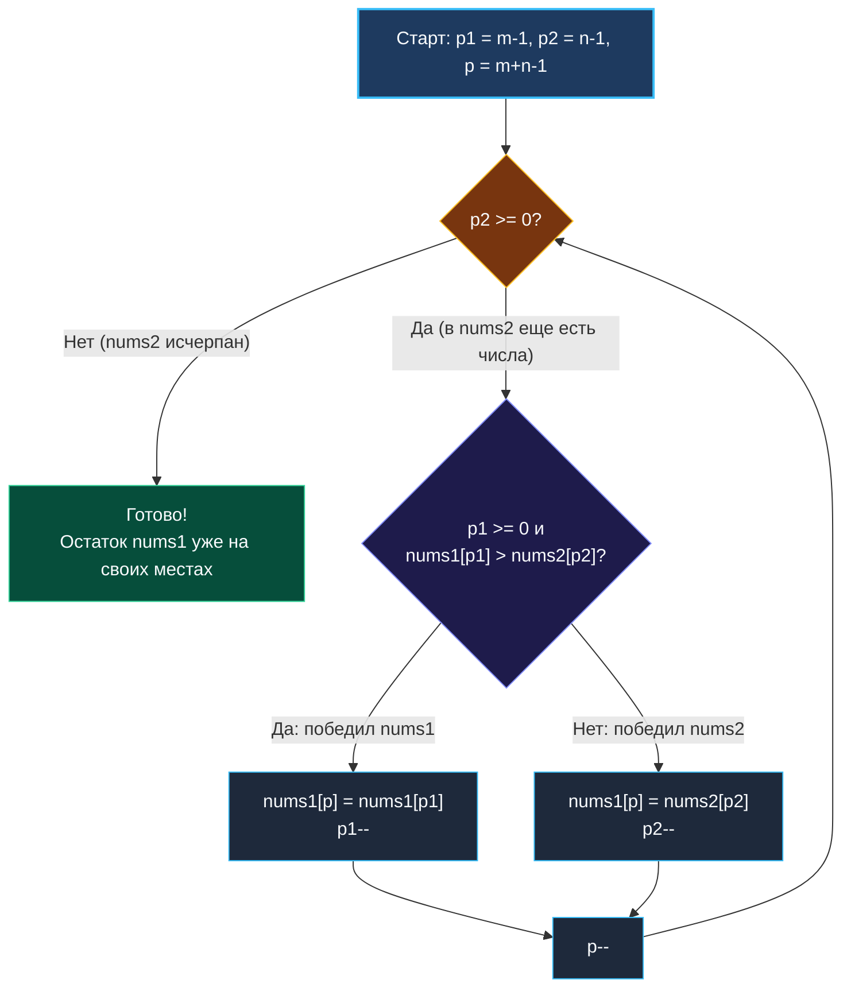

> *«Если свободное место находится позади вас, не пытайтесь пробиваться вперёд сквозь толпу — развернитесь и спокойно заполняйте пространство с конца».*  
> — Брайан Керниган

**LeetCode 88. Merge Sorted Array (Easy / Core)**

Вам даны два отсортированных по неубыванию целочисленных массива `nums1` и `nums2`, а также целые числа $m$ и $n$, обозначающие количество значащих элементов в каждом из них соответственно.  
Срез `nums1` имеет общую длину $m + n$: первые $m$ позиций содержат исходные данные, а последние $n$ позиций заполнены нулями и служат буфером для слияния.

**Требование:** Объединить элементы `nums2` в `nums1` так, чтобы результирующий массив оставался отсортированным. Алгоритм обязан работать **in-place** за $O(m + n)$ по времени и со строгим **$O(1)$ дополнительной памяти**.

---

### Калибровка условий и пограничные случаи

```text
Вход:  nums1 = [1, 2, 3, 0, 0, 0], m = 3
       nums2 = [2, 5, 6],       n = 3
Вывод: nums1 = [1, 2, 2, 3, 5, 6]
```

> [!INTERVIEW] Вопросы интервьюеру перед реализацией
> 1. *«Что делать, если $m = 0$?»* — Все элементы `nums1` являются буфером, мы просто копируем в него `nums2`.
> 2. *«Что делать, если $n = 0$?»* — Никаких действий не требуется, массив `nums1` уже готов.
> 3. *«Гарантируется ли, что capacity среза `nums1` не меньше $m + n$?»* — Да, по условию длина `len(nums1) == m + n`.

---

### Архитектурный инвариант: Инвертированное слияние с хвоста

Если двигаться привычным путем от начала массивов (слева направо), каждая вставка числа из `nums2` в `nums1` потребует сдвига всех последующих элементов `nums1` вправо, что приведет к квадратичной деградации $O(m \times n)$!

Но инженеры смотрят на топологию памяти: **пустое место находится в самом конце `nums1`**!  
Следовательно, мы выставляем три указателя:
- `p1 = m - 1` — указывает на наибольший неразмещённый элемент в `nums1`;
- `p2 = n - 1` — указывает на наибольший неразмещённый элемент в `nums2`;
- `p = m + n - 1` — указывает на позицию текущей записи с конца массива `nums1`.

На каждом шаге мы сравниваем `nums1[p1]` и `nums2[p2]`. Большее из чисел ставится в позицию `nums1[p]`. Мы гарантированно никогда не перезапишем значащие элементы `nums1`, так как число свободных слотов в хвосте всегда превосходит количество оставшихся элементов `nums2`.

---

### Визуальный процесс обратного слияния



---

### Идиоматичная реализация на Go

```go
package main

func merge(nums1 []int, m int, nums2 []int, n int) {
    p1 := m - 1
    p2 := n - 1

    // Заполняем nums1 строго с конца
    for p := m + n - 1; p >= 0; p-- {
        // Если все элементы nums2 уже перенесены,
        // оставшиеся элементы nums1 уже находятся на своих правильных позициях!
        if p2 < 0 {
            break
        }

        if p1 >= 0 && nums1[p1] > nums2[p2] {
            nums1[p] = nums1[p1]
            p1--
        } else {
            nums1[p] = nums2[p2]
            p2--
        }
    }
}
```

> [!WARNING] Элегантность досрочного выхода
> Заметьте проверку `if p2 < 0 { break }`. Как только мы исчерпали массив `nums2`, оставшиеся элементы в начале `nums1` уже отсортированы и уже стоят на правильных индексах. Мы совершаем досрочный выход, экономя такты процессора.

---

### Mechanical Sympathy: Почему алгоритм работает без промахов кэша

1. **Последовательное чтение назад (Reverse Streaming):** Аппаратные блоки предвыборки современных процессоров (x86-64, ARM64 Neoverse) умеют распознавать декрементные шаги указателей не хуже инкрементных. Кэш-линии плавно выгружаются в L1d.
2. **Zero Extra Memory:** Никаких временных слайсов, никакого участия сборщика мусора (GC), нулевая фрагментация кучи.
3. **Отсутствие вызовов встроенных функций:** Простое линейное ветвление, которое процессор отлично оптимизирует в конвейере.

---

### Резюме

Merge Sorted Array — наглядный урок того, как нестандартная смена направления обхода (справа налево вместо слева направо) превращает сложную задачу с потенциальными сдвигами элементов в чистый линейный алгоритм за $O(m + n)$.

В следующей лекции мы разберем технику фильтрации массива на месте с сохранением относительного порядка элементов — задачу Move Zeroes: [[10. Move Zeroes]].