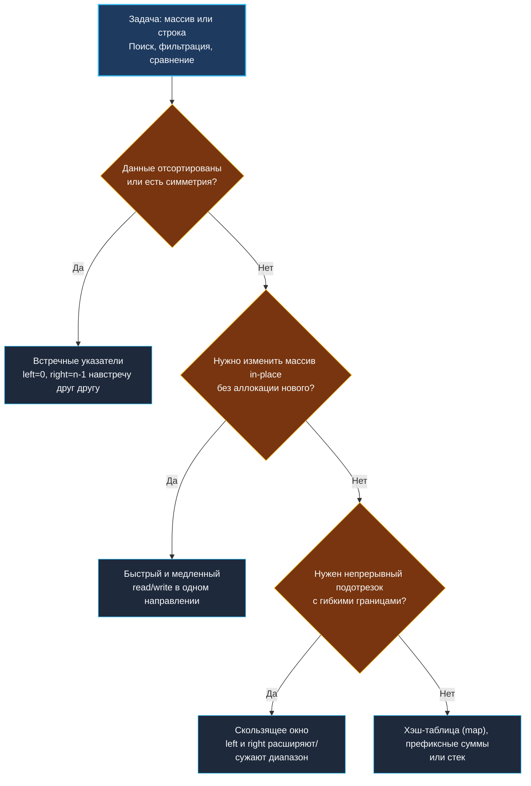

> *«Указатели — это один из самых сильных и выразительных инструментов программирования. Управляя двумя указателями одновременно, мы укрощаем комбинаторную сложность».*  
> — Брайан Керниган, Деннис Ритчи

# 1. Теория. Два указателя (Two Pointers)

**Тема:** Фундаментальные алгоритмические паттерны, линейное сканирование, $O(1)$ по памяти  
**Ссылки:** [[01. Массивы и строки/1. Теория. Массивы и строки|Теория: Массивы и строки]], [[02. Два указателя/2. Варианты применения|Варианты применения]], [[02. Два указателя/3. Valid Palindrome|Valid Palindrome]], [[02. Два указателя/4. Two Sum II Sorted Array|Two Sum II]]

---

### 1. Введение и физическая интуиция

Представьте себе длинный коридор архива, где на полках по возрастанию номеров расставлены коробки с документами. Вам поручено найти две коробки, суммарный вес которых составляет ровно 100 кг.

- **Наивный архивариус ($O(N^2)$):** берет первую коробку, затем по очереди взвешивает её с каждой последующей коробкой в коридоре. Если пара не подошла, берет вторую коробку и снова обходит весь коридор. К концу дня архивариус падает без сил от десятков километров холостого бега.
- **Опытный архивариус (Два указателя, $O(N)$):** ставит двух стажеров — одного в самом начале коридора (у легких коробок, `left = 0`), а второго в конце (у самых тяжелых, `right = n - 1`).  
  Они взвешивают пару:
  - Сумма больше 100 кг? Правый стажер делает шаг влево к более легким коробкам (`right--`).
  - Сумма меньше 100 кг? Левый стажер делает шаг вправо к более тяжелым коробкам (`left++`).
  - Сумма ровно 100 кг? Пара найдена!

Стажеры идут навстречу друг другу, ни разу не разворачиваясь назад. Суммарно они проходят коридор ровно один раз. Сложность задачи схлопывается из квадратичной в строго линейную $O(N)$.



---

### 2. Суть паттерна: почему два указателя работают за $O(N)$

В классическом двойном цикле мы перебираем все пары индексов $(i, j)$:
$$ \sum_{i=0}^{N-1} (N - 1 - i) = \frac{N(N-1)}{2} \approx O(N^2) $$

Паттерн двух указателей эксплуатирует **монотонность** пространства поиска или **инвариант исключения**.

> [!IMPORTANT]
> **Золотое правило двух указателей:**  
> На каждом шаге цикла хотя бы один из указателей сдвигается строго вперед (или назад) минимум на 1 позицию. Указатели **никогда не возвращаются назад**.  
> Следовательно, суммарное число операций строго ограничено $N + N = 2N \in O(N)$.

---

### 3. Три фундаментальные разновидности

#### 1. Встречные указатели (Opposite Direction)
- **Топология:** `left = 0`, `right = len(arr) - 1`. Движение навстречу: `left++` или `right--`.
- **Условие применимости:** монотонность данных (отсортированный срез) либо геометрическая/текстовая симметрия.
- **Инвариант:** на каждом шаге отбрасывается либо крайний левый элемент (он слишком мал), либо крайний правый (он слишком велик). Все элементы за пределами `[left, right]` гарантированно не могут образовать искомый результат.
- **Примеры:**
  - [[02. Два указателя/3. Valid Palindrome|Valid Palindrome]] — проверка симметрии строки.
  - [[02. Два указателя/4. Two Sum II Sorted Array|Two Sum II]] — поиск целевой суммы в отсортированном слайсе.
  - [[01. Массивы и строки/7. Container With Most Water|Container With Most Water]] — жадный выбор наивысшей стенки.
  - [[02. Два указателя/6. 3Sum|3Sum]] и [[02. Два указателя/7. 4Sum|4Sum]] — фиксация базовых элементов + встречные указатели.

```go
left, right := 0, len(arr)-1
for left < right {
    sum := arr[left] + arr[right]
    if sum == target {
        return []int{left + 1, right + 1}
    } else if sum < target {
        left++
    } else {
        right--
    }
}
```

---

#### 2. Быстрый и медленный указатели (Fast & Slow / Read & Write)
- **Топология:** оба указателя стартуют с начала среза (`write = 0`, `read = 0`) и движутся в одну сторону.
- **Условие применимости:** фильтрация элементов, компактификация, удаление дубликатов, сдвиг нулей in-place.
- **Инвариант:** 
  - `[0, write-1]` содержит только валидные элементы, прошедшие фильтр.
  - `[write, read-1]` содержит устаревшие значения («мусор»), готовые к перезаписи.
  - `[read, len(arr)-1]` содержит еще не просмотренные элементы.
- **Примеры:**
  - [[02. Два указателя/5. Remove Duplicates from Sorted Array|Remove Duplicates from Sorted Array]].
  - [[01. Массивы и строки/10. Move Zeroes|Move Zeroes]].
  - [[02. Два указателя/8. Sort Colors|Sort Colors]] (голландский флаг — расширение до трех указателей).

```go
write := 0
for read := 0; read < len(nums); read++ {
    if nums[read] != 0 {
        nums[write] = nums[read]
        write++
    }
}
// Хвост от write до конца заполняется нулями
```

---

#### 3. Скользящее окно (Sliding Window)
- **Топология:** `left` и `right` формируют динамический диапазон `[left, right]`. Правый указатель расширяет окно, включая новые данные; левый сужает окно при нарушении инварианта (превышение суммы, повтор символов).
- Этому богатому паттерну посвящен наш следующий специализированный кластер: [[03. Скользящее окно/1. Теория. Скользящее окно|Кластер 03. Скользящее окно]].

---

### 4. Trade-off: Два указателя vs Хэш-таблица (`map`)

На собеседованиях регулярно возникает выбор: решить задачу через `map` за один проход или отсортировать срез и пустить два указателя.

| Характеристика | `map[int]int` | Сортировка + Два указателя |
|:---|:---|:---|
| **Асимптотика по времени** | $O(N)$ в среднем | $O(N \log N)$ (или $O(N)$, если срез уже отсортирован) |
| **Асимптотика по памяти** | $O(N)$ в куче (Heap) | **$O(1)$** дополнительной памяти (in-place) |
| **Кэш-локальность (CPU L1/L2)** | Низкая (псевдослучайные скачки по бакетам мапы) | **Идеальная** (строго последовательное чтение непрерывного массива) |
| **Нагрузка на Garbage Collector** | Высокая (аллокация структуры `hmap`, эвакуация бакетов) | **Нулевая** (0 аллокаций, память на стеке) |
| **Обработка дубликатов** | Требует отдельного учета счетчиков | Тривиально пропускаются условием `nums[i] == nums[i-1]` |

> [!TIP]
> **Инженерный вердикт:**  
> Если входной массив уже отсортирован (как в Two Sum II) — два указателя безальтернативны: $O(N)$ время и $O(1)$ память.  
> Если массив не отсортирован, но важна строгая экономия памяти или полное отсутствие пауз GC — сортировка на месте (`slices.Sort`) с последующим обходом двумя указателями выигрывает у хэш-таблицы в реальных высоконагруженных Go-сервисах.

---

### 5. Mechanical Sympathy: почему железо обожает два указателя

1. **Аппаратный Prefetcher CPU:**  
   Современные микропроцессоры (x86-64 Zen/Golden Cove, Apple Silicon, ARM Neoverse) содержат аппаратные предсказатели потока данных (Stream Prefetcher). Когда процессор видит, что память читается последовательно (`arr[read]` или `arr[left]`), он заранее загружает следующие кэш-линии (по 64 байта) из оперативной памяти в L2 и L1d кэш еще до того, как инструкция выполнится.
2. **Нулевой Pointer Chasing:**  
   В отличие от связных списков и хэш-таблиц, где каждый доступ требует разыменования указателя и ожидания в 100–200 тактов (DRAM latency), срез в Go — это непрерывный плоский буфер. Доступ по индексу компилируется в одну ассемблерную инструкцию с базовым регистром и смещением:
   ```assembly
   MOVQ (RAX)(RDX*8), RBX  ; Загрузка 64-битного числа из arr[read]
   ```
3. **Bounds Check Elimination (BCE):**  
   Компилятор Go при грамотно написанном цикле `for left < right` способен доказать безопасность доступа и исключить скрытые проверки выхода за границы массива (`runtime.panicIndex`), превращая горячий цикл в чистые машинные инструкции без единого лишнего перехода.

---

### 6. Типичные ловушки и ошибки (Gotchas)

> [!CAUTION]
> **1. Забытый инкремент при пропуске дубликатов:**  
> В задачах типа 3Sum или 4Sum при обнаружении валидного ответа необходимо сдвинуть указатели и пропустить одинаковые значения. Если написать:
> ```go
> for left < right && nums[left] == nums[left+1] {
>     left++
> }
> ```
> вы рискуете остановиться на последнем дубликате! После внутреннего цикла обязательно должен следовать финальный шаг: `left++`, `right--`.

> [!WARNING]
> **2. Условие выхода `left < right` против `left <= right`:**  
> - Используйте `left < right`, когда указатели должны указывать на **два разных элемента** (например, пара с заданной суммой).
> - Используйте `left <= right`, когда указатели могут сойтись на одном центральном элементе (например, бинарный поиск или разворот массива нечетной длины).

> [!NOTE]
> **3. Несортированные данные:**  
> Встречные указатели на поиск суммы работают **только** на монотонно упорядоченных последовательностях. Применение их к неотсортированному слайсу без предварительного вызова `slices.Sort(nums)` — грубейшая алгоритмическая ошибка.

---

### 7. Чек-лист готовности к задачам кластера

Перед тем как браться за реализацию задач, проверьте себя:
- [x] Понимаю ли я разницу между встречными указателями и схемой read/write?
- [x] Могу ли я четко сформулировать инвариант цикла для интервьюера?
- [x] Помню ли я, что в Go 1.21+ стандартная сортировка срезов выполняется через `slices.Sort()` вместо устаревшего `sort.Ints()`?
- [x] Учитываю ли я граничные условия: пустой срез, массив из 1–2 элементов, массив из всех одинаковых элементов?

В следующей статье мы детально разберем все **варианты применения** и классификацию задач перед переходом к коду: [[02. Два указателя/2. Варианты применения|2. Варианты применения]].