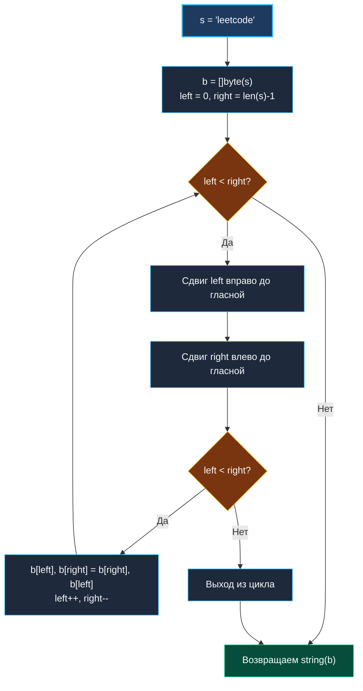

> *«Хороший программист знает, что делает машина; великий программист предвидит, как она будет это делать».*  
> — Деннис Ритчи

## LeetCode 345. Reverse Vowels of a String

**Сложность:** Easy  
**Тема:** Встречные указатели, строки в Go, селективный обмен in-place, табличные проверки  
**Ссылки:** [[02. Два указателя/1. Теория. Два указателя|Теория: Два указателя]], [[02. Два указателя/2. Варианты применения|Варианты применения]], [[02. Два указателя/3. Valid Palindrome|Valid Palindrome]]

---

### 1. Введение и физическая интуиция

Представьте строку как последовательность вагонов в железнодорожном составе: `"h e l l o"`.  
Некоторые вагоны — пассажирские (гласные буквы: `a, e, i, o, u`), другие — грузовые платформы (согласные буквы и знаки препинания).

Задача требует развернуть порядок пассажирских вагонов задом наперед, оставив грузовые платформы строго на своих исходных путях:
- В слове `"hello"` гласные `'e'` и `'o'` меняются местами $\implies$ `"holle"`.
- В слове `"leetcode"` гласные `['e', 'e', 'o', 'e']` превращаются в `['e', 'o', 'e', 'e']` $\implies$ `"leotcede"`.

Используя два встречных указателя, мы скользим с двух концов состава навстречу друг другу:
- Левый указатель ищет первую гласную слева.
- Правый указатель ищет первую гласную справа.
- Обнаружив пару гласных, мы меняем их местами и продолжаем движение к центру состава.



---

### 2. Формулировка задачи и вопросы интервьюеру

Дана строка `s`. Развернуть только гласные буквы в строке и вернуть полученный результат. Гласными буквами считаются `'a'`, `'e'`, `'i'`, `'o'`, `'u'` в строчном и заглавном регистрах (`'A'`, `'E'`, `'I'`, `'O'`, `'U'`). Буква `'y'` гласной не считается.

#### Вопросы интервьюеру (Senior-стиль):
1. **Каков алфавит входных строк?**  
   *«Стандартные ASCII-символы. Это позволяет использовать мутабельный срез байтов `[]byte(s)` без накладных расходов на `[]rune(s)`.»*
2. **Нужно ли учитывать регистр?**  
   *«Да, заглавные и строчные буквы сохраняют свой регистр при перемещении на новую позицию (например, заглавная `'E'` перейдет на место строчной `'o'` именно как заглавная `'E'`).»*
3. **Что возвращать для пустой строки или строки без гласных?**  
   *«Возвращать исходную строку без изменений.»*

---

### 3. Разбор подходов

#### Подход 1: Два прохода со сбором гласных в срез (Наивный)
1. Первый проход: выписать все гласные буквы в отдельный слайс `vowels := []byte{}`.
2. Второй проход: перезаписать гласные позиции в строке значениями из `vowels` в обратном порядке.
- **Минусы:** Два прохода по строке, дополнительная аллокация среза `vowels` в куче, лишняя работа Garbage Collector.

#### Подход 2: Встречные указатели на мутабельном буфере (Оптимальный)
Строки в Go неизменяемы (immutable). Мы один раз преобразуем строку в `[]byte(s)` и производим селективный обмен на месте встречными указателями за один проход: $O(N)$ по времени и $O(1)$ вспомогательной памяти (за исключением самого среза байтов).

---

### 4. Эталонная реализация на Go

```go
package main

// ReverseVowels разворачивает порядок только гласных букв в строке s.
// Временная сложность: O(N) — каждый байт строки инспектируется не более 2 раз.
// Пространственная сложность: O(N) под мутабельный буфер результата.
func ReverseVowels(s string) string {
	// Строки в Go иммутабельны. Создаем байтовый срез для in-place модификаций
	b := []byte(s)
	left, right := 0, len(b)-1

	for left < right {
		// Пропускаем согласные буквы слева
		for left < right && !isVowel(b[left]) {
			left++
		}
		// Пропускаем согласные буквы справа
		for left < right && !isVowel(b[right]) {
			right--
		}

		// Если оба указателя остановились на гласных и не пересеклись
		if left < right {
			b[left], b[right] = b[right], b[left]
			left++
			right--
		}
	}

	return string(b)
}

// isVowel выполняет O(1) проверку на гласную букву.
// switch компилируется в плоскую jump table или битовую маску без аллокаций.
func isVowel(c byte) bool {
	switch c {
	case 'a', 'e', 'i', 'o', 'u',
		'A', 'E', 'I', 'O', 'U':
		return true
	default:
		return false
	}
}
```

---

### 5. Пошаговая трассировка (Walkthrough)

Рассмотрим слово `s = "leetcode"` ($len = 8$).

| Шаг | `left` | `b[left]` | `right` | `b[right]` | Действие | Состояние буфера `b` |
|:---:|:---:|:---:|:---:|:---:|:---|:---|
| 0 | 0 | `'l'` | 7 | `'e'` | `left` пропускает `'l'` $\implies left=1$ (`'e'`) | `"leetcode"` |
| 1 | 1 | `'e'` | 7 | `'e'` | Гласные с обеих сторон $\implies$ `swap(1, 7)`, `left=2, right=6` | `"leotcede"` |
| 2 | 2 | `'e'` | 6 | `'d'` | `right` пропускает `'d'` $\implies right=5$ (`'o'`) | `"leotcede"` |
| 3 | 2 | `'e'` | 5 | `'o'` | Гласные с обеих сторон $\implies$ `swap(2, 5)`, `left=3, right=4` | `"leotcede"` |
| 4 | 3 | `'t'` | 4 | `'c'` | `left` пропускает `'t'`, `right` пропускает `'c'` $\implies left > right$ | **`"leotcede"`** |

Цикл завершен. Возвращаем строку `"leotcede"`.

---

### 6. Mechanical Sympathy: почему `switch` лучше `map`

| Подход к проверке `isVowel` | Ассемблерные инструкции | Аллокации памяти | Кэш CPU |
|:---|:---:|:---:|:---|
| **`map[byte]bool`** | ~$40\text{--}60$ тактов (хэширование, поиск бакета, pointer chasing) | 48 байт в куче под `hmap` | Возможен Cache Miss при обращении к бакету |
| **`switch` по константам** | **$1\text{--}3$ такта** (непосредственные сравнения или битовая маска) | **0 байт** (встроено в код) | Инструкции прогреты в L1i кэше |

> [!TIP]
> **Альтернатива высшего пилотажа (Битовая маска):**  
> Поскольку все гласные лежат в диапазоне кодов ASCII от 65 (`'A'`) до 117 (`'u'`), проверку можно выполнить за 1 такт с помощью битовой маски `uint128`, где установленные биты соответствуют позициям гласных букв. Однако стандартный Go `switch` по байтовым литералам оптимизируется компилятором настолько эффективно, что ручная битовая магия не требуется.

---

### 7. Вопросы для собеседования

> [!INTERVIEW]
> **Вопрос:** Зачем мы дублируем проверку `if left < right` перед обменом, если она уже есть в заголовке внешнего цикла `for left < right`?  
> **Ответ:**  
> Внутри цикла мы сдвигаем указатели во вложенных циклах `while !isVowel`. Если в центре строки больше нет гласных (или осталась ровно одна), указатели `left` и `right` могут сойтись в одной точке или перехлестнуться (`left >= right`).  
> Без дополнительной проверки `if left < right` мы выполнили бы некорректный повторный обмен уже обработанных символов или холостой сдвиг `left++, right--`.

---

### 8. Инварианты и чек-лист самопроверки

- [x] **Иммутабельность:** исходная строка скопирована в `[]byte` ровно один раз.
- [x] **Граничное условие `left < right` во всех циклах:** предотвращает панику выхода за пределы среза.
- [x] **Регистронезависимость:** проверены все 10 вариантов гласных (`5` строчных + `5` заглавных).

---

### Итоги кластера 02 «Два указателя»

Мы завершили детальный разбор всех ключевых задач на паттерн «Два указателя»:
1. [[02. Два указателя/3. Valid Palindrome|Valid Palindrome]] — встречные указатели на строках с фильтрацией мусора.
2. [[02. Два указателя/4. Two Sum II Sorted Array|Two Sum II]] — математическое сужение пространства поиска в отсортированном срезе.
3. [[02. Два указателя/5. Remove Duplicates from Sorted Array|Remove Duplicates]] — быстрый и медленный указатели (read/write) in-place.
4. [[02. Два указателя/6. 3Sum|3Sum]] и [[02. Два указателя/7. 4Sum|4Sum]] — сортировка, дедупликация и ранняя отсечка ветвей.
5. [[02. Два указателя/8. Sort Colors|Sort Colors]] — три указателя Дейкстры (голландский флаг).
6. [[02. Два указателя/9. Squares of Sorted Array|Squares of Sorted Array]] — встречные указатели с обратным заполнением.
7. [[02. Два указателя/10. Reverse Vowels of String|Reverse Vowels of String]] — селективный обмен элементов.

Следующий шаг нашего путешествия — кластер **«Скользящее окно» (Sliding Window)**, где два указателя обретают динамическое состояние и превращают сложные задачи на поиск подмассивов и подстрок в линейные алгоритмы: [[03. Скользящее окно/1. Теория. Скользящее окно|1. Теория. Скользящее окно]].