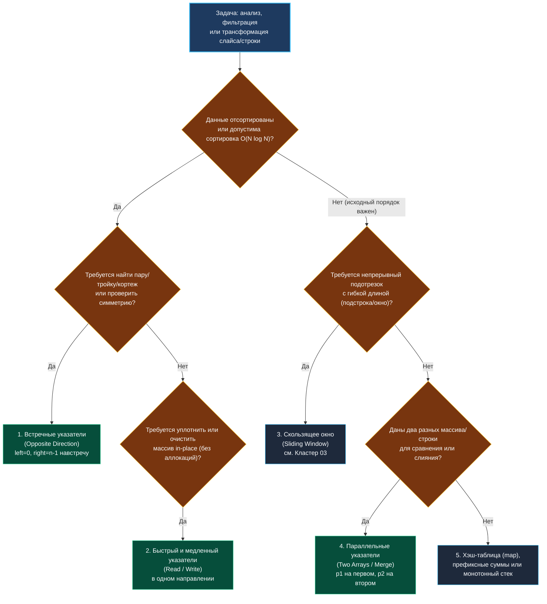

> *«Прежде чем бросаться писать код, окиньте задачу взглядом и найдите в ней симметрию или монотонность. Природа любит простоту».*  
> — Чарльз Хоар

# 2. Варианты применения двух указателей

**Тема:** Классификация паттернов, дерево принятия решений, сигналы задачи на интервью  
**Ссылки:** [[02. Два указателя/1. Теория. Два указателя|Теория: Два указателя]], [[02. Два указателя/3. Valid Palindrome|Valid Palindrome]], [[02. Два указателя/4. Two Sum II Sorted Array|Two Sum II]], [[02. Два указателя/5. Remove Duplicates from Sorted Array|Remove Duplicates]]

---

### 1. Карта принятия решений

На техническом интервью Senior-инженер тратит не более 30–60 секунд на определение базовой парадигмы. Главное — распознать характерные «триггеры» в формулировке условий.



---

### 2. Паттерн 1: Встречные указатели (Opposite Direction)

#### Сигналы в условии задачи:
- Массив **уже отсортирован** (или элементы можно отсортировать без потери инварианта).
- Требуется найти два элемента, сумма, разность или произведение которых удовлетворяет критерию (`target`).
- Требуется проверить строковую или числовую **зеркальность (палиндром)**.
- Геометрическая оптимизация крайних границ (поиск максимального объема или площади).

#### Инвариант и механика:
Один указатель ставится на минимальный элемент (`left = 0`), второй — на максимальный (`right = len(arr) - 1`).
- Если текущая комбинация «меньше желаемого», единственный способ ее увеличить — сдвинуть `left++`.
- Если комбинация «больше желаемого», единственный способ уменьшить ее — сдвинуть `right--`.
- Указатели сужают диапазон, отсекая сразу целые строки и столбцы гипотетической матрицы перебора $N \times N$.

#### Каталог задач в кластере:
1. [[02. Два указателя/3. Valid Palindrome|Valid Palindrome]] — проверка симметрии с пропуском небуквенных символов.
2. [[02. Два указателя/4. Two Sum II Sorted Array|Two Sum II]] — классический поиск пары в отсортированном массиве.
3. [[02. Два указателя/6. 3Sum|3Sum]] — фиксация внешнего элемента $nums[i]$ и встречные указатели для поиска пары с суммой $-nums[i]$.
4. [[02. Два указателя/7. 4Sum|4Sum]] — двойной внешний цикл плюс встречные указатели.
5. [[02. Два указателя/9. Squares of Sorted Array|Squares of Sorted Array]] — заполнение квадратов с конца, сравнивая абсолютные значения на концах.
6. [[02. Два указателя/10. Reverse Vowels of String|Reverse Vowels of String]] — встречный обмен гласных букв.

---

### 3. Паттерн 2: Быстрый и медленный указатели (Fast & Slow / Read & Write)

#### Сигналы в условии задачи:
- Ключевые фразы: **"in-place"**, **"O(1) extra memory"**, **"modify the input array"**.
- Требуется удалить определенные элементы (дубликаты, нули, заданное значение `val`).
- Требуется сохранить взаимный порядок оставшихся элементов (стабильная фильтрация).

#### Инвариант и механика:
- Указатель `read` (быстрый) инспектирует каждый элемент среза подряд.
- Указатель `write` (медленный) указывает на позицию, куда должен быть записан следующий валидный элемент.
- Пока `read` встречает мусорные элементы, `write` стоит на месте. Как только `read` находит полезный элемент, происходит запись: `arr[write] = arr[read]`, после чего `write++`.

```go
// Идиоматичный шаблон компактификации в Go
write := 0
for read := 0; read < len(nums); read++ {
    if isKeep(nums[read]) {
        nums[write] = nums[read]
        write++
    }
}
// write возвращает новую эффективную длину среза: nums[:write]
```

#### Каталог задач в кластере:
1. [[02. Два указателя/5. Remove Duplicates from Sorted Array|Remove Duplicates from Sorted Array]] — схлопывание повторов в отсортированном срезе.
2. [[01. Массивы и строки/10. Move Zeroes|Move Zeroes]] — вытеснение нулей в конец массива с сохранением порядка чисел.
3. [[02. Два указателя/8. Sort Colors|Sort Colors]] (Dutch National Flag) — обобщение до 3 указателей (`low`, `mid`, `high`) для сортировки массива из значений 0, 1, 2 за один проход.

---

### 4. Паттерн 3: Параллельные указатели на разных структурах

#### Сигналы в условии задачи:
- Даны **два или более независимых среза** или строки.
- Задача требует слить их воедино, проверить отношение подпоследовательности или найти пересечение.

#### Инвариант и механика:
- Указатель `p1` обходит первый срез, `p2` — второй.
- При слиянии с сохранением сортировки элементы сравниваются: `nums1[p1]` против `nums2[p2]`. Меньший помещается в результат.
- Особый трюк: слияние **с конца** (обратные указатели), если один из срезов имеет достаточный буфер, чтобы избежать перезаписи еще не прочитанных данных.

#### Каталог задач:
- [[01. Массивы и строки/9. Merge Sorted Array|Merge Sorted Array]] — слияние двух отсортированных массивов с конца без выделения дополнительной памяти.
- Проверка на подпоследовательность (`isSubsequence(s, t)`).

---

### 5. Паттерн 4: Скользящее окно (Краткий обзор)

Когда задача требует найти подотрезок или подстроку переменной или фиксированной длины, удовлетворяющую заданному критерию (максимальная сумма, подстрока без повторов, минимальное окно с символами), указатели двигаются в одну сторону, но формируют динамический интервал `[left, right]`.

Подробный разбор, типовые шаблоны и задачи собраны в следующем кластере: [[03. Скользящее окно/1. Теория. Скользящее окно|Кластер 03. Скользящее окно]].

---

### 6. Сравнительная матрица применимости

| Сценарий | Лучший паттерн | Временная сложность | Память | Пример задачи |
|:---|:---|:---:|:---:|:---|
| Поиск пары с суммой в отсортированном массиве | Встречные указатели | $O(N)$ | **$O(1)$** | Two Sum II |
| Поиск пары в произвольном неотсортированном массиве | Хэш-таблица (`map`) | $O(N)$ | $O(N)$ | Two Sum (LeetCode 1) |
| Поиск уникальных троек с суммой 0 | Сортировка + Встречные указатели | $O(N^2)$ | **$O(1)$** | 3Sum |
| Удаление дубликатов / фильтрация на месте | Быстрый и медленный указатели | $O(N)$ | **$O(1)$** | Remove Duplicates |
| Проверка строки на палиндром | Встречные указатели | $O(N)$ | **$O(1)$** | Valid Palindrome |
| Слияние двух упорядоченных массивов in-place | Обратные параллельные указатели | $O(N + M)$ | **$O(1)$** | Merge Sorted Array |
| Сортировка 3 типов элементов за один проход | 3 указателя (Dutch Flag) | $O(N)$ | **$O(1)$** | Sort Colors |

---

### 7. Итог

Паттерн двух указателей — это квинтэссенция алгоритмической прагматики: минимум сущностей, нулевые накладные расходы на структуры данных и максимальная скорость исполнения за счет непрерывного обхода памяти.

Приступаем к практической реализации! Наш первый шаг — классическая задача на встречные указатели со строками: [[02. Два указателя/3. Valid Palindrome|3. Valid Palindrome]].