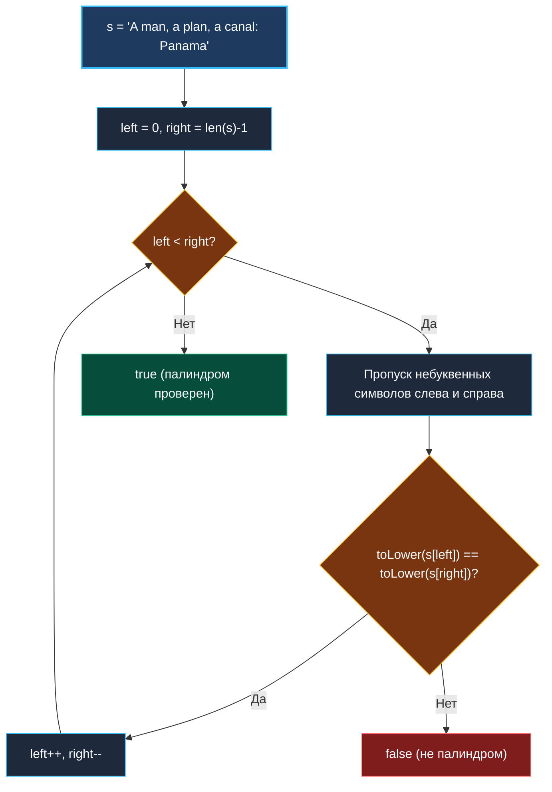

> *«Вглядитесь в строку с обоих концов — и симметрия откроется без единого лишнего движения».*  
> — Брайан Керниган

## LeetCode 125. Valid Palindrome

**Сложность:** Easy  
**Тема:** Встречные указатели, строки, ASCII vs Unicode, нулевые аллокации  
**Ссылки:** [[02. Два указателя/1. Теория. Два указателя|Теория: Два указателя]], [[02. Два указателя/2. Варианты применения|Варианты применения]], [[02. Два указателя/4. Two Sum II Sorted Array|Two Sum II]]

---

### 1. Введение и физическая интуиция

Палиндром — фраза-перевертыш, одинаково читающаяся слева направо и справа налево, если пренебречь пробелами, знаками пунктуации и регистром букв. Классический пример: *"A man, a plan, a canal: Panama"*.

Представьте двух инженеров, осматривающих железнодорожный мост с противоположных берегов реки. Они идут навстречу друг другу шаг за шагом, осматривая заклепки и балки:
- Левый инженер видит пробелы, запятые и двоеточия — он просто перешагивает через них, пока не упрется в настоящую букву.
- Правый инженер делает то же самое с другого конца.
- Встретившись глазами на очередных буквах, они сравнивают их: `'a'` и `'A'` (в нижнем регистре оба `'a'`) — совпадение! Они продолжают идти навстречу, пока не сойдутся в центре моста.

Встречные указатели позволяют решить задачу за **один проход** с **нулевой дополнительной памятью** ($O(1)$) прямо по байтовому буферу исходной строки.



---

### 2. Формулировка задачи и вопросы интервьюеру

Дана строка `s`. Требуется определить, является ли она палиндромом, учитывая только буквенно-цифровые символы и игнорируя регистр.

#### Вопросы интервьюеру (Senior-стиль):
1. **Каков алфавит входной строки?**  
   *«Только ASCII или произвольный UTF-8? В стандартных ограничениях LeetCode гарантируются печатные символы ASCII. Это позволяет обойтись байтовой индексацией `s[i]` без аллокации слайса рун `[]rune(s)`.»*
2. **Что считать буквенно-цифровым символом (alphanumeric)?**  
   *«Символы `'a'..'z'`, `'A'..'Z'` и цифры `'0'..'9'`. Пробелы, двоеточия, кавычки, запятые отбрасываются.»*
3. **Что возвращать для пустой строки или строки из одних пробелов?**  
   *«Пустая строка после очистки читается одинаково в обоих направлениях — возвращаем `true`.»*

---

### 3. Разбор подходов

#### Подход 1: Создание очищенной копии строки (Наивный)
Отфильтровать строку во временный слайс `[]byte`, привести к нижнему регистру, а затем сравнить с развернутой копией.

```go
func isPalindromeNaive(s string) bool {
    var clean []byte
    for i := 0; i < len(s); i++ {
        c := s[i]
        if isAlphanumeric(c) {
            clean = append(clean, toLower(c))
        }
    }
    for i := 0; i < len(clean)/2; i++ {
        if clean[i] != clean[len(clean)-1-i] {
            return false
        }
    }
    return true
}
```

**Минусы:**  
Выделяет до $O(N)$ памяти в куче под слайс `clean`, заставляя GC собирать временный буфер. На больших объемах данных это приводит к ненужной фрагментации памяти.

---

#### Подход 2: Встречные указатели in-place (Оптимальный)
Два индекса `left` и `right` начинают движение с противоположных концов строки. На каждом шаге они перешагивают через невалидные символы и сравнивают буквы без создания каких-либо промежуточных строк.

---

### 4. Эталонная реализация на Go

```go
package main

// IsPalindrome проверяет, является ли строка палиндромом,
// игнорируя регистр и небуквенно-цифровые символы.
// Временная сложность: O(N) — каждый байт читается не более 2 раз.
// Пространственная сложность: O(1) — 0 аллокаций в куче.
func IsPalindrome(s string) bool {
	left, right := 0, len(s)-1

	for left < right {
		// Пропускаем небуквенно-цифровые символы слева
		for left < right && !isAlphanumeric(s[left]) {
			left++
		}
		// Пропускаем небуквенно-цифровые символы справа
		for left < right && !isAlphanumeric(s[right]) {
			right--
		}

		// Сравниваем символы в нижнем регистре
		if toLower(s[left]) != toLower(s[right]) {
			return false
		}

		left++
		right--
	}

	return true
}

// isAlphanumeric проверяет, является ли ASCII-байт буквой или цифрой
func isAlphanumeric(b byte) bool {
	return (b >= 'a' && b <= 'z') ||
		(b >= 'A' && b <= 'Z') ||
		(b >= '0' && b <= '9')
}

// toLower переводит заглавную ASCII-букву в строчную
func toLower(b byte) byte {
	if b >= 'A' && b <= 'Z' {
		return b + ('a' - 'A') // прибавляем 32
	}
	return b
}
```

---

### 5. Пошаговая трассировка (Walkthrough)

Возьмем строку: `"A man, a plan, a canal: Panama"`

| Шаг | `left` | `s[left]` | `right` | `s[right]` | Действие |
|:---:|:---:|:---:|:---:|:---:|:---|
| 1 | 0 | `'A'` | 29 | `'a'` | `toLower('A') == toLower('a')` $\to$ совпало, `left=1, right=28` |
| 2 | 1 | `' '` (пробел) | 28 | `'m'` | Пропуск пробела $\to$ `left=2` (`'m'`) |
| 3 | 2 | `'m'` | 28 | `'m'` | Совпало, `left=3, right=27` |
| 4 | 3 | `'a'` | 27 | `'a'` | Совпало, `left=4, right=26` |
| 5 | 4 | `'n'` | 26 | `'n'` | Совпало, `left=5, right=25` |
| ... | ... | ... | ... | ... | Указатели сходятся к центру строки |
| Конец | 15 | `' '` | 15 | `' '` | `left == right`, цикл завершен $\to$ возвращаем `true` |

---

### 6. Mechanical Sympathy: байтовая арифметика и регистры CPU

1. **Побайтовый доступ `s[left]`:**  
   Поскольку строка в Go — это структура `{ Data uintptr, Len int }`, обращение `s[left]` компилируется в одну команду `MOVZX` (чтение байта из памяти с расширением нулями в регистр).
2. **Битовый трюк для ASCII `toLower`:**  
   Разница между `'a'` (0x61, `0110 0001`) и `'A'` (0x41, `0100 0001`) заключается ровно в одном 5-м бите (маска `0x20` или 32). Выражение `b | 0x20` переводит любую латинскую букву в строчную за 1 такт CPU!
3. **Нулевая нагрузка на GC:**  
   Вся функция использует только два регистра процессора (`left`, `right`). Ни одного вызова `runtime.newobject`, ни одного байта в куче.

---

### 7. Работа с Unicode: когда нужен `unicode.ToLower`

Если интервьюер спрашивает: *«А как поступить, если входная строка — это кириллица или многоязычный UTF-8 текст (например, "А роза упала на лапу Азора")?»*

В UTF-8 русские буквы занимают по 2 байта. Побайтовое сравнение сломается, так как мы разрежем кодовую точку пополам. Решение для произвольного Unicode:

```go
import "unicode"

func isPalindromeUnicode(s string) bool {
    runes := []rune(s) // O(N) памяти под срез кодовых точек int32
    left, right := 0, len(runes)-1

    for left < right {
        for left < right && !isAlphaNumRune(runes[left]) {
            left++
        }
        for left < right && !isAlphaNumRune(runes[right]) {
            right--
        }

        if unicode.ToLower(runes[left]) != unicode.ToLower(runes[right]) {
            return false
        }
        left++
        right--
    }
    return true
}

func isAlphaNumRune(r rune) bool {
    return unicode.IsLetter(r) || unicode.IsDigit(r)
}
```

> [!TIP]
> На собеседовании обязательно проговорите:  
> *«Для чистого ASCII я использую побайтовую реализацию с $O(1)$ памяти. Для Unicode потребуется декодирование UTF-8 через `[]rune` или `utf8.DecodeRuneInString`, что потребует $O(N)$ памяти или чуть более сложного прохода с прямым и обратным декодированием.»*

---

### 8. Вопросы для собеседования

> [!INTERVIEW]
> **Вопрос:** Зачем мы проверяем условие `left < right` внутри вложенных циклов `for !isAlphanumeric(s[left])`?  
> **Ответ:** Без этой проверки строка, состоящая исключительно из знаков препинания (например, `"   .,:;   "`), приведет к бесконечному инкременту `left` за пределы среза и спровоцирует `runtime error: index out of range [N] with length N`.

> [!NOTE]
> **Вопрос:** Почему мы не использовали пакет `strings.ToLower()` перед началом работы?  
> **Ответ:** `strings.ToLower(s)` создает полную копию строки в куче размером $N$ байт. Наш посимвольный метод `toLower()` обрабатывает только валидные символы на лету, сохраняя константную память $O(1)$.

---

### 9. Инварианты и чек-лист самопроверки

- [x] **Граничное условие `left < right` во всех циклах:** гарантирует защиту от выхода за границы слайса при пустых или мусорных строках.
- [x] **Симметричный сдвиг:** после каждого успешного совпадения обязателен сдвиг обоих указателей: `left++`, `right--`.
- [x] **Zero Allocations:** для ASCII алгоритм работает со строгой памятью $O(1)$.

Следующая задача кластера покажет, как встречные указатели используются для поиска числовых пар в отсортированном массиве: [[02. Два указателя/4. Two Sum II Sorted Array|4. Two Sum II Sorted Array]].