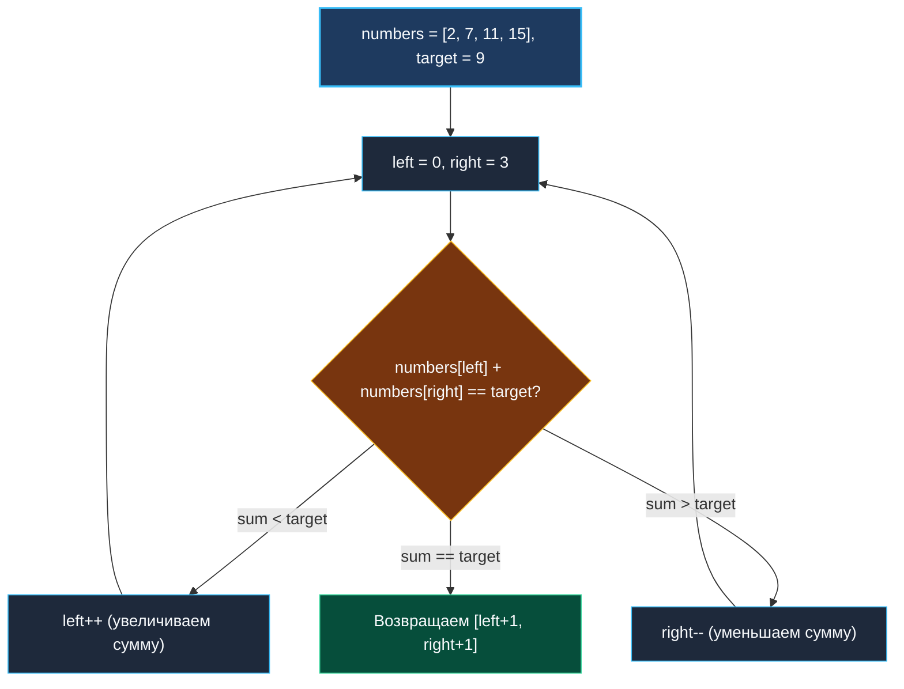

> *«Когда данные упорядочены, поиск перестаёт быть блужданием впотьмах и становится уверенным движением навстречу цели».*  
> — Дональд Кнут

## LeetCode 167. Two Sum II - Input Array Is Sorted

**Сложность:** Medium  
**Тема:** Встречные указатели, отсортированные массивы, $O(1)$ по памяти  
**Ссылки:** [[01. Массивы и строки/3. Two Sum|Классический Two Sum]], [[02. Два указателя/1. Теория. Два указателя|Теория: Два указателя]], [[02. Два указателя/6. 3Sum|3Sum]]

---

### 1. Введение и физическая интуиция

В классической задаче Two Sum массив не был упорядочен, и нам приходилось жертвовать памятью, разворачивая хэш-таблицу `map[int]int` для поиска дополнений $target - x$ за $O(1)$.

В Two Sum II массив **уже отсортирован по неубыванию**. Это кардинально меняет правила игры.

Представьте весы с двумя чашами. Мы берем самое легкое число из начала массива (`left = 0`) и самое тяжелое число из конца (`right = len(numbers) - 1`):
- Их сумма больше `target`? Никакое другое число в паре с текущим `right` не даст меньшую сумму — значит, текущий правый элемент **заведомо непригоден** ни с одним оставшимся левым. Сдвигаем `right--`.
- Их сумма меньше `target`? Аналогично: текущий левый элемент слишком мал даже в паре с самым большим числом. Сдвигаем `left++`.
- Сумма равна `target`? Искомая пара найдена!

Мы отсекаем целые подмножества возможных пар за один шаг, не делая ни одной аллокации в куче.



---

### 2. Формулировка задачи и вопросы интервьюеру

Дан отсортированный по неубыванию массив целых чисел `numbers`. Необходимо найти два индекса (1-индексированных!), сумма элементов на которых равна `target`.  
Гарантируется, что решение существует и в точности одно. Нельзя использовать один и тот же элемент дважды. Дополнительная память должна быть $O(1)$.

#### Вопросы интервьюеру (Senior-стиль):
1. **Могут ли числа быть отрицательными?**  
   *«Да, в диапазоне $[-1000, 1000]$. На монотонность суммы это никак не влияет.»*
2. **Могут ли быть дубликаты?**  
   *«Да, но так как решение ровно одно, дубликаты либо сформируют пару (например, `[2, 2]` для таргета 4), либо будут безопасно пропущены алгоритмом.»*
3. **Требуется ли 1-индексация результата?**  
   *«Да, условие LeetCode 167 требует вернуть индексы `[left+1, right+1]`.»*

---

### 3. Разбор подходов

#### Подход 1: Хэш-таблица `map[int]int` (Субоптимальный)
Мы могли бы применить решение от LeetCode 1:

```go
func twoSumMap(numbers []int, target int) []int {
    seen := make(map[int]int, len(numbers))
    for i, num := range numbers {
        if idx, ok := seen[target-num]; ok {
            return []int{idx + 1, i + 1}
        }
        seen[num] = i
    }
    return nil
}
```

**Почему на собеседовании это минус:**
- Требует $O(N)$ памяти в куче, нарушая жесткое условие задачи: $O(1)$ extra space.
- Полностью игнорирует главное преимущество входных данных — их отсортированность.

---

#### Подход 2: Встречные указатели (Эталонный)
Два указателя движутся навстречу друг другу. За счет монотонности отсортированного массива мы детерминированно управляем суммой: `left++` строго увеличивает сумму, `right--` строго уменьшает её.

---

### 4. Эталонная реализация на Go

```go
package main

// TwoSum находит 1-индексированную пару элементов с суммой target
// в отсортированном массиве numbers.
// Временная сложность: O(N) — каждый указатель делает не более N шагов.
// Пространственная сложность: O(1) вспомогательной памяти.
func TwoSum(numbers []int, target int) []int {
	left, right := 0, len(numbers)-1

	for left < right {
		currentSum := numbers[left] + numbers[right]

		switch {
		case currentSum == target:
			// По условию задачи возвращаются 1-based индексы
			return []int{left + 1, right + 1}
		case currentSum < target:
			left++
		default: // currentSum > target
			right--
		}
	}

	return nil // По условию решение всегда существует
}
```

---

### 5. Пошаговая трассировка (Walkthrough)

Возьмем входные данные: `numbers = [2, 3, 4, 7, 11, 15]`, `target = 9`.

| Шаг | `left` (значение) | `right` (значение) | Сумма `numbers[l] + numbers[r]` | Сравнение с `target=9` | Действие |
|:---:|:---:|:---:|:---:|:---:|:---|
| 1 | 0 (`2`) | 5 (`15`) | $2 + 15 = 17$ | $17 > 9$ | `right--` |
| 2 | 0 (`2`) | 4 (`11`) | $2 + 11 = 13$ | $13 > 9$ | `right--` |
| 3 | 0 (`2`) | 3 (`7`) | $2 + 7 = 9$ | **$9 == 9$** | **Найдено!** |

Ответ: `[0+1, 3+1] = [1, 4]`. Всего 3 итерации вместо перебора 15 пар!

---

### 6. Математическое доказательство корректности (Exchange Argument)

Почему мы уверены, что алгоритм не может «перескочить» через искомую пару $(i, j)$?

Пусть истинное решение находится на индексах $(i, j)$, где $i < j$.
1. В начале алгоритма: $left = 0 \le i$ и $right = len - 1 \ge j$.
2. В процессе работы либо `left` дойдет до $i$, либо `right` дойдет до $j$.
3. Допустим, `left` первым достиг индекса $i$. Теперь на позиции $left$ стоит правильный элемент $numbers[i]$.  
   Поскольку массив отсортирован и $numbers[i] + numbers[j] == target$, то для любого текущего $right > j$ выполняется:
   $$ numbers[left] + numbers[right] = numbers[i] + numbers[right] \ge numbers[i] + numbers[j] = target $$
   (если бы сумма была равна target при $right > j$, это означало бы множественные решения, а условие гарантирует уникальность).  
   Следовательно, сумма будет строго $> target$.
4. Алгоритм на каждом следующем шаге будет уменьшать `right`, пока $right$ не станет в точности равен $j$.
5. Указатель $left$ при этом не сдвинется с места!

Аналогично, если $right$ первым достигнет $j$, алгоритм будет только увеличивать $left$, пока тот не достигнет $i$. Пропустить ответ математически невозможно.

---

### 7. Mechanical Sympathy: почему это работает с молниеносной скоростью

- **Нулевые аллокации:** алгоритм хранит три 64-битные переменные (`left`, `right`, `currentSum`), которые аллоцируются строго в процессорных регистрах `RAX`, `RBX`, `RCX`.
- **L1d Cache Prefetching:** процессор одновременно считывает данные из двух концов непрерывного буфера. Поскольку шаг всегда равен $\pm 8$ байтам, аппаратный стрим-префетчер процессора загружает кэш-линии без единого промаха (zero cache misses).
- **Сравнение через `switch`:** плоский `switch` компилируется в эффективную ветвящуюся последовательность `CMP` / `JL` / `JG`.

---

### 8. Вопросы для собеседования

> [!INTERVIEW]
> **Вопрос:** Что лучше: решить эту задачу через бинарный поиск для каждого элемента или через два указателя?  
> **Ответ:**  
> Решение бинарным поиском (для каждого $i$ искать $target - numbers[i]$ в оставшейся части среза) дает сложность $O(N \log N)$ по времени и $O(1)$ по памяти.  
> Встречные указатели дают $O(N)$ по времени и $O(1)$ по памяти.  
> Два указателя строго превосходят бинарный поиск как асимптотически, так и по кэш-локальности.

> [!TIP]
> **Вопрос:** В чем фундаментальная разница между LeetCode 1 (Two Sum) и LeetCode 167 (Two Sum II)?  
> **Ответ:** В LeetCode 1 массив не отсортирован. Чтобы применить два указателя, нам пришлось бы отсортировать массив за $O(N \log N)$, но сортировка разрушила бы исходные индексы (потребовалось бы создавать массив структур `{val, originalIdx}`). Поэтому в LeetCode 1 оптимален $map$ за $O(N)$ времени и $O(N)$ памяти. В LeetCode 167 данные уже упорядочены, что позволяет получить идеальные $O(N)$ времени и $O(1)$ памяти.

---

### 9. Инварианты и чек-лист самопроверки

- [x] **Индексы 1-based:** возврат оформлен как `left + 1, right + 1`.
- [x] **Строго $O(1)$ памяти:** в теле функции нет ни одной аллокации в куче.
- [x] **Условие `left < right`:** исключает использование одного и того же элемента дважды.

Следующая задача кластера переносит нас от встречного движения к паттерну быстрого и медленного указателей для модификации слайса in-place: [[02. Два указателя/5. Remove Duplicates from Sorted Array|5. Remove Duplicates from Sorted Array]].