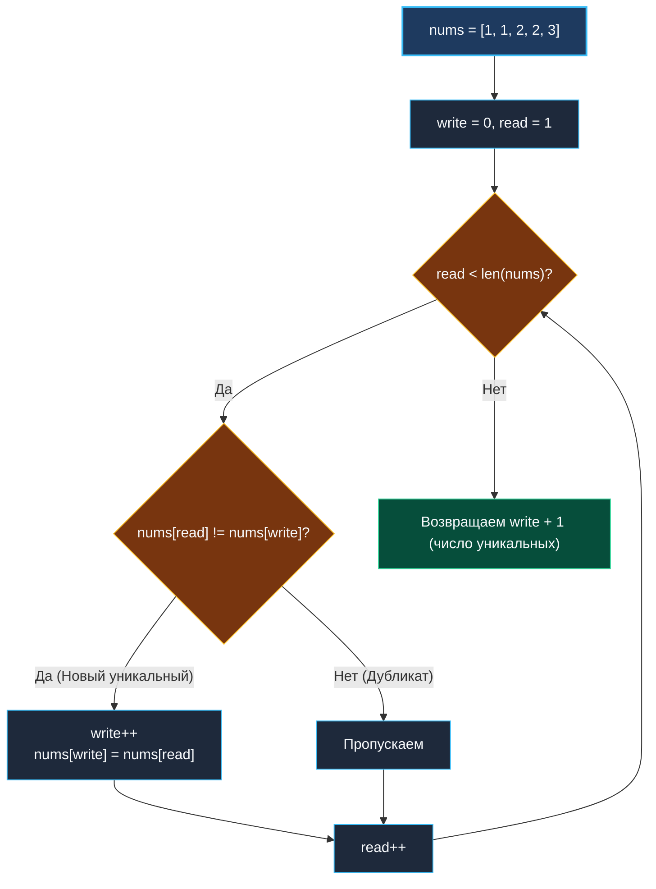

> *«Всякое усложнение программы должно быть оправдано, а удаление лишнего — это высшая форма оптимизации».*  
> — Брайан Керниган

## LeetCode 26. Remove Duplicates from Sorted Array

**Сложность:** Easy  
**Тема:** Быстрый и медленный указатели (Read & Write), in-place модификация, кэш-локальность  
**Ссылки:** [[02. Два указателя/1. Теория. Два указателя|Теория: Два указателя]], [[02. Два указателя/2. Варианты применения|Варианты применения]], [[01. Массивы и строки/10. Move Zeroes|Move Zeroes]]

---

### 1. Введение и физическая интуиция

Представьте конвейерную ленту на складе, по которой один за другим едут ящики с товарами. Поскольку товары уже рассортированы по номерам артикулов, одинаковые ящики идут строго пачками: `[1, 1, 2, 2, 2, 3, 4, 4]`.

На конвейере работают два сотрудника:
- **Инспектор (`read`):** бежит вдоль ленты вперед и осматривает каждый ящик.
- **Укладчик (`write`):** стоит позади и формирует эталонную витрину уникальных товаров прямо на той же ленте.

Укладчик уже зафиксировал первый ящик на позиции `0`. Инспектор бежит вперед:
- Видит такой же ящик? Пропускает его.
- Видит ящик с новым номером? Зовет укладчика: укладчик делает шаг вперед (`write++`) и переставляет новый уникальный ящик на эту позицию.

В конце концов первые `write + 1` ящиков на ленте содержат все уникальные товары в исходном порядке, а «хвост» ленты нас больше не интересует. Мы решили задачу за один проход с **нулевой аллокацией памяти** ($O(1)$) и без единого сдвига массива!



---

### 2. Формулировка задачи и вопросы интервьюеру

Дан отсортированный по неубыванию массив `nums`. Требуется удалить дубликаты **in-place** так, чтобы каждый уникальный элемент встречался ровно один раз, а относительный порядок сохранялся. Функция должна вернуть количество уникальных элементов $k$. Первые $k$ ячеек массива `nums` обязаны содержать итоговые значения.

#### Вопросы интервьюеру (Senior-стиль):
1. **Может ли массив быть пустым?**  
   *«Да, если `len(nums) == 0`, уникальных элементов нет — возвращаем `0`.»*
2. **Что должно находиться в элементах после первых $k$ позиций?**  
   *«Значения в `nums[k:]` не имеют значения и проверяться тестирующей системой не будут.»*
3. **Требуется ли изменять длину (`len`) или вместимость (`cap`) среза?**  
   *«Нет, функция принимает срез по значению заголовка (`[]int`) и возвращает целое число `int`. Сам нижележащий массив модифицируется in-place.»*

---

### 3. Разбор подходов

#### Подход 1: Создание вспомогательного среза или map (Недопустимый)
Сложить элементы в `map[int]struct{}` или скопировать во временный срез `unique := []int{}` с последующим вызовом `copy(nums, unique)`.  
- **Оценка:** требует $O(N)$ памяти в куче, нарушая жесткое условие задачи: $O(1)$ extra space.

#### Подход 2: Удаление элементов через `append` (Катастрофический)
При обнаружении дубликата вырезать его через `nums = append(nums[:i], nums[i+1:]...)`.  
- **Оценка:** каждый вызов `append` сдвигает весь оставшийся хвост среза в памяти! Временная сложность взлетает до $O(N^2)$. При $N = 30000$ это гарантированный Time Limit Exceeded.

#### Подход 3: Быстрый и медленный указатели (Эталонный)
Указатель `read` сканирует массив, а `write` фиксирует новые уникальные значения за один проход со сложностью $O(N)$ по времени и $O(1)$ по памяти.

---

### 4. Эталонная реализация на Go

```go
package main

// RemoveDuplicates удаляет дубликаты из отсортированного среза nums in-place.
// Возвращает k — количество уникальных элементов.
// Временная сложность: O(N) — ровно один проход.
// Пространственная сложность: O(1) памяти — 0 аллокаций.
func RemoveDuplicates(nums []int) int {
	if len(nums) == 0 {
		return 0
	}

	// Медленный указатель: индекс последнего записанного уникального элемента
	write := 0

	// Быстрый указатель: инспектирует элементы начиная со второго
	for read := 1; read < len(nums); read++ {
		// Поскольку срез отсортирован, новый элемент гарантированно отличается от nums[write]
		if nums[read] != nums[write] {
			write++
			nums[write] = nums[read]
		}
	}

	// Количество уникальных элементов равно индексу последнего элемента + 1
	return write + 1
}
```

---

### 5. Пошаговая трассировка (Walkthrough)

Рассмотрим массив `nums = [0, 0, 1, 1, 1, 2, 2, 3, 3, 4]`.

| Шаг | `read` | `nums[read]` | `write` | `nums[write]` | Условие `nums[read] != nums[write]` | Действие | Состояние `nums[:write+1]` |
|:---:|:---:|:---:|:---:|:---:|:---:|:---|:---|
| Старт | 1 | 0 | 0 | 0 | `0 != 0` (Ложь) | Дубликат, `read++` | `[0]` |
| 1 | 2 | 1 | 0 | 0 | `1 != 0` (Истина) | `write=1`, пишем `nums[1] = 1` | `[0, 1]` |
| 2 | 3 | 1 | 1 | 1 | `1 != 1` (Ложь) | Дубликат | `[0, 1]` |
| 3 | 4 | 1 | 1 | 1 | `1 != 1` (Ложь) | Дубликат | `[0, 1]` |
| 4 | 5 | 2 | 1 | 1 | `2 != 1` (Истина) | `write=2`, пишем `nums[2] = 2` | `[0, 1, 2]` |
| 5 | 6 | 2 | 2 | 2 | `2 != 2` (Ложь) | Дубликат | `[0, 1, 2]` |
| 6 | 7 | 3 | 2 | 2 | `3 != 2` (Истина) | `write=3`, пишем `nums[3] = 3` | `[0, 1, 2, 3]` |
| 7 | 8 | 3 | 3 | 3 | `3 != 3` (Ложь) | Дубликат | `[0, 1, 2, 3]` |
| 8 | 9 | 4 | 3 | 3 | `4 != 3` (Истина) | `write=4`, пишем `nums[4] = 4` | `[0, 1, 2, 3, 4]` |

Итог: цикл завершен, возвращаем `write + 1 = 5`. Первые 5 элементов массива содержат `[0, 1, 2, 3, 4]`.

---

### 6. Mechanical Sympathy: идеальная гармония с железом

1. **Hardware Prefetcher и последовательная память:**  
   Указатель `read` шагает строго вперед: `+8` байт на каждой итерации. Указатель `write` также движется строго вперед. Доступ к памяти строго последовательный, без случайных прыжков. Аппаратный блок предвыборки данных процессора заблаговременно закачивает кэш-линии (64 байта) в кэш L1d.
2. **Нулевой Write-Back мусора:**  
   Мы не зануляем и не очищаем остаток массива за пределами `write`. Это экономит сотни тактов шины памяти, не заставляя контроллер кэша сбрасывать «грязные» кэш-линии в оперативную память.
3. **Branch Predictor (Предсказатель переходов):**  
   Если в массиве дубликаты встречаются регулярными блоками, предсказатель ветвлений процессора (BTB) мгновенно подстраивается под ветвление `if nums[read] != nums[write]`, сводя паузы конвейера CPU (pipeline stalls) практически к нулю.

---

### 7. Follow-up с реальных собеседований: Remove Duplicates II

> [!INTERVIEW]
> **Вопрос:** Как изменить алгоритм, если разрешено оставлять **не более двух** дубликатов каждого элемента (LeetCode 80)?  
> **Ответ:**  
> Инвариант меняется минимально: новый элемент `nums[read]` должен сравниваться не с `nums[write]`, а с элементом на две позиции назад — `nums[write - 2]`:
> ```go
> func removeDuplicatesAtMostTwo(nums []int) int {
>     if len(nums) <= 2 {
>         return len(nums)
>     }
>     write := 2
>     for read := 2; read < len(nums); read++ {
>         if nums[read] != nums[write-2] {
>             nums[write] = nums[read]
>             write++
>         }
>     }
>     return write
> }
> ```
> Этот элегантный паттерн легко обобщается на любое допустимое количество повторов $K$.

---

### 8. Инварианты и чек-лист самопроверки

- [x] **Проверка пустого массива:** `len(nums) == 0` возвращает 0 до первого обращения по индексу.
- [x] **Один элемент:** при длине 1 цикл `for read := 1` даже не запускается, возвращается `write + 1 = 1`.
- [x] **Свойство $write \le read$:** медленный указатель математически никогда не обгоняет быстрый, перезапись еще не прочитанных данных физически невозможна.

Переходим к следующей фундаментальной задаче — классическому алгоритму поиска уникальных троек **3Sum**, объединяющему сортировку и встречные указатели: [[02. Два указателя/6. 3Sum|6. 3Sum]].