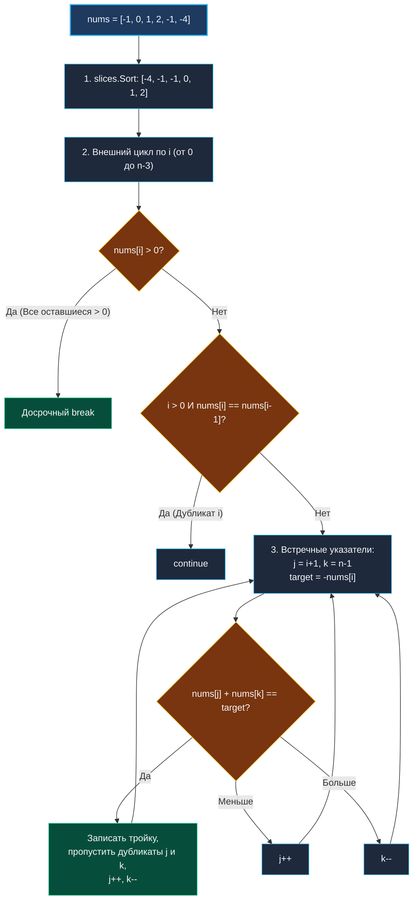

> *«Сложные алгоритмические конструкции вырастают из правильного комбинирования базовых приёмов: отсортируйте данные один раз, и хаос превратится в строгий порядок».*  
> — Никлаус Вирт

## LeetCode 15. 3Sum

**Сложность:** Medium  
**Тема:** Сортировка + Встречные указатели, дедупликация троек, ранняя отсечка (Pruning)  
**Ссылки:** [[01. Массивы и строки/4. Three Sum|Three Sum (Обзор)]], [[02. Два указателя/1. Теория. Два указателя|Теория: Два указателя]], [[02. Два указателя/4. Two Sum II Sorted Array|Two Sum II]], [[02. Два указателя/7. 4Sum|4Sum]]

---

### 1. Введение и физическая интуиция

Если задача Two Sum — это дуэт, то 3Sum — классическое трио. Нам требуется найти все уникальные наборы из трех чисел, которые в сумме дают круглый ноль: $a + b + c = 0$.

Главная ловушка задачи — комбинаторный взрыв и повторяющиеся тройки. В массиве из 3 000 элементов наивный перебор трех индексов потребует:
$$ \frac{3000 \times 2999 \times 2998}{6} \approx 4.5 \times 10^9 \text{ операций} $$
Программа неизбежно зависнет в тайм-ауте (Time Limit Exceeded).

Решение в стиле классической инженерной школы — **сведение задачи к уже решенной**:
1. Отсортируем массив за $O(N \log N)$.
2. Зафиксируем первое число $nums[i]$.
3. Теперь нам нужно найти два числа $nums[j]$ и $nums[k]$ в оставшейся правой части массива, сумма которых равна $-nums[i]$. А это не что иное, как задача [[02. Два указателя/4. Two Sum II Sorted Array|Two Sum II]]!
4. Встречные указатели решают эту подзадачу за $O(N)$ для каждого фиксированного $i$. Общая сложность схлопывается до комфортных $O(N^2)$.



---

### 2. Формулировка задачи и вопросы интервьюеру

Дан целочисленный массив `nums`. Найти все уникальные тройки `[nums[i], nums[j], nums[k]]` такие, что $i \ne j \ne k$ и $nums[i] + nums[j] + nums[k] == 0$.  
Итоговый набор троек не должен содержать дубликатов (например, нельзя возвращать дважды `[-1, 0, 1]`).

#### Вопросы интервьюеру (Senior-стиль):
1. **Каков размер входного массива?**  
   *«$3 \le len(nums) \le 3000$. Это подтверждает, что $O(N^2)$ — эталонная сложность, а $O(N^3)$ недопустима.»*
2. **Можно ли модифицировать исходный срез?**  
   *«Да, мы можем сортировать `nums` in-place, не аллоцируя дополнительную память.»*
3. **Что возвращать, если троек нет?**  
   *«В Go принято возвращать пустой слайс `[][]int{}` или `nil`.»*

---

### 3. Разбор подходов

#### Подход 1: Тройной вложенный цикл + `map` дедупликация (Наивный)
- **Сложность:** $O(N^3)$ по времени, $O(N)$ по памяти под хэш-таблицу нормализованных троек `map[[3]int]struct{}`.
- **Минусы:** гарантированный TLE на LeetCode и отказ на интервью.

#### Подход 2: Внешний цикл + `map` дополнений (Субоптимальный)
- Фиксируем $i$, а для оставшейся части запускаем классический Two Sum с хэш-мапой.
- **Минусы:** хотя асимптотика $O(N^2)$, дедупликация требует отдельной громоздкой логики или мапы троек, что влечет сотни тысяч мелких аллокаций в куче и сильнейшую нагрузку на Garbage Collector.

#### Подход 3: Сортировка + Встречные указатели (Эталонный)
- Предварительная сортировка объединяет дубликаты в непрерывные группы.
- Дедупликация выполняется элементарным пропуском соседних равных значений (`nums[idx] == nums[idx±1]`).
- Дополнительная память: $O(1)$ (не считая среза результатов).

---

### 4. Эталонная реализация на Go

```go
package main

import "slices"

// ThreeSum находит все уникальные тройки с суммой 0.
// Временная сложность: O(N^2) — квадратичный обход после быстрой сортировки O(N log N).
// Пространственная сложность: O(1) вспомогательной памяти (in-place).
func ThreeSum(nums []int) [][]int {
	n := len(nums)
	if n < 3 {
		return nil
	}

	// В современном Go (1.21+) используем быстрый pdqsort
	slices.Sort(nums)

	var result [][]int

	for i := 0; i < n-2; i++ {
		// Ранняя отсечка (Pruning): если наименьшее число в тройке больше нуля,
		// то сумма трех положительных чисел никогда не даст ноль!
		if nums[i] > 0 {
			break
		}

		// Дедупликация первого элемента: пропускаем одинаковые числа
		if i > 0 && nums[i] == nums[i-1] {
			continue
		}

		target := -nums[i]
		left, right := i+1, n-1

		for left < right {
			currentSum := nums[left] + nums[right]

			switch {
			case currentSum == target:
				// Тройка найдена
				result = append(result, []int{nums[i], nums[left], nums[right]})

				// Пропускаем дубликаты левого указателя
				for left < right && nums[left] == nums[left+1] {
					left++
				}
				// Пропускаем дубликаты правого указателя
				for left < right && nums[right] == nums[right-1] {
					right--
				}

				left++
				right--

			case currentSum < target:
				left++

			default: // currentSum > target
				right--
			}
		}
	}

	return result
}
```

---

### 5. Пошаговая трассировка (Walkthrough)

Возьмем входной массив: `nums = [-1, 0, 1, 2, -1, -4]`  
После `slices.Sort`: `[-4, -1, -1, 0, 1, 2]` ($n = 6$).

1. **`i = 0` (`nums[0] = -4`), `target = 4`:**  
   `left = 1` (`-1`), `right = 5` (`2`).  
   Максимально возможная сумма: $-1 + 2 = 1 < 4$. Указатель `left` доходит до конца, пар нет.
2. **`i = 1` (`nums[1] = -1`), `target = 1`:**  
   `left = 2` (`-1`), `right = 5` (`2`).  
   - $-1 + 2 = 1 == target$! $\implies$ Записываем **`[-1, -1, 2]`**.  
   - Пропускаем дубликаты: `left` сдвигается на позицию 3 (`0`), `right` на позицию 4 (`1`).  
   - Новая проверка: $0 + 1 = 1 == target$! $\implies$ Записываем **`[-1, 0, 1]`**.  
   - Указатели сошлись (`left > right`).
3. **`i = 2` (`nums[2] = -1`):**  
   Проверка `nums[2] == nums[1]` (`-1 == -1`) $\implies$ **Дубликат, пропускаем (`continue`)**.
4. **`i = 3` (`nums[3] = 0`), `target = 0`:**  
   `left = 4` (`1`), `right = 5` (`2`).  
   $1 + 2 = 3 > 0 \implies right--$. Указатели сошлись.
5. **`i = 4` (`nums[4] = 1`):**  
   `nums[4] > 0` $\implies$ Срабатывает **`break`** (все оставшиеся элементы положительные).

Итоговый результат: `[[-1, -1, 2], [-1, 0, 1]]`. Без единого дубликата!

---

### 6. Mechanical Sympathy: почему алгоритм летит на CPU

1. **Паттерн сортировки `pdqsort` (Pattern-Defeating Quicksort):**  
   С версии Go 1.19/1.21 стандартный пакет `slices` использует `pdqsort`. Для частично упорядоченных массивов или массивов с большим числом дубликатов он переходит в $O(N)$ режим, сохраняя превосходную кэш-локальность.
2. **Ранняя отсечка (Early Pruning):**  
   Проверка `if nums[i] > 0 { break }` отсекает до $50\%$ работы внешнего цикла на массивах с равномерным распределением чисел.
3. **Отсутствие промежуточных аллокаций:**  
   Вся математика работает на регистрах. В кучу попадают только результирующие срезы троек `[]int{...}` при вызове `append`.

---

### 7. Вопросы для собеседования

> [!INTERVIEW]
> **Вопрос:** Почему мы пропускаем дубликаты `i` через `nums[i] == nums[i-1]`, а не через `nums[i] == nums[i+1]`?  
> **Ответ:**  
> Если проверить вперед (`nums[i] == nums[i+1]`), мы пропустим тройки, в которых первое и второе число совпадают (например, `[-1, -1, 2]`)!  
> Сравнивая назад (`i > 0 && nums[i] == nums[i-1]`), мы гарантируем, что первая валидная копия числа `-1` отработала как базовый элемент, и отбрасываем только повторные попытки сформировать те же тройки.

> [!WARNING]
> **Вопрос:** Что произойдет, если забыть сдвинуть `left++` и `right--` после внутреннего цикла пропуска дубликатов?  
> **Ответ:**  
> Цикл уйдет в **вечный бесконечный цикл** (Infinite Loop), так как указатели останутся на позициях последнего дубликата и сумма снова совпадет с `target`. Внутренний сдвиг перешагивает одинаковые элементы, а финальные `left++` и `right--` переводят указатели на принципиально новые значения.

---

### 8. Инварианты и чек-лист самопроверки

- [x] **Предварительная сортировка:** `slices.Sort(nums)` вызвана на старте.
- [x] **Дедупликация первого элемента:** условие `i > 0 && nums[i] == nums[i-1]`.
- [x] **Дедупликация встречных указателей:** вложенные циклы `nums[left] == nums[left+1]` и `nums[right] == nums[right-1]`.
- [x] **Ограничение `left < right`:** защищает от выхода за границы при сериях дубликатов в конце массива.

Теперь мы готовы масштабировать этот подход еще на один уровень вложенности в задаче **4Sum**: [[02. Два указателя/7. 4Sum|7. 4Sum]].