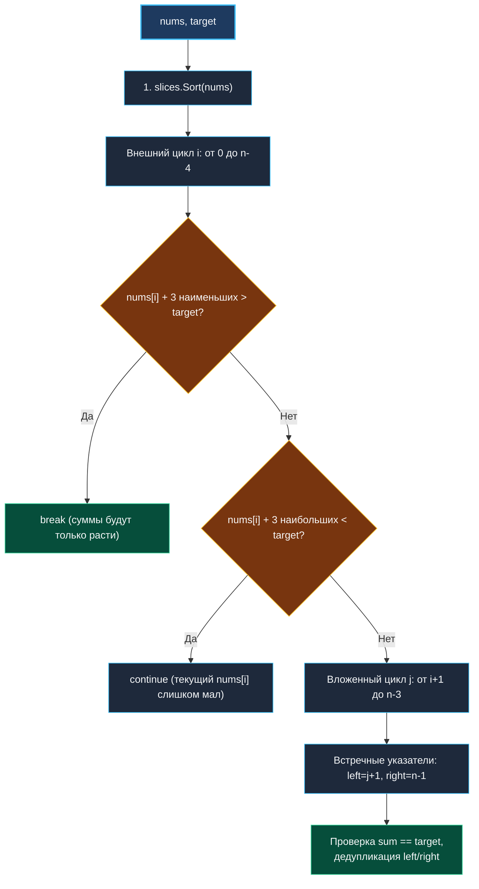
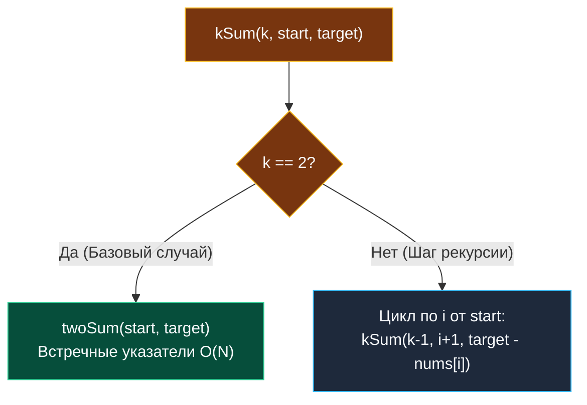

> *«Масштабирование простого алгоритма всегда надежнее, чем изобретение сложного монстра с нуля».*  
> — Кен Томпсон

## LeetCode 18. 4Sum

**Сложность:** Medium  
**Тема:** Сортировка + Два указателя, ранняя отсечка ветвей (Pruning), обобщение до kSum  
**Ссылки:** [[02. Два указателя/1. Теория. Два указателя|Теория: Два указателя]], [[02. Два указателя/4. Two Sum II Sorted Array|Two Sum II]], [[02. Два указателя/6. 3Sum|3Sum]]

---

### 1. Введение и физическая интуиция

Задача 4Sum — это естественный шаг эволюции:
- **Two Sum II ($k=2$):** $O(N)$ — встречные указатели.
- **3Sum ($k=3$):** $O(N^2)$ — один внешний цикл + встречные указатели.
- **4Sum ($k=4$):** $O(N^3)$ — два внешних цикла + встречные указатели.

Наивный перебор четырех индексов дает чудовищную сложность $O(N^4)$. При $N = 200$ это $200^4 = 1.6 \times 10^9$ итераций — гарантированный тайм-аут.

Сортировка среза в связке с двумя внешними циклами и встречными указателями уменьшает сложность до $O(N^3)$. Но Senior-разработчик идет еще дальше: он добавляет **раннюю отсечку ветвей (Branch Pruning)**, которая вычисляет минимальную и максимальную возможные суммы на текущем шаге, срезая до $70\text{--}90\%$ холостых итераций.



---

### 2. Формулировка задачи и вопросы интервьюеру

Дан целочисленный массив `nums` и целевое значение `target`. Найти все уникальные четверки `[nums[a], nums[b], nums[c], nums[d]]` такие, что индексы попарно различны и $nums[a] + nums[b] + nums[c] + nums[d] == target$. Дубликаты четверок недопустимы.

#### Вопросы интервьюеру (Senior-стиль):
1. **Каковы диапазоны чисел и целевого значения `target`?**  
   *«Элементы и таргет лежат в диапазоне $[-10^9, 10^9]$. В языках с 32-битным `int` (Java, C++) сумма четырех чисел может переполниться ($4 \times 10^9 > 2^{31}-1$) и требует приведения к `int64`. В Go на 64-битных платформах тип `int` уже является 64-битным, что защищает от целочисленного переполнения.»*
2. **Каков размер входного массива?**  
   *«$1 \le len(nums) \le 200$. Сложность $O(N^3)$ дает не более $8 \times 10^6$ операций в худшем случае, что укладывается в несколько миллисекунд.»*
3. **Что возвращать при `len(nums) < 4`?**  
   *«Возвращаем пустой срез `nil` или `[][]int{}`.»*

---

### 3. Оптимальная реализация с ранней отсечкой (Pruning)

Ключ к максимальной производительности в 4Sum — математическая оценка границ на каждом уровне вложенности:

- **Минимальная сумма четверки с базовым элементом $i$:**  
  $$ sum_{min} = nums[i] + nums[i+1] + nums[i+2] + nums[i+3] $$  
  Если даже наименьшие 4 числа превышают `target`, то при дальнейшем увеличении $i$ сумма станет еще больше! Можно делать немедленный **`break`**.
- **Максимальная сумма четверки с базовым элементом $i$:**  
  $$ sum_{max} = nums[i] + nums[n-3] + nums[n-2] + nums[n-1] $$  
  Если $nums[i]$ даже в комбинации с тремя самыми большими элементами не дотягивает до `target`, то никакой $j$ на этом шаге не поможет. Делаем **`continue`** и берем больший $nums[i]$.

---

### 4. Эталонная реализация на Go

```go
package main

import "slices"

// FourSum находит все уникальные четверки чисел с суммой target.
// Временная сложность: O(N^3) в худшем случае, в среднем O(N^2) благодаря pruning.
// Пространственная сложность: O(1) дополнительной памяти (in-place).
func FourSum(nums []int, target int) [][]int {
	n := len(nums)
	if n < 4 {
		return nil
	}

	// Сортировка in-place через современный pdqsort
	slices.Sort(nums)

	var result [][]int

	for i := 0; i < n-3; i++ {
		// Дедупликация первого элемента
		if i > 0 && nums[i] == nums[i-1] {
			continue
		}

		// Pruning уровня 1: отсекаем заведомо невозможные ветви
		if nums[i]+nums[i+1]+nums[i+2]+nums[i+3] > target {
			break // суммы будут только расти
		}
		if nums[i]+nums[n-3]+nums[n-2]+nums[n-1] < target {
			continue // текущий nums[i] слишком мал, увеличиваем i
		}

		for j := i + 1; j < n-2; j++ {
			// Дедупликация второго элемента
			if j > i+1 && nums[j] == nums[j-1] {
				continue
			}

			// Pruning уровня 2
			if nums[i]+nums[j]+nums[j+1]+nums[j+2] > target {
				break
			}
			if nums[i]+nums[j]+nums[n-2]+nums[n-1] < target {
				continue
			}

			left, right := j+1, n-1
			subTarget := target - nums[i] - nums[j]

			for left < right {
				currentSum := nums[left] + nums[right]

				switch {
				case currentSum == subTarget:
					result = append(result, []int{nums[i], nums[j], nums[left], nums[right]})

					// Дедупликация третьего элемента
					for left < right && nums[left] == nums[left+1] {
						left++
					}
					// Дедупликация четвертого элемента
					for left < right && nums[right] == nums[right-1] {
						right--
					}

					left++
					right--

				case currentSum < subTarget:
					left++

				default: // currentSum > subTarget
					right--
				}
			}
		}
	}

	return result
}
```

---

### 5. Обобщение до $k$-Sum (Инженерный паттерн)

На собеседованиях часто звучит вопрос: *«А что, если нам нужно найти сумму не 4, а $K$ элементов?»*  
Senior-разработчик демонстрирует знание рекурсивного сведения $k\text{-Sum}$ к $(k-1)\text{-Sum}$ с базой на $k=2$:



Рекурсивный каркас для произвольного $K$:
```go
func kSum(nums []int, target int, k int, start int) [][]int {
    var res [][]int
    if start >= len(nums) {
        return res
    }

    // Базовый случай: сводим к встречным указателям за O(N)
    if k == 2 {
        left, right := start, len(nums)-1
        for left < right {
            sum := nums[left] + nums[right]
            if sum == target {
                res = append(res, []int{nums[left], nums[right]})
                for left < right && nums[left] == nums[left+1] { left++ }
                for left < right && nums[right] == nums[right-1] { right-- }
                left++
                right--
            } else if sum < target {
                left++
            } else {
                right--
            }
        }
        return res
    }

    // Шаг рекурсии: фиксируем элемент и уменьшаем k
    for i := start; i <= len(nums)-k; i++ {
        if i > start && nums[i] == nums[i-1] {
            continue
        }
        subResults := kSum(nums, target-nums[i], k-1, i+1)
        for _, sub := range subResults {
            quad := append([]int{nums[i]}, sub...)
            res = append(res, quad)
        }
    }
    return res
}
```

---

### 6. Mechanical Sympathy: 64-битные регистры и переполнения

1. **Тип `int` в 64-битной архитектуре:**  
   В Go размер типа `int` зависит от целевой платформы. На `linux/amd64` и `darwin/arm64` размер `int` составляет ровно 64 бита (диапазон $[-2^{63}, 2^{63}-1]$). Сумма четырех $10^9$ дает максимум $4 \times 10^9$, что ни при каких обстоятельствах не переполняет 64-битный регистр. В отличие от C++ и Java, где `int` строго 32-битный и требует каста к `long long` / `long`, Go-код остается кристально чистым.
2. **Branch Predictor и отсечки:**  
   Проверки `sum_min > target` и `sum_max < target` вычисляются за 3-4 такта ALU процессора. Если ветка отсекается, процессор экономит тысячи инструкций циклов `left/right`.

---

### 7. Вопросы для собеседования

> [!INTERVIEW]
> **Вопрос:** Почему при дедупликации второго элемента мы проверяем условие `j > i + 1`, а не `j > 0`?  
> **Ответ:**  
> Число $j$ начинает свой цикл с позиции $i + 1$. Если проверить `j > 0`, мы запретим второму элементу совпадать по значению с первым (например, в четверке `[2, 2, 2, 2]`), что разрушит корректность. Условие `j > i + 1 && nums[j] == nums[j-1]` гарантирует, что мы берем первое вхождение числа на позиции $j$ и отбрасываем только его последующие дубликаты в пределах того же $i$.

---

### 8. Инварианты и чек-лист самопроверки

- [x] **Условия дедупликации:** `i > 0 && nums[i] == nums[i-1]` и `j > i+1 && nums[j] == nums[j-1]`.
- [x] **Ранний выход (Pruning):** проверки минимальных и максимальных сумм защищают от холостых пробегов.
- [x] **Корректность границ `left < right`:** дедупликация третьего и четвертого элементов не приводит к выходу за пределы среза.

Мы полностью освоили встречные указатели для поиска комбинаций. Теперь переходим к задаче, использующей три указателя в одном направлении для решения знаменитой задачи Дейкстры о голландском флаге: [[02. Два указателя/8. Sort Colors|8. Sort Colors]].