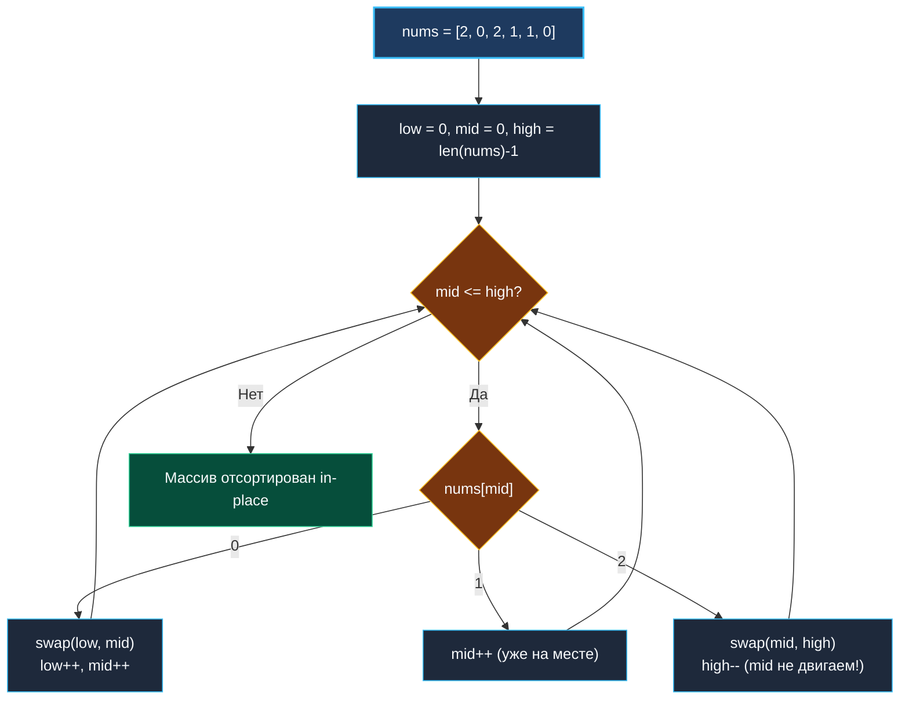

> *«Простота — это предварительное условие надежности».*  
> — Эдсгер Дейкстра

## LeetCode 75. Sort Colors

**Сложность:** Medium  
**Тема:** Задача голландского национального флага (Dutch National Flag), три указателя, in-place сортировка за $O(N)$  
**Ссылки:** [[02. Два указателя/1. Теория. Два указателя|Теория: Два указателя]], [[02. Два указателя/2. Варианты применения|Варианты применения]], [[02. Два указателя/5. Remove Duplicates from Sorted Array|Remove Duplicates]]

---

### 1. Введение и физическая интуиция

Задача о голландском национальном флаге (Dutch National Flag problem) была сформулирована великим Эдсгером Дейкстрой в 1976 году. Цвета флага Нидерландов — красный, белый и синий. В задаче они закодированы числами `0` (красный), `1` (белый) и `2` (синий).

Требуется отсортировать массив из нулей, единиц и двоек за **один проход** ($O(N)$), используя **строго $O(1)$ памяти** и без вызова библиотечных сортировок.

Представьте детскую песочницу, где в ряд высыпаны разноцветные шарики. У нас есть три зоны:
- Слева — корзина для красных шариков (`0`).
- В центре — площадка для белых шариков (`1`).
- Справа — корзина для синих шариков (`2`).

Мы ставим три указателя:
- `low`: граница, куда должен лечь следующий найденный `0`.
- `mid`: наш текущий сканер (инспектор), обходящий шарики слева направо.
- `high`: граница, куда должен лечь следующий найденный `2`.

Инспектор `mid` берет очередной шарик:
- Видит `0`? Бросает его влево на позицию `low`, сдвигает обе границы: `low++`, `mid++`.
- Видит `1`? Оставляет на месте в центре: `mid++`.
- Видит `2`? Бросает его вправо на позицию `high`, уменьшает `high--`. Но внимание: шарик, прилетевший с позиции `high`, инспектор еще не видел! Поэтому `mid` остается на месте и инспектирует его на следующем шаге.



---

### 2. Формулировка задачи и вопросы интервьюеру

Дан массив `nums`, содержащий $n$ объектов цвета 0, 1 или 2. Отсортировать массив in-place так, чтобы одинаковые цвета шли рядом в строгом порядке `0, 1, 2`. Запрещено использовать стандартную библиотечную функцию сортировки.

#### Вопросы интервьюеру (Senior-стиль):
1. **Каков размер массива?**  
   *«$1 \le len(nums) \le 300$. Задача решается за линейное время $O(N)$.»*
2. **Допустимо ли решение в два прохода (подсчет частот)?**  
   *«Counting sort (два прохода: сначала подсчитать число нулей, единиц и двоек, затем перезаписать массив) работает за $O(N)$. Однако на интервью уровня Senior всегда требуют однопроходный алгоритм (one-pass) с обменами на месте.»*
3. **Требуется ли стабильность сортировки?**  
   *«Нет, элементы представляют собой простые примитивы `int`.»*

---

### 3. Инвариант трех указателей Дейкстры

Весь массив в любой момент выполнения делится на 4 четко разграниченные зоны:

```
+------------------+------------------+-------------------+------------------+
|  Все нули (0)    |  Все единицы (1) | Еще не проверены  |  Все двойки (2)  |
|  [0 .. low-1]    |  [low .. mid-1]  | [mid .. high]     | [high+1 .. n-1]  |
+------------------+------------------+-------------------+------------------+
                   ^                  ^                   ^
                  low                mid                 high
```

- **До старта цикла:** `low = 0`, `mid = 0`, `high = n - 1`. Зоны нулей, единиц и двоек пусты. Весь массив лежит в зоне `[mid .. high]`.
- **В процессе работы:** на каждом шаге зона неисследованных элементов `high - mid + 1` уменьшается строго на 1.
- **По завершении:** когда `mid > high`, неисследованная зона схлопывается в 0. Массив идеально упорядочен.

---

### 4. Эталонная реализация на Go

```go
package main

// SortColors сортирует срез nums, состоящий из 0, 1 и 2,
// за один проход по алгоритму Дейкстры (Dutch National Flag).
// Временная сложность: O(N) — каждый элемент обрабатывается не более 2 раз.
// Пространственная сложность: O(1) памяти — 0 аллокаций в куче.
func SortColors(nums []int) {
	low := 0
	mid := 0
	high := len(nums) - 1

	for mid <= high {
		switch nums[mid] {
		case 0:
			// 0 отправляется в левую корзину.
			// Так как слева от mid могут быть только единицы (или low == mid),
			// на позицию mid попадает гарантированная 1, поэтому двигаем оба указателя.
			nums[low], nums[mid] = nums[mid], nums[low]
			low++
			mid++

		case 1:
			// 1 уже находится в центральной зоне, просто шагаем дальше
			mid++

		case 2:
			// 2 отправляется в правую корзину.
			// На позицию mid прилетает элемент с конца, который мы еще НЕ инспектировали!
			// Поэтому сдвигаем только high, а mid оставляем на месте.
			nums[mid], nums[high] = nums[high], nums[mid]
			high--
		}
	}
}
```

---

### 5. Пошаговая трассировка (Walkthrough)

Возьмем входной массив: `nums = [2, 0, 2, 1, 1, 0]`.

| Шаг | `low` | `mid` | `high` | `nums[mid]` | Действие | Массив после шага |
|:---:|:---:|:---:|:---:|:---:|:---|:---|
| 0 | 0 | 0 | 5 | **2** | `swap(mid, high)`, `high--` | `[0, 0, 2, 1, 1, 2]` |
| 1 | 0 | 0 | 4 | **0** | `swap(low, mid)`, `low++`, `mid++` | `[0, 0, 2, 1, 1, 2]` |
| 2 | 1 | 1 | 4 | **0** | `swap(low, mid)`, `low++`, `mid++` | `[0, 0, 2, 1, 1, 2]` |
| 3 | 2 | 2 | 4 | **2** | `swap(mid, high)`, `high--` | `[0, 0, 1, 1, 2, 2]` |
| 4 | 2 | 2 | 3 | **1** | `mid++` | `[0, 0, 1, 1, 2, 2]` |
| 5 | 2 | 3 | 3 | **1** | `mid++` | `[0, 0, 1, 1, 2, 2]` |
| 6 | 2 | 4 | 3 | — | `mid > high` $\implies$ Выход из цикла | **`[0, 0, 1, 1, 2, 2]`** |

Всего 6 итераций для массива из 6 элементов. Ровно $O(N)$!

---

### 6. Mechanical Sympathy: почему множественное присваивание в Go идеально

В строках:
```go
nums[low], nums[mid] = nums[mid], nums[low]
```
Go использует множественное присваивание (tuple assignment). Компилятор `gc` транслирует эту операцию не через выделение памяти в стеке, а через два процессорных регистра:
```assembly
MOVQ (RAX), R8    ; R8 = nums[low]
MOVQ (RBX), R9    ; R9 = nums[mid]
MOVQ R9, (RAX)    ; nums[low] = R9
MOVQ R8, (RBX)    ; nums[mid] = R8
```
Обмен происходит ровно за 4 инструкции CPU без промежуточных переменных в памяти и без системных вызовов.

---

### 7. Вопросы для собеседования

> [!INTERVIEW]
> **Вопрос:** Почему при `case 0` мы инкрементируем и `low`, и `mid`, а при `case 2` декрементируем только `high`, оставляя `mid` на месте?  
> **Ответ:**  
> Это ключевой нюанс алгоритма Дейкстры!  
> В силу инварианта, зона между `low` и `mid-1` содержит **только единицы**. Когда мы меняем местами `nums[low]` и `nums[mid]`, на позицию `mid` гарантированно попадает либо единица (если `low < mid`), либо тот же ноль (если `low == mid`). Мы точно знаем значение этого элемента, его не нужно перепроверять, поэтому делаем `mid++`.  
> Напротив, элемент `nums[high]` берется из неисследованной зоны `[mid .. high]`. Там может оказаться любое значение — 0, 1 или 2. Если мы сдвинем `mid++`, мы пропустим этот элемент без проверки! Поэтому `mid` обязан остаться на месте.

> [!TIP]
> **Вопрос:** В чем недостаток двухпроходного подсчета (Counting Sort) по сравнению с алгоритмом флага?  
> **Ответ:**  
> 1. Counting Sort делает **два прохода** по массиву (чтение для подсчета + полная перезапись всех ячеек).  
> 2. Если в массиве хранятся не примитивные числа `0, 1, 2`, а тяжелые структуры (например, заказы с приоритетами `Low`, `Medium`, `High`), алгоритм флага переставляет указатели на объекты за один проход, тогда как подсчет уничтожит исходные данные и потребует дополнительного буфера.

---

### 8. Инварианты и чек-лист самопроверки

- [x] **Условие цикла:** строго `mid <= high` (элемент на позиции `high` должен быть проверен).
- [x] **При `case 0`:** `low++` и `mid++`.
- [x] **При `case 1`:** только `mid++`.
- [x] **При `case 2`:** только `high--` (`mid` не меняется).

Следующая задача кластера демонстрирует встречные указатели с обратным заполнением результирующего среза: [[02. Два указателя/9. Squares of Sorted Array|9. Squares of Sorted Array]].