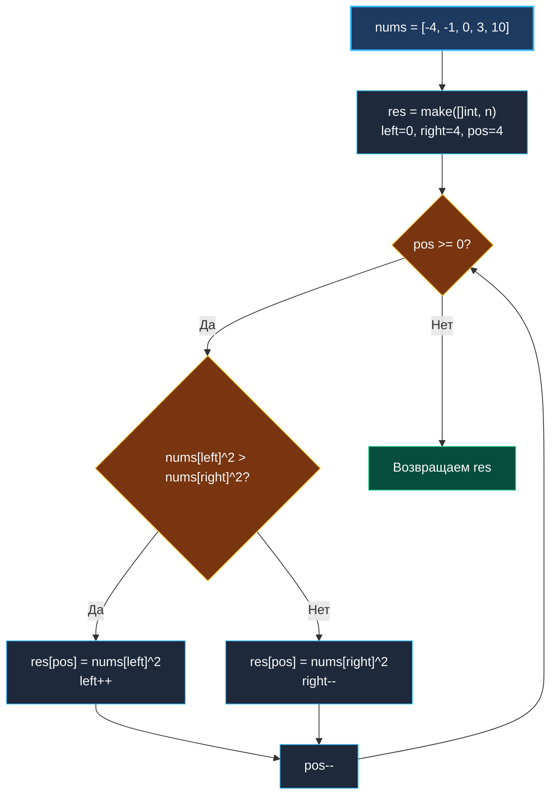

> *«Вместо того чтобы двигаться от начала к концу, порой достаточно взглянуть на концы задачи и идти внутрь».*  
> — Брайан Керниган

## LeetCode 977. Squares of a Sorted Array

**Сложность:** Easy  
**Тема:** Встречные указатели, обратное заполнение (Reverse Filling), сортировка за $O(N)$  
**Ссылки:** [[02. Два указателя/1. Теория. Два указателя|Теория: Два указателя]], [[02. Два указателя/2. Варианты применения|Варианты применения]], [[01. Массивы и строки/9. Merge Sorted Array|Merge Sorted Array]]

---

### 1. Введение и физическая интуиция

Дан отсортированный по неубыванию массив чисел: например, `[-4, -1, 0, 3, 10]`.  
Если мы просто возведем каждое число в квадрат, то получим: `[16, 1, 0, 9, 100]`.  
Сортировка нарушилась: отрицательные числа с большими по модулю значениями дали огромные квадраты в начале среза!

Математически функция $f(x) = x^2$ представляет собой параболу с вершиной в точке $0$. Значения убывают при приближении к нулю слева и возрастают при удалении от нуля вправо.

Это значит, что **самые большие квадраты гарантированно находятся на краях массива** — либо у крайнего левого отрицательного числа, либо у крайнего правого положительного.

Отсюда рождается элегантнейший алгоритм:
Мы ставим указатели на оба конца массива (`left = 0`, `right = n - 1`) и начинаем заполнять результирующий срез **с самого конца** (`pos = n - 1`):
- Сравниваем квадраты чисел на концах: $nums[left]^2$ против $nums[right]^2$.
- Тот, чей квадрат больше, забирает почетное место в конце среза.
- Соответствующий указатель сдвигается внутрь массива.

Никаких логарифмических сортировок за $O(N \log N)$! Мы получаем идеальный отсортированный результат за **строго один линейный проход** $O(N)$.



---

### 2. Формулировка задачи и вопросы интервьюеру

Дан целочисленный массив `nums`, отсортированный по неубыванию. Вернуть массив квадратов каждого числа, также отсортированный по неубыванию. Решение должно работать за $O(N)$ по времени.

#### Вопросы интервьюеру (Senior-стиль):
1. **Каков размер входных данных?**  
   *«$1 \le len(nums) \le 10^4$, значения в диапазоне $[-10^4, 10^4]$. Квадрат максимального числа равен $10^8$, что с огромным запасом помещается в стандартный целочисленный тип.»*
2. **Можно ли использовать вспомогательный массив?**  
   *«Да, возвращаемое значение `[]int` требует новой памяти $O(N)$. Попытка перезаписать входной срез in-place разрушит еще не обработанные значения.»*
3. **Может ли массив содержать только положительные или только отрицательные числа?**  
   *«Да, алгоритм двух указателей обязан корректно отрабатывать любые граничные комбинации знаков.»*

---

### 3. Разбор подходов

#### Подход 1: Возведение в квадрат + сортировка (Наивный)
```go
func sortedSquaresNaive(nums []int) []int {
    res := make([]int, len(nums))
    for i, v := range nums {
        res[i] = v * v
    }
    slices.Sort(res)
    return res
}
```
- **Сложность:** $O(N \log N)$ по времени, $O(N)$ по памяти.
- **Вердикт:** Решение работает, но полностью игнорирует главное свойство — отсортированность входа. На собеседовании такое решение показывает непонимание задачи.

#### Подход 2: Встречные указатели с обратным заполнением (Эталонный)
Заполняем результирующий буфер с конца, выбирая максимальный квадрат за один шаг. Сложность строго $O(N)$ по времени и $O(1)$ вспомогательной памяти (за исключением возвращаемого результата).

---

### 4. Эталонная реализация на Go

```go
package main

// SortedSquares возвращает срез квадратов элементов, отсортированный по неубыванию.
// Временная сложность: O(N) — каждый элемент просматривается ровно один раз.
// Пространственная сложность: O(N) под результирующий срез (0 лишних аллокаций).
func SortedSquares(nums []int) []int {
	n := len(nums)
	result := make([]int, n)

	left := 0
	right := n - 1

	// Заполняем массив с конца: от самого большого квадрата к наименьшему
	for pos := n - 1; pos >= 0; pos-- {
		leftSquare := nums[left] * nums[left]
		rightSquare := nums[right] * nums[right]

		if leftSquare > rightSquare {
			result[pos] = leftSquare
			left++
		} else {
			result[pos] = rightSquare
			right--
		}
	}

	return result
}
```

---

### 5. Пошаговая трассировка (Walkthrough)

Вход: `nums = [-4, -1, 0, 3, 10]` ($n = 5$).

| Шаг | `left` (`nums[l]`) | `right` (`nums[r]`) | `lSquare` | `rSquare` | Победитель | `pos` | Состояние `result` |
|:---:|:---:|:---:|:---:|:---:|:---:|:---:|:---|
| 1 | 0 (`-4`) | 4 (`10`) | 16 | 100 | `right` (100) | 4 | `[0, 0, 0, 0, 100]` |
| 2 | 0 (`-4`) | 3 (`3`) | 16 | 9 | `left` (16) | 3 | `[0, 0, 0, 16, 100]` |
| 3 | 1 (`-1`) | 3 (`3`) | 1 | 9 | `right` (9) | 2 | `[0, 0, 9, 16, 100]` |
| 4 | 1 (`-1`) | 2 (`0`) | 1 | 0 | `left` (1) | 1 | `[0, 1, 9, 16, 100]` |
| 5 | 2 (`0`) | 2 (`0`) | 0 | 0 | `right` (0) | 0 | **`[0, 1, 9, 16, 100]`** |

Ровно 5 итераций. Массив безупречно отсортирован!

---

### 6. Mechanical Sympathy: предвыделение памяти и кэш

1. **Единственная аллокация `make([]int, n)`:**  
   Мы создаем срез точного размера `n`. В коде нет ни единого вызова `append()`, а значит:
   - Нет проверок вместимости (`cap`).
   - Нет повторных реаллокаций и копирований буфера в куче.
   - Исключена фрагментация памяти кучи.
2. **Аппаратный Prefetcher при обратной записи:**  
   Современные процессоры одинаково эффективно предугадывают как прямой последовательный доступ (`pos++`), так и обратный (`pos--`). Запись в непрерывный буфер `result[pos]` наполняет кэш-линию L1d последовательно справа налево, минимизируя задержки шины памяти.

---

### 7. Вопросы для собеседования

> [!INTERVIEW]
> **Вопрос:** Почему мы заполняем результирующий массив с конца, а не с начала?  
> **Ответ:**  
> Чтобы заполнять массив с начала (от меньших квадратов к большим), нам пришлось бы сначала найти точку перехода знака (ближайший к нулю элемент) бинарным или линейным поиском, а затем раздвигать указатели в стороны от центра (как в слиянии двух отсортированных массивов).  
> Это добавило бы лишний код, усложнило граничные условия при отсутствии отрицательных или положительных чисел. Подход со встречными указателями с краев **не требует поиска нуля**, покрывает все краевые случаи автоматически и пишется в 10 строк кода.

---

### 8. Инварианты и чек-лист самопроверки

- [x] **Размер среза:** `make([]int, n)` строго равен длине входа.
- [x] **Условие цикла:** `pos >= 0` выполняется ровно $N$ раз.
- [x] **Случай одного элемента:** при $n = 1$ цикл срабатывает на `pos = 0`, корректно записывая квадрат единственного числа.

Переходим к финальной задаче кластера «Два указателя» — избирательному реверсу гласных символов в строке: [[02. Два указателя/10. Reverse Vowels of String|10. Reverse Vowels of String]].