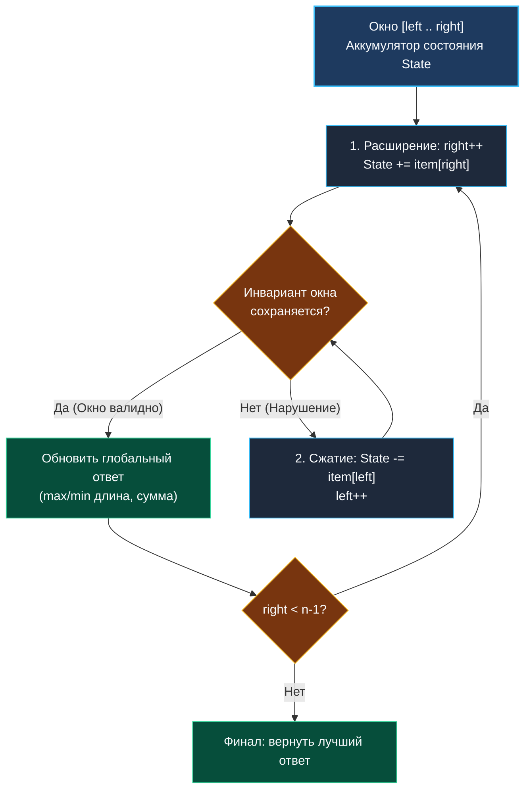

> *«Вместо того чтобы раз за разом пересчитывать всё с нуля, помните прошлое и обновляйте только то, что изменилось на границе».*  
> — Брайан Керниган

# 1. Теория. Скользящее окно (Sliding Window)

**Тема:** Фундаментальные алгоритмические паттерны, инкрементальный пересчет состояния, $O(N)$ на подмассивах  
**Ссылки:** [[02. Два указателя/1. Теория. Два указателя|Теория: Два указателя]], [[03. Скользящее окно/2. Фиксированное и динамическое окно|Фиксированное и динамическое окно]], [[03. Скользящее окно/3. Maximum Average Subarray I|Maximum Average Subarray I]], [[03. Скользящее окно/4. Longest Substring Without Repeating Characters|Longest Substring]]

---

### 1. Введение и физическая интуиция

Представьте движущийся поезд с панорамными окнами фиксированного размера. Пассажир смотрит в окно: по мере движения поезда в правый край стекла вплывают новые пейзажи (деревья, дома, горы), а из левого края стекла точно такие же объекты навсегда исчезают.

Чтобы узнать суммарную яркость или количество деревьев в поле зрения, пассажиру не нужно каждый метр заново пересчитывать все деревья в окне! Достаточно простой формулы:
$$ \text{Текущее состояние} = \text{Предыдущее состояние} + \text{Новый вошедший объект} - \text{Старый вышедший объект} $$

В этом заключается фундаментальная магия **скользящего окна (Sliding Window)**:
- Мы сворачиваем полный квадратичный перебор всех непрерывных подмассивов ($O(N^2)$ или $O(N \times K)$) в строго **один линейный проход** $O(N)$.
- На каждом шаге сдвига границы мы тратим ровно $O(1)$ операций на обновление внутреннего аккумулятора (суммы, частотного словаря, счетчика).



---

### 2. Отличие от классических двух указателей

В кластере [[02. Два указателя/1. Теория. Два указателя|Два указателя]] мы оперировали индексами, анализируя только сами крайние элементы: `arr[left]` и `arr[right]`.

**Скользящее окно — это два указателя с памятью состояния:**
1. Между `left` и `right` всегда находится непрерывный диапазон данных (contiguous subarray / substring).
2. Алгоритм непрерывно поддерживает агрегированное состояние этого диапазона (`sum`, `freq[26]int`, `count`).
3. При сдвиге правого указателя состояние инкрементируется за $O(1)$.
4. При сдвиге левого указателя состояние декрементируется за $O(1)$.

---

### 3. Критерии применимости скользящего окна

Паттерн гарантированно применим, если выполняются три условия:

1. **Непрерывность (Contiguous Subsegment):** задача требует найти оптимальный подмассив, подстроку или срез. Элементы нельзя пропускать или переставлять.
2. **Инкрементальность пересчета ($O(1)$ Update):** добавление одного элемента в правый край и удаление одного элемента из левого края пересчитывает метрику без полного сканирования всего окна.
3. **Монотонность (для динамического окна):** расширение окна вправо либо только увеличивает метрику, либо только приближает нас к нарушению условия. Например, сумма неотрицательных чисел монотонно растет при расширении.

> [!CAUTION]
> **Ловушка отрицательных чисел:**  
> Если массив содержит отрицательные числа, а условие задачи требует найти подмассив с суммой $S$, скользящее окно **неприменимо**! Расширение окна с отрицательным числом может уменьшить сумму, разрушая монотонность.  
> В таких случаях единственно верный путь — **префиксные суммы с хэш-таблицей** ([[01. Массивы и строки/5. Maximum Subarray (Kadane)|алгоритм Кадане]] или `map[int]int`).

---

### 4. Классификация окон: фиксированные и динамические

| Характеристика | Фиксированное окно (Fixed-size) | Динамическое окно (Variable-size) |
|:---|:---|:---|
| **Длина окна ($K$)** | Константа, задана явно в условии | Переменная величина ($right - left + 1$) |
| **Управление `left`** | Жесткая связь: $left = right - K + 1$ | Сдвигается в цикле `while`, пока нарушено условие |
| **Цель оптимизации** | Найти экстремум метрики в окне длины $K$ | Найти минимальную или максимальную длину окна |
| **Сложность по времени** | Строго $N$ итераций ($O(N)$) | $2N$ итераций в худшем случае ($O(N)$ амортизировано) |
| **Примеры задач** | Maximum Average Subarray, Find All Anagrams | Longest Substring Without Repeating, Minimum Window Substring |

Подробный разбор каркасов для обоих типов представлен в следующей статье: [[03. Скользящее окно/2. Фиксированное и динамическое окно|2. Фиксированное и динамическое окно]].

---

### 5. Mechanical Sympathy: структуры данных и кэш процессора

Эффективность скользящего окна в реальном рантайме Go на $90\%$ определяется выбором структуры для хранения состояния:

#### 1. Статический массив на стеке (`[26]int` / `[128]int`) — Абсолютный фаворит:
Если алфавит задачи ограничен (ASCII, латиница a–z), состояние окна хранится в массиве фиксированного размера:
```go
var window [128]int // 128 * 8 = 1024 байта на стеке
window[s[right]]++  // 1 инструкция CPU LEA/MOV
window[s[left]]--   // 1 инструкция CPU
```
- **0 аллокаций в куче (0 B/op).**
- Помещается в L1d-кэш процессора.
- Сравнение окон `window == target` компилируется в векторный `memequal`.

#### 2. Хэш-таблица (`map[byte]int`) — Только при необходимости:
Если набор ключей заранее неизвестен или слишком разрежен:
- Требует вызова `runtime.mapassign` и `runtime.mapaccess`.
- Каждый доступ к ключу — это вычисление хэша и поиск по цепочке бакетов (~$30\text{--}50$ тактов).
- Операция `delete(m, key)` не освобождает память бакетов немедленно, создавая фрагментацию.
- Обязательно предвыделяйте вместимость: `make(map[byte]int, 128)`.

---

### 6. Вопросы для собеседования

> [!INTERVIEW]
> **Вопрос:** Почему вложенный цикл сжатия окна `for violates() { left++ }` не делает общую сложность квадратичной $O(N^2)$?  
> **Ответ:**  
> Применяется метод **амортизационного анализа**.  
> Правый указатель `right` сдвигается вперед ровно $N$ раз. Левый указатель `left` стартует с нуля, двигается **только вперед** и не может обогнать `right`. Следовательно, суммарно за все время работы внешнего цикла левый указатель сдвинется максимум $N$ раз.  
> Общее количество операций: $N + N = 2N \in O(N)$. Временная сложность строго линейна.

> [!TIP]
> **Вопрос:** Как реализовать скользящее окно для поиска максимума на отрезке за $O(1)$ времени на сдвиг?  
> **Ответ:**  
> Обычная переменная `maxVal` не подходит, так как при выходе текущего максимума из окна слева мы не сможем найти новый максимум за $O(1)$.  
> Для этого используется **монотонная двусторонняя очередь (Monotonic Deque)**, хранящая индексы кандидатов в порядке убывания значений. Это решение подробно разбирается в задаче [[03. Скользящее окно/8. Sliding Window Maximum|Sliding Window Maximum]].

---

### 7. Чек-лист готовности к кластеру

- [x] Понимаю разницу между фиксированным и динамическим окном.
- [x] Помню, что при наличии отрицательных чисел скользящее окно на сумму неприменимо.
- [x] Использую плоские массивы `[26]int` или `[128]int` вместо `map` везде, где алфавит ограничен.
- [x] Умею доказать интервьюеру линейность $O(N)$ через амортизацию сдвигов.

Приступаем к детальному изучению анатомии фиксированных и динамических окон: [[03. Скользящее окно/2. Фиксированное и динамическое окно|2. Фиксированное и динамическое окно]].