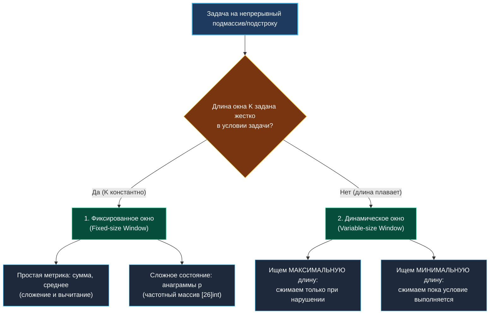

> *«Если рамки задачи заданы строго — держите строй. Если границы гибки — позвольте им сжиматься и расширяться по законам монотонности».*  
> — Дональд Кнут

# 2. Фиксированное и динамическое окно

**Тема:** Паттерны скользящего окна, каркасы алгоритмов, выбор стратегии сжатия  
**Ссылки:** [[03. Скользящее окно/1. Теория. Скользящее окно|Теория: Скользящее окно]], [[03. Скользящее окно/3. Maximum Average Subarray I|Maximum Average Subarray I]], [[03. Скользящее окно/4. Longest Substring Without Repeating Characters|Longest Substring]], [[03. Скользящее окно/5. Minimum Window Substring|Minimum Window Substring]]

---

### 1. Дерево выбора типа окна

При первом взгляде на задачу со скользящим окном Senior-инженер определяет категорию по двум ключевым признакам:



---

### 2. Тип 1: Фиксированное скользящее окно

#### Сигналы в условии:
- «Дан массив и целое число $K$...»
- «Найти максимальное среднее значение среди всех подмассивов длины $K$».
- «Проверить, содержит ли строка перестановку длины $|P|$».

#### Архитектура алгоритма:
1. **Фаза инициализации:** вычисляем состояние для самого первого окна `[0 .. K-1]`.
2. **Фаза скольжения:** запускаем цикл от индекса $K$ до $N-1$:
   - Включаем новый элемент: `state += nums[i]`.
   - Исключаем старый элемент, выпавший слева: `state -= nums[i-k]`.
   - Обновляем глобальный оптимум.

#### Идиоматичный Go-каркас:
```go
func fixedSlidingWindow(nums []int, k int) int {
    if len(nums) < k {
        return 0
    }

    // 1. Инициализация первого окна
    currentSum := 0
    for i := 0; i < k; i++ {
        currentSum += nums[i]
    }
    maxSum := currentSum

    // 2. Скольжение окна
    for i := k; i < len(nums); i++ {
        currentSum += nums[i] - nums[i-k] // + новый, - старый
        maxSum = max(maxSum, currentSum)
    }

    return maxSum
}
```

> [!TIP]
> **Индекс вышедшего элемента:**  
> В цикле `for i := k; i < len(nums); i++` текущий входящий элемент — `nums[i]`, а выбывающий левый элемент всегда находится строго по индексу `nums[i - k]`.

---

### 3. Тип 2: Динамическое скользящее окно

#### Сигналы в условии:
- «Найти длину **самой длинной** подстроки без повторяющихся символов».
- «Найти **минимальную** длину подмассива с суммой не менее $S$».
- «Найти кратчайшее окно, содержащее все символы шаблона $T$».

#### Архитектура алгоритма:
Окно расширяется правым указателем `right`, пока оно легально. Как только инвариант нарушается, левый указатель `left` подтягивается вправо, сжимая окно и восстанавливая валидность.

#### Каркас для поиска МАКСИМАЛЬНОЙ длины:
```go
func dynamicWindowMax(s string) int {
    var freq [128]int
    left := 0
    maxLen := 0

    for right := 0; right < len(s); right++ {
        // Расширяем окно вправо
        freq[s[right]]++

        // Сжимаем окно слева, пока условие нарушено
        for freq[s[right]] > 1 { // например, обнаружен дубликат
            freq[s[left]]--
            left++
        }

        // Окно валидно — фиксируем максимальную длину
        maxLen = max(maxLen, right-left+1)
    }

    return maxLen
}
```

#### Каркас для поиска МИНИМАЛЬНОЙ длины:
```go
func dynamicWindowMin(nums []int, target int) int {
    left := 0
    currentSum := 0
    minLen := len(nums) + 1

    for right := 0; right < len(nums); right++ {
        currentSum += nums[right]

        // Пока условие выполняется — пытаемся СЖАТЬ окно слева,
        // чтобы сделать его еще меньше!
        for currentSum >= target {
            minLen = min(minLen, right-left+1)
            currentSum -= nums[left]
            left++
        }
    }

    if minLen > len(nums) {
        return 0 // решение не найдено
    }
    return minLen
}
```

---

### 4. Гибридный тип: фиксированная длина со сложным состоянием

Иногда длина окна фиксирована ($K = len(pattern)$), но сравнение окон требует учета частот символов (например, [[03. Скользящее окно/6. Permutation in String|Permutation in String]] или [[03. Скользящее окно/9. Find All Anagrams in a String|Find All Anagrams]]).

Вместо примитивной суммы мы ведем массив частот:
```go
var targetFreq, windowFreq [26]int
// Инициализируем шаблоны
for i := 0; i < len(p); i++ {
    targetFreq[p[i]-'a']++
    windowFreq[s[i]-'a']++
}

// Скользим окном длины len(p)
for i := len(p); i < len(s); i++ {
    if windowFreq == targetFreq {
        // Найдена анаграмма!
    }
    windowFreq[s[i]-'a']++           // вошел символ справа
    windowFreq[s[i-len(p)]-'a']--   // вышел символ слева
}
```

В Go сравнение массивов фиксированного размера `windowFreq == targetFreq` выполняется **мгновенно за один вызов `memequal`** (208 байт сравниваются аппаратно через регистры AVX/SSE).

---

### 5. Сравнительная шпаргалка

| Параметр | Фиксированное окно | Динамическое (Максимум) | Динамическое (Минимум) |
|:---|:---|:---|:---|
| **Условие сдвига `left`** | Автоматически каждый шаг ($i \ge K$) | В цикле `while` (пока нарушен инвариант) | В цикле `while` (пока инвариант соблюден) |
| **Точка обновления ответа** | После сдвига обеих границ | После цикла сжатия `left` | Внутри цикла сжатия `left` |
| **Инициализация ответа** | Первое окно `[0 .. K-1]` | `0` | $\infty$ (`len(arr) + 1`) |
| **Типичные задачи** | Max Average, Anagrams | Longest Substring No Repeats | Min Window Substring |

---

### 6. Mechanical Sympathy: предотвращение ловушек

> [!CAUTION]
> **Ловушка забытого декремента:**  
> При сжатии окна `left++` начинающие разработчики часто забывают уменьшить счетчик в аккумуляторе: `state -= nums[left]`.  
> Всегда сначала модифицируйте аккумулятор, и только затем двигайте указатель:
> ```go
> state -= nums[left]
> left++
> ```

> [!WARNING]
> **Ловушка размера окна:**  
> Всегда проверяйте крайний случай `len(nums) < k` на первой строке функции для фиксированного окна. Попытка инициализировать первое окно приведет к панике выхода за границы массива (`index out of range`).

---

### 7. Итог

- Фиксированное окно — прямолинейный инструмент: одно сложение, одно вычитание на каждом шаге.
- Динамическое окно — эластичный инструмент: растягивается в поисках новых элементов и сжимается до предела, находя локальный оптимум.

Переходим к первой практической задаче кластера — расчету максимального среднего значения: [[03. Скользящее окно/3. Maximum Average Subarray I|3. Maximum Average Subarray I]].