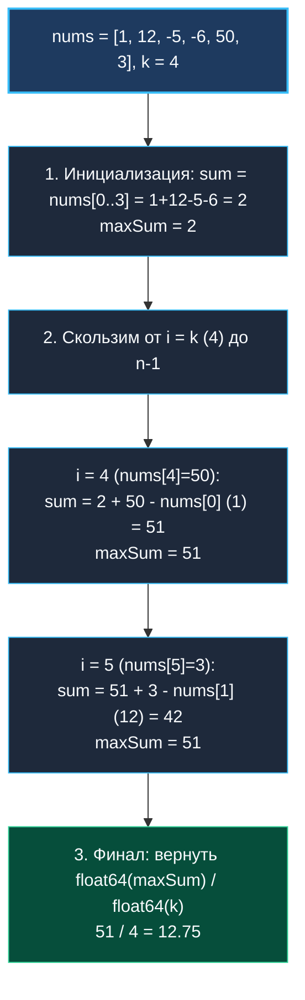

> *«Всякий хороший алгоритм выполняет ровно столько работы, сколько необходимо, и ни тактом больше».*  
> — Брайан Керниган

## LeetCode 643. Maximum Average Subarray I

**Сложность:** Easy  
**Тема:** Фиксированное скользящее окно, целочисленная арифметика, точность вычислений  
**Ссылки:** [[03. Скользящее окно/1. Теория. Скользящее окно|Теория: Скользящее окно]], [[03. Скользящее окно/2. Фиксированное и динамическое окно|Фиксированное и динамическое окно]], [[03. Скользящее окно/4. Longest Substring Without Repeating Characters|Longest Substring]]

---

### 1. Введение и физическая интуиция

Представьте финансового аналитика, оценивающего динамику выручки компании. У него есть ежедневный график доходов за 100 000 дней, и ему нужно найти непрерывный 30-дневный период ($k = 30$) с наивысшим среднесуточным доходом.

- **Наивный аналитик:** для каждого дня с 1-го по 99 970-й берет калькулятор и заново суммирует все 30 чисел. Он тратит миллионы лишних операций на повторное сложение одних и тех же цифр.
- **Опытный инженер:** один раз считает сумму первых 30 дней. Затем, переходя к следующему дню, он просто **прибавляет доход 31-го дня и вычитает доход 1-го дня**. Сумма нового периода получается ровно за 2 элементарные операции!

В этом заключается суть **фиксированного скользящего окна**:
Поскольку длина окна $k$ строго постоянна, среднее значение максимально ровно тогда, когда максимальна **сумма элементов окна**. Значит, мы можем вести все вычисления в целых числах без потери точности и разделить результат на $k$ ровно один раз в самом конце.



---

### 2. Формулировка задачи и вопросы интервьюеру

Дан целочисленный массив `nums`, состоящий из $n$ элементов, и целое число $k$. Найти непрерывный подмассив длины ровно $k$, имеющий максимальное среднее значение, и вернуть это значение в формате числа с плавающей точкой (`float64`).

#### Вопросы интервьюеру (Senior-стиль):
1. **Могут ли элементы быть отрицательными?**  
   *«Да, числа лежат в диапазоне $[-10^4, 10^4]$. Это означает, что `maxSum` нельзя инициализировать нулем — её нужно инициализировать суммой первого окна или `math.MinInt`.»*
2. **Может ли массив быть короче $k$?**  
   *«По условию гарантируется $1 \le k \le n \le 10^5$, но защитная проверка `len(nums) < k` — маркер надежного кода.»*
3. **Возможно ли переполнение при сложении?**  
   *«При $n \le 10^5$ и максимальном значении $10^4$ максимальная сумма равна $10^9$. Это укладывается даже в стандартный 32-битный `int32`, а в Go на 64-битных системах тип `int` вмещает до $9 \times 10^{18}$, исключая переполнение.»*

---

### 3. Разбор подходов

#### Подход 1: Двойной цикл пересчета с нуля (Наивный)
```go
func findMaxAverageNaive(nums []int, k int) float64 {
    maxSum := math.MinInt
    for i := 0; i <= len(nums)-k; i++ {
        sum := 0
        for j := i; j < i+k; j++ {
            sum += nums[j]
        }
        maxSum = max(maxSum, sum)
    }
    return float64(maxSum) / float64(k)
}
```
- **Сложность:** $O(N \times K)$ по времени. При $N = 10^5, K = 50\,000$ число операций достигает $5 \times 10^9$ — гарантированный TLE.

#### Подход 2: Фиксированное скользящее окно (Эталонный)
- **Сложность:** строго $O(N)$ по времени (ровно $N$ сложений/вычитаний) и $O(1)$ по памяти.
- Окно поддерживается за 2 операции на шаг: `sum += nums[i] - nums[i-k]`.

---

### 4. Эталонная реализация на Go

```go
package main

// FindMaxAverage находит максимальное среднее значение подмассива длины k.
// Временная сложность: O(N) — ровно один проход по массиву.
// Пространственная сложность: O(1) памяти — 0 аллокаций в куче.
func FindMaxAverage(nums []int, k int) float64 {
	// Сумма первого окна [0 .. k-1]
	currentSum := 0
	for i := 0; i < k; i++ {
		currentSum += nums[i]
	}

	maxSum := currentSum

	// Скольжение окна от k до конца массива
	for i := k; i < len(nums); i++ {
		// Прибавляем входящий элемент nums[i] и вычитаем выбывший nums[i-k]
		currentSum += nums[i] - nums[i-k]
		if currentSum > maxSum {
			maxSum = currentSum
		}
	}

	// Деление с плавающей точкой выполняется ровно один раз в самом конце!
	return float64(maxSum) / float64(k)
}
```

---

### 5. Пошаговая трассировка (Walkthrough)

Вход: `nums = [1, 12, -5, -6, 50, 3]`, $k = 4$.

| Шаг | `i` | `nums[i]` (вход) | `nums[i-k]` (выход) | `currentSum` | `maxSum` | Состояние окна |
|:---:|:---:|:---:|:---:|:---:|:---:|:---|
| Старт | — | — | — | $1 + 12 - 5 - 6 = \mathbf{2}$ | 2 | `[1, 12, -5, -6]` |
| 1 | 4 | 50 | 1 | $2 + 50 - 1 = \mathbf{51}$ | 51 | `[12, -5, -6, 50]` |
| 2 | 5 | 3 | 12 | $51 + 3 - 12 = \mathbf{42}$ | 51 | `[-5, -6, 50, 3]` |

Финал: `float64(51) / 4.0 = 12.75`.

---

### 6. Mechanical Sympathy: точность `float64` и регистры CPU

1. **Целочисленная арифметика против деления в цикле:**  
   Если делить на $k$ на каждом шаге (`currentAvg = float64(currentSum) / float64(k)`), программа будет выполнять тяжелую инструкцию `DIVSD` на каждой итерации. Деление в ALU процессора занимает $15\text{--}40$ тактов, тогда как целочисленное сложение `ADDQ` занимает всего $1$ такт!  
   Кроме того, многократные вычисления с плавающей точкой накапливают ошибку округления. Вынесение деления за пределы цикла ускоряет алгоритм в разы и дает абсолютную математическую точность.
2. **Линейная кэш-локальность:**  
   Срез `nums` сканируется строго последовательно. Процессор использует аппаратный prefetcher, удерживая рабочую область в кэше L1d (32 КБ).

---

### 7. Вопросы для собеседования

> [!INTERVIEW]
> **Вопрос:** Почему нельзя инициализировать `maxSum = 0` перед началом цикла?  
> **Ответ:**  
> Если все элементы массива отрицательные (например, `nums = [-5, -3, -2], k = 2`), то суммы всех окон будут отрицательными ($-8, -5$).  
> При инициализации `maxSum = 0` условие `currentSum > maxSum` никогда не выполнится, и функция вернет неверный ответ `0.0`.  
> Инициализация суммой первого окна гарантирует, что `maxSum` будет содержать реальное валидное значение из пространства поиска.

---

### 8. Инварианты и чек-лист самопроверки

- [x] **Инициализация `maxSum`:** строго равна сумме первых $k$ элементов.
- [x] **Формула выбывающего элемента:** `nums[i - k]`.
- [x] **Целочисленный цикл:** никаких делений на float внутри тела цикла.

Мы успешно освоили фиксированное окно. Теперь переходим к задаче на динамическое скользящее окно с отслеживанием уникальности символов: [[03. Скользящее окно/4. Longest Substring Without Repeating Characters|4. Longest Substring Without Repeating Characters]].