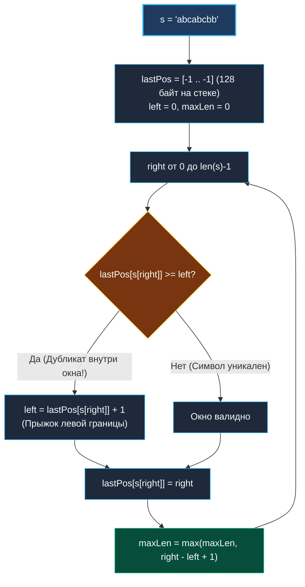

> *«Простота — это не нехватка замысла, это ясность мысли, воплощённая в коде».*  
> — Брайан Керниган

## LeetCode 3. Longest Substring Without Repeating Characters

**Сложность:** Medium  
**Тема:** Динамическое скользящее окно, индексация последних позиций, нулевые аллокации  
**Ссылки:** [[03. Скользящее окно/1. Теория. Скользящее окно|Теория: Скользящее окно]], [[03. Скользящее окно/2. Фиксированное и динамическое окно|Фиксированное и динамическое окно]], [[03. Скользящее окно/5. Minimum Window Substring|Minimum Window Substring]]

---

### 1. Введение и физическая интуиция

Представьте скользящую рамку на ленте символов: `"a b c a b c b b"`.  
Мы растягиваем правый край рамки (`right`), затягивая внутрь новые буквы:
- `"a"` $\implies$ длина 1.
- `"a b"` $\implies$ длина 2.
- `"a b c"` $\implies$ длина 3.
- И тут в правый край входит вторая буква `'a'`! Внутри окна возник конфликт — дубликат.

Как устранить дубликат?
- **Наивный способ:** двигать левый край рамки по одному символу (`left++`), проверяя, исчез ли конфликт.
- **Оптимальный способ (Прыжок):** мгновенно перенести левую границу окна `left` **сразу за позицию предыдущего вхождения конфликтного символа** (`left = prevPos + 1`).

Поскольку все символы внутри окна должны быть уникальны, хранение последнего индекса каждого символа превращает сжатие окна в мгновенную операцию $O(1)$. Общее время работы алгоритма становится строго линейным $O(N)$ при **нулевых аллокациях памяти**.



---

### 2. Формулировка задачи и вопросы интервьюеру

Дана строка `s`. Найти длину самой длинной подстроки без повторяющихся символов.

#### Вопросы интервьюеру (Senior-стиль):
1. **Каков алфавит строки?**  
   *«Только печатные символы ASCII (буквы английского алфавита, цифры, символы и пробелы)? В LeetCode 3 гарантируется ASCII (коды 0–127). Это позволяет применить массив `[128]int` на стеке вместо медленной `map[rune]int`.»*
2. **Может ли строка быть пустой?**  
   *«Да, если `len(s) == 0`, возвращаем 0.»*
3. **Регистрозависимость?**  
   *«Да, `'a' != 'A'`.»*

---

### 3. Разбор подходов

#### Подход 1: Полный перебор всех подстрок (Наивный)
Проверить все возможные пары границ `(left, right)` с проверкой уникальности через хэш-сет.  
- **Сложность:** $O(N^3)$ или $O(N^2)$. При $N = 50\,000$ — Time Limit Exceeded.

#### Подход 2: Скользящее окно со множеством `map[byte]bool` (Субоптимальный)
Сдвигать `left` на 1 позицию в цикле `while`, удаляя элементы из мапы, пока не уйдет дубликат.  
- **Сложность:** $O(2N)$, но требует аллокаций `map` и медленного посимвольного сжатия.

#### Подход 3: Скользящее окно с прыжком по массиву `[128]int` (Эталонный)
Храним последние индексы в статическом массиве. При обнаружении дубликата делаем мгновенный прыжок: `left = max(left, lastPos[ch] + 1)`.  
- **Сложность:** строго $O(N)$ по времени, $O(1)$ по памяти (**0 B/op, 0 allocs/op**).

---

### 4. Эталонная реализация на Go

```go
package main

// LengthOfLongestSubstring возвращает длину наибольшей подстроки без повторов.
// Временная сложность: O(N) — ровно один проход правого указателя.
// Пространственная сложность: O(1) памяти — статический массив на 128 int на стеке.
func LengthOfLongestSubstring(s string) int {
	if len(s) == 0 {
		return 0
	}

	// Массив последних позиций символов ASCII.
	// 128 int занимает 1024 байта и гарантированно аллоцируется на стеке.
	var lastPos [128]int
	for i := range lastPos {
		lastPos[i] = -1 // -1 означает, что символ еще не встречался
	}

	left := 0
	maxLen := 0

	for right := 0; right < len(s); right++ {
		char := s[right]

		// Если символ уже встречался ВНУТРИ текущего окна [left .. right]
		if prevIdx := lastPos[char]; prevIdx >= left {
			// Прыгаем левой границей сразу за предыдущее вхождение
			left = prevIdx + 1
		}

		// Запоминаем текущую позицию символа
		lastPos[char] = right

		// Обновляем максимальную длину окна
		currentLen := right - left + 1
		if currentLen > maxLen {
			maxLen = currentLen
		}
	}

	return maxLen
}
```

---

### 5. Пошаговая трассировка (Walkthrough)

Рассмотрим строку `s = "abba"`. Это классический коварный тест!

| Шаг | `right` | Символ `char` | `prevIdx = lastPos[char]` | Условие `prevIdx >= left` | Новое значение `left` | Длина `right - left + 1` | `maxLen` |
|:---:|:---:|:---:|:---:|:---:|:---:|:---:|:---:|
| 0 | 0 | `'a'` | -1 | Ложь (`-1 >= 0`) | 0 | $0 - 0 + 1 = 1$ | **1** |
| 1 | 1 | `'b'` | -1 | Ложь (`-1 >= 0`) | 0 | $1 - 0 + 1 = 2$ | **2** |
| 2 | 2 | `'b'` | 1 | **Истина** (`1 >= 0`) | `1 + 1 = 2` (прыжок!) | $2 - 2 + 1 = 1$ | 2 |
| 3 | 3 | `'a'` | 0 | **Ложь** (`0 >= 2`)! | 2 (не меняется!) | $3 - 2 + 1 = 2$ | **2** |

> [!IMPORTANT]
> **Почему условие `prevIdx >= left` критично:**  
> На шаге 3 символ `'a'` уже встречался ранее на индексе 0. Но индекс 0 находится **левее** текущей границы `left = 2`! Этот символ уже давно выпал из окна и не создает дубликата.  
> Если бы мы написали наивное `left = prevIdx + 1`, указатель `left` откатился бы назад с 2 на 1, что сломало бы инвариант монотонности!

---

### 6. Mechanical Sympathy: массив на стеке против map

```
Расположение [128]int в стековом кадре функции (L1d кэш):
+-----------------------------------------------------------+
| lastPos[0..127] : 1024 байта (16 кэш-линий по 64 байта)   |
+-----------------------------------------------------------+
  ^
  |-- Доступ: MOVQ (RSP+offset), RAX (1 такт CPU, 0 cache misses)
```

1. **Escape Analysis (Анализ побега):**  
   Компилятор Go видит, что размер массива `[128]int` фиксирован и ссылка на него не покидает тело функции. Массив выделяется в стеке простым сдвигом регистра `RSP` (`SUBQ $1024, RSP`).  
   При выходе из функции память очищается за 0 тактов. Никаких объектов для GC не создается.
2. **Нулевой Pointer Chasing:**  
   Прямая адресация `lastPos[char]` компилируется в одну команду ассемблера с базовым регистром и смещением. В случае с `map[byte]int` выполнялись бы десятки инструкций runtime хэширования.

---

### 7. Расширение для произвольного Unicode (Follow-up)

Если на собеседовании спросят: *«А что, если строка содержит китайские иероглифы или эмодзи?»*

```go
func lengthOfLongestSubstringUnicode(s string) int {
    lastPos := make(map[rune]int)
    left := 0
    maxLen := 0

    // Итерация range по строке автоматически декодирует символы UTF-8 в руны!
    for right, r := range []rune(s) {
        if prevIdx, ok := lastPos[r]; ok && prevIdx >= left {
            left = prevIdx + 1
        }
        lastPos[r] = right
        maxLen = max(maxLen, right-left+1)
    }

    return maxLen
}
```

---

### 8. Инварианты и чек-лист самопроверки

- [x] **Инициализация `-1`:** гарантирует, что нулевой индекс массива `s[0]` не спутается со значением по умолчанию.
- [x] **Защита от отката назад:** проверка `prevIdx >= left` предотвращает движение левой границы влево.
- [x] **Zero Allocations:** для ASCII алгоритм работает со строгой памятью $O(1)$ и 0 B/op.

Следующая задача — легендарный Hard с LeetCode, где скользящее окно ищет минимальный покрывающий отрезок: [[03. Скользящее окно/5. Minimum Window Substring|5. Minimum Window Substring]].