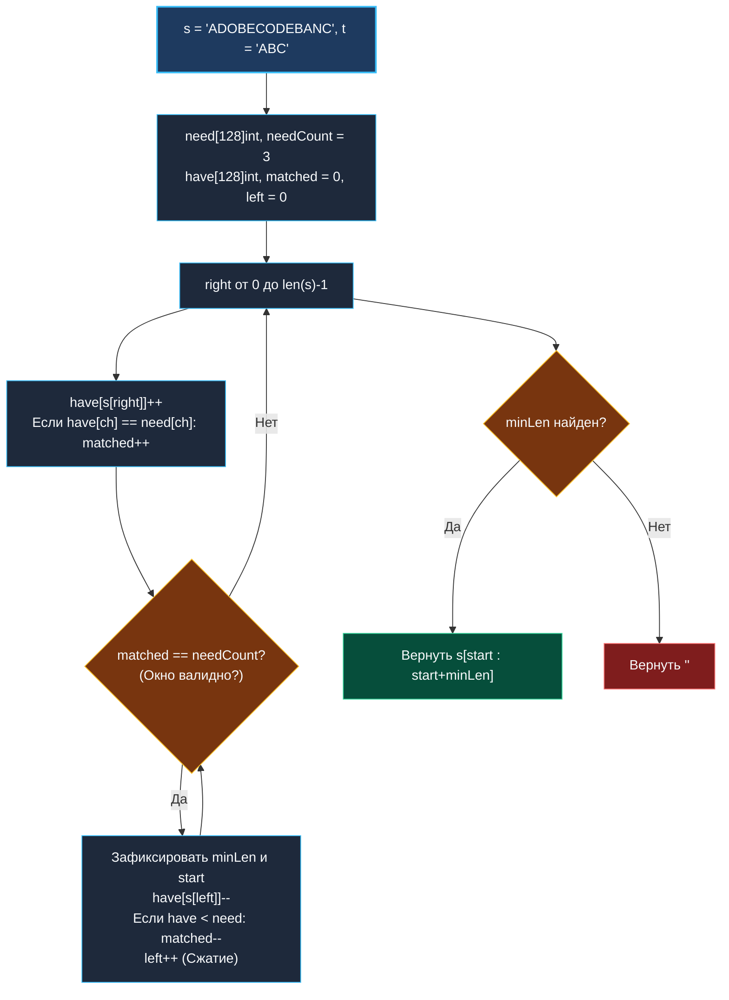

> *«В сложных задачах ясность инварианта спасает от бесконечных исправлений в коде».*  
> — Эдсгер Дейкстра

## LeetCode 76. Minimum Window Substring

**Сложность:** Hard  
**Тема:** Динамическое скользящее окно, счетчик покрытия (Matched Counter), $O(N)$ со стековыми массивами  
**Ссылки:** [[03. Скользящее окно/1. Теория. Скользящее окно|Теория: Скользящее окно]], [[03. Скользящее окно/2. Фиксированное и динамическое окно|Фиксированное и динамическое окно]], [[03. Скользящее окно/4. Longest Substring Without Repeating Characters|Longest Substring]]

---

### 1. Введение и физическая интуиция

Представьте инспектора на конвейере по сборке сложных механизмов. На входной ленте `s` едут самые разные детали: `"A D O B E C O D E B A N C"`.  
Инспектору необходимо собрать базовый комплект `t = "ABC"`.  
Он хочет найти **самый короткий непрерывный отрезок ленты**, на котором гарантированно присутствуют абсолютно все необходимые детали в требуемом количестве.

Инспектор использует стратегию «тяни-толкай» (Expand & Shrink):
1. **Тяни (Расширение):** он шагает правым указателем `right` вперед, подбирая детали и складывая их в инвентарь. Как только в инвентаре набрался полный комплект деталей из `t` — окно признается **валидным**!
2. **Толкай (Сжатие):** теперь инспектор пытается сделать этот отрезок как можно короче. Он выбрасывает ненужные или избыточные детали с левого края (`left++`), пока комплект остается полным. Как только из окна выпадает критически важная деталь — сжатие останавливается, минимальная длина фиксируется, и правый край снова начинает расширяться.

Ключевой вызов задачи — как мгновенно за $O(1)$ понимать, что в окне набрались все нужные символы с учетом их кратностей, не сканируя каждый раз таблицу частот из 128 элементов? Для этого вводится **счетчик покрытия `matched`**.



---

### 2. Формулировка задачи и вопросы интервьюеру

Даны две строки `s` и `t` длиной $m$ и $n$ соответственно. Найти минимальную по длине подстроку в `s`, которая содержит все символы строки `t` с учетом их кратностей. Если такой подстроки нет, вернуть `""`.

#### Вопросы интервьюеру (Senior-стиль):
1. **Каков алфавит символов?**  
   *«Символы ASCII (заглавные и строчные латинские буквы). Это позволяет выделить два массива `[128]int` на стеке вместо медленных `map[byte]int`.»*
2. **Может ли `t` быть длиннее `s`?**  
   *«Да. Если `len(s) < len(t)`, валидное окно физически невозможно — сразу возвращаем пустую строку `""` за $O(1)$.»*
3. **Может ли строка `t` содержать повторяющиеся буквы?**  
   *«Да, например `t = "AABC"`. Окно обязано содержать как минимум две буквы `'A'`, одну `'B'` и одну `'C'`.»*

---

### 3. Механика счетчика `matched`: проверка окна за $O(1)$

Вместо наивного посимвольного сравнения двух массивов по 128 ячеек мы вводим целочисленный счетчик `matched`:
- `needCount` — количество **уникальных** символов строки `t`.
- `matched` — количество уникальных символов из `t`, частота которых в текущем окне `have` **достигла или превысила** требуемую частоту `need`.

**События изменения `matched`:**
1. **При расширении `right`:**  
   Символ входит в окно: `have[char]++`.  
   Если в этот момент `have[char] == need[char]`, то данный символ стал полностью укомплектован $\implies$ `matched++`.
2. **При сжатии `left`:**  
   Символ выбывает из окна: `have[leftChar]--`.  
   Если после декремента `have[leftChar] < need[leftChar]`, комплектация нарушилась $\implies$ `matched--`.

Окно полностью валидно тогда и только тогда, когда:
$$ matched == needCount $$
Эта проверка выполняется ровно за 1 такт процессора!

---

### 4. Эталонная реализация на Go

```go
package main

import "math"

// MinWindow находит минимальную подстроку s, содержащую все символы t.
// Временная сложность: O(len(s) + len(t)) — строго линейный обход.
// Пространственная сложность: O(1) памяти — два массива на 128 int на стеке.
func MinWindow(s string, t string) string {
	if len(s) < len(t) || len(t) == 0 {
		return ""
	}

	// 1. Составляем профиль требуемых символов t
	var need [128]int
	needCount := 0
	for i := 0; i < len(t); i++ {
		if need[t[i]] == 0 {
			needCount++
		}
		need[t[i]]++
	}

	// 2. Инициализируем скользящее окно
	var have [128]int
	matched := 0
	left := 0

	minLen := math.MaxInt
	startIdx := 0

	// 3. Расширение окна вправо
	for right := 0; right < len(s); right++ {
		rightChar := s[right]
		have[rightChar]++

		// Символ достиг необходимой кратности в окне
		if have[rightChar] == need[rightChar] {
			matched++
		}

		// 4. Сжатие окна слева, пока оно удовлетворяет всем условиям
		for matched == needCount {
			currentLen := right - left + 1
			if currentLen < minLen {
				minLen = currentLen
				startIdx = left
			}

			leftChar := s[left]
			have[leftChar]--
			// Если из-за удаления символа его стало меньше необходимого
			if have[leftChar] < need[leftChar] {
				matched--
			}

			left++
		}
	}

	if minLen == math.MaxInt {
		return ""
	}

	// Срез строки в Go выполняется за O(1) времени и O(1) памяти
	return s[startIdx : startIdx+minLen]
}
```

---

### 5. Пошаговая трассировка (Walkthrough)

Пусть `s = "ADOBECODEBANC"`, `t = "ABC"`.  
Требования: `need['A']=1, need['B']=1, need['C']=1`, `needCount = 3`.

| `right` | Символ | `have` для целевых | `matched` | Валидно? | Действие со сжатием `left` | Лучшее окно |
|:---:|:---:|:---|:---:|:---:|:---|:---|
| 0..4 | `'ADOBE'` | `A:1, B:1` | 2 | Нет | Расширяем | — |
| 5 | `'C'` | `A:1, B:1, C:1` | **3** | **Да** | Окно `"ADOBEC"` (длина 6). Удаляем `'A'` $\implies matched=2$, `left=1` | `"ADOBEC"` (len 6) |
| 6..9 | `'ODEB'` | `B:2, C:1` | 2 | Нет | Расширяем | `"ADOBEC"` (len 6) |
| 10 | `'A'` | `A:1, B:2, C:1` | **3** | **Да** | Окно `"DOBECODEBA"` (len 10). Сжимаем `left` до 9 (`'B'`): `"BECODEBA"` $\implies$ `"CODEBA"` | `"ADOBEC"` (len 6) |
| 12 | `'C'` | `A:1, B:1, C:2` | **3** | **Да** | Окно `"BANC"` (длина 4!). `'B'` удаляется $\implies matched=2, left=10$ | **`"BANC"` (len 4)** |

Итог: алгоритм вернул идеальный минимум `"BANC"`.

---

### 6. Mechanical Sympathy: стек против кучи

| Параметр | Стековые массивы `[128]int` | Хэш-таблицы `map[byte]int` |
|:---|:---:|:---:|
| **Размещение в памяти** | Стек (2048 байт суммарно) | Куча (Heap) |
| **Аллокации в цикле** | **0 B/op, 0 allocs/op** | 48–1024 B/op при росте бакетов |
| **Доступ к ячейке** | 1 инструкция ассемблера (`LEA`) | Вызов `runtime.mapaccess` (~50 тактов) |
| **Кэш-локальность** | **100% L1d hit rate** | Периодические Cache Misses при эвакуации |

> [!TIP]
> Обратите внимание: возвращаемое значение `s[startIdx : startIdx+minLen]` создает легковесный заголовок строки `reflect.StringHeader`, который разделяет массив байтов с исходной строкой `s`. Выделение новой памяти в куче для подстроки не происходит!

---

### 7. Вопросы для собеседования

> [!INTERVIEW]
> **Вопрос:** Почему мы проверяем условие `have[rightChar] == need[rightChar]`, а не `have[rightChar] >= need[rightChar]`?  
> **Ответ:**  
> Если в окно входит второй, третий или десятый дубликат нужного символа (например, лишняя буква `'A'`), условие `>=` срабатывало бы на каждом из них, и счетчик `matched` увеличился бы до 4, 5, 10, нарушив логику сравнения с `needCount`!  
> Строгое равенство `==` гарантирует, что `matched` увеличится **ровно один раз** — в момент, когда символ переходит из категории «дефицитных» в категорию «укомплектованных».

---

### 8. Инварианты и чек-лист самопроверки

- [x] **Инициализация `needCount`:** строго по числу уникальных символов `t`.
- [x] **Сжатие в цикле `while`:** пока `matched == needCount`.
- [x] **Счетчик `matched`:** инкрементируется строго при `have == need`, декрементируется строго при `have < need`.
- [x] **Обработка отсутствия ответа:** если `minLen == math.MaxInt`, возвращается `""`.

Переходим к следующей задаче — поиску перестановок строки с фиксированным окном: [[03. Скользящее окно/6. Permutation in String|6. Permutation in String]].